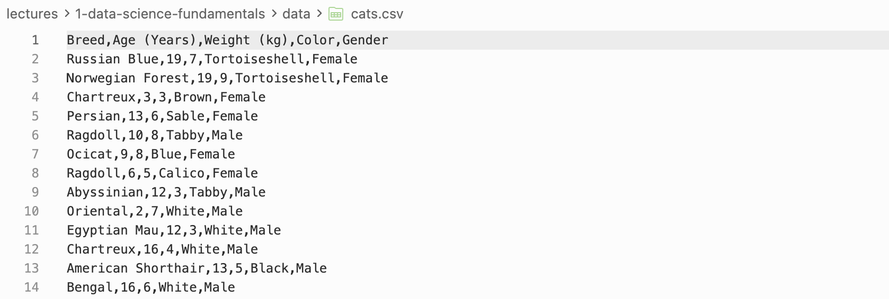
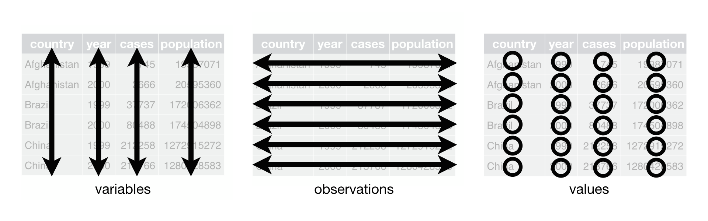

```{python}
#| echo: false
#| eval: false
import os
from pathlib import Path

```

::: {.callout-important title="Learning Objectives"}
- Understand Python's built-in data types and the limitations of native data structures.
- Work with NumPy arrays and Pandas DataFrames.
- Load tabular data from `.csv` and `.xlsx` files.
- Distinguish between wide and long data formats and convert between them using `pd.melt` and `pd.pivot`.
- Apply the tidy data standard to assess and clean real-world datasets.
:::

# Data in Python

## Python Variables

Python is a general purpose [programming language]{.accent}. It natively stores data in [variables]{.accent} of different types:

- [Strings]{.accent} (`str`) — text data.
- [Integers]{.accent} (`int`) — whole numbers.
- [Floating point numbers]{.accent} (`float`) — decimal numbers.
- [Booleans]{.accent} (`bool`) — true/false values.
- [Lists]{.accent} (`list`) — ordered collections of data.
- [Dictionaries]{.accent} (`dict`) — key-value pairs.
- [Tuples]{.accent} (`tuple`) — ordered, immutable collections of data.
- [Sets]{.accent} (`set`) — unordered collections of unique data.

[Packages]{.accent} such as `pandas` and `numpy` provide additional data types optimised for data analysis:

- Pandas [DataFrames]{.accent} (`.DataFrame`) — tabular data.
- NumPy [arrays]{.accent} (`.array`) — numerical data.

### Built-in Data Types

```{python}
#| echo: true

my_string = "Hello, World!"
my_integer = 10
my_float = 3.14
my_boolean = True
my_list = [1, 2, 3, 4, 5]
my_tuple = (1, 2, 3, 4, 5)
my_set = {1, 2, 3, 4, 5}
my_dict = {"name": "John", "age": 30}

item_list = [my_string, my_integer, my_float, my_boolean,
             my_list, my_tuple, my_set, my_dict]

for item in item_list:
    print(type(item), ":", item)
```

Built-in data types have limitations for data analysis:

- [Scalability]{.accent} — inefficient memory usage at scale.
- [Functionality]{.accent} — no support for vector operations or tabular manipulation.

For example, adding a scalar to a list raises a `TypeError`:

```{python}
#| echo: true
#| error: true
my_list + 2
```

## NumPy Arrays

NumPy [arrays]{.accent} are $n$-dimensional arrays of homogeneous data. They support:

- [Vectorized operations]{.accent} — element-wise arithmetic without explicit loops.
- [Efficient memory usage]{.accent} — stored as contiguous blocks of typed data.

Make sure you are familiar with the basics of NumPy arrays: construction (`array`, `linspace`, `full`), indexing and slicing, and broadcasting.

```{python}
#| echo: true

import numpy as np

list_array = np.array([1, 2, 3, 4, 5])
linspace_array = np.linspace(0, 1, 5)

print(list_array)
print(linspace_array)

print(list_array[:3])
print(linspace_array[list_array > 2])
```

## Pandas DataFrames

### What is Pandas?

[Pandas]{.accent} is a library for data manipulation and analysis built on top of [NumPy]{.accent}. It provides data structures and functions for working with tabular data.

Pandas DataFrames are 2-dimensional tabular data structures with labeled rows and columns. They are similar to NumPy arrays but with labeled axes, and similar to dictionaries but with labeled columns.

```{python}
#| echo: true

import pandas as pd

data = pd.DataFrame({
    "name": ["John", "Jane", "Jim", "Jill"],
    "age": [20, 21, 22, 23],
    "city": ["New York", "Los Angeles", "Chicago", "Houston"]
})

print(data)
```

## Loading Data Files

### Data Formats

In PSTAT100 we primarily use [tabular data]{.accent} stored in the following formats:

- [Text files]{.accent} (`.txt`) — simplest format but with loading challenges.
- [Comma Separated Values]{.accent} (`.csv`) — most common format.
- [Tab Separated Values]{.accent} (`.tsv`) — similar to CSV but uses tabs as delimiters.
- [Excel files]{.accent} (`.xlsx`) — spreadsheets with complex formulas and formatting.



### Loading `.csv` Files

`.csv` files store tabular data as plain text with comma-separated values. Use `pd.read_csv` to load them.

```{python}
#| echo: true

cats_data = pd.read_csv("data/cats.csv")
print(cats_data.head())
```

### Loading `.xlsx` Files

`.xlsx` files are Excel spreadsheets. Use `pd.read_excel` to load them, specifying the sheet name where needed.

```{python}
#| echo: true

sales_data = pd.read_excel(
    "data/office_sales.xlsx",
    sheet_name="SalesOrders")
print(sales_data.head())
```

## DataFrame Basics

### Manipulation and Indexing

There are many ways to **manipulate** DataFrames:

- Finding information: `columns`, `index`, `shape`, `head`, `tail`.
- **Indexing and filtering**: `.loc`, `.iloc`.
- **Adding and removing** columns and rows: `.drop`, `.dropna`, `.insert`, `pd.concat`.
- **Sorting**: `.sort_values`, `.sort_index`.

```{python}
#| echo: true

print(cats_data.columns)
print(cats_data.index)
print(cats_data.shape)
```

```{python}
#| echo: true

print(cats_data[["Breed", "Color"]].head())
print(cats_data.iloc[3:5])
```

```{python}
#| echo: true

cats_data_dropped = cats_data.drop(columns=["Color"])
print(cats_data_dropped.columns)
```

# Data Structure

## Wide and Long Formats

Often two datasets can represent the same information in [different data structures]{.accent}. These can be broadly categorised as:

:::{.columns}
:::{.column width="50%"}
**Wide data structure:**

- One row per subject.
- Repeated measurements are in separate columns.
:::
:::{.column width="50%"}
**Long data structure:**

- One row per measurement.
- A separate column identifies which variable was measured.
:::
:::


## Wide Data Structure

To build intuition, consider a dataset of points, assists, and rebounds for four basketball teams (adapted from [Luke Bennett](https://www.thedataschool.co.uk/luke-bennett/long-vs-wide-data-tables/)).

```{python}
#| echo: true
#| tbl-cap: "Basketball Data — Wide Format"

basketball_data = pd.DataFrame({
    "team": ["A", "B", "C", "D"],
    "points": [88, 91, 99, 94],
    "assists": [12, 17, 24, 28],
    "rebounds": [22, 28, 30, 31]
})
basketball_data.set_index("team")
```

Each observation (team) occupies its own row, and each measurement type is in a separate column — this is the [wide format]{.accent}.

## Long Data Structure

The same data in a long format places each individual measurement on its own row, with a column identifying which variable was measured.

```{python}
#| echo: false
#| tbl-cap: "Basketball Data — Long Format"

basketball_data_long = basketball_data.melt(
    id_vars=["team"], var_name="statistic", value_name="value")
basketball_data_long.sort_values(by="team").iloc[0:6, :].set_index("team")
```

- Each measurement has its own row (`value`).
- A column identifies which variable was measured (`statistic`).

## Wide vs Long — Which Is Better?

Neither format is universally better; the appropriate choice depends on context:

- [Wide]{.accent} data is more human-readable and common in spreadsheets.
- [Long]{.accent} data is more computer-readable:
    - Required by most plotting libraries (`seaborn`, `ggplot` in R).
    - Easier to filter, group, and aggregate in `pandas`.

It is therefore important to be able to [convert between the two formats]{.accent}.

## `pd.melt` — Wide → Long

`pd.melt` converts a wide DataFrame to a long DataFrame. Its key arguments are:

- `id_vars` — columns that identify the subject (kept as-is).
- `var_name` — name for the column that will hold the former column names.
- `value_name` — name for the column that will hold the values.

```{python}
#| echo: true

basketball_data_long = basketball_data.melt(
    id_vars=["team"],
    var_name="statistic",
    value_name="value"
)
print(basketball_data_long)
```

## `pd.pivot` — Long → Wide

`pd.pivot` converts a long DataFrame back to a wide DataFrame. Its key arguments are:

- `index` — column to use as row identifiers.
- `columns` — column whose values become the new column names.
- `values` — column whose values fill the cells.

```{python}
#| echo: true

basketball_data_wide = basketball_data_long.pivot(
    index="team",
    columns="statistic",
    values="value"
)
print(basketball_data_wide)
```

## The Lack of a Standard Format

Most data is stored in a layout that made [intuitive sense to the creator]{.accent} — idiosyncratic and unprincipled, with few widely used conventions and lots of variability in practice.

This creates two interdependent choices for data scientists:

- [Representation]{.accent}: how to encode information (e.g. dates as one variable or three? Ordinal values as numbers or labels?).
- [Form]{.accent}: how to display information (wide or long? one table or many?).

The [tidy data standard]{.accent} was introduced to resolve this inconsistency by providing a principled set of rules for structuring datasets.

# Tidy Data

## Tidy Data Principles

> "Tidying your data means storing it in a consistent form that matches the semantics of the dataset with the way it is stored. In brief, when your data is tidy, each column is a variable, and each row is an observation." — Wickham and Grolemund, *R for Data Science*, 2017.

A dataset has both:

- [Semantics]{.accent}: the meaning of each value.
- [Structure]{.accent}: how values are arranged.

The [tidy standard]{.accent} aligns data semantics with data structure.

## The Tidy Data Standard

::: {.callout-important title="Tidy Data Standard"}
For data to be tidy, it must satisfy three rules:

1. Each variable is a column.
2. Each observation is a row.
3. Each type of observational unit forms a table.
:::



## Example 1 — GDP Growth Data

Consider World Bank data on annual GDP growth:

```{python}
#| echo: true

gdp = pd.read_csv(
    "data/annual_growth.csv",
    encoding="latin1"
)
print(gdp.shape)
gdp.head()
```

To assess whether this is tidy, we compare semantics with structure:

| Semantics | | Structure | |
|---|---|---|---|
| **Observations:** | Annual country records | **Rows:** | Countries |
| **Variables:** | GDP growth and year | **Columns:** | Values of year |
| **Observational units:** | Countries | **Tables:** | Just one |

❌ Rules 1 and 2 are violated — column names are values (years), not variables. This dataset is **not tidy**.

## Making the GDP Data Tidy

We need to:

1. Set the index to `Country Name` using `set_index`.
2. Drop the superfluous `Country Code` column using `drop`.
3. Melt the data so that `year` and `growth_pct` are variables using `melt`.
4. Sort by year and country using `sort_values`.

```{python}
#| echo: true

gdp_tidy = gdp.set_index(
    "Country Name"
).drop(
    columns="Country Code"
).melt(
    var_name="year",
    value_name="growth_pct",
    ignore_index=False
).reset_index(
).sort_values(
    ["year", "Country Name"]
).set_index("Country Name")

gdp_tidy.head()
```

Now we can verify:

| Semantics | | Structure | |
|---|---|---|---|
| **Observations:** | Annual country records | **Rows:** | Annual country records |
| **Variables:** | GDP growth and year | **Columns:** | GDP growth and year |
| **Observational units:** | Countries | **Tables:** | Just one |

✅ All three rules are satisfied. The data is now tidy.
