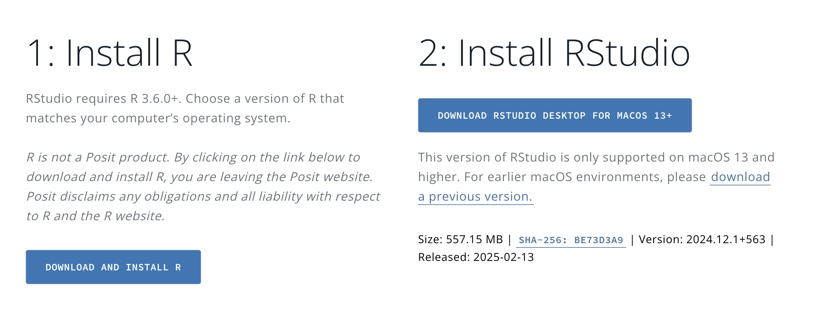
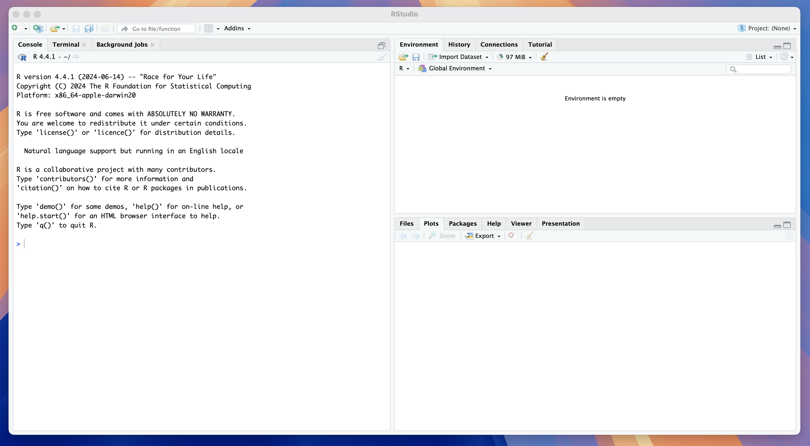
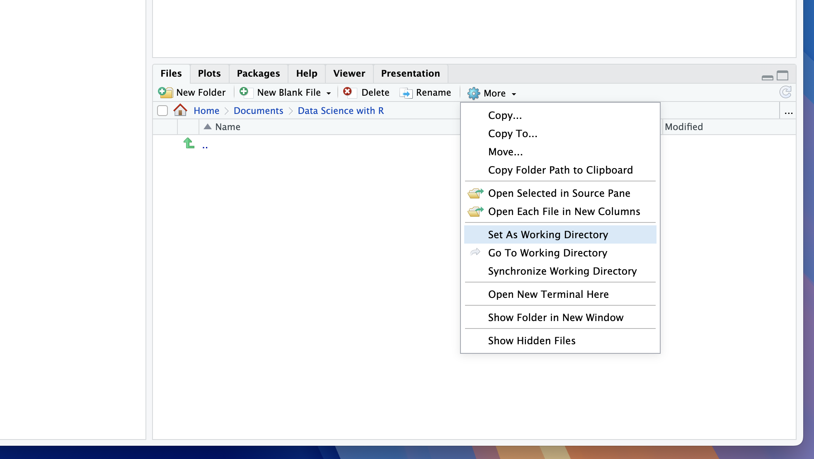
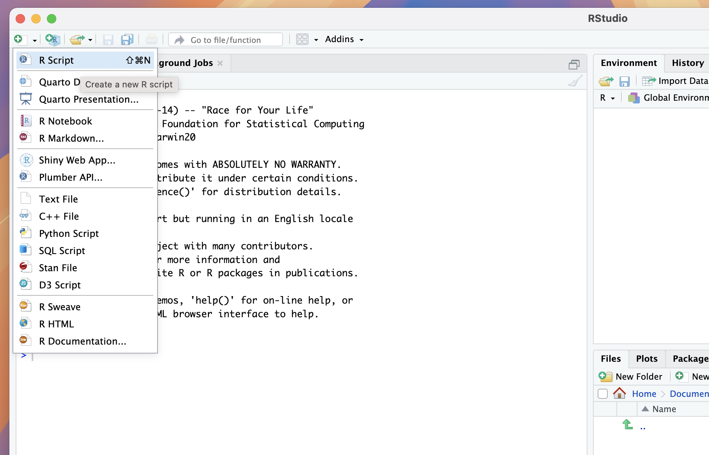
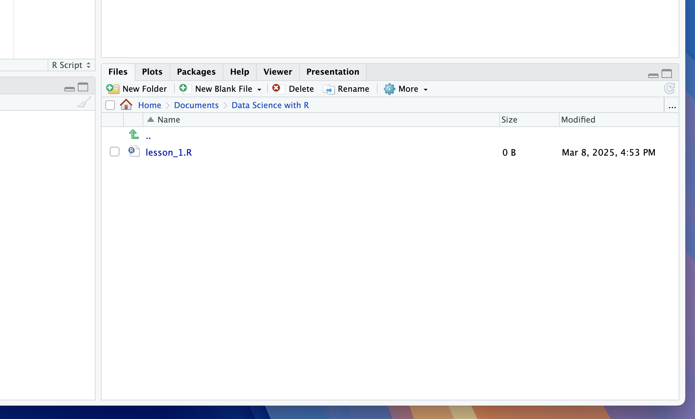

This post contains notes for Chapter 1 of my course series [Data Science with R](/courses/intro_to_data_science/index.qmd) covering how to install both the language R and the IDE RStudio, and the basics of using the IDE for data analysis.

## Background Information

`R` is a programming language (like python or C++) whilst **RStudio** is a software that facilitates writing R scripts known as an [Intergrated Development Enviroment (IDE)](https://en.wikipedia.org/wiki/Integrated_development_environment).  In this course we will learn how to write in the `R` language using the IDE RStudio.

`R` can be used to perform and automate computations, generate plots, simulate from random variables and perform statistical analysis.  RStudio is primarily an R focussed IDE but it also has the capability of producing technical documents in a variety of formats using Quarto markdown.  This is something I discuss in my post [insert post].

## Installation

`R` is not natively loaded on your computer and so to begin with we need to install both the language and the IDE onto our computers, the downloads for which can be found on the [posit website](https://posit.co/download/rstudio-desktop/).  You will need to check that you download versions of both R and RStudio that match your operating system.



R will be loaded onto your local drive and can mostly be forgotten about.  RStudio will be downloaded into your applications folder and once the download is complete you can open the application to get started.

## RStudio Layout

When you first open RStudio the application will be split into several sections called **panes**, each with a selection of **tabs**. 



We will first go through the most important tabs and what they are used for:

1. **Left Pane:**

    a. *Console Tab* - Where R code can be read and executed by your computer.

    b. *Terminal Tab* - Providing command line access to the computer's operating system (this is rarely used by beginners).

2. **Upper Right Pane:**

    a. *Environment Tab* - A breakdown of items saved in the working memory.

3. **Lower Right Pane:**

    a. *Files Tab* - A view of your system files.

    b. *Plots Tab* - A space displaying any plot you generate.

    c. *Packages Tab* - A manager to load functions defined by other users known as **packages**.

    d. *Help Tab* - A space to search for and view code documentation.

## System vs Working Memory

Anytime you define something in R (discussed in a later chapter) it will be saved to RStudios **working (short-term) memory**, shown in the environment tab.  The available memory is limited and it is important to remember that anything stored here will be deleted once you close RStudio.

For long term storage you will need to save objects to your **system memory** (your computers filing system), shown in the files tab.  You will then be able to load anything you have saved for later use.  In this course we will typically only use our system memory for saving our R scripts (text documents in which we write our code), accessing data files or for generating and saving .pdf documents.  

RStudios **working environment** is the file on your system that RStudio is currently looking within (i.e. what it can pull files from and save files too).  The default working directory location is the file that is shown within the files tab.  You can set a new working directory at anytime by either:

1. Navigating to the desired folder in the files tab, clicking on the more settings cog and selecting Set as Working Directory.

2. Typing `setwd("desired_file_path")` into the R console.

In the image below you can see that I have created a folder titled `Data Science with R` in my system `Documents` folder and set this as my working directory.



::: {.callout-tip}

## Exercise 1

Lets prepare to create our first R script.  First navigate to your desired course folder (or create on) and set it as your working directory.
:::

## Creating R Scripts

Now we are ready to create our first R script by using any of the following methods:

1. Navigate to file > New File > R Script;

2. Use the shortcut shift + cmd + N on mac;

3. Click the small + button at the top left of the application window and select R Script.



After this a new pane will appear in the top left position showing an unititled document with the suffix `.R`.  We can save this file using either:

1. The shortcut CMD + S;

2. Clicking File > Save,

and the document should then appear in our working directory, therefore in our system storage.



::: {.callout-tip}

## Exercise 2

Create and save your first R script (choose whatever name you like) to your working directory.
:::

## Packages

R comes preloaded with a variety of functions, called **base functions** however there are many tasks for which they are insufficient (advanced plotting, statistical modelling etc.).  CRAN Packages are collections of functions written in `R` by other users that are available for download.  A comprehensive list of the available packages are detailed on the [CRAN website](https://cran.r-project.org/web/packages/available_packages_by_name.html).

Throughout this course we will use a variety of packages (such as `tidyverse`) and so it is important we know how to load and use the in-built package management in RStudio.  navigating to the packages tab we will see a list of pre-installed packages with empty check marks next to them.  These packages are installed (downloaded from the internet) but not loaded (not available for use in our R session).

To install a package (e.g. `tidyverse`) we can use the `install.packages()` function where the input to the function is the name of the package enclosed in quotation marks:

```{r}
#| eval: false

install.packages('tidyverse')
```

You will see the package appear with no check mark in the packages manager.  Note that once a package is installed it will not need to be installed in future unless you reinstall RStudio (which is why we often omit this code in scripts).

Next, to load a package we can use the `library()`function where this time the input is the name of the package with no quotation marks:

```{r}
#| message: false

library(tidyverse)
```

Your console output will often provide relevant information about the version of the package and its compatibility with your downloaded version of R and other loaded packages. Running this function will check the box next to `tidyverse` in the package tab. 

*I recommend including all your package loading functions at the top of your script so you can quickly check what packages you have loaded in your session.*


Occasionally you might have loaded multiple packages which have conflicting package names.  In this case, you may want to unload a package which you can do using the `detach()` function.  The syntax for the input is a little more complicated:

```{r}
#| message: false

detach("package:tidyverse", unload = TRUE)
```

::: {.callout-tip}

## Exercise 3

By writing code in your console install the packages: (1) `tidyverse`; (2) `astsa` and (3) `zoo`, using the `install.packages()` function.  Now in your script use the `library()` function to load all three packages.
:::

## Help Function

One of my most used functions in `R` is `?` which quickly loads to documentation for the specified function in the Help tab.  An example of using this function to return information about the base `mean()` function is:

```{r}
#| eval: false

?mean()
```

If you run this code you will see the documentation for the `mean()` function displayed in the Help tab.


::: {.callout-tip}

## Exercise 4

In the `tidyverse` function you have just loaded there is a function `ggplot()`.  Use the help `?` syntax to load and read the documentation.
:::

## Review

At the end of this short lesson we should now be able to:

1. Download and install both R and RStudio.

2. Set our working directory.

3. Create new R scripts and save them.

4. Install and load packages.

5. Use the help function to search for documentation.

<div style="display: flex; justify-content: space-between; padding: 20px 0;">
  <!-- Back Button -->
  <a href="/courses/intro_to_data_science/index.qmd" style="text-decoration: none; font-size: 18px;">
    &#8592; Course Homepage
  </a>
  
  <!-- Forward Button -->
  <a href="/posts/Rds2_rbasics/index.qmd" style="text-decoration: none; font-size: 18px;">
    Next Chapter &#8594;
  </a>
</div>