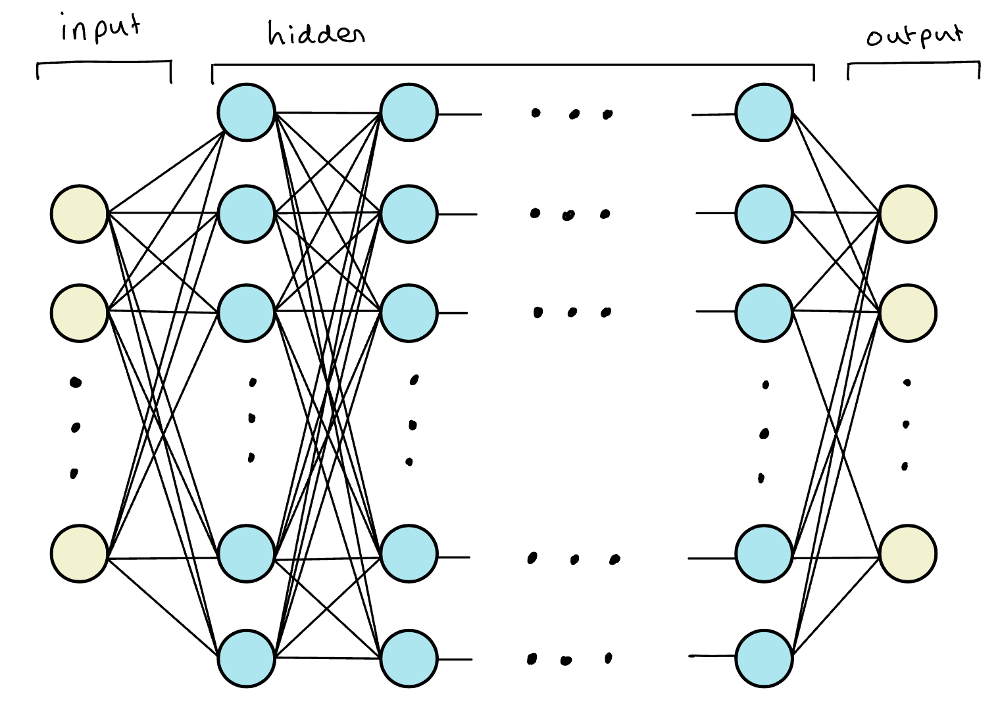

In this note how build our first neural network in python using the guide
[Python AI: How to Build a Neural Network & Make Predictions](https://realpython.com/python-ai-neural-network/) provided by Real Python.  We construct a simple network from scratch rather than using libraries such as `scikit-learn`, `pytorch` or `tensorflow` which we cover in a different note.

## Background

### Machine Learning

**Machine learning (ML)** involves solving a problem by training a statistical model rather than explicitly programming rules.  There are two types of ML:

1. **Supervised Learning** - considers *labelled data* meaning inputs have a corresponding correct output where the goal of the training is to predict outputs for new unseen inputs (e.g. classification, regression),
   
2. **Unsupervised Learning** - considers *unlabelled data* with no explicit output labels where the goal of the training is to uncover hidden relationships in the data.

We call input data **features** and **feature engineering** is the process of extracting features from raw data, i.e. representing different kinds of data in order to extract meaningful information.  

:::{.callout-tip}

For example, **lemmatization** is the process of removing inflection from words in a sentence i.e. sleeping, sleeper, sleepiest all become sleep.  This helps reduce data sparsity (variety of values) and increase algorithm performance. 

:::

### Deep Learning 

**Deep learning (DL)** involves allowing the ML model to determine important features by itself rather than manually applying feature engineering techniques.  This is ideal for complex data where feature engineering quickly becomes untractable - e.g. extracting data to predict a person's mood from a photograph of their face.

### Neural Networks

A **Neural Network (NN)** is a ML model inspried by the structure and function of the human brain built from layers of interconnected units called **neurons** arranged into layers.  We think of a neural network as essentially a *layered function approximator* whose general model structure has the following components:

1. **Input Layer** - takes in raw data (e.g. image pixels, text, numerical features),

2. **Hidden Layers** - performs transformations and extracts patterns using weighted connections and nonlinear activation functions (e.g. `ReLU`, `sigmoid`, `tanh`),

3. **Output Layer** - outputs predictions.

Essentially, you can think of each layer transformation as a feature extraction step as we are pulling some representation of the data that came previously.

{width="70%"}

Like the human brain, NN work by neurons firing (activating) which sends signals down synapses (connections) to activate neighboring neurons.  Each connection has a **weight** that determines how strongly one neuron influences another.  Neurons also have a **bias** term to shift activation and improve model flexibility (i.e. how activated the neuron is).  There are several types of neural networks including:

1. **Feedforward Neural Networks (FNNs):** Basic form, information moves forwards from input to output.

2. **Convolution Neural Networks (CNNs):** Specialized for images and spatial data.

3. **Recurrent Neural Networks (RNNs):** Handle sequential data (e.g. text, time series).

4. **Transformers:** Modern architecture for language and sequence tasks (e.g. GPT).

In this note we will consider FNNs. To train a NN we start with some random weights and bias values before using the network to make a prediction.  This is then compared to the desired output and the vectors are adjusted to improve prediction accuracy.  

### Activation Functions

The **activation functions** of the NN are there to introduce non-linearity.  Each neurons connections are simply given by a weighted sum of other neurons hence a neural network is essentially a composition of linear maps which will just collapse to a single linear transformation since the composition of linear transformations is itself linear.  

Activation functions allow us to introduce non-linearity such that each layer can warp the input space in a way that lets later layers combine them into much more expressive shapes.  Activation functions are chosen to be non-linear, almost everywhere differentiable and computationally efficient.  Some of the most popular include:

1. `sigmoid` - outputs in (0,1), good for probabilities in binary classification but suffers from vanishing gradient problem;
2. `tanh` - outputs in (–1,1), useful when you want centered data; and
3. `ReLU` - unbounded above and zero below, great for general deep nets.

### Backpropogation

As you can imagine, with multiple neurons over multiple layers the neural network will have a large number of parameters that we are looking to fit.  When training a neural network we update these parametes using backpropogation which includes:

1. **Forward pass:** Feed an input $x$ through the network with parameters $\theta$ $\rightarrow$ to obtain output $\hat{y}$,
2. **Compute loss:** Compare $\hat{y}$ to the true label $y$ using the loss function $L$,
3. **Backwards propogation:** Use the chain rule to compute $L_{\theta}$,
4. **Update:** Improve model fit by updating parameters using **gradient decent**.

**Gradient descent** is the procedure whereby we look for the parameters that minimize the loss by using the gradient as a compass. Intuitively, the loss for a realization of a model is a function in the input parameters $\theta$ thus can be interpretted as a high-dimensional surface with peaks and valleys.  We are looking for the parameters coordinates that correspond to the lowest point and use the slope of the point we are currently at as our guide.  That is, once we compute the gradient of the loss with respect to the various parameters we then change the parameters by subtracting the gradient.

There are many problems with gradient descent including becoming stuck in local minima, learning rate problems, vanishing or exploding gradients and poorly conditioned problems but we defer our discussion of gradient descent to a later note.  However we note that it is necessary to include a **learning rate** term $\alpha$ which reducing the size of the parameter update to a much smaller proportion of the derivative (e.g. common values are $\alpha=0.1, 0.01, 0.001$ etc.).  This is to avoid bouncing back and forth and missing the minimum points below.

## Neural Networks in Python

We will be constructing our NN in `python` and requires the following packages:

```{python}
# Packages
import numpy as np
import matplotlib.pyplot as plt
```

### Basic Example - 1 layer binary classification

Our first network is a single-neuron (no hidden layers) neural network (effectively logistic regression with a sigmoid on a 2-dimensional input). For an input $x\in\mathbb{R}^2$, weights $w\in\mathbb{R}^2$, and bias $b\in\mathbb{R}$, it computes
$$
\begin{align}
z & = w^{\top}x+b \\
\hat{y} & = \sigma(z)
\end{align}
$$

with output $\hat{y}$ and denoting the sigmoid function 
$$
\sigma=\frac{1}{1+\exp(-x)}.
$$

For future reference the derivative of the sigmoid function can be written as
$$
\begin{align}
\frac{d\sigma}{dx} & = \frac{\exp(-x)}{(1+\exp(-x))^{2}} \\
& = \frac{-1+1+\exp(-x)}{(1+\exp(-x))^2} \\
& = \frac{-1}{(1+\exp(-x))^2} + \frac{1}{1+\exp(-x)} \\
& = \frac{1}{1+\exp(-x)}\left(-\frac{1}{1+\exp(-x)}+1\right) \\
& = \sigma(x)(1-\sigma(x)).
\end{align}
$$

We use the mean-squared error (MSE) for a single example: 
$$
L=(\hat{y}−y)^2.
$$

We update parameters with plain gradient descent where we compute gradients with the chain rule.  Denoting parameters $\theta=(w,b)$ from the chain rule we have that
$$
\begin{align}
& \frac{dL}{d\theta} = \frac{dL}{d\hat{y}}\cdot \frac{d\hat{y}}{dz}\cdot \frac{dz}{d\theta} \\
\implies &
\begin{cases} \
    \frac{dL}{dw} & = 2(\hat{y}-y)\cdot \sigma(1-\sigma) \cdot w \\
    \frac{dL}{db} & = 2(\hat{y}-y)\cdot \sigma(1-\sigma).
\end{cases}
\end{align}
$$

Gradients are computed by the chain rule and parameters are updated by plain gradient descent.  We define the following `NeuralNetwork` python class:  
```{python}
class NeuralNetwork:

    # initialization 
    def __init__(self, alpha):
        self.weights = np.array([np.random.randn(), np.random.randn()])
        self.bias = np.random.randn()
        self.alpha = alpha
    
    # sigmoid function
    def _sigmoid(self, x):
        return 1 / (1 + np.exp(-x))
    
    # sigmoid derivative function
    def _sigmoid_deriv(self, x):
        return self._sigmoid(x) * (1 - self._sigmoid(x))
    
    # predict function
    def predict(self, input_vector):
        layer_1 = np.dot(input_vector, self.weights) + self.bias
        layer_2 = self._sigmoid(layer_1)
        prediction = layer_2
        return prediction
    
    # function computing the gradient
    def _compute_gradients(self, input_vector, target):
        # computing layers and prediction
        layer_1 = np.dot(input_vector, self.weights) + self.bias
        layer_2 = self._sigmoid(layer_1)
        prediction = layer_2
        # computing 
        dL_dp = 2 * (prediction - target)
        dp_dz = self._sigmoid_deriv(layer_1)
        dz_db = 1
        dz_dw = (0 * self.weights) + (1 * input_vector)
        dL_db = (
            dL_dp * dp_dz * dz_db
        )
        dL_dw = (
            dL_dp * dp_dz * dz_dw
        )
        return dL_db, dL_dw

    # function updating parameters through backpropogation
    def _update_parameters(self, dL_db, dL_dw):
        self.bias = self.bias - (dL_db * self.alpha)
        self.weights = self.weights - (
            dL_dw * self.alpha
        )

    # function training the neural network
    def train(self, input_vectors, targets, iterations):
        cumulative_errors = []
        for current_iteration in range(iterations):
            # Pick a data instance at random
            random_data_index = np.random.randint(len(input_vectors))

            input_vector = input_vectors[random_data_index]
            target = targets[random_data_index]

            # Compute the gradients and update the weights
            dL_db, dL_dw = self._compute_gradients(
                input_vector, target
            )

            self._update_parameters(dL_db, dL_dw)

            # Measure the cumulative error for all the instances
            if current_iteration % 100 == 0:
                cumulative_error = 0
                # Loop through all the instances to measure the error
                for data_instance_index in range(len(input_vectors)):
                    data_point = input_vectors[data_instance_index]
                    target = targets[data_instance_index]

                    prediction = self.predict(data_point)
                    error = np.square(prediction - target)

                    cumulative_error = cumulative_error + error
                cumulative_errors.append(cumulative_error)

        return cumulative_errors
```

We consider the following data provided by the article on Real Python:

: Table: Target and feature example data.

| $x_1$ | $x_2$ | $y$ |
|:-----:|:-----:|:---:|
|   3   |  1.5  |  0  |
|   2   |   1   |  1  |
|   4   |  1.5  |  0  |
|   3   |   4   |  1  |
|  3.5  |  0.5  |  0  |
|   2   |  0.5  |  1  |
|  5.5  |   1   |  1  |
|   1   |   1   |  0  |

```{python}
#| echo: false
#| fig-cap: "Feature space grouped by target outputs."

data = np.array([
    [1.66, 1.56], [3, 1.5],[2, 1],[4, 1.5],[3, 4],
    [3.5, 0.5],[2, 0.5],[5.5, 1],[1, 1],
])
target = np.array([1,0,1,0,1,0,1,1,0])
plt.scatter(
    x=data[target==0,0],y=data[target==0,1], 
    label = "target = 0", color = "blue", marker = "o"
    )
plt.scatter(
    x=data[target==1,0],y=data[target==1,1], 
    label="target = 1",color="red",marker="s")
plt.xlabel(r"$x_1$ (feature 1)")
plt.ylabel(r"$x_2$ (feature 2)")
plt.legend()
```


Defining the learning rate $\alpha = 0.1$ and setting the seed for reproducibility we call an instance of the NN and produce a prediction using the first row: 

```{python}
np.random.seed(42)
alpha = 0.1
input_vector = data[0,]
neural_network = NeuralNetwork(alpha)
neural_network.predict(input_vector)
```

We conclude by training our NN using the entire data set and 10000 iterations.  We produce a final plot showing the error for all training instances.

```{python}
#| fig-width: 8
training_error = neural_network.train(data, target, 10000)
plt.plot(training_error)
plt.xlabel("Iterations")
plt.ylabel("Error for all training instances")
plt.show()
```

The result is reasonable but not very informative, the data set is small and random, therefore there is not a lot of information for the model to capture.  Furthermore, this is a poor measure of performance because it is using training data when in fact we are more interested in the models ability to correctly categorize new data.