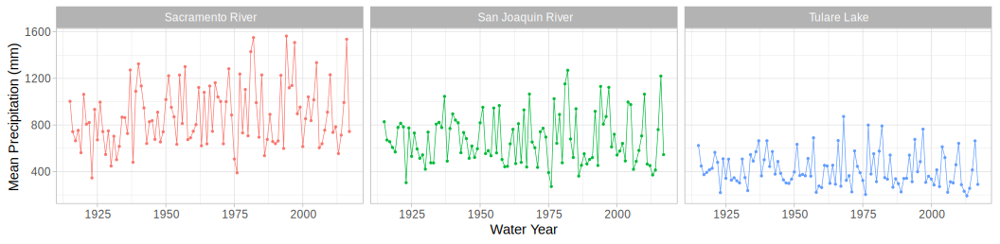
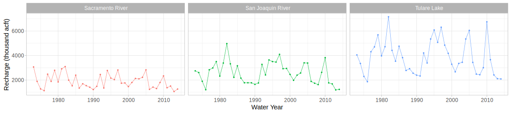
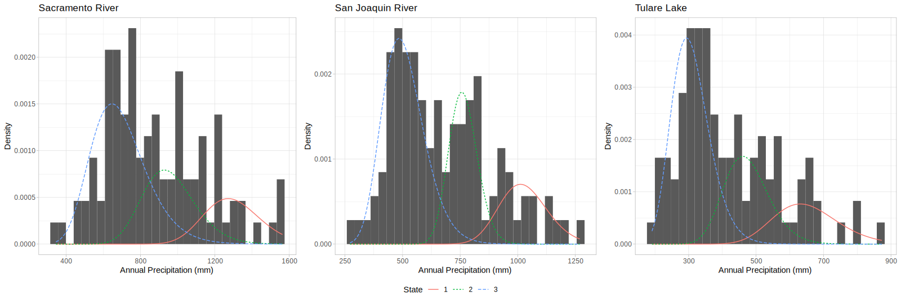
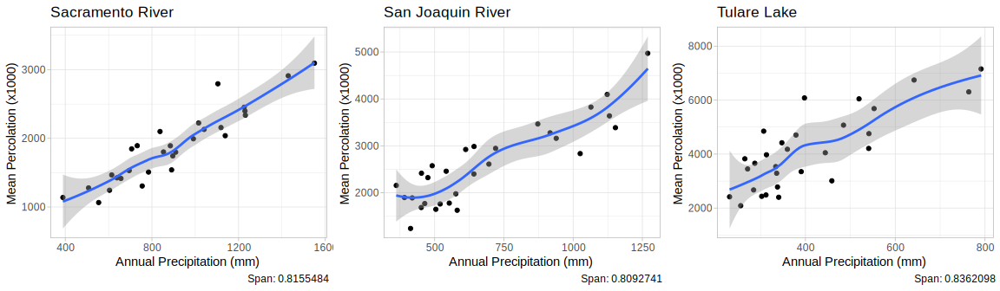

## Introduction

The [groundwater market model]{.alert} described by @Cialenco.Ludkovski2025 is stochastically driven by groundwater recharge process $\{R_t\}_{t\in\mathbb{N}_0}$ for year $t$.  In order for this model to be a useful tool for groundwater conservation and planning we need to be able to efficiently simulate this process whilst ensuring the result is 

::::{layout-ncol="4"}

:::{}
1️⃣ Markovian 
:::

:::{}
2️⃣ Exogenous
:::

:::{}
3️⃣ Low-cost
:::

:::{}
4️⃣ Controllable
:::

::::

Assuming that precipitation is the primary driver of recharge we model annual precipitation using a [Hidden Markov Model (HMM)]{.alert} before mapping to groundwater recharge using functional estimates.  In this note we outline our procedure and provide a summary of our results. 

## Background

HMMs consist of a pair of stochastic processes $(S(t), P(t))$ known as the (unobserved) [latent process]{.alert} and the (observed) [emission process]{.alert} respectively.

{width='90%'}

The latent state process $\{S(t)\}$ is a Markov chain (MC) taking values in finite state space $\mathcal{S}:=\{1, ..., S\}$. The number of states is specified *a priori* and the interpretation of these states can only be intferred post-fitting. 

The MC $\{S_t\}$ is described by its [transition probability matrix]{.alert}

$$
\begin{aligned}
\Gamma & := (\gamma_{i,j})_{i,j\in\mathcal{S}} \\
    & = ((\mathbb{P}(S(t+1)=j|S(t)=i)))_{i,j\in\mathcal{S}},
\end{aligned}
$$

with [initial state distribution vector]{.alert}

$$
\boldsymbol{\pi}:=(\pi_i)_{i\in\mathcal{S}} = (\mathbb{P}(S(1)=i))_{i\in\mathcal{S}}.
$$

The precipitation process $\boldsymbol{P}(t)\in\mathbb{R}_+^M$are realizations of precipitation densities that are conditionally dependent only on the current state of the process $S(t)$

$$
\mathbb{P}(\boldsymbol{P}(t)|\boldsymbol{P}(1:t-1),S(1:t)=s(1:t)) = \mathbb{P}(\boldsymbol{P}(t)|S(t)=s(t)).
$$

The precipitation density vector is given by

$$
\begin{aligned}
\boldsymbol{\eta}(t|S(t)) & = (\eta^{(m)}(t|S(t)))_{m\in\mathcal{M}} \\
    & = (\mathbb{P}(\boldsymbol{P}^{(m)}(t)|S(t)=j))_{m\in\mathcal{M}}.
\end{aligned}
$$

## Model

For our implementation we focus on the Central valley (CV) aquifer in California which is split into multiple [water regions]{.alert} which we index by $m\in\mathcal{M}$.  We assume that total annual groundwater recharge $R(t)$ is given by

$$
\begin{aligned}
R(t) & = \sum_{m\in\mathcal{M}} R^{(m)}(t) \\
    & = \sum_{m\in\mathcal{M}} f_m(P^{(m)}(t)),
\end{aligned}
$$

where:

1. $f_m$ are region specific (possibly non-linear) [percolation functions]{.alert}; and

2. $P^m(t)$ are the regional [average precipitation]{.alert} time series.

The precipitation time series processes $P^{(m)}(t)$ are given by a common state HMM and the percolation functions are given by local polynomial regression.  

## Data

Our precipitation data is computed from the gridded 100-year historic daily weather data (`Product_100yr`) provided by the [California Department of Water Resources (DWR) Open Data Portal](https://data.cnra.ca.gov/organization/dwr/portal/data).

Our percolation data is computed using data from [California Central Valley Fine-Grid Groundwater-Surface Water Simulation Model (C2VSimFG)]{.alert} created and made available by the [California Department of Water Resources (DWR)]{.alert}.

::: {.panel-tabset}

## Rainfall data

## Percollation data

:::

## Results

### Model Parameters

Through exploratory data analysis we determine that 3 latent states are optimal and that the log-normal density with regional parameters $\mu_m$ and $\sigma_m$ best fit the data characteristics.  The fitted emission distribution parameters are summarized in @tbl-hmm-params and @tbl-hmm-meansd below.

::: {.panel-tabset}
## Log-normal parameters
| Region | $\mu_1$ | $\sigma_1$ | $\mu_2$ | $\sigma_2$ | $\mu_3$ | $\sigma_3$ |
|:-------|:-------:|:----------:|:-------:|:----------:|:-------:|:----------:|
| SR | 7.162 | 0.117 | 6.855 | 0.148 | 6.519 | 0.217 |
| SJ | 6.930 | 0.102 | 6.636 | 0.081 | 6.216 | 0.181 |
| TL | 6.470 | 0.149 | 6.152 | 0.141 | 5.717 | 0.180 |

: Log-normal distribution parameters. {#tbl-hmm-params}

## Log-normal mean/SD
| Region | $m_1$ | $s_1$ | $m_2$ | $s_2$ | $m_3$ | $s_3$ |
|:-------|:-----:|:-----:|:-----:|:-----:|:-----:|:-----:|
| SR | 1298.34 | 152.43 | 959.06 | 142.72 | 694.05 | 152.40 |
| SJ | 1027.83 | 105.11 | 764.54 |  62.03 | 508.97 |  92.88 |
| TL |  652.69 |  97.79 | 474.35 |  67.22 | 309.12 |  57.05 |

: Log-normal mean and standard deviation. {#tbl-hmm-meansd}
:::

Retrospectively we interpret the states as follows:

- State 3 low precipitation
- State 2 medium precipitation
- State 1 high precipitation

The fitted transition probabilities are

$$
\Gamma := \begin{bmatrix}
0.110 & 0.131 & 0.759 \\
0.207 & 0.359 & 0.435 \\
0.196 & 0.282 & 0.522
\end{bmatrix}.
$$

The corresponding stationary distribution of the chain is

$$
\mu\cdot \Gamma = \mu \implies \mu = \begin{bmatrix}0.183 & 0.276 & 0.541\end{bmatrix}.
$$

Producing a plot of the precipitation distributions we see that our model seems to avoid redundancy with clear distinction between latent state distributions.

Next. we produce plots for our fitted local polynomial regression.

From these results we observe that recharge is crudely linear in precipitation in all regions which indicates reasonable extrapolation.  We also note that there is much higher recharge in San Joaquin and Tulare despite arid conditions due to river runoff, induced recharge and geological factors.

### Simulations

We conclude by applying our entire simulation engine to produce 1000 year simulations of groundwater recharge.  

::: {.panel-tabset}

## Groundwater Simulation

## Precipitation Densities

:::

## References
