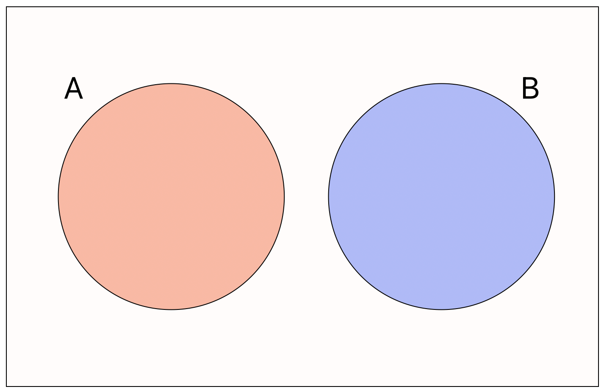
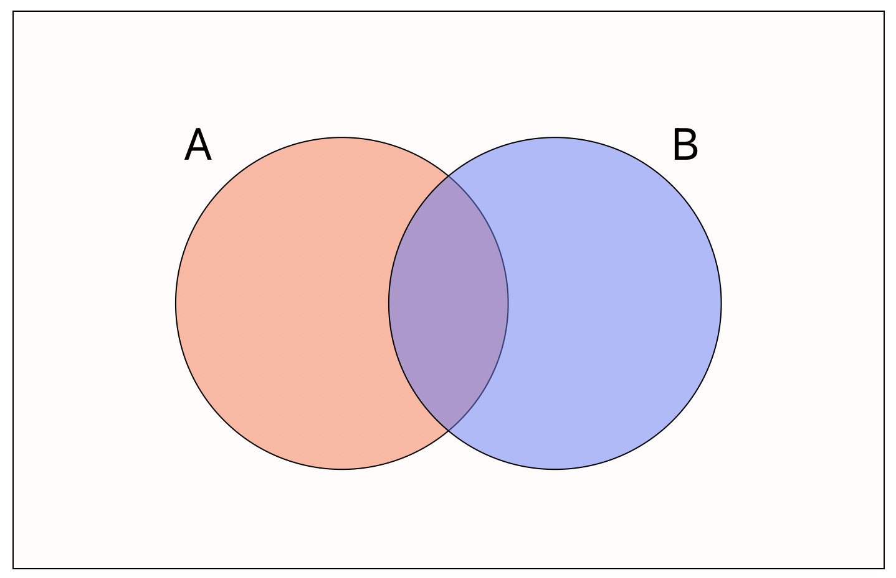
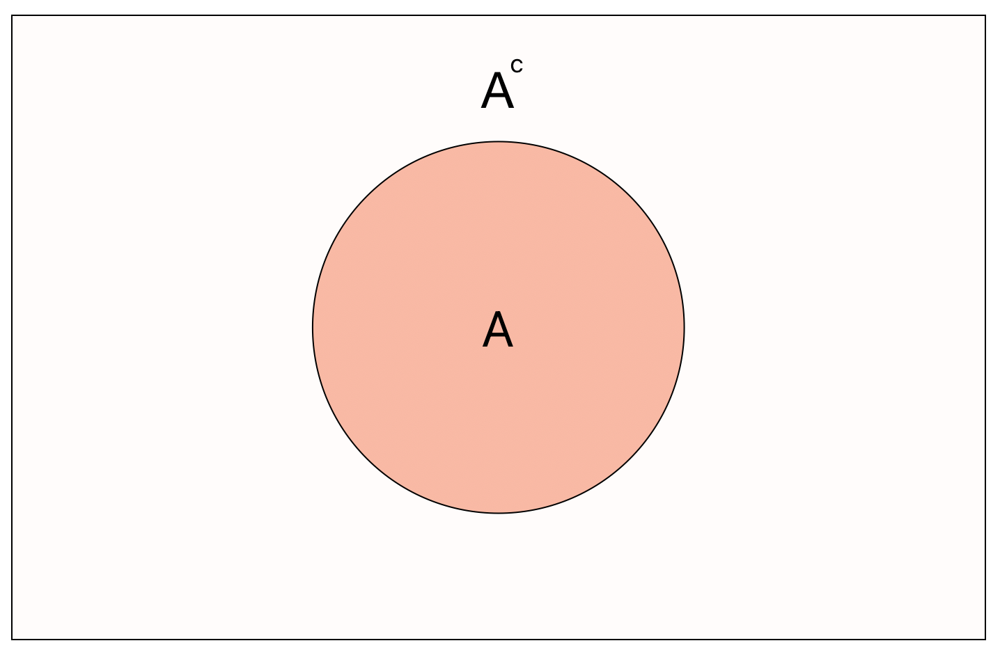

This post contains notes for Chapter 5 of my course series [Data Science with R](/courses/intro_to_data_science/index.qmd) covering some fundamentals of probability theory.  The material in this note is focussed on developing intuitive understanding for those who perhaps do not have a formal mathematical background.  For a more rigorous measure theoretic definitions see my notes on Probability Theory.

## Probability

Let us begin like all good courses on the fundamentals of probability by considering the simple experiment of flipping a fair coin.  This is a **random experiment** with **finite** and **discrete** outcomes, i.e. the results of the experiment can be either heads or tails and do not know which in advance.  

A collection of possible outcomes is known as an **event**, for example we define the event of the coin landing on heads by $H$.

The **probability** of a discrete event $H$ occuring is given by:

$$
\mathbb{P}(A) := \frac{\text{number of ways for }H\text{ to occur}}{\text{total number of possible outcomes}}
$$

For our coin flipping example we have 2 possible outcomes and thus

$$
\mathbb{P}(H)=\mathbb{P}(T)=\frac{1}{2}.
$$

:::{.callout-note icon=false}

## Definition: Sample Space

The **sample space** for a random experiment, denoted by the capital Greek letter Omega $\Omega$, is the set of all possible outcomes of the experiment.  

:::

A sample space is said to be **discrete** if it has finite (or more specifically countable) possible outcomes (e.g. coin flips, dice rolls).  Otherwise, the sample space is said to be **continuous** (e.g. height of individuals measured, speed of birds).

Since the sample space contains all outcomes and it is certain that something will happen we have that $\mathbb{P}(\Omega)=1$.  Equivalently, the probability of nothing happening, denoted by the empty set $\emptyset$, is $\mathbb{P}(\emptyset)=0$.  Finally, intuitively the probability of any event can never be negative, and can never be greater than 1, or written mathematically

$$
\forall A,~0\leq \mathbb{P}(A)\leq 1.
$$

These fundamental properties are known as the **probability axioms**.

### Probability Zero Events

We note that when we are considering random experiments with continuous sample spaces, a **probability zero event** is not the same as that event being **impossible**.  This might seem like a crazy thing to say but lets develop our intuition with an example. 

Consider the continuous interval $[0,1]$.  Let us say that we have equal probability of choosing any real number (decimal of up to infinite length) in this interval.  *What is the probability that we select exactly $0.5$?*

You would correctly say 0, we have uncountably infinite events and only one that we care about, hence this is a zero probability event.

However, you could have chosen 0.5.  In fact, you are certain to choose some number and whatever number you choose also was a probability zero event!  

### Venn Diagrams

To visualize the probability of random experiments, and to gain an intuitive understanding of the underlying set theory notation, we can use Venn diagrams. 

To consider a new and more interesting example, we turn to a fair 10-sided dice.  The sample space is

$$
\Omega := \{1,2,3,4,5,6,7,8,9,10\}.
$$

We then define the events:

1. $A$ - roll a number less than 5; and
2. $B$ - roll a number greater than 3,

with probabilities

$$
\mathbb{P}(A)=\frac{4}{10}=\frac{2}{5}\quad \& \quad \mathbb{P}(B)=\frac{7}{10}.
$$

```{r}
#| label: venn-plot
#| fig-cap: "Venn Diagram of Set A and B"
#| fig-align: center
#| echo: false
#| message: false

library(VennDiagram)

venn.plot <- draw.pairwise.venn(
  area1 = 2/5,
  area2 = 7/10,
  cross.area = 1/10,
  category = c("A", "B"),
  fill = c("skyblue", "pink1"),
  alpha = 0.5,
  cex = 2,
  cat.cex = 2
)
grid.draw(venn.plot)
```

## Probability Laws

### Mutual Exclusivity

Consider two general events $A$ and $B$.  We say that the events are **mutually exclusive** if they cannot happen at the same time, or written mathematically
$$
\mathbb{P}(A\cap B) = 0.
$$



Thus, if two events are not mutually exclusive, they overlap when drawn as a Venn diagram.



### Addition Rule

The **addition rule** states that 
$$
\mathbb{P}(A\cup B)=\mathbb{P}(A) + \mathbb{P}(B) -\mathbb{P}(A\cap B),
$$

i.e. the probabiity that event $A$ or $B$ occurs is equal to the sum of the probabilities that events $A$ and $B$ occur minus the probability that both events $A$ and $B$ occur.

### Complementary Events

The **complement** $A^c$ of an event $A$ means all outcomes besides those contained in $A$.



Thus we have the helpful result
$$
\mathbb{P}(A^c)= 1-\mathbb{P}(A).
$$

### Conditional Events

Sometimes it is easier to think about the probability of an event $A$ conditional on some other event $B$.  Formally written, the **conditional probability** of $A$ occurring given that event $B$ has occurred is 
$$
\mathbb{P}(A|B) = \frac{\mathbb{P}(A\cap B)}{\mathbb{P}(B)}.
$$

### Independent Events

Two events $A$ and $B$ are said to be **independent** if
$$
\mathbb{P}(A|B)=\mathbb{P}(A).
$$

Note that this also allows us to obtain the equivalent definition using the definition of conditional probability:
$$
\mathbb{P}(A|B)=\frac{\mathbb{P}(A\cap B)}{\mathbb{P}(B)}=\mathbb{P}(A)\implies\mathbb{P}(A\cap B)=\mathbb{P}(A)\times\mathbb{P}(B).
$$

### Bayes Theorem

The fundamental result of Bayesian statistics is **Bayes theorem** which states that
$$
\mathbb{P}(A|B)=\frac{\mathbb{P}(B|A)\mathbb{P}(A)}{\mathbb{P}(B)}.
$$

## Random Variables

Intuitively, a **random variable** $X$ is a function that takes values in a support (some prespecified range of values) with some given probability.  We often denote random variables with capital letter $X$, $Y$ or $Z$.

If the support of a random variable is **countable** then the random variable is said to be **discrete**, otherwise it is said to be **continuous**.  

### Discrete Random Variables

Consider a discrete random variable $X$ that has countable support.  We define the **probability mass function (PMF)** $p_X(x)$ of the random variable by
$$
p_X(x)=\mathbb{P}(X=x),
$$

i.e. the probability mass function gives the probabilities of the random variable taking certain values in its support.  From the  PMF we can define the **cumulative distribution function** as
$$
F_X(x)=\mathbb{P}(X\leq x).
$$

For example, let $X$ be a random variable describing a fair 6-sided dice.  Thus $X$ has support $\{1,2,3,4,5,6\}$ and its PMF can be summarised as
$$
\mathbb{P}(X=x)=\frac{1}{6}~~\forall x\in\{1,2,3,4,5,6\}.
$$

We say that $X$ follows a **discrete uniform distribution** and this is one example of a discrete distribution family.  The common discrete distributions we will explore include:

1. Bernoulli Distribution;
2. Binomial Distribution;
3. Discrete Uniform Distribution;
4. Poisson Distribution.

#### Discrete Expectation

The expectation of a random variable gives the average of all values generated by the random variable under repeated sampling.  For a discrete random variable this is given by the weighted sum
$$
\mathbb{E}[X] = \sum_{x}x\cdot\mathbb{P}(X=x).
$$

Returning to our example, we can compute the expectation of the discrete unform random variable as
$$
\begin{align}
\mathbb{E}[X] & = \sum_{x=1}^6 x\cdot\mathbb{P}(X=x) \\
& = \frac{1}{6}\cdot (1+2+3+4+5+6) = 21/6 = 3.5.
\end{align}
$$

### Continuous Random Variables

Now consider a continuous random variable $X$ taking values in some continuous support.  Notice now that it would be non-sensical to try to define a mass function as above since $\mathbb{P}(X=x)=0$ for all $x$.  We instead must define a function
$f_X(x)$ known as the probability density function which gives the density of $X$ across its support.

To improve our intuition about what a density function is, let us find the density function for a continuous random variable using probability laws.  Let $X$ be continuous and take values in the interval $[0,10]$ with **equal probability**.  The density must be the same across all values of $x$ and so we need can state that for some constant $c$
$$
f(x)=c;~~\forall x.
$$

Further the *"sum"* of the probabilities of all values must equal 1.  Since we are *"summing"* over a continuous interval we instead use integration, i.e. we have that
$$
\int_0^{10}f_X(x)dx = \int_0^{10}cdx =  1.
$$

Some simple calculus gives us that
$$
[cx]_{x=0}^{10}=10c=1\implies c=\frac{1}{10}.
$$

Thus the density can be summarized as
$$
f_X(x) = \frac{1}{10};~~\forall x\in [0,10].
$$

This is an example of a **continuous uniform distribution**.  The standard continuous probability distributions we shall be considering include:

1. Continuous Uniform Distribution;
2. Exponential Distribution;
3. Normal Distribution.

The **cumulative distribution function** is defined as
$$
F_X(x) := \mathbb{P}(X\leq x) =  \int_{0}^x f_X(x)dx.
$$

Thus, in the continuous setting we can only compute the probability of **intervals of the support**. 

#### Continuous Expectation

Similarly, the continuous expectation is intuitively just the infinite weighted sum (i.e. an integral) defined as
$$
\mathbb{E}[X] := = \int_X x dF(x) = \int_X x\cdot f_X(x) dx.
$$

For our example we can compute the expectation as
$$
\mathbb{E}[X] = \int_{0}^{10} x\cdot \frac{1}{10} dx = \left[\frac{x^2}{20}\right]_{x=0}^{10} = \frac{100}{20} = 5.
$$


