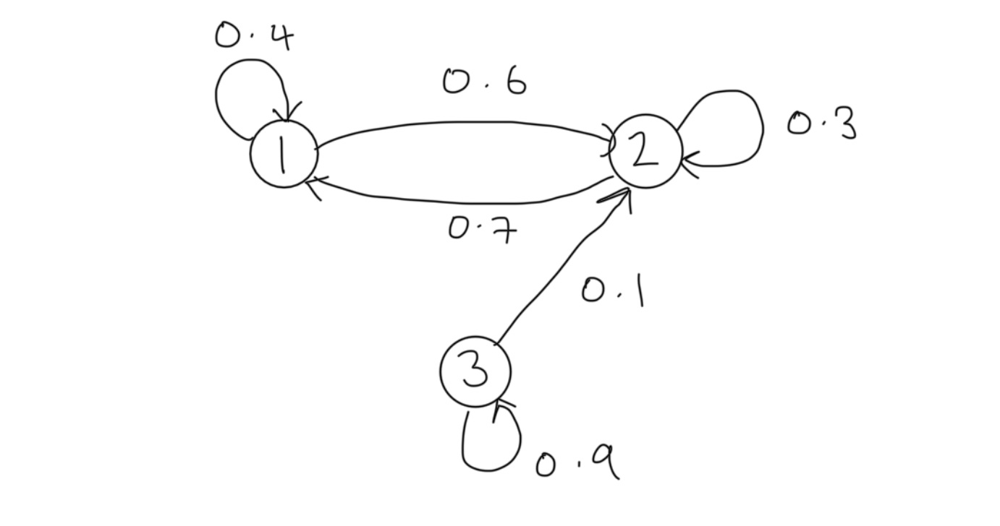
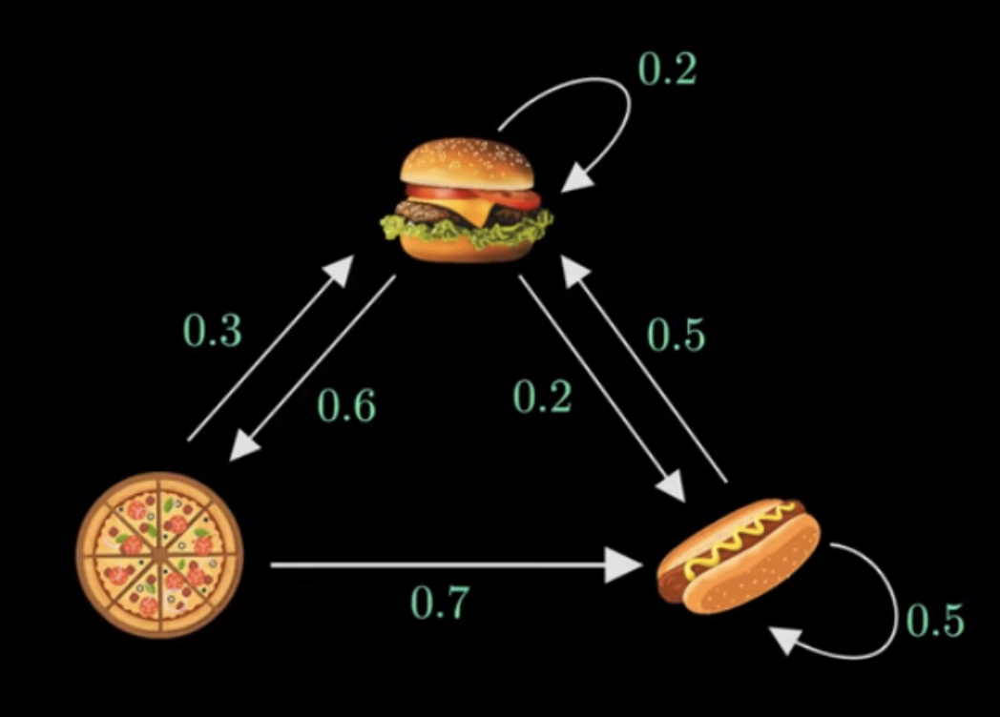

#### Parent Topics

::: {#topics}
:::


```{python}
#| echo: false
# Packages
import numpy as np
```

## Markov Property (Discrete Processes)

In probability theory a stochastic process is said to satisfy the <mark>_Markov property_</mark> if its future evolution is <mark>_independent of its history_</mark>, that is the process is <mark>_memoryless_</mark>.  Consider a discrete time stochastic process $\{X_t\}_{t\in\mathbb{N}}$ defined in the probability space $(\Omega,\mathcal{F}, \mathbb{P})$.

> **Definition:** (<mark>Markov Property</mark>)
> The discrete time stochastic process $\{X_t\}_{t\in\mathbb{N}}$ is said to satisfy the _Markov property_ if $$\mathbb{P}(X_{n+1}=x_{n+1}|X_n=x_n, ..., X_1=x_1)=\mathbb{P}(X_{n+1}=x_{n+1}|X_n=x_n).$$

Intuitively, we see that we gain no additional information about the probability of the next value of the process by conditioning on the entire history rather than the latest value.  Any process satisfying the markov property is called a <mark>_Markov process_</mark>. 

## Markov Chains

A Markov process with a discrete state space is known as a _Markov chain_ (MC).  Assume that $\{X_t\}_{t\in\mathbb{N}}$ is a Markov chain with finite state space $\mathcal{X}:=\{1, ..., M\}$.  The evolution of the chain in time is described by <mark>_transition probabilities_</mark> $p_{i,j}^{(t)}(n)$ which give the probability that the chain is in state $j$ at time $t+n$ given that the chain was in $i$ at time $t$ 
$$
p_{i,j}^{(n)}(t)=\mathbb{P}(X_{t+n}=j|X_{t}=i).
$$

We summarize the transition probabilities in an $M\times M$ <mark>_transition probability matrix_</mark> denoted by 
$$
P^{(n)}(t)=(p_{i,j}^{(n)}(t))_{i,j\in\mathcal{X}}.
$$

The transition probability matrix is <mark>_stochastic_</mark> which means that for all $n,t\in\mathbb{N}$ we have:

1. $0\leq p_{i,j}^{(n)}(t)<1$ for all $i,j\in \mathcal{X}$,
2. $\sum_{{j\in S}}p_{{i,j}}^{(n)}(t)=1$ for all $i\in \mathcal{X}$.

To simplify notation we denote the <mark>_one-step transition probablity matrix_</mark>  
$$
P^{(1)}(t)=P(t)=(p_{i,j}^{(1)}(t))_{i,j\in\mathcal{X}}=(p_{i,j}^{(n)})_{i,j\in\mathcal{X}}.
$$

The transition probabilities are <mark>_stationary_</mark> when they are invariant in time, that is
$$
p_{i,j}^{(n)}(t)=p_{i,j}^{(n)}(s);~~\forall s,t\in\mathbb{N}.
$$

We say that a MC is <mark>_homogenous_</mark> if it has stationary transition probabilities.  For homogenous MCs we are often interested in the <mark>one-step transition probabilities</mark> and so again to clarify notation we denote the one-step transition probability matrix for homogenous MCs as
$$
P=(p_{i,j}^{(t)}(1))_{i,j\in\mathcal{X}}=(p_{i,j})_{i,j\in\mathcal{X}}.
$$


The <mark>_state distribution_</mark> $m^{(t)}(i)$ gives the probability that the chain is in state $u$ at time $t$ 
$$
\mu^{(i)}(t)=\mathbb{P}(X_{t}=i).
$$

For convenience we summarize the state distributions in vector notation
$$
\boldsymbol{\mu}(t)=(\mu^{(i)}(t))_{i \in \mathcal{X}}.
$$

Of particular interest is the <mark>_initial state distribution_</mark> 
$$
\boldsymbol{\mu}(0)=\boldsymbol{\mu}=(\mu^{(i)}(0))_{i \in\mathcal{X}}.
$$ 

For conveinence we also introduce the following notation for process vectors 
$$
X_{1:t} = (X_1, ..., X_t),
$$

where similarly $X_{1:t}=x_{1:t}$ is equivalent to $X_1=x_1, ..., X_t=x_t$.

<mark>_Finite-dimensional distributions_</mark> allow us to evaluate the behavior of the distribution of infinite length processes by selecting some sub-sequence of index values to evaluate their joint distribution.

> **Proposition (Finite-Dimensional Distributions):**
> The *finite-dimensional distributions* of $X=(X_{n})_{n}$ are determined by the initial mass $\mu^{(0)}$ and transition matrix $P$ where $$P(X_{0}=i_{0}, \dots, X_{n}=i_{n})=\mu_{{x_{0}}}^{(0)}p^{(1)}_{x_{0}, x_{1}}p^{(2)}_{x_{1}, x_{2}}\cdots p^{(n)}_{x_{n-1}, x_{n}}.$$

**Proof:** \
From application of the Chain Rule and the Markov Property we see that
$$
\begin{align}  
\mathbb{P}&(X_{1 : t}=x_{1: t}) & \\
 & = \mathbb{P}(X_{0}=x_{0}) \mathbb{P}(X_{1}=x_{1}|X_{0}=x_{0})\mathbb{P}(X_{2}=x_{2}|X_{0 : 1}=x_{0 : 1})\cdots \\
 & \quad \cdots \mathbb{P}(X_{t}=x_{t}|X_{0 : t-1}=x_{0: t-1})  \\
  & =\mathbb{P}(X_{0}=x_{0})\mathbb{P}(X_{1}=x_{1}|X_{0}=x_{0})\mathbb{P}(X_{2}=x_{2}|X_{1}=x_{1})\cdots \\
  & \quad \cdots \mathbb{P}(X_{n}=x_{n}|X_{n-1}=x_{n-1})  \\
& = \mu_{{x_{0}}}^{(0)}p^{(1)}_{x_{0}, x_{1}}p^{(2)}_{x_{1}, x_{2}}\cdots p^{(n)}_{x_{n-1}, x_{n}},
\end{align}
$$

as required.
$\square$

## Homogenous Markov Chains

From this point onwards we exclusively consider homogenous MCs.   

> **Proposition 1:** (<mark>Multi-step Transition Probabilities for homogenous MCs)</mark> \
> Let $\{ X_{n} \}$ be a homogenous MC with one-step transition probability matrix $P$.The $m$-step transition probabilities are given by raising the one-step transition probability matrix to the $m$-th power $$P^{(m)}=(\mathbb{P}(X_{m}=j|X_{0}=i))_{i,j}=P^m.$$

**Proof:** \
The result follows immediately from the Markov property since
$$
\begin{aligned}
\mathbb{P}(X_{m}|X_{0}) & =\mathbb{P}(X_{m}|X_{m-1})\mathbb{P}(X_{m-1}|X_{0}) \\
& = \qquad \vdots \\
& = \mathbb{P}(X_{m}|X_{m-1})\cdots \mathbb{P}(X_{1}|X_{0}) \\
& = [\mathbb{P}(X_{1}|X_{0})]^m.
\end{aligned}
$$

$\square$

Often to help us understand the structure of Markov chains we construct <mark>_state diagrams_</mark>, connected graphs where nodes represent the possible chain states and directed connections the transition probabilities. 

<em>**Example 1:** Consider a MC with state space $\mathcal{S}:=\{ 1,2,3 \}$ with transition probability matrix $P$ and initial state distribution $\mu$ given respectively by
$$
P:=\begin{bmatrix}
0.4 & 0.6 & 0 \\
0.7 & 0.3 & 0  \\
0 & 0.1 & 0.9
\end{bmatrix},~~\mu=\begin{bmatrix}
0.1 & 0.2 & 0.7
\end{bmatrix}.
$$

The state diagram for this chain is 



Suppose we wish to determine the $3$-step transition probabilities.  Applying Proposition 1 we can compute that
```{python}
P = np.array([
    [.4, .6, 0],
    [.7, .3, 0],
    [0, .1, .9]
])
P3 = np.linalg.matrix_power(P,3); print(P3)
```

Furthermore, let use suppose that we wish to determine the 3-step state distribution.  From the Markov property we see that
$$
\begin{aligned}
\mathbb{P}(X_3|X_0) & =\mathbb{P}(X_0)\mathbb{P}(X_1|X_0)\mathbb{P}(X_2|X_1)\mathbb{P}(X_3|X_2) \\
 & = \boldsymbol{\mu}P^3.
\end{aligned}
$$

Thus we can compute
```{python}
mu = np.array([
    0.1, 0.2, 0.7
])
mu@(P3)
```

</em>

## State Classification

We can classify MC states based on how they appear in the chain and their behavior in the limit.  States can be _persistent_ (_recurrent_), _null-persistent_, _transient_, _absorbing_, _periodic_ and _ergodic_.

> **Definition:** (<mark>Persistent States</mark>)
> A state $j$ is _persistent_ if the probability that the process will return to $j$ given that it started at $j$ eventually is 1, that is $$\mathbb{P}(X_{n}=j~\text{for some}~n\geq 1|X_{0}=j)=1.$$

For future reference we note that this statement is equivalent to each of the following:

1. The probability that the first hitting time of state $j$ is finite given the process started at $j$ is 1 i.e. $\mathbb{P}(T_{i}<\infty|X_{0}=i)=1$ or equivalently $\mathbb{P}(T_{i}=\infty|X_{0}=i)=0$;

2. The sum of the $n$ step transition probabilities from $j$ to $j$ for all $n\in \mathbb{N}$ is infinite i.e. $\sum_{n}p_{j,j}(n)=\infty$;

3. The probability that the chain ever visits $j$ having started at $j$ is 1 i.e. $f_{j,j}=1$.

4. The expected number of visits $N_{j}$ to state $j$ is infinite i.e. $\mathbb{E}[N_{j}|X_{0}=i]=\infty$.

The importance of these equivalent statements will be made clearer in the upcoming sections.

> **Definition:** (<mark>Null-Persistent States</mark>) /
> A state $j$ is _null-persistent_ if it is persistent but the mean recurrence time is still infinite i.e. $\mu_{i}=\infty$. Otherwise the state is known as *non-null* or *positive persistent*.  

For example we consider a symmetric random walk whereby any point in the state space is null-persistent since the random walk can always return but may take infinitely long to do so.  We provide a proof of this claim in our note on Random Walks.

> **Definition:** (<mark>Transient States</mark>) /
> Alternatively, if a state $j$ is not persistent it must be _transient_, that is, the probability that the process will return to $j$ given that it started at $j$ eventually is 0 i.e. the processes structure prevents it from returning.  This is equivalent to writing $$\mathbb{P}(X_{n}=i~\text{for some}~n\geq 1|X_{0}=i)<1.$$

As above, notice that this is equivalent to each of the following:

1. The probability that the first hitting time of state $j$ is finite given the process started at $j$ is less than $1$, i.e. $\mathbb{P}(T_i<\infty|X_0=i)<1$ or equivalently $\mathbb{P}(T_{i}=\infty|X_{0}=i)>0$;

2. The sum of the $n$ step transition probabilities from $j$ to $h$ for all $n \in\mathbb{N}$ is finite $\sum_{n}p_{j,j}(n)<\infty$;

3. The probability that the chain ever visits $j$ having started at $j$ is less than $1$ i.e. $f_{j,j}<1$;
   
4. The expected number of visits $N_j$ to state $j$ is finite i.e. $\mathbb{E}[N_{j}|X_{0}=i]<\infty$.

Note that if a state $j$ is transient we must have that $p_{i,j}(n) \to 0$ as $n \to \infty$ for all $i$ since $\sum_{n}p_{{i,j}}(n)<\infty$.  Intuitively, this is stating that since $j$ is transient, the probability that the chain visits $j$ as time $n$ goes to infinity approaches 0.

> **Definition:** (<mark>Periodic States</mark>) /
> The *period* of a state $j$ is the greatest common divider of all $n$ for which $p_{{i,i}}(n)>0$ i.e. $$d(i)=gcd\{n:p_{i,i}(n)>0\}.$$If $d(i)=1$ then the state $j$ is *aperiodic* and otherwise, the state is said to be *periodic*.

A state $j$ is <mark>_ergodic_</mark> if it is positive persistent and aperiodic i.e. $\mu_{i,i}<\infty$ and $d(i)=1$.

A state $j$ is <mark>_absorbing_</mark> if $p_{j,j}=1$, that is the probability of leaving state $j$ once the process has entered is 0. 


## Chain Classification

To classify chains we first define state <mark>_communication_</mark>, that is when paths between states have non-zero probability.

> **Definition:** (<mark>Communicating States</mark>) \
> For MC $\{ X_{t} \}$ state $i$ _communicates_ with state $j$, denoted $i \to j$, if $p_{i,j}(n)>0$ for some $n$.  If $i\to j$ and $j \to i$ we say that $i$ and $j$ _intercommunicate_, denoted $i \leftrightarrow j$.

- If $i \neq j$ this is equivalent to $f_{i,j}=\mathbb{P}(T_{j}<\infty|X_{0}=i)>0$.

- If $i = j$, then $p_{i,i}(0)=1$ so that $i \to i$ but it is possible for $f_{i,i}=\sum_{n=1}^\infty f_{i,i}(n)=0$, that is, the chain might leave $i$ immediately and never return to it.

We can show that intercommunication is an <mark>_equivalence class_</mark> and thus can be used to split MC state spaces into communication classes.  For $i,j$ in the same communication class we have:

1. States $i$ and $j$ have the same period;

2. State $i$ is transient iff $j$ is transient; and

3. State $i$ is null persistent iff $j$ is.

A set of states $C$ is <mark>_irreducible_</mark> if for all $i,j\in C$, $i\leftrightarrow j$, that is all states within $C$ inter-communicate.

A set of states $C$ is <mark>_closed_</mark> if for all $i \in C$, $p_{i,j}=0$ for all $j\not\in C$, that is, the chain never leaves $C$ once it has entered.  Not that clearly the set consisting of one absorbing state is closed.

<em>**Example 2:** Considering the same chain as Example 1 we note that states 1 and 2 are persistent (specifically non-null persistent) whilst state 3 is transient.  Further the chain has two communication classes $\{ 1,2 \}$ and $\{ 3 \}$.  All states are aperiodic.</em>

## Chapman Kolmogorov Equations

The <mark>_Chapman-Kolmogorov Equations (CKE)_</mark> relate the joint probability distributions of different sets of coordinates on a stochastic process.  

> **Theorem 2:** (<mark>Chapman-Kolmogorov Equations</mark>) \
> For a discrete time countable state homogeneous Markov chain the Chapman-Kolmogorov equations state that $$P_{n+m}=P_{n}\cdot P_{m},$$or equivalently $$p_{i,j}(n+m)=\sum_{k\in S}p_{i,k}(n)p_{k,j}(m).$$

A similar result holds for distributions
$$
\mu_{j}^{(n+m)}=\sum_{i \in S}\mu_{i}^{(n)}p_{i,j}(m),
$$

or in matrix form 
$$
\boldsymbol{\mu}^{(n+m)}=\boldsymbol{\mu}^{(n)}P_{m}=\boldsymbol{\mu}^{(n)}P^m\quad\&\quad \boldsymbol{\mu}^{(n)}=\boldsymbol{\mu}^{(0)}P^n.
$$

## Passage Times & Mean Recurrence Times

To understand recurrence and passage times we first define the <mark>_first hitting time_</mark> of a state.

> **Definition:** (<mark>Hitting Times</mark>) \
> The _first hitting time_ of state $j\in S$ is defined as $$T_{j}=\min\{n\geq 1:X_{n}=j\},$$where we assume that $T_{j}=\infty$ if the chain $X$ never visits this state for $n=1,2,\dots$.

Sometimes we denote $T_{i,j}$ when we wish to specify that the process starts from $i$ and finishes at $j$.

The probability that the chain visits state $j$, starting from state $i$, for the first time on step $n$ is called the <mark>_passage time probability_</mark> and is defined by
$$
f_{i,j}(n)=\mathbb{P}(T_{j}=n|X_{0}=i)=\mathbb{P}(X_{1}\neq j, X_{2}\neq j, \dots, X_{{n-1}}\neq j, X_{n}=j|X_{0}=i).
$$

The _visiting probability_ which describes the probability that the chain ever visits state $j$ when starting from state $i$ is defined by 
$$
f_{ij}=\mathbb{P}(T_{j}<\infty|X_{0}=i)=\sum_{n=1}^\infty f_{{ij}}(n).
$$

> **Definition:** (<mark>Mean Recurrence Time</mark>) \
> The *mean recurrence time* is defined as $\mu_{i}=\mathbb{E}[T_{i}|X_{0}=i]$ which gives that $\mu_{i}=\infty$ if $i$ is transient and $\mu_{i}=\sum_{n=1}^\infty nf_{i,i}(n)$ if $i$ is persistent.

## Excursions & State Visits

Intuitively, an <mark>_excursion_</mark> of a Markov chain $X=\{X_{n}\}_{n=0}^\infty$ can be thought of the path and time spent by the chain in some pre-specified region.

More formally, assume $X_{0}=j$ and define the following:

1. The time of first return to state $j$ as: $T_{j}=T_{j}(1):=\min \{ m \geq 1 :X_{m}=j\}$.
2. The $n$-th return to state $j$ as: $T_{j}(n):=\min \{ m>T_{j}(n-1):X_{m}=j \}$.

The <mark>_stopping times_</mark> $T_{j}(n)$ are therefore random times when the chain hits point $X_{m}=j$.

The _$n$-th excursion_ of $X$ starting from $j$ is therefore given by the block
$$
(X_{T_{j}(n-1)+1}, \dots, X_{T_{j}(n)}).
$$

The <mark>_excursion length_</mark> is given by
$$
\alpha_{n}:= T_{j}(n)-T_{j}(n-1);\quad \alpha_{0}=0;\quad \alpha_{1}=T_{j}.
$$

Define the <mark>_number of visits to a state_</mark> $j$ after time $0$ by
$$
N_{j}=\sum_{n=1}^\infty \mathbb{1}_{X_{n}=j}.
$$

From the simple computation
$$
\mathbb{E}[N_{j}|X_{0}=i]=\sum_{n=1}^\infty \mathbb{E}[\mathbb{1}_{X_{n}=j}|X_{0}=i]=\sum_{n=1}^\infty \mathbb{P}(X_{n}=j|X_{0}=i)=\sum_{n=1}^\infty p_{i,j}(n),
$$

we obtain the following result regarding state classification..

> **Theorem:** (<mark>State Classification and Expected Visits</mark>) \
> State $j$ is persistent iff $\mathbb{E}[N_{j}|X_{0}=i]=\infty$ i.e. if the expected number of visits to state $j$ is infinite starting from $j$ or any state $i$ that communicates with $j$.  Equivalently state $j$ is transient iff $\mathbb{E}[N_{j}|X_{0}=i]<\infty$.

In fact we have the more robust result following from properties of the Geometric distribution.

For all $i,j\in S$ and $k\geq 0$ we have that
$$
\mathbb{P}(N_{j}=k|X_{0}=i)=\begin{cases}
1-f_{ij} & \text{if }k=0, \\
f_{i,j}f_{j,j}^{k-1}(1-f_{j,j}) & \text{if }k\geq 1.
\end{cases}
$$

From this we can make the following conclusions:

1. If $j$ is transient ($f_{j,j}<1$) then:

	- $\mathbb{P}(N_{j}=k|X_{0}=j)=f_{j,j}^k(1-f_{j,j})$, $k\geq 0$ i.e. $N_j$ is a Geometric ($f_{j,j}$) random variable.
	- For all $i$, $\mathbb{E}[N_{j}|X_{0}=i]=\sum_{n=1}^\infty p_{i,j}(n)= \frac{{f_{i,j}}}{1-f_{j,j}}<\infty$ (mean of Geometric random variable).
	- For all $i$, $\mathbb{P}(N_{j}<\infty|X_{0}=i)=1$ and $\mathbb{P}(N_{j}=\infty|X_{0}=i)=0$ i.e. the chain visits transient state $j$ finitely often.

2. If $j$ is persistent ($f_{j,j}=1$) then:

	- $\mathbb{P}(N_{j}=k|X_{0}=j)=0$ for $k=0,1,2,\dots$ and $\mathbb{P}(N_{j}=\infty|X_{0}=j)=1$, that is
	- $\mathbb{P}(\{ X_{n}=j \}~i.o.|X_{0}=j)=1$.
	- For all $i$, $\mathbb{P}(N_{j}=k|X_{0}=i)=0$ for $j=0,1,2,\dots$, $\mathbb{P}(N_{j}=\infty|X_{0}=i)=f_{{i,j}}$ and $\mathbb{P}(N_{j}=0|X_{0}=i)=1-f_{i,j}$.

To understand the appearance of the Geometric distribution consider a Markov chain starting from the state $j$, $X_{0}=j$.  Following the movements of the chain until it returns to $j$ with probability $f_{j,j}$, that is until it completes its first excursion.  Completing an excursion is labelled as a Failure, leaving excursion incomplete as a Success.  $N_{j}=k$ means that starting from $j$, the chain completed $k$ excursions, i.e. returned to state $j$ exactly $k$ times.  The $(k+1)$-st excursion was not completed, a Success, with probability $1-f_{j,j}$.  This happened because the chain left state $j$ at time $T_{j}(n)$ and never returned.

## Equilibrium Convergence & Ergodic Theorems

For a Markov chain $\{ X_{n} \}_{n=0}^\infty$ we consider whether the limit $\lim_{ n \to \infty }p_{i,j}(n)$ exists for all $j$ independently of $i$, whether it is a distribution, and whether the chain visits $j$ at $n=\infty$.  

> **Theorem:** \
> If state $j$ is transient then $\lim_{ n \to \infty }p_{i,j}(n)=0$ for all $i$.

If the limiting distribution $\pi=(\pi_{j}=\lim_{ n \to \infty }p_{i,j}(n),~j\in S)$ exists, it must be stationary.  More formally we have the following result.

> **Lemma:** \
> For all $j$, let $p_{i,j}(n)\to \pi_{j}$ and $\pi=(\pi_{j},~j \in S)$ be a distribution, that is $\pi_{j} \geq 0$, $\sum_{j}\pi_{j}=1$.  Then, $\pi$ is stationary.
> 

For periodic states $\lim_{ n \to \infty }p_{i,j}(n)$ might not exist.

The following theorem for ergodic (aperiodic non-null persistent) states is an important result.

> **Theorem:** (<mark>Ergodic Theorem</mark>) \
> Let $(X_{n})$ be an irreducible non-null persistent Markov chain with stationary distributions $\pi$ such that $\pi=\pi P$, we have the following results:
> 
> 1. If the chain is aperiodic then $\lim_{ n \to \infty }p_{i,j}(n)=\pi_{j}=\frac{1}{\mu_{j}}$ for all $j \in S$.
> 
> 2. If the chain is periodic with period $d$, then for all $i,j\in S$ there exists an integer $r$ such that $0\leq r<d$ and $p_{i,j}(n)=0$ unless $n=md+r$ for some $m\geq 0$ and $\lim_{ m \to \infty }p_{i,j}(md+r)=d\cdot \pi_{j}= \frac{d}{\mu_{j}}$.
> 
> For null persistent irreducible chains these results hold with $\mu_{j}=\infty$ i.e. $\lim_{ n \to \infty }p_{i,j}(n)=0$ in aperiodic case and $\lim_{ m \to \infty }p_{i,j}(md+r)=0$ in periodic case.

We discuss the result in the following points:

1. In ergodic case, $p_{i,j}(n)\to \pi_{j}= \frac{1}{\mu_{j}}$ and the chain forgets its origin: $$\begin{aligned}\mathbb{P}(X_{n}=j)&=\sum_{i \in S}\mathbb{P}(X_{n}=j|X_{0}=i)\mathbb{P}(X_{0}=i)=\sum_{i}p_{i,j}(n)\cdot \mathbb{P}(X_{0}=i) \\ &\stackrel{n \to \infty}{\to}\pi_{j}\sum_{i}\mathbb{P}(X_{0}=i) \\ &=\pi_{j}.\end{aligned}$$Here we used the Dominated Convergence Theorem to justify exchanging summation and limits: $$\left| \sum_{i}p_{i,n}(n)\mathbb{P}(X_{0}=i) \right|\leq \sum_{i}\mathbb{P}(X_{0}=i)=1.$$

2. A finite irreducible aperiodic Markov chain is always non-null persistent (see previous results) so that the stationary distribution always exists and by the ergodic theorem, $\lim_{ n \to \infty }p_{i,j}(n)=\pi p_{j}=\frac{1}{\mu_{j}}$.
   
3. An irreducible aperiodic Markov chain has: stationary distribution $\iff$ non-null persistent $\iff$ there exists $\lim_{ n \to \infty }p_{i,j}(n)=\pi_{j}$ and $\pi=(\pi_{j},~j \in S)$ is a probability distribution (ergodic chain!).

## Stationary Distributions

Consider the long-term behavior of a Markov chain $\{ X_{n} \}_{n=0}^\infty$ when $n \to \infty$.  It is possible for the chain to converge to a particular state (e.g. a Galton-Watson-Bienaymé (GWB) Branching Process can converge to 0).  Additionally, it is possible for a Markov chain to converge to some random variable $X~a.s.$ as $n\to \infty$.  Intuitively, if a Markov chain runs for a long time it generally doesn't converge because it is always jumping around but its distribution can settle down.  

A process is <mark>_strictly stationary_</mark> if its distribution does not change under translations, i.e. over time.  More formally we give the following definition.

> **Definition:** (<mark>Strictly Stationary Process</mark>)
> A process $\{ X_{n},~n\geq 0 \}$ is _strictly stationary_ if for any integers $m\geq 0$ and $k>0$, we have $(Y_{0}, Y_{1}, \dots Y_{m})\stackrel{\mathcal{D}}{=}(Y_{k}, Y_{k+1}, \dots, Y_{k+m})$ that is, the distribution does not change under translations.

This is often a challenging condition to show and so we also define a <mark>_weak stationarity_</mark> of the mean and covariance being invariant to changes in time.  See oour discussion of Time Series Anaysis for more detailed noted on stationarity.

> **Definition:** (<mark>Stationary Distribution</mark>)
> The vector $\pi=(\pi_{j},~j \in S)$ is called a _stationary distribution_ of a Markov chain if:
> 1. $\pi_{j}\geq 0$ and $\sum_{j\in S}\pi_{j}=1$.
> 2. $\pi=\pi P$ i.e. $\pi_{j}=\sum_{i \in S}\pi_{i}p_{i,j}$ for all $j \in S$.
>  
> Note that $\pi P^2=\pi P\cdot P=\pi P=\pi$ and similarly, for all $n>1$, $\pi P^n=\pi$, that is $\pi_{j}=\sum_{i\in S}\pi_{i}p_{i,j}(n)$ for all $j \in S$.

Denote by $P_{\pi}$ the distribution of a Markov chain with initial distribution $\pi$:  $\mu^{(0)}=\pi$.  Thus $\{X_{n}\}\sim Markov(\pi,P)$ that is, for an event $A$, $\mathbb{P}_{\pi}(A)=\sum_{i\in S}\mathbb{P}(A|X_{0}=i)\pi_{i}$.  With respect to $\mathbb{P}_{\pi}$, chain $\{X_{n}\}$ is a strictly stationary process
$$
\begin{aligned}
\mathbb{P}_{\pi}&(X_{n}=i_{0}, X_{n+1}=i_{1}, \dots, X_{n+k}=i_{k}) \\
 & = \pi_{i_{0}}p_{i_{0}, i_{1}}\dots p_{i_{k-1}i_{k}} \\ 
 & = \mathbb{P}_{\pi}(X_{0}=i_{0}, X_{1}=i_{1}, \dots, X_{k}=i_{k}).
\end{aligned}
$$

In particular $\mu_{i}^{(n)}=\mathbb{P}_{\pi}(X_{n}=i)=\pi_{i}$ for all $i\in S$ and $n\geq 0$.

Intuitively, if $\{  X_{n} \} \sim Markov(\pi,P)$ and its initial distribution is stationary, then for all $n$, $X_{n}\stackrel{\mathcal{D}}{\sim }\pi$ so that $X_{n}\stackrel{\mathcal{D}}{\to}X$ with $\mathbb{P}_{\pi}(X_{n}=j)=\pi_{j}\to \pi_{j}=\mathbb{P}(X=j)$.

<em>**Example:** Consider a Markov chain describing the meals served by a restaurant with transition graph shown below in Figure 1 provided by helpful video on Markov chains by [Normalized Nerd](https://www.youtube.com/watch?v=i3AkTO9HLXo&t=110s).  



Taking state 1 to be hamburger, state 2 to be pizza and state 3 to be hotdog, the transition matrix $P$ can be written as
$$
P=\begin{bmatrix}
0.2 & 0.6 & 0.2  \\
0.3 & 0 & 0.7  \\
0.5 & 0 & 0.5 
\end{bmatrix}.
$$

Given the restaurant first serves pizza we can define the initial distribution $\pi_{0}=\begin{bmatrix}0 & 1 & 0\end{bmatrix}$.  Applying the transition matrix $P$ we get
$$
\pi_{0}P=\begin{bmatrix}
0 & 1 & 0
\end{bmatrix}\cdot \begin{bmatrix}
0.2 & 0.6 & 0.2  \\
0.3 & 0 & 0.7  \\
0.5 & 0 & 0.5 
\end{bmatrix}=\begin{bmatrix}
0.3 & 0 & 0.7
\end{bmatrix}=\pi_{1},
$$

the second state future transition probabilities.   Repeating this step for $\pi_{1}$ we have
$$
\pi_{0}P=\begin{bmatrix}
0.3 & 0 & 0.7
\end{bmatrix}\cdot \begin{bmatrix}
0.2 & 0.6 & 0.2  \\
0.3 & 0 & 0.7  \\
0.5 & 0 & 0.5 
\end{bmatrix}=\begin{bmatrix}
0.41 & 0.18 & 0.41
\end{bmatrix}=\pi_{2},
$$

If a stationary distribution $\pi$ exists it would mean that as $\pi_{0}, \pi_{1}, \dots$ continues, eventually it will reach a point where it doesn't change when $P$ is applied, hence using linear algebra we can write the expression
$$
\pi P=\pi,
$$

see Definition 2 above.  Additionally, since $\pi$ is a vector of probabilities we have that $\pi(1)+\pi(2)+\pi(3)=1$ and solving this system gives the stationary distribution
$$
\pi=\begin{bmatrix}
\frac{25}{71} & \frac{15}{71} & \frac{31}{71}
\end{bmatrix}.
$$

</em>

> **Theorem:** (<mark>MC Strict Stationarity with Stationary Initial Distribution</mark>) \
> Denote by $\mathbb{P}_{\pi}$ the distribution of a Markov chain with initial distribution $\pi:\mu^{(0)}=\pi$.  Thus, $(X_{n})\sim Markov(\pi, \mathbb{P})$, that is, for an event $A$, $\mathbb{P}_{\pi}(A)=\sum_{i \in S}\mathbb{P}(A|X_{0}=i)\pi_{i}$.
> 
> With respect to $\mathbb{P}_{\pi}$, chain $(X_{n})$ is a strictly stationary process: $$\mathbb{P}_{\pi}(X_{n}=i_{o}, X_{n+1}=i_{1}, \dots, X_{n+k}=i_{k})=\pi_{i_{0}}p_{i_{0}, i_{1}}\dots p_{i_{k-1},i_{k}}=\mathbb{P}_{\pi}(X_{0}=i_{o}, X_{1}=i_{1}, \dots, X_{k}=i_{k}).$$In particular, $$\mu_{i}^{(n)}=\mathbb{P}_{\pi}(X_{n}=i)=\pi_{i}$$for all $i \in S$ and $n \geq 0$.

Here $\pi$ has is something called an <mark>_invariant measure_</mark>.

> **Definition:** (<mark>Invariant Measure</mark>)
> A vector $\underline{\rho}=(\rho_{j}~j \in S)$ is an _invariant measure_ if (1) $\rho_{j}\geq 0$ for all $j \in S$ and (b) $\underline{\rho}=\underline{\rho}P$.

Note that if $\underline{\rho}$ is an invariant measure such that $\sum_{j\in S}\rho_{j}<\infty$, then $\pi=\left( \pi_{i}:= \rho_{i} / \sum_{j}\rho_{j},~i \in S \right)$ is the stationary distribution for this Markov chain.  In general, invariant measure $\underline{\rho}$ does not have to be finite, it is possible to have $\sum_{j}\rho_{j}=\infty$.

The following is a fundamental result on the existence and uniqueness of invariant measures and stationary distributions.

> **Theorem:** (<mark>Existence & Uniqueness of Invariant Measures & Stationary Distributions</mark>) \
> An irreducible Markov chain has a stationary distribution $\pi$ iff all its states are non-null persistent. In this case, $\pi$ is the unique stationary distribution and is given by $\pi_j = \frac{1}{μ_{j}}$, for all $j \in S$, where $μ_j = \mathbb{E}(T_{j} |X_{0} = j)$ is the mean recurrence time of $j$. 
> 
> Also, in this case, the equation $\underline{x} = \underline{x}P$ has a positive root which is unique up to a multiplicative constant and for which $\sum_{j∈S} x_{j} < \infty$. 
> 
> If the chain is irreducible and null persistent, the previous statement holds, but $\sum_{j∈S} x_j = \infty$.

The following results follow immediately from the previous theorem.

1. An irreducible persistent chain always has an invariant measure unique up to a multiplicative constant $(\underline{\rho}=\underline{\rho}P)\implies(c \underline{p}=c \underline{\rho}P)$ for any constant $c>0$.

2. If a chain is non-null persistent, then $\sum_{j}\rho_{j}<\infty$ and there is a unique stationary distribution $\pi$: $\pi_{i}=\rho_{i} / \sum_{j}\rho_{j}$.

3. If a chain is _null persistent_, then $\sum_{j}\rho_{j}<\infty$, there is <mark>_no stationary distribution_</mark>.

4. If the chain is _transient irreducible_, there is <mark>_no stationary distribution_</mark>.

We consider only irreducible persistent chains because any chain can be decomposed into disjoint closed classes of these.  

This theorem gives a new method to calculate mean recurrence times $\mu_{j}=\pi_{j}^{-1}$ where $\pi=\pi P$.  For non-null persistent chain ($\mu_{j}<\infty$) we are guaranteed existence of a unique solutions $\pi$ of this system of equations, this solution is the stationary distribution of the chain.

Furthermore, this theorem provides a new method of deciding whether or not an irreducible chain is non-null persistent: check whether the system of equations $x=xP$ has a positive solution such that $\sum_{j}x_{j}<\infty$.  If it does, the chain has stationary distribution and therefore is non-null persistent.

> **Theorem:** \
> Let $s \in S$ be any state of an irreducible chain.  The chain is transient if and only if there exists a non-zero solution $\{  y_{j}:~j\neq s \}$, satisfying $|y_{j}|\leq 1$ for all $j$, to equations $y_{i}=\sum_{j: j\neq s}p_{i,j}y_{j}$, $i\neq s$.

## Time Averages

Let us consider the behavior of a Markov chain $X$ in the limit in distribution.

> **Theorem:** (<mark>SLLN for Markov Chains</mark>) \
> Let $X$ be irreducible non-null persistent Markov chain with a state space $S$ and with unique stationary distribution $\pi$.  Let function $f:S\to \mathbb{R}$ be bounded (i.e. $|f(k)|\leq M<\infty$) for all $k \in S$ for some constant $M$) or non-negative (i.e. $f(k)\geq 0$ for all $k \in S$).  Then, for any initial distribution we have the following result $$\lim_{ N \to \infty } \frac{1}{N}\sum_{n=0}^N f(X_{n})=\pi(f):=\sum_{k\in S}f(k)\pi_{k}~a.s..$$

**Proof:** \
We think of $f(k)$ as a reward (or cost) for the process to be in state $k$.  Then, the expression $\lim_{ N \to \infty }\frac{1}{N}\sum_{n=0}^N f(X_{n})$ represents the average long-run reward (or cost) rate.

Fix, a state $j \in S$ and take function
$$
f(k)=\mathbb{1}_{j}(k)=\begin{cases}
1 & \text{if }k=j \\
0 & \text{if }k\neq j,
\end{cases}
$$

so that $f(X_{n})=\mathbb{1}_{j}(X_{n})$.  In this case $\lim_{ N \to \infty } \frac{1}{N}\sum_{n=0}^N \mathbb{1}_{j}(X_{n})$ is equivalent to each of the following:

- $\frac{1}{N}\times$ number of visits to state $j$ on steps $0,1,\dots,N$
- proportion of time the chain spends in state $j$
- relative frequency of visiting $j$.

Since the Markov chain $X$ is irreducible non-null persistent, so eventually, it gets into a steady-state with stationary distribution $\pi$.  The result above says that at equilibrium $N \to \infty$, the sample mean $\frac{1}{N} \sum_{i=0}^N f(X_{i})$ becomes the mean value of $X_{\infty}\sim \pi$ such that $\mathbb{E}_{\pi}f(X_{\infty})=\sum_{k \in S}f(k)\pi_{k}$.

The result can be phrased as *the time average is equal to the ensemble average* and therefore is known as *the ergodic theorem*.  Here the time average $= \frac{1}{N}\sum_{n=0}^N f(X_{n})$ since we are averaging values of $f(X_{n})$ taken over times $0,1,\dots,N$; and the ensemble average $=\mathbb{E}X_{\infty}=\sum_{k \in S}f(k)\pi_{k}=\int _{\Omega}X_{\infty}(\omega) \, \mathbb{P}(d\omega)$ is the average over values $X_{\infty}(\omega)$ where $X_{\omega}$ has the steady-state distribution $\pi$.

## Time Reversibility

Let $X:=\{X_{n}\}_{n=0}^\infty$ be an irreducible non-null persistent Markov chain with transition matrix $P$ and stationary distribution $\pi$.  Assume that $X$ starts according to its stationary distribution $\mu^{(0)}=\pi$ so that $X$ is in equilibrium and is strictly stationary, $X_{n}\stackrel{\mathcal{D}}{\sim}\pi$ for all $n$.

> **Definition:** (<mark>Reverse Markov Chain</mark>) \
> For $\{ X_{n},~n=0,1,\dots,N \}$ the reverse Markov chain is defined as $$\{ Y_{n}:=X_{N-n},~n=0,1,\dots,N \},$$i.e. the original chain running backwards in time.

We can prove the following theorem showing that the reversed chain $Y$ is Markov.

> **Theorem:** (<mark>Reversed Chain Markov Property</mark>)
> The reversed Markov chain $Y:=\{ Y_{n} \}_{n=0}^N$ satisfies the Markov property with transition probabilities $q_{i,j}$ given by $$q_{i,j}= \frac{\pi_{j}}{\pi_{i}}p_{j,i}.$$

**Proof:** \
We check the Markov property of the reverse chain $Y$
$$
\begin{align}
\mathbb{P}(Y_{n+1}=i_{n+1}|Y_{n}=i_{n}, \dots, Y_{0}=i_{0}) & = \frac{{\mathbb{P}(Y_{0}=i_{0}, \dots, Y_{n+1}=i_{n+1})}}{\mathbb{P}(Y_{0}=i_{0}, \dots, Y_{n}=i_{n})} \\ 
& = \frac{{\mathbb{P}(X_{N}=i_{0}, \dots, X_{N-n-1}=i_{n+1})}}{\mathbb{P}(X_{N}=i_{0}, \dots, X_{N-n}=i_{n})} \\
& = \frac{{\pi_{n+1}p_{i_{n+1}, i_{n}}p_{i_{n}, i_{n-1}}\dots p_{i_{1}, i_{0}}}}{\pi_{n}p_{i_{n}, i_{n-1}}\dots p_{i_{1}, i_{0}}} = \frac{{\pi_{i_{n+1}}}}{\pi_{i_{n}}}p_{i_{n+1}, i_{n}} \\
& = \mathbb{P}(Y_{n+1}=i_{n+1}|Y_{n}=i_{n})  \\
& = q_{i_{n}, i_{n+1}}.
\end{align}
$$

$\square$

The <mark>_balance equations_<\mark> are a way of testing whether a Markov chain $X$ is time reversible.

> **Theorem:** (<mark>Balance Equations</mark>) \
> A Markov chain $X$ is <mark>_time-reversible_</mark> if and only if it satisfies the balance equations for all $i,j\in S$ which are defined (following from Theorem 2 above) as $$\pi_{i}p_{i,j}=\pi_{j}p_{j,i}.$$

Note that one often considers infinite chains on $\{ -\infty, \dots, -2, -1, 0,1 ,2, \dots, +\infty \}$ rather than finite chains as above.  The main result of this section is given below.

> **Theorem:** /
> Let $X$ be an irreducible Markov chain.  If there exists a distribution $\pi$ such that $0\leq \pi_{i}\leq 1$, $\sum_{i \in S}\pi_{i}=1$ and $\pi_{i}p_{i,j}=\pi_{j}p_{j,i}$ for all $i,j \in S$, then the chain is time-reversible (in equilibrium) non-null persistent with stationary distribution $\pi$.

**Proof:** \
We sum the equations $\pi_{i}p_{i,j}=\pi_{j}p_{j,i}$ such that
$$
\sum_{i}\pi_{i}p_{i,j}=\pi_{j}\sum_{i}p_{j,i}=\pi_{j},
$$

because the sum of the probabilities must be 1.  We conclude that $\pi P=\pi$ or that $\pi$ is the stationary distribution for $X$.  Since the stationary distribution exists $\iff$ $X$ is non-null persistent and hence $X$ is time-reversible. 
$\square$

## Related Topics and Examples

Below are some of the most important examples of Markov Chains for which we have also written dedicated notes:

1. Random Walks
2. Galton-Watson-Bienaymé (GWB) Branching Process
3. Birth-Death Processes
4. Poisson Process
5. Brownian Motion

Further for reading on topics on the implementation of Markov chains see the related topics below:

1. Markov Chain Monte Carlo (MCMC) Methods
	- General Metropolis Hastings
	- Gibb's Sampler
2. Hidden Markov Models

## Related Notes

::: {#blog}
:::


