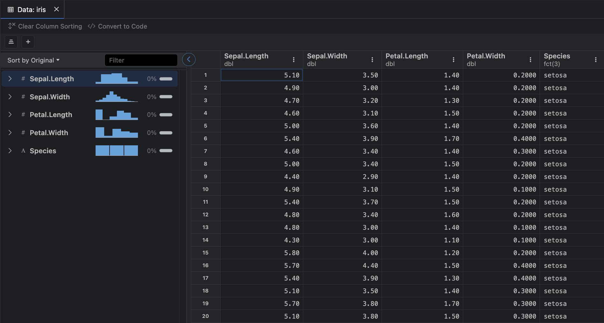

#### Parent Topics

::: {#topics}
:::

```{r}
#| echo: false
# Libraries
library(kableExtra)
```

## Non-Atomic Data Structures

So far we have introduced a variety of atomic data structures (e.g. scalars, vectors, matrices and arrays) each of which are designed for ease of computation and interaction by being restricted to containing only one datatype.  However, as any scientist who has ever collected data will tell you, we often need to define objects that contain multiple datatypes, namely:

1. **Dataframes**; and
2. **Lists**.

By containing multiple datatypes you sacrifice computationally tractability but gain immense flexibility for data storage.



## Dataframes

In `R` a dataframe can be intuitively pictured as a table of data where each column is of the same datatype.  For example here is a table showing the first 6 rows of the pre-loaded dataframe `iris` which contains 4 numeric columns and one factor column:

```{r}
#| echo: false
head(iris) |>
    kable()
```

### Constructing Dataframes

To construct a dataframe in `R` we can use the `dataframe()` function:

```{r}
#| eval: false
data.frame(..., row.names = NULL, check.rows = FALSE,
           check.names = TRUE, fix.empty.names = TRUE,
           stringsAsFactors = FALSE)
```

This function has multiple arguments but the most important are `...`, `row.names` and `stringsAsFactors`.  Lets go through a few examples of constructing data frames to build up our understanding. 

Lets start by building a dataframe with three columns, the first containing numbers, the second containing boolean objects and the third containing character strings.  To do so we specify each columns values in a vector ensuring all three vectors are of the same length to avoid an `error` message:

```{r}
data <- data.frame(
    c(1,2,3),
    c(TRUE, TRUE, FALSE),
    c("alpha", "beta", "gamma")
)
data
```

Looking at our print out we note othat we have successfully created a dataframe with: 

- Numbered rows from 1 to 3; and
- Generated column names based on the vector inputs.

We can specify the names of the columns of the dataframe by slightly tweaking our code:

```{r}
data <- data.frame(
    numbers = c(1,2,3),
    booleans = c(TRUE, TRUE, FALSE),
    strings = c("alpha", "beta", "gamma")
)
data
```

What if we want to name the rows?  In this case we can use the `row.names` argument as

```{r}
data <- data.frame(
    numbers = c(1,2,3),
    booleans = c(TRUE, TRUE, FALSE),
    strings = c("alpha", "beta", "gamma"),
    row.names = c("first", "second", "third")
)
data
```

Finally, we can use the `stringsAsFactors` argument to specify that we wish to convert the `strings` column into a `factor` column:

```{r}
data <- data.frame(
    numbers = c(1,2,3),
    booleans = c(TRUE, TRUE, FALSE),
    strings = c("alpha", "beta", "gamma"),
    row.names = c("first", "second", "third"),
    stringsAsFactors = TRUE
)
data
```

This does not change the dataframe visually but if we will see in the following section that it has changed the datatype of the `strings` column.

### Indexing Dataframes

Dataframe indexing behaves a lot like matrix indexing as discussed in [R Basics II (Atomic Data Structures)](/posts/r-atomicdata/index.qmd).  We can use **numerical indexing** with dataframes by specifying the row $i$ and column number $j$ of the elements we wish to return inside braces `[]`:

```{r}
# return the element in the 2nd row and 3rd column
data[2,3]
# return column 2
data[,2]
# return the second and third row for both columns 1 and 3
data[2:3, c(1,3)]
```

Alternatively, we can specify the name of the column and rows using quotation marks `' '`:

```{r}
# return the numbers column
data["numbers"]
# return the numbers column for the second row
data["second", "numbers"]
```

A quick syntax for returning a specific column is `$`:

```{r}
# select the boolean column
data$booleans
```

As with atomic data structures we can also filter values using logical statements but it is important to consider the datatypes being considered:

```{r}
# return the rows that have numbers == 2
data[data$numbers == 2,]
# return the rows that have numbers == 1 or boolean == TRUE
data[data$numbers == 2 | data$booleans == TRUE,]
```

## Lists

Lists are the most flexible data storage tool, allowing us to store scalars, matrices, arrays, dataframes or even other lists by some indexing or naming convention.  We have already created a dataframe object `data` and in previous posts we used the following code to create scalars, vectors and matrices:

```{r}
y <- "scalar"
char_vec <- c("dog", "cat", "goose", "monkey", "elephant")
B <- matrix(
    seq(from=2, length.out=16, by=2), 
    nrow = 4, ncol = 4, byrow = TRUE
    )
```

To create a list of these objects called `object_list` we naturally use the `list()` function:

```{r}
object_list <- list(
    scalar = y,
    vector = char_vec,
    matrix = B,
    dataframe = data
)
```

This creates a list with 4 elements which we can access using **double braces** `[[]]`, either using the specified name or the corresponding numerical index:

```{r}
# return the vector from the list
object_list[["vector"]]
# return the third element from the list (the matrix)
object_list[[3]]
```

We typically only use lists for convenient data storage due to their restrictive structure making any computations impossible.  

## Related Notes

::: {#blog}
:::
