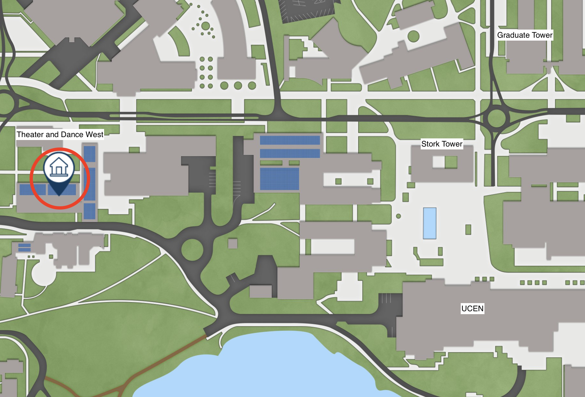

::: {#hero-heading}

Welcome to PSTAT10!

My name is [John Inston](about.qmd) and I will be the instructor for this
course, I am a 5th year Ph.D. candidate in the Department of Statistics and
Applied Probability here at UC Santa Barbara.  Thank you all for taking this
course. I hope that you find it both interesting and informative.

This course introduces students to the fundamentals of programming for data
science using R and SQL. We will cover descriptive statistics, distributions,
and graphics in R, as well as relational database management systems,
including the relational model, relational algebra, database design
principles, and data manipulation using SQL.

#### 🔍 Reference Material

The contents of this course was prepared using past teaching material provided
by [Isaiah Katz](https://isaiahkatzt.github.io) and 
[Robin Lui](https://roobnloo.github.io) as well as historical course material
made available online by the 
[UCSB Department of Statistics and Applied Probability](https://www.pstat.ucsb.edu).

:::

## 📚 Material

- **Course Syllabus:**
  - [Syllabus](material/pstat10_syllabus.pdf)
- **Lecture Notes:**
  - Online lecture notes
- **Course Readings:**
  - [R for Data Science](https://r4ds.had.co.nz/)
  - [SQL for Data Science](https://www.coursera.org/learn/sql-for-data-science)
  - [R Manuals: An Introduction to R](https://rstudio.github.io/r-manuals/r-intro/)
  - [Tidyverse Styling Guide](https://style.tidyverse.org/)
- **Helpful Resources:**
  - [Downloading R and RStudio](https://posit.co/download/rstudio-desktop/)
  - [Download Quarto.](https://quarto.org/docs/get-started/)
  - [Documentation: Quarto for PDF documents](https://quarto.org/docs/output-formats/pdf-basics.html)
  - [Documentation: Writing math using LaTeX](https://en.wikibooks.org/wiki/LaTeX/Mathematics)

## ✏️ Information

### Teaching Staff

| Name           | Role       | Email                        | Office Hours                      |
|----------------|------------|------------------------------|-----------------------------------|
| John Inston    | Instructor | johninston@ucsb.edu          | SH 5431T W 1:00PM - 4:00PM        |
| Abhijit Brahme | TA         | abhijitbrahme@umail.ucsb.edu | Zoom Meeting R 1:00PM - 3:00PM    |
| Siyu Chen      | TA         | siyu_chen@umail.ucsb.edu     | Zoom Meeting T 10:00AM - 11:00AM  |

> For zoom meeting links please check the course Canvas page. 

### Instruction

Course instruction will comprise of **20 lectures** (held four times per week) 
and **10 programming labs** (held twice per week).  

- **Lecture:** 
  - MTWR 11:00AM - 12:20PM [Theater and Dance West (Room 1701)](https://www.map.ucsb.edu/?id=1982#!m/618767?s/).
- **Labs:**
  - MW 12:30PM - 1:20PM Phelps Hall 1513 - Abhijit Brahme
  - MW 2:00PM - 2:50PM Phelps Hall 1513 - Abhijit Brahme
  - MW 3:30PM - 4:20PM Phelps Hall 1513 - Siyu Chen

### Assessments

You will be required to complete **10 lab worksheets** which will be due for 
submission every Wednesday and Friday (2 days after lab) at midnight on Canvas.

You will be required to complete **5 assignments** which will be due for 
submission every Wednesday at midnight starting in Week 2. 

You final assessment will be an in-person **final exam** which will be held on
Thursday of finals week from 11:00AM to 12:20PM in the same location as the 
lecture, [Theater and Dance West (Room 1701)](https://www.map.ucsb.edu/?id=1982#!m/618767?s/).

### Course Schedule

Please check this schedule regularly throughout the term as it is updated with 
the latest material and reading suggestions.

| Week | Lecture | Date        | Topics                             | Materials  |
|------|---------|-------------|------------------------------------|------------|
| 1    | 1       | Mon, Aug 3  | Course Introduction, R Basics      | [Lec01](material/lecture_01/pstat10_lecture_1.qmd) |
|      | 2       | Tue, Aug 4  | Vectors                            | [Lec02](material/lecture_02/pstat10_lecture_2.qmd) |
|      | 3       | Wed, Aug 5  | Matrices and Arrays                | [Lec03](material/lecture_03/pstat10_lecture_3.qmd) |
|      | 4       | Thu, Aug 6  | Functions, Branching and Loops     | [Lec04](material/lecture_04/pstat10_lecture_4.qmd) | 
| 2    | 5       | Mon, Aug 10 | Algorithms                         | [Lec05](material/lecture_05/pstat10_lecture_5.qmd) |
|      | 6       | Tue, Aug 11 | Dataframes                         | [Lec06](material/lecture_06/pstat10_lecture_6.qmd) |
|      | 7       | Wed, Aug 12 | Tibbles                            | [Lec07](material/lecture_07/pstat10_lecture_7.qmd) |
|      | 8       | Thu, Aug 13 | Plotting                           | [Lec08](material/lecture_08/pstat10_lecture_8.qmd) |
| 3    | 9       | Mon, Aug 17 | Probability                        | [Lec09](material/lecture_09/pstat10_lecture_9.qmd) |
|      | 10      | Tue, Aug 18 | Discrete Random Variables          | [Lec10](material/lecture_10/pstat10_lecture_10.qmd) |
|      | 11      | Wed, Aug 19 | Continuous Random Variables        | [Lec11](material/lecture_11/pstat10_lecture_11.qmd) |
|      | 12      | Thu, Aug 20 | Monte-Carlo Methods                | [Lec12](material/lecture_12/pstat10_lecture_12.qmd) |
