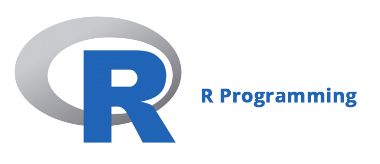
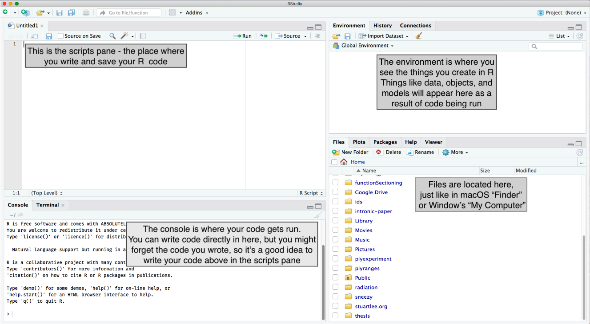
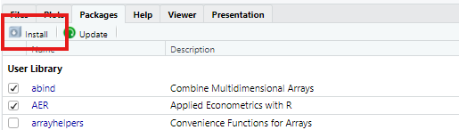
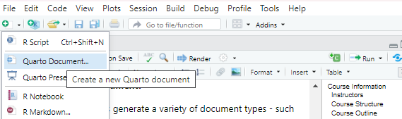
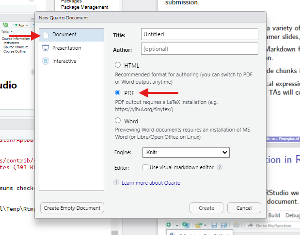
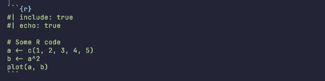
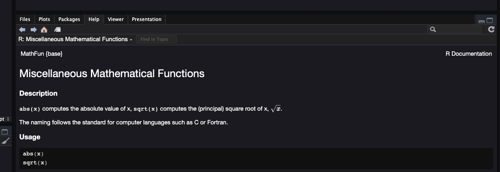
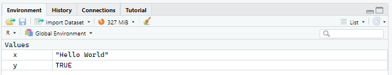

# Introduction

## 👋 Welcome {.intro-two-col}

::: {.spacer-sm}
:::

::: {.welcome-lead .welcome-trigger .fragment}
Welcome to [PSTAT 10 Data Science Principles]{.accent}! 🎉
:::

- [Course description:]{.accent} This course introduces students to the 
  fundamentals of programming for data science using `R` and `SQL`.  We will
  cover descriptive statistics, distributions, and graphics in `R`, as well as
  relational database management systems, including the relational model, 
  relational algebra, database design principles, and data manipulation 
  using `SQL`. 

::: {.fragment}

::: {.spacer-sm}
:::

::: {.columns}

:::{.column width="50%"}

### Instructor

- [**John Inston**]{.accent} *(Instructor)* 
    - [Pronouns:]{.accent} he/him
    - 🏢 [OH:]{.accent} Wednesday 1:00PM–4:00PM, South Hall Cubicle 5431T
    - ✉️ [Email:]{.accent} [johninston@ucsb.edu](mailto:johninston@ucsb.edu)
    - 🌐 [Website:]{.accent} [johnrobininston.com](https://johnrobininston.com)

:::

:::{.column width="50%"}

{.profile-rounded}

:::

:::

:::

## 👩‍🏫 Teaching Staff

### Teaching Assistants

::: {.fragment}

I am being assisted this term by the following wonderful [teaching assistants]{.accent}:

:::


::: {.fragment}

::: {.ta-row}

{.profile-circle}


::: {.ta-info}

[Abhijit Brahme]{.ta-name}

- ✉️ [Email:]{.accent} [abhijitbrahme@umail.ucsb.edu](mailto:abhijitbrahme@umail.ucsb.edu)
- 🏢 [OH:]{.accent} Thursdays 1PM-3PM on [Zoom]{.accent} (link on Canvas)

:::

:::

:::

::: {.fragment}

::: {.ta-row}

{.profile-circle}


::: {.ta-info}

[Siyu Chen]{.ta-name}

- ✉️ [Email:]{.accent} [siyu_chen@umail.ucsb.edu](mailto:siyu_chen@umail.ucsb.edu)
- 🏢 [OH:]{.accent} Tuesday 11:00AM-12:00PM on [Zoom]{.accent} (link on Canvas)

:::

:::

:::

::: {.fragment}

::: {.emphasize}

[Communication Guidelines:]{.accent}

1. [Be respectful]{.accent} and [professional]{.accent} in all communications.
2. [Be patient]{.accent} — allow 24–48 hours for a response to emails.
3. [Be specific]{.accent} — when asking for help, please provide as much detail as possible.

:::

:::

## Course Structure

::: {.fragment}

::: {.spacer-sm}
:::

::: {.callout-important title="Grading Structure"}
1. Section attendance — 10%
2. Section worksheets — 20% *(graded on [completion]{.accent})*
3. Homework assignments — 40% *(graded on [correctness]{.accent})*
4. Final exam — 30%
:::

:::

::: {.fragment}

::: {.spacer-sm}
:::

::: {.callout-note title="Worksheet & Assignment Submissions"}
- [Section worksheets]{.accent} are due via [PDF on Canvas]{.accent} at 11:59pm on the following Wednesday / Friday after section (2 days).
- [Homework assignments]{.accent} are uploaded to Canvas Tuesday evening and due via [PDF on Gradescope]{.accent} at **11:59pm the following Wednesday (8 days)**.
:::

:::

::: {.fragment}

::: {.emphasize}
📝 [Final]{.accent} is written in-person for [11AM Thursday September 10th]{.accent} in Theater and Dance West.
:::

:::

## ✅ Course Outline

:::{.spacer-sm}
:::

The following is our tentative course outline:

::: {.columns}
::: {.column width="50%"}

- ### [Week 1]{.accent}
    - Vectors, matrices and arrays
    - Functions and control flow
- ### [Week 2]{.accent}
    - Dataframes and tibbles
    - Data manipulation
- ### [Week 3]{.accent}
    - Statistics
    - Probability

:::

::: {.column width="50%"}

- ### [Week 4]{.accent}
    - Database structure and design
    - Basic SQL
- ### [Week 5]{.accent}
    - More complex SQL
    - Data visualization
- ### [Week 6]{.accent}
    - Review
    - Additional topics as time allows

:::
:::

:::{.spacer-sm}
:::

:::{.fragment}

:::{.emphasize}

Throughout the course we will be programming in `R`.  In weeks 4 and 5 we will 
also be using `SQL` to query relational databases.  
:::

:::

## ⚖️ Academic Integrity

### Academic Integrity Statement

By enrolling in this course, you agree to abide by the [UCSB Academic Integrity Policy]{.accent}.  In short, you are expected to avoid the following dishonest behaviors:

::: {.integrity-bubbles}

::: {.bubble .fragment}
Cheating
:::

::: {.bubble .fragment}
Plagiarism
:::

::: {.bubble .fragment}
Lying
:::

::: {.bubble .fragment}
Unauthorized collaboration
:::

::: {.bubble .fragment}
Misusing resources
:::

:::

:::{.fragment}

Any violation of these policies will be reported to the [Office of Student Conduct]{.accent} and may result in a failing grade for the course.

:::

::: {.fragment}

:::{.spacer-sm}
:::

### ✅ Guidelines for this course

- 🤝 You may collaborate on assignments and worksheets, but [always write and submit your own documents]{.accent}. 

- 🤖 The use of [AI tools]{.accent} such as ChatGPT, Claude and Gemini is permitted as a [learning tool]{.accent}. 

- 🗣️ [Communication]{.accent} is key! Please let me know about any mitigating circumstances or deadline conflicts as soon as possible!

:::

# R & RStudio

## 🅁 What is R?

::: {.fragment}

::: {.spacer-sm}
:::

This course will use the programming language [R]{.accent}.

- [Open-source]{.accent} programming language designed for statistical computing.
- Large collection of [community built libraries]{.accent} and resources.
- Tools for [computation]{.accent}, [data exploration]{.accent}, and [visualization]{.accent}.

:::

::: {.fragment}

::: {.spacer-sm}
:::

You can download R to your system using the following link:

[{.slide-img-center width="700"}](https://www.r-project.org/)

:::

## 💻 What is RStudio?

### It's an IDE for R!

:::{.fragment}

:::{.callout-important title="Interactive Development Environment"}
An [interactive development environment (IDE)]{.accent} is an application designed to facilitate writing and running code. 
:::

:::

::: {.fragment}

::: {.spacer-sm}
:::

In this course we will be using the IDE [RStudio]{.accent}, which can be downloaded using the following link:

[{.slide-img-center width="800"}](https://posit.co/downloads/)

:::

## 🖥️ RStudio Interface

{.slide-img-center width="80%"}


## 📜 Scripts & Console

::: {.fragment}

::: {.spacer-sm}
:::

### Scripts

- We write code in [scripts]{.accent}, which appear in the top left pane:
  - Scripts have the file extension `.R` and are used to [write code]{.accent}.
  - They [contain only code and comments]{.accent}, and are not used to generate documents.

- In your worksheets and assignments we will use [Quarto Markdown]{.accent} documents — *which can generate PDFs* — which will also appear in the top left pane.
  - Markdown is a simple formatting syntax for authoring documents.
  - Quarto is a tool that allows us to use Markdown to generate documents in a variety of formats, including PDFs, Word documents, and HTML.


:::

::: {.fragment}

::: {.spacer-sm}
:::

### Console

- The [console]{.accent} in the bottom left pane is where we run code.
- This is also where any [error messages]{.accent} for bug-fixing will appear.
- Code written here is not saved and lost when we run it.

:::

## 🗂️ Environment & Files

::: {.fragment}

::: {.spacer-sm}
:::

### Data Environment

- We often need to store objects or data in our [working memory]{.accent}.
  - Working memory is a [temporary storage space]{.accent} for data and objects that we are currently using in our R session.
  - If we close RStudio, all objects in working memory will be [lost]{.accent}.
- These will appear in the [data environment]{.accent} in the top right pane.

:::

::: {.fragment}

::: {.spacer-sm}
:::

### Files

- When working in R we work within a [working directory]{.accent}.
    - A working directory is the folder on our computer where RStudio can save and load files.

- This is shown and changed in the [Files]{.accent} tab in the bottom right pane.

:::

## 📦 Packages

### What are packages?

- Often we make our lives easier by using [code written by the community]{.accent} for certain tasks — *e.g. plot formatting, data manipulation, statistical analysis, etc.*
- This code can be found online as [packages]{.accent} which we can load and use in our IDE.
- A list of the pre-installed packages can be found in the Packages tab in the bottom right pane.

:::{.fragment}

:::{.spacer-sm}
:::

### Common Packages 

- `tidyverse` — a collection of packages for data manipulation and visualization.
  - `ggplot2` — a package for creating complex and customizable plots.
  - `dplyr` — a package for data manipulation and transformation.
  - `tidyr` — a package for tidying and reshaping data.
- `Shiny` — a package for creating interactive web applications.

:::

## 🔧 Package Management

::: {.fragment}

::: {.spacer-sm}
:::

### Package Management Functions

The following functions are used to manage packages in R:

:::

:::{.fragment}

#### Installing

To install a package (e.g. `cowsay`) use the `install.packages()` function:

```{r}
#| echo: true
#| eval: false 
install.packages("cowsay")
```

:::

:::{.fragment}

:::{.spacer-sm}
:::

The package should now appear in the Packages tab. To use functions from the package we load them using the `library()` function:

```{r}
#| echo: true
#| eval: false
library(cowsay)
```

:::

::: {.fragment}

:::{.spacer-sm}
:::

<br>

#### Unloading

Similarly, to remove the package we use the `remove.packages()` function:

```{r}
#| echo: true
#| eval: false
remove.packages(cowsay)
```

:::

## 🔧 Package Management (Alternative)

::: {.fragment}

::: {.spacer-sm}
:::

### Manual Alternative

Helpfully, R also has a [manual library management tool]{.accent} which allows us to:

- Manually install packages using the button highlighted below.
- Select which libraries to load or unload with a check box.

:::

::: {.fragment}

{.slide-img-center width="800"}

:::

# Quarto Documents

## 📝 Quarto Basics


In this course you will be required to use [Quarto Markdown documents]{.accent} to generate PDFs for submission.

::: {.fragment}

::: {.spacer-sm}
:::

### What is a Quarto Markdown document?

- [Quarto documents]{.accent} generate a variety of document types — such as PDFs, Word documents, PowerPoints, Beamer slides, HTML documents, etc. — in RStudio.
  - You can identify a Quarto document by the file extension `.qmd`.
- They use a language called [Markdown]{.accent} for formatting.
- Allow you to [add and run code chunks inside the document]{.accent}.
  - [Code chunks]{.accent} are sections of code that can be run in the document, and the output can be displayed in the document.
  - Code can be written in a [variety of programming languages]{.accent}, including R, Python, and SQL.
- Allow you to use [mathematical expressions]{.accent} written using [LaTeX]{.accent}.

:::

:::{.fragment}

```
f(x,y) = \frac{1}{2\pi\sigma^2} e^{-\frac{x^2 + y^2}{2\sigma^2}}.
```

$$
f(x,y) = \frac{1}{2\pi\sigma^2} e^{-\frac{x^2 + y^2}{2\sigma^2}}.
$$

:::


## 📝 Quarto in RStudio

To create a Quarto document in RStudio we use the [new document button]{.accent} in the top left corner and select Quarto document.

{.slide-img-center}

## 📝 Quarto Documents

::: {.fragment}

::: {.spacer-sm}
:::

Then you will be met with the following pop-up menu asking you to specify the document type.

{.slide-img-center width="600"}

:::

::: {.fragment}

From here you can specify you want a [PDF document]{.accent} and give your document a [title]{.accent} and [author]{.accent}.

:::

## 📚 Quarto Syntax

### Writing in Markdown

- Headings are created using `#` symbols, with more `#` symbols indicating a lower level heading.
- Lists are created using `-` or `*` symbols, with indentation indicating sub-lists.
- Mathematical expressions are created using LaTeX syntax, with inline expressions enclosed in `$` symbols and block expressions enclosed in `$$` symbols.

:::{.fragment}

### Adding Code Chunks

- Code chunks are created using three backticks followed by the language name (e.g. `r` for R) and a set of curly braces.

:::

:::{.fragment}

{.slide-img-center width="800"}

:::

## Rendering Documents

### What are YAMLs?

- [YAMLs]{.accent} are a way to specify document metadata and options in Quarto documents.
  - They are written at the top of the document and enclosed in `---` symbols.
  - They can specify options such as the document title, author, date, output format, and code chunk options.

:::{.fragment}

### Rendering PDFs

- Think of the quarto document as a recipe for generating a PDF document.  To generate the PDF we use the [Render button]{.accent} in the top left corner of RStudio.
- [Your TAs will help you with the details of Quarto's syntax.]{.accent} 
   - You can find a template assignment Quarto document with the generated PDF on Canvas.
   - You can also find further guidance on Quarto syntax in the following post on my website.

:::

::: {.fragment}

::: {.spacer-sm}
:::


[{.slide-img-center}](https://quarto.org/docs/output-formats/pdf-basics.html)

:::

# Programming Concepts

## 🧮 Calculations

::: {.fragment}

::: {.spacer-sm}
:::

### Simple Calculations

Fundamentally, [R is a calculator]{.accent} allowing you to perform a wide variety of mathematical computations.

:::

:::{.fragment}

::: {.columns}

::: {.column width="50%"}
```{r}
#| echo: true
#| eval: false

6+5 # addition
6-5 # subtraction
2*4 # multiplication
4/2 # division
2^10 # raising to power 10
exp(2) # applying the exponential function
log(9) # applying the natural log (ln)
log10(1000) # applying log base 10
sqrt(64) # computing the square root
```
:::

::: {.column width="50%"}
```{r}
#| echo: false
#| eval: true

6+5 # addition
6-5 # subtraction
2*4 # multiplication
4/2 # division
2^10 # raising to power 10
exp(2) # applying the exponential function
log(9) # applying the natural log (ln)
log10(1000) # applying log base 10
sqrt(64) # computing the square root
```
:::

:::

:::

::: {.fragment}

:::{.spacer-sm}
:::

::: {.emphasize}
📌 The use of `#` has made the text following the computations into a [comment]{.accent}, which is not read as code.
:::

:::

:::{.fragment}

### Order of Operations

- R follows the standard [order of operations]{.accent} (PEMDAS) when evaluating expressions.

:::

:::{.fragment}

```{r}
#| echo: true
#| output-location: column-fragment
(2+3)*4-5^2
```

:::

## ❓ Help Function

### How to ask for help!

- One of my most used functions in R is the `help()` function or the `?` function. 
  - With this function you can ask R's built-in code documentation reader to provide information on how a specific function works.
  - For example, for help on the function `sqrt()` write the following in your console:

:::{.fragment}

:::{.columns}

:::{.column width="25%"}

```{r}
#| echo: true
#| eval: false

# Asking for help
help(sqrt)
?sqrt
```

:::

:::{.column width="75%"}

{.slide-img-center width="800"}

:::

:::

:::

:::{.fragment}

::: {.emphasize}
📌 Make sure not to include these functions in your written documents.
:::

:::


## 💪 Exercise — R Calculations

```{r}
#| echo: false
library(countdown)
countdown(minutes=2)
```


Spend a couple of minutes evaluating the following expressions in R:

### Problem 1 

$$
\frac{\log_2(256)+2^3}{4^2 - \sqrt{64}}.
$$


### Problem 2

$$
\exp(4)\times56(\ln(7)-3^3)
$$


*Hint: Use `help()` to look up the `log`, `log2` and `exp` functions.*

::: {.fragment}

:::{.spacer-sm}
:::

### Solutions

```{r}
#| include: true
#| echo: true
#| layout-ncol: 1

(log2(256) + 2^3) / (4^2 - sqrt(64))
```

```{r}
#| include: true
#| echo: true
exp(4)*56*(log(7)-3^3)
```

:::

## 🔢 Data Types

Below is a list of most important R [datatypes]{.accent}:

1. [Numeric]{.accent}
    - any number (integer or decimal) is a numeric value.

2. [Integer]{.accent}
    - any whole number declared using an `L` suffix.

3. [Character]{.accent}
    - any letter or number enclosed in either [single quotes]{.accent} (`' '`) or [double quotes]{.accent} (`" "`) becomes a character.
    - A sequential collection of characters forms a [string]{.accent} — this is not a specific datatype in R — e.g. `"2+3*4"`, `"alphabet"`.

4. [Logical]{.accent} 
    - [TRUE / FALSE]{.accent} output of some logical query.


## 🔣 Logic

### Logical Operators

- `!` — negation operator, returns the opposite of a logical value.
- `&` — and operator, returns TRUE if both logical values are TRUE.
- `&&` — short-circuit and operator, returns TRUE if both logical values are TRUE, but only evaluates the first element of each vector.
- `|` — or operator, returns TRUE if at least one logical value is TRUE.
- `||` — short-circuit or operator, returns TRUE if at least one logical value is TRUE, but only evaluates the first element of each vector.
- `xor()` — exclusive or operator, returns TRUE if exactly one logical value is TRUE.

:::{.fragment}

:::{.spacer-sm}
:::

### Comparison Symbols 

- `==` — Equal to
- `!=` — Not equal to
- `>` / `<` — Greater / less than
- `>=` / `<=` — Greater / less than or equal to

:::

## 💪 Exercise — Logic

```{r}
#| echo: false

countdown(minutes=2)
```

What will the following logical queries return?

::: {.nonincremental}
1. `5 > 10`
2. `10 <= 10`
3. `13 != 12`
4. `"Hello" == "Hello"`
5. `"Hello" <= "Hell"`
6. `"Goodbye" != "Hello"`
7. `"Hello" != "Hello" | 5 < 10`
8. `4 <= 2 & 5 <= 12`
9. `3 < 5 < 7`
:::

Spend 2 minutes evaluating the examples above in R and check your answers.

::: {.fragment}

::: {.emphasize}
📌 9 gives an error because we can't combine logical expressions without using either `&` or `|`.
:::

:::

## ✅ Solution — Logic

```{r}
#| include: true
#| echo: true
#| layout-ncol: 4
5 > 10
10 <= 10
13 != 12
"Hello" == "Hello"
```

::: {.fragment}

```{r}
#| include: true
#| echo: true
#| layout-ncol: 4
"Hello" <= "Hell"
"Goodbye" != "Hello"
"Hello" != "Hello" | 5 < 10
4 <= 2 & 5 <= 12
```

:::

## ➡️ Assignment Operator

### How to assign values to objects 

- Throughout this course the most frequently used operator will be the [assignment operator]{.accent} `<-`
  - Assigns some value (of any datatype) to an object.
  - The object can then be used in subsequent calculations or code.

:::{.fragment}

```{r}
x <- "Hello World"
y <- 6 <= 7
```

:::

::: {.fragment}

::: {.spacer-sm}
:::

Notice that when you run the code above you receive no output, but the objects will have appeared in your [data environment (top right tab)]{.accent}.

{.slide-img-center}

:::

## 🖨️ Print Function

### How to display output

- The `print()` function is used to display the value of an object in the console.
  - Printing is incredibly useful when writing scripts or functions, as it allows us
    to see the output of our code and debug any errors that may arise.

:::{.fragment}

```{r}
print(x) 
```

:::

:::{.fragment}

<br>

### Pasting output together 

- Some functions allow us to print more complex outputs, such as the `paste()` function which allows us to concatenate strings and objects together.

:::

:::{.fragment}

```{r}
#| echo: true

print(paste("The value of x is:", x))
```


:::

## ✅ Good Practices


- 📖 Make sure your [code is easy to read]{.accent} — *both for graders and for your own error checking* — by documenting with [comments]{.accent} and using [good structure]{.accent} (such as indentation).

- 🔤 When naming objects in R keep in mind the following conventions:
    - Letters, digits, underscores, and dots can all be used.
    - Object names cannot start with a [digit]{.accent} or [underscore]{.accent}.
    - Avoid starting object names with [dots]{.accent} (doing so has special meaning).
    - Object names are [case sensitive]{.accent}.
    - Use [descriptive]{.accent}, [logical]{.accent}, and [efficient]{.accent} object names.

- 🔁 Avoid repeating yourself ([DRY]{.accent}) — write a [function]{.accent} for any code you find yourself copy-pasting more than once (we will cover functions in a later lecture).

- 📝 [Test and debug incrementally]{.accent} — run and check your code in small pieces as you write it, rather than all at once, so errors are easier to catch and fix.

- 💾 [Save]{.accent} your work often!


## Summary

:::{.fragment}

:::{.spacer-sm}
:::

### ✅ Topics Covered

- R and RStudio
- Quarto document generation
- Packages
- Calculations in R
- Datatypes
- Assignment operators

:::

::: {.fragment}

:::{.spacer-sm}
:::

### 📅 Next Class

- Data structures
- Filtering, recycling & sorting
- Vectorization

:::
