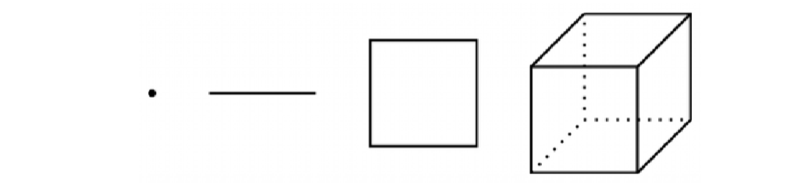
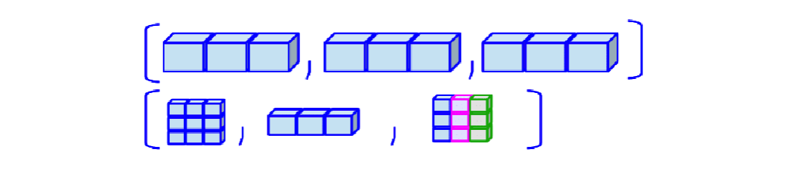

# Introduction

## 🔁 Review: Lecture 2

::: {.spacer-sm}
:::

👈 Last lecture we started exploring data in `R` and its inbuilt functionality, specifically:

- [Scalars]{.accent}
- [Vectors]{.accent}
- Filtering and subsetting
- Named indices
- Vectorized functions

## 👀 Outline: Lecture 3

::: {.spacer-sm}
:::

👇 This lecture we look into higher-dimensional data structures such as:

- [Matrices]{.accent}
- Arrays
- Lists

# Matrices

## 🔢 What is a Matrix?

::: {.fragment}

$$
A:=\begin{bmatrix}
1 & 2 & 3 & 4 & 5 & 6 \\
7 & 8 & 9 & 10 & 11 & 12 \\
13 & 14 & 15 & 16 & 17 & 18 \\
19 & 20 & 21 & 22 & 23 & 24 \\
25 & 26 & 27 & 28 & 29 & 30
\end{bmatrix}
$$

:::

::: {.fragment}

::: {.spacer-sm}
:::

- [Matrices]{.accent} are essentially [2-dimensional vectors]{.accent}.
- They are the building blocks of [data science]{.accent} and [machine learning]{.accent}.
- The mathematics of matrix manipulation is [linear algebra]{.accent}.
  - *For the purposes of this course we introduce only some very simple linear algebra methods and demonstrate how to perform them in R.*
  - For anyone interested in studying linear algebra here are some resources:
    - [Linear Algebra Done Right](https://linear.axler.net/) by Sheldon Axler.
    - [Introduction to Linear Algebra](https://math.mit.edu/~gs/linearalgebra/) by Gilbert Strang.

:::

## 📐 Dimensionality


### Dimension

- A [vector]{.accent} of length $n$ has dimension $(1\times n)$.
- A [matrix]{.accent} with $n$ rows and $m$ columns has dimension $(n\times m)$.

:::{.fragment}

:::{.emphasize}

Note this is different from the [number of dimensions]{.accent} of the object, which is 1 for vectors and 2 for matrices.

:::

:::

::: {.fragment}

::: {.spacer-sm}
:::

### Matrix Properties

- Matrices are [atomic]{.accent} — all elements must be the [same data type]{.accent}.
- Same coercion hierarchy as vectors: [character]{.accent} > [numeric]{.accent} > [logical]{.accent}.
- Matrices support additional operations beyond vectors, such as [transpose]{.accent}, element-wise operations, and matrix operations.

:::

## `matrix()` Function

::: {.fragment}

We can define a matrix using the `matrix()` function:

```{r}
#| output-location: column
# define a matrix
mat_1 <- matrix(
  data = NA,
  nrow = 2, ncol = 3,
  byrow = FALSE,
  dimnames = NULL
)
mat_1
```

:::

::: {.fragment}

::: {.spacer-sm}
:::

The function arguments are as follows:

- `data` — [vector of the input data]{.accent} (defaults to `NA`)
- `nrow` and `ncol` — scalars specifying [number of rows and columns]{.accent}
- `byrow` — Boolean specifying [row-wise]{.accent} or [column-wise]{.accent} construction
- `dimnames` — list containing two vectors of [row and column names]{.accent}

:::

## Example — `matrix()` Function

::: {.fragment}

We will construct a variety of matrices using the input data below:

```{r}
#| output-location: column
input_data <- 1:9
input_data
```

:::

::: {.fragment}

::: {.spacer-sm}
:::

Firstly let's define a 3 by 3 matrix where the data is loaded [row-wise]{.accent}:

```{r}
#| output-location: column
matrix_1 <- matrix(
    data = input_data, 
    nrow = 3, ncol = 3, 
    byrow = TRUE, 
    dimnames = NULL
)
matrix_1
```

:::

::: {.fragment}

::: {.spacer-sm}
:::

If instead we load the data [column-wise]{.accent} we obtain:

```{r}
#| output-location: column
matrix_2 <- matrix(
      data = input_data, 
      nrow = 3, ncol = 3, 
      byrow = FALSE, 
      dimnames = NULL
)
matrix_2
```

:::

## 🪞 Transpose

::: {.fragment}

Let's look more carefully at the two matrices from the last slide:

```{r}
#| echo: false
#| layout-ncol: 2
matrix(data = input_data, nrow = 3, ncol = 3,
       byrow = TRUE, dimnames = NULL)
matrix(data = input_data, nrow = 3, ncol = 3,
       byrow = FALSE, dimnames = NULL)
```

- We see that these matrices are [reflections of each other down the diagonal]{.accent}. 
- Reflecting a matrix this way is known as [transposing]{.accent}. 

:::

::: {.fragment}

::: {.spacer-sm}
:::

$$
A = \begin{bmatrix}a & b & c \\
d & e & f \\
g & h & i\end{bmatrix}\implies A^T=\begin{bmatrix}a & d & g \\ b & e & h \\ c & f & i\end{bmatrix}.
$$

- R has an inbuilt transpose function `t()`:

:::

:::{.fragment}

```{r}
#| output-location: column
print(matrix_1)
```

```{r}
#| output-location: column
t(matrix_1)
```

:::

## 🏷️ Row & Column Names

::: {.fragment}

If we wish to [add row and column names]{.accent} we can use the `dimnames` argument:

```{r}
#| output-location: column
named_matrix <- matrix(
    data = input_data, 
    nrow = 3, ncol = 3,
    byrow = FALSE,
    dimnames = list(
      c("Row 1", "Row 2", "Row 3"), # row names
      c("Col 1", "Col 2", "Col 3") # column names
    )
)
named_matrix
```

:::

::: {.fragment}

::: {.spacer-sm}
:::

We can also [read the names]{.accent} off an existing matrix using the `rownames()` and `colnames()` functions directly:

```{r}
#| layout-ncol: 2
# get the row and column names
rownames(named_matrix)
colnames(named_matrix)
```

:::

## `cbind()` & `rbind()` Functions

### Other ways to define matrices

- Another way of defining matrices is by [binding]{.accent} several vectors of the same length together.

- There are two ways to combine vectors:

  - Stacking the vectors [row-wise]{.accent} ([vertically]{.accent}) using `rbind()`
  - Stacking the vectors [column-wise]{.accent} ([horizontally]{.accent}) using `cbind()`

- To demonstrate we define the following vectors:

:::{.fragment}


```{r}
v1 <- c("alpha", "beta", "gamma")
v2 <- c("delta", "epsilon", "kappa")
v3 <- c("phi", "psi", "nabla")
```

- We can then combine these vectors into a matrix using either `rbind()` or `cbind()`:

:::

:::{.fragment}

```{r}
#| layout-ncol: 2
rbind(v1, v2, v3)
cbind(v1, v2, v3)
```

:::

::: {.fragment}

:::{.emphasize}
📌 Notice that the [rows]{.accent} are named with `rbind()` and the [columns]{.accent} are named with `cbind()`.
:::

:::

## 🆔 Identity Matrix

::: {.fragment}

:::{.emphasize}

In mathematics, a multiplicative identity is a number which, when multiplied by another number, leaves the other number unchanged. 

:::

- The [identity matrix]{.accent} is the matrix equivalent of the multiplicative scalar identity `1`.
- The $n\times n$ identity matrix, denoted $I_n$, is a matrix with [diagonal values]{.accent} 1 and all other values 0.

:::

::: {.fragment}

::: {.spacer-sm}
:::

We can generate the identity matrix using the `diag()` function:

```{r}
#| output-location: column
diag(5)
```

:::

::: {.fragment}

::: {.spacer-sm}
:::

`diag()` has a [second use]{.accent}: passed an existing matrix, it [extracts the diagonal elements]{.accent} instead of building an identity matrix:

```{r}
#| output-location: column
diag(matrix_1)
```

:::

# Indexing Matrices

## 🎯 Indexing Matrices

### Recall Vector Indexing

- For vectors we can [index]{.accent} elements using a single index value, e.g. `vec[3]` returns the 3rd element of `vec`.

:::{.fragment}

:::{.spacer-sm}
:::

### Matrix Indexing

- Every matrix entry is [indexed by an ordered pair]{.accent} $(i,j)$ where:

  - $i$ is the [row number]{.accent}, and
  - $j$ is the [column number]{.accent}

:::

::: {.fragment}

::: {.spacer-sm}
:::

$$
A = \begin{bmatrix}a & b & c \\
d & e & f \\
g & h & i\end{bmatrix}\quad\text{has index}\quad\underbrace{\begin{bmatrix}
(1,1) & (1,2) & (1,3) \\ (2,1) & (2,2) & (2,3) \\ (3,1) & (3,2) & (3,3)
\end{bmatrix}}_{index~matrix}.
$$

:::

## Example — Indexing Matrices

### Remember Matrix 1?

::: {.fragment}

Consider `matrix_1` from previous examples:

```{r}
#| output-location: column
print(matrix_1)
```

:::

::: {.fragment}

::: {.spacer-sm}
:::

### Indexing Example

If we wish to index the element from the [2nd row]{.accent} and [3rd column]{.accent} (i.e. number 6) we specify the index inside braces:

```{r}
#| output-location: column
matrix_1[2, 3]
```

- First specify the [row index]{.accent} and then the [column index]{.accent}, separated by a comma.

:::

## 🔪 Slicing Matrices

### Sounds dramatic!


- [Indexing a whole row or column]{.accent} is known as [slicing]{.accent} the matrix.

- To slice a matrix we leave the [first / second index values blank]{.accent} to return the [entire column / row]{.accent}.
  - Note the difference from `Python`, which uses `:` to slice.


::: {.fragment}

::: {.spacer-sm}
:::

```{r}
#| layout-ncol: 2
# index the second row
matrix_1[2, ]
# index the third column
matrix_1[, 3]
```

:::

:::{.fragment}

### Submatrices

- We can also index a [submatrix]{.accent} by specifying a [range of rows and columns]{.accent} using the `:` operator.

:::

:::{.fragment}

```{r}
#| output-location: column
# index rows 1 and 2, columns 2 and 3
matrix_1[1:2, 2:3]
```


:::

## ✂️ Removing Matrix Values

::: {.fragment}

[Omitting values]{.accent} — or even whole rows and columns — of a matrix works the same way as omitting elements of a vector, using [negative indices]{.accent}.

- For example we can remove specific rows or columns:

:::

::: {.fragment}

::: {.spacer-sm}
:::

```{r}
#| layout-ncol: 2
# remove the first row
matrix_1[-1, ]
# remove the second column
matrix_1[, -2]
```

- Or multiple rows and columns:

:::

::: {.fragment}

::: {.spacer-sm}
:::

```{r}
#| layout-ncol: 2
# remove the second row and third column
matrix_1[-2, -3]
# remove the first and third column
matrix_1[, -c(1, 3)]
```

:::

## 💪 Exercise — Matrix Construction

```{r}
#| echo: false
library(countdown)
countdown(minutes = 3)
```

Spend 3 minutes to complete the following steps:

::: {.nonincremental}
1. Create a $5\times 4$ numeric matrix object named `num_matrix` with elements 1 through 20 (constructed row-wise).
2. Select the [3rd row]{.accent} of the matrix and save it to an object named `row3`.
3. Select [rows 3, 4 and 5]{.accent} of columns [1, 2 and 3]{.accent} of the matrix and save them to an object `new_matrix`.
4. Determine the [dimensions]{.accent} of `new_matrix` using the `dim()` function.
:::

## ✅ Solution — Matrix Construction

::: {.fragment}

### Define the Matrix

```{r}
#| output-location: column
num_matrix <- matrix(1:20, nrow = 5, ncol = 4, byrow = TRUE)
num_matrix
```

:::

::: {.fragment}

::: {.spacer-sm}
:::

### Select the 3rd Row

```{r}
#| output-location: column
row3 <- num_matrix[3, ]
row3
```

:::

::: {.fragment}

::: {.spacer-sm}
:::

### Select Rows 3–5, Columns 1–3

```{r}
#| output-location: column
new_matrix <- num_matrix[3:5, 1:3]
new_matrix
```

:::

::: {.fragment}

::: {.spacer-sm}
:::

### Determine the Dimensions

```{r}
#| output-location: column
dim(new_matrix)
```

:::

# Matrix Operations

## 🧮 Matrix Operations

::: {.fragment}

R has many functions designed to interface with matrices:

::: {.columns}

::: {.column width="50%"}
- `rowSums()` and `colSums()`
- `rowMeans()` and `colMeans()`
- `dim()` and `dimnames()`
:::

::: {.column width="50%"}
- `det()` — matrix determinant
- `solve()` — matrix inverse
- `%*%` — matrix multiplication
:::

:::

:::

::: {.fragment}

::: {.spacer-sm}
:::

```{r}
#| output-location: column
rowSums(matrix_1)
colSums(matrix_1)
```

:::

::: {.fragment}

We can also perform [matrix multiplication]{.accent} using the `%*%` operator:

```{r}
#| output-location: column
matrix_1 %*% t(matrix_1)
```

:::

::: {.fragment}

::: {.spacer-sm}
:::

```{r}
#| output-location: column
op_mat <- matrix(c(2, 1, 1, 3), nrow = 2)
det(op_mat)
solve(op_mat)
```

:::{.emphasize}
📌 `det()` and `solve()` only work on [square]{.accent} matrices, and `solve()` requires the matrix to be [invertible]{.accent} — for example, `matrix_1` has [linearly dependent]{.accent} rows, so it has no inverse.
:::

:::

# Arrays

## 🧊 What are Arrays?

### Moving into higher dimensions!

::: {.fragment}

{.slide-img-center width="950"}


::: {.spacer-sm}
:::

- One might ask — can we consider [higher dimensions]{.accent}? 
- The [array]{.accent} is the natural extension of the vector and matrix, and can be extended to [arbitrarily large $k$ dimensions]{.accent}:

:::

:::{.fragment}

$$
n_1 \times n_2 \times ... \times n_k.
$$

:::

## Defining Arrays

### Don't get too excited!

- In PSTAT 10 we only consider up to [3-dimensional arrays]{.accent}.

- We can create an array using the `array()` function, which has similar arguments to the `matrix()` function:

:::{.fragment}

```{r}
#| eval: false
# defining an array
array(data = NA,
      dim = length(data),
      dimnames = NULL)
```

:::

::: {.fragment}

::: {.spacer-sm}
:::

- The arguments of the `array()` function are:

  - `data` — the input data (scalar, vector, matrix)
  - `dim` — array dimensions (vector)
  - `dimnames` — array dimension names (list)

:::

## Example — Defining Arrays

::: {.fragment}

We can define a $2\times 2 \times 2$ array using the following code:

```{r}
#| output-location: column
# define rubiks_cube array
rubiks_cube <- array(data = 1:8, dim = c(2, 2, 2))
rubiks_cube
```

:::

::: {.fragment}

::: {.spacer-sm}
:::

[Indexing]{.accent} extends naturally from matrices: instead of $(i,j)$ we now index with $(i,j,k)$, one subscript per dimension:

```{r}
#| output-location: column
# element in row 1, column 2, slice 2
rubiks_cube[1, 2, 2]
```

- You can see how this can naturally be extended to higher dimensions.
  - Just be aware of the [exponential growth]{.accent} in the number of elements as the number of dimensions increases.

:::


## 🔁 Functions Over Arrays

::: {.fragment}

We can apply [operations]{.accent} (mathematical operations, functions) over an array using the `apply()` function:

```{r}
#| eval: false
# apply function
apply(X = array_object,
      MARGIN = array_margin,
      FUN = f)
```

:::

::: {.fragment}

::: {.spacer-sm}
:::

- `X` — the array object on which we are applying our operation
- `MARGIN` — vector giving the subscripts for which the function will be applied over
- `FUN` — function to be applied

:::

::: {.fragment}

::: {.spacer-sm}
:::

For example, summing over `MARGIN = 3` [collapses each $2\times 2$ slice]{.accent} of `rubiks_cube` into a single total:

```{r}
#| output-location: column
apply(X = rubiks_cube, MARGIN = 3, FUN = sum)
```

:::

## 💪 Exercise — Constructing Arrays

```{r}
#| echo: false
countdown(minutes = 3)
```

For the next 3 minutes create a basic array to represent the faces of a solved two-color Rubik's cube (each color appears on 3 of the cube's six faces).

::: {.nonincremental}
1. Define the matrices `red` and `blue` as $3 \times 3$ matrices where all entries are the character `"r"` and `"b"` respectively.
2. Construct an array using the `red` and `blue` matrices that represents the faces of the solved cube.
:::

*[Hint: one of your array dimensions should refer to the cube's 6 faces.]{.accent}*

## ✅ Solution — Constructing Arrays

::: {.fragment}

### Define the Face Matrices

```{r}
red <- matrix(rep("r", 9), nrow = 3, ncol = 3)
blue <- matrix(rep("b", 9), nrow = 3, ncol = 3)
```

:::

::: {.fragment}

::: {.spacer-sm}
:::

### Assemble the Cube

[Stack]{.accent} 3 copies of `red` and 3 copies of `blue` along a third dimension representing the cube's 6 [faces]{.accent}:

```{r}
rubiks_faces <- array(c(rep(red, 3), rep(blue, 3)), dim = c(3, 3, 6))
```

:::

::: {.fragment}

::: {.spacer-sm}
:::

```{r}
#| layout-ncol: 2
rubiks_faces[, , 1]
rubiks_faces[, , 6]
```

:::

# Lists

## 🗂️ What is a List?

::: {.fragment}

{.slide-img-center width="800"}


::: {.spacer-sm}
:::

- Lists are a [flexible data structure]{.accent} that can contain [multiple data types]{.accent} and even [multiple data structures]{.accent}.
  - They are similar to dictionaries in `Python`.
- Each element of a list can be [named]{.accent} and accessed using the `$` operator.
- What we gain in flexibility we lose in computational efficiency and mathematical tractability.
  - Only numeric data types with regular structure (vectors, matrices, arrays) can be used in mathematical operations.

:::

## Example — Lists

::: {.fragment}

To construct an example list we first define three objects to store: (1) a character vector; (2) a numeric matrix; and (3) a logical scalar.

```{r}
# construct a list
list_example <- list(c("a", "b", "c"), matrix(data = 1:4, nrow = 2, ncol = 2), TRUE)
list_example
```

:::

::: {.fragment}

::: {.spacer-sm}
:::

Just like [naming vector elements]{.accent}, we can name list elements using the `names()` function:

```{r}
#| output-location: column
names(list_example) <- c("letters", "numbers", "flag")
list_example
```

:::

## 🔓 Indexing Lists

::: {.fragment}

The key difference between [indexing lists]{.accent} and the other data types we have considered is that to index list elements we use [double braces]{.accent} `list_example[[...]]`.

:::

::: {.fragment}

::: {.spacer-sm}
:::

```{r}
#| layout-ncol: 2
list_example[[2]]
list_example[[3]]
```

:::

::: {.fragment}

::: {.spacer-sm}
:::

If a list has [named elements]{.accent} we can also index by name using the `$` operator:

```{r}
#| layout-ncol: 2
list_example$numbers
list_example$flag
```

:::

# Summary

## ✅ Topics Covered

::: {.fragment}

::: {.spacer-sm}
:::

🤔 Today we studied lots and lots of topics:

- Matrices
- Matrix Operations
- Indexing
- Arrays
- Lists

:::

## 📅 Next Class

::: {.fragment}

::: {.spacer-sm}
:::

🤩 Next class we continue our introduction by exploring multi-dimensional datatypes including:

- Functions
- Branching
- Loops
- Control Flow

:::
