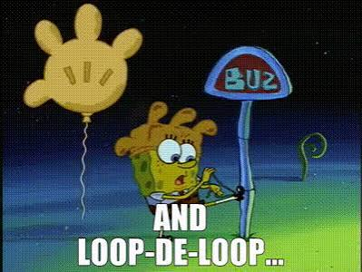
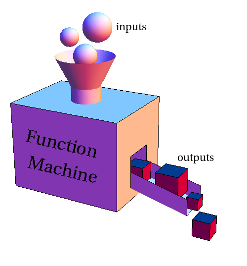

# Introduction

## 🔁 Review: Lecture 3


::: {.spacer-sm}
:::

👈 Last lecture we started exploring higher-dimensional data structures such as:

- [Vectors]{.accent} $(1 \times n)$
- [Matrices]{.accent} $(n \times p)$
- Arrays $(n_1 \times n_2 \times ... \times n_k)$
- Lists (ordered items)
- Accessing data; creating data structures

## 👀 Outline: Lecture 4

::: {.spacer-sm}
:::

👇 This lecture we look into automating repetitive tasks using:

- [Functions]{.accent}
- Branching (`if`, `else`, `else if`)
- Loops (`for`, `while`, `repeat`)
- Control Flow

:::{.spacer-sm}
:::

:::{.fragment}

{.slide-img-center width="400"}

:::

# Functions

## 🧩 What is a Function?

:::{.spacer-sm}
:::

::: {.fragment}

In programming, a function is a [self-contained, reusable block of code]{.accent} designed to perform a specific task.

[{.slide-img-center width="300"}](http://mathinsight.org/function_machine)

:::

::: {.fragment}

::: {.spacer-sm}
:::

- A function can take [zero or more inputs]{.accent} and returns [at least one outputs]{.accent}.
- Writing a function lets us [reuse the same logic]{.accent} without retyping it — a core idea in programming.

:::

## 🧰 Functions in R

:::{.spacer-sm}
:::

::: {.fragment}

We have implicitly and explicitly used dozens of functions already:

::: {.columns}

::: {.column width="50%"}
[**Constructing Objects**]{.accent}

- `c()`, `matrix()`
- `array()`, `list()`
:::

::: {.column width="50%"}
[**Math & Summaries**]{.accent}

- `exp()`, `log()`, `sqrt()`
- `mean()`, `median()`, `sum()`
:::

:::

:::

::: {.fragment}

::: {.spacer-sm}
:::

We've also used functions that interact with our [environment]{.accent} rather than our data, such as `getwd()` and `setwd()`.

:::

::: {.fragment}

::: {.spacer-sm}
:::

- Some functions did [not]{.accent} require inputs; some did [not]{.accent} appear to produce outputs.
  - In reality, all functions output something, even if it is just a setting change or manipulating objects.

:::

## 🏗️ Function Anatomy

::: {.fragment}

We [define a function]{.accent} in R using the following syntax:

```{r}
#| eval: false
abstract <- function(in_1, in_2, ... , in_k) {  # input arguments

  FUNCTION MACHINE  # core of the operation

  return(outputs)  # appropriate output
}
```

:::

::: {.fragment}

::: {.spacer-sm}
:::

- R functions can take [any number of inputs]{.accent}.
- R functions can only return [at most one output]{.accent} (sort of):
  - We can get around this using data structures such as lists or using packages.

:::

::: {.fragment}

::: {.spacer-sm}
:::

[**Example — Matrix Deconstruct Function**]{.accent}

We wish to define a function that takes a [matrix as an input]{.accent} and [returns the first and last rows]{.accent}.

:::

:::{.fragment}

```{r}
matrix_deconstruct <- function(x){ # input x
  # function machine
  row_dim <- dim(x)[1] # number of rows
  firstrow <- x[1,] # select first row
  lastrow <- x[row_dim, ] # select last row
  return(list(firstrow, lastrow)) # output row list
}
```

:::

:::{.fragment}

:::{.spacer-sm}
:::

:::{.emphasize}
📌 Notice that the function we define is listed in the [environment]{.accent} pane, just like any other object.
:::

:::

## Example — Testing Functions

::: {.fragment}

To test our function we define a $4\times 3$ matrix and apply our function to obtain:

```{r}
#| output-location: column
test_matrix <- matrix(1:12, nrow = 4, ncol = 3)
matrix_deconstruct(test_matrix)
```

- The output is a [list]{.accent} of two elements — the first and last rows - but [one object]{.alert}.

:::

::: {.fragment}

We can access each element individually using [double-bracket indexing]{.accent}:

```{r}
#| layout-ncol: 2
matrix_deconstruct(test_matrix)[[1]]
matrix_deconstruct(test_matrix)[[2]]
```

:::

::: {.fragment}

Let's [stress-test]{.accent} with an edge case: a [single-row matrix]{.accent}.

:::

:::{.fragment}

```{r}
#| output-location: column
# a single-row matrix
one_row <- matrix(1:5, nrow = 1)
matrix_deconstruct(one_row)
```

:::{.emphasize}
📌 With a single-row matrix, the first and last row [are the same]{.accent}!
:::

:::

## 💪 Exercise — Defining Functions

```{r}
#| echo: false
library(countdown)
countdown(minutes = 2)
```

Take 2 minutes to attempt to define your own function.

We wish to write a function called `inc_nth_root` which does the following:

::: {.nonincremental}
1. Takes two inputs (labels are arbitrary but let's use `v` and `n`).
2. Increments `v` by `1` (i.e. adds 1 to `v`).
3. Computes the $n$th root of `v` (i.e. `v` raised to the power of $1/n$).
4. Returns the resulting value.
:::

## ✅ Solution — Defining Functions

::: {.fragment}

[**First Solution**]{.accent}

The first solution we write is very explicitly clear but slightly inefficient:

```{r}
inc_nth_root <- function(v,n){
  v <- v+1
  v <- v^(1/n)
  return(v)
}
```

:::

::: {.fragment}

::: {.spacer-sm}
:::

[**Second Solution**]{.accent}

The second is more efficient and returns an equivalent result:

```{r}
inc_nth_root2 <- function(v,n){
  output <- (v+1)^(1/n)
  return(output)
}
```

:::

## ✅ Solution — Testing Functions

::: {.fragment}

We [test]{.accent} our solution with the following unit tests:

```{r}
#| layout-ncol: 2
c(inc_nth_root(63,3), inc_nth_root2(63,3))
c(inc_nth_root(3,2), inc_nth_root2(3,2))
```

:::

::: {.fragment}

::: {.spacer-sm}
:::

Let's consider [inputs we might not have accounted for]{.accent}:

```{r}
#| error: true
#| layout-ncol: 2
inc_nth_root("seal", "otter"); inc_nth_root(24,0)
```

:::{.emphasize}
📌 Always think about how people might "break" your code!
:::

:::

## 🎛️ Omitted Arguments

::: {.fragment}

When defining functions we often have cases where we typically only use a handful of the arguments since the others have [default inputs]{.accent}.

- To define such a function we can specify default values of our inputs which the function will assume to be used unless the user specifies otherwise.

:::

::: {.fragment}

::: {.spacer-sm}
:::

[**Improving `inc_nth_root`**]{.accent}

Currently if we omit our inputs we get an error message:

```{r}
#| error: true
#| output-location: column
inc_nth_root()
```
:::

:::{.fragment}

We can define default values for our inputs to avoid this problem:

```{r}
inc_nth_root <- function(v = 0, n = 2){
  v <- v+1
  v <- v^(1/n)
  return(v)
}
```

*We have specified that if no input is provided, the function will assume `v = 0` and `n = 2`.*

:::

:::{.fragment}

```{r}
#| output-location: column

inc_nth_root() # <- uses default values
```

:::

# Branching

## 🔀 Branching

::: {.fragment}

To protect our function against other problems (such as incorrect data types) we introduce the concept of [branching]{.accent}.

R allows branching blocks using `if`, `else` and `else if` statements which each do the following:

1. `if` — takes a logical input and [if the input is satisfied]{.accent} executes the branched code.
2. `else if` — follows an `if` statement as a [catch all]{.accent}, applying a second logical test when the preceding condition is not satisfied.
3. `else` — the final part of a branching block: if [none of the previous branches were triggered]{.accent} this code is executed.

:::

::: {.fragment}

::: {.spacer-sm}
:::

Below is a [full branching block]{.accent} (an if/else block) using all three:

```{r}
#| eval: false
if (logical1) { # condition on 1st logic statement
  PERFORM ACTION 1 # action if logical1 is true
} else if (logical2) { # condition on 2nd logic statement
  PERFORM ACTION 2 # action if logical2 is true
} else { # only runs if previous logicals are FALSE
  PERFORM ACTION 3
}
```

:::

## Example — Branching

::: {.fragment}

Suppose we wish to design a function that [returns certain character strings]{.accent} describing whether the length of our vector `x` is [below]{.accent}, [between]{.accent} or [above]{.accent} certain values.

```{r}
length_test <- function(x = 0){
  if(length(x) < 10){
    print("Vector has length less than 10!")
  } else if (length(x) >= 10 & length(x) <= 20){
    print("Vector has length between 10 and 20!")
  } else {
    print("Vector has length greater than 20!")
  }
}
```

*Notice we defined a default input value of 0 to avoid error messages!*

:::

::: {.fragment}

::: {.spacer-sm}
:::

Let's [test]{.accent} our function using a collection of vectors:

```{r}
length_test(rep(1,15))
length_test(c("dog", "cat", "monkey", "horse"))
length_test(1:100)
```

:::

## 🛠️ Robustifying `inc_nth_root`

::: {.fragment}

Returning to our `inc_nth_root` function we wish to make it [robust]{.accent} to the following problems:

- Incorrect input datatypes [returns an error message]{.accent}.
- Using 0 as the $n$ input [returns `Inf`]{.accent}.
- Providing a vector input [returns a vector]{.accent}.
- Omitting the $n$ input [returns an error message]{.accent}.

:::

:::{.fragment}


We can now fix these issues by using branching blocks.

```{r}
inc_nth_root <- function(v = 0, n = 2) {  # set defaults

  if (is.numeric(v) == FALSE | length(v) != 1) {
    return("Vector v is not a numeric scalar!")
  }
  else if (n == 0) {
    return("Cannot divide by zero!")
  }
  else {
    v <- v+1
    v <- v^(1/n)
    return(v)
  }
}
```

:::

:::{.fragment}

::: {.spacer-sm}
:::

:::{.emphasize}
📌 Notice `is.numeric(v) == FALSE | length(v) != 1` is a [reusable check]{.accent} — if we needed it in several functions, we could write it once as its own function and [nest]{.accent} it inside each one.
:::

:::

## 🪆 Nesting Functions

::: {.fragment}

Functions can call [other functions]{.accent} inside their body — this is known as [nesting]{.accent} functions.

- Breaking a task into smaller functions makes each piece [easier to write, test, and reuse]{.accent}.
- A common use case is [factoring out repeated logic]{.accent} — like the input check above — into its own function.

:::

::: {.fragment}

::: {.spacer-sm}
:::

```{r}
#| eval: false
helper <- function(x) {
  CHECK OR TRANSFORM x
}

main_function <- function(x) {
  result <- helper(x)  # nested call
  return(result)
}
```

:::

## Example — Nesting Functions

::: {.fragment}

Suppose several of our functions need to check whether an input is a valid numeric scalar. Rather than repeating the check each time, we write it [once]{.accent}:

```{r}
numeric_scalar <- function(x) {
  if (!is.numeric(x) | length(x) != 1) {
    return(FALSE)
  } else {
    return(TRUE)
  }
}
```

:::

::: {.fragment}

::: {.spacer-sm}
:::

We can now [nest]{.accent} `numeric_scalar()` inside `inc_nth_root` instead of repeating its logic:

```{r}
inc_nth_root3 <- function(v = 0, n = 2) {
  if (!numeric_scalar(v)) {
    return("Vector v is not a numeric scalar!")
  } else if (n == 0) {
    return("Cannot divide by zero!")
  } else {
    v <- v + 1
    v <- v^(1/n)
    return(v)
  }
}
```

:::

::: {.fragment}

::: {.spacer-sm}
:::

```{r}
#| layout-ncol: 2
numeric_scalar("seal")
inc_nth_root3("seal", 2)
```

:::{.emphasize}
📌 The same `numeric_scalar()` helper could now validate inputs in [any other function]{.accent}.
:::

:::

## Testing the Robust `inc_nth_root`

::: {.fragment}

Let's see if our correction has been successful: 🥳

```{r}
#| layout-ncol: 2
inc_nth_root("seal","otter")
inc_nth_root(2, 0)
```

```{r}
#| layout-ncol: 2
inc_nth_root()
inc_nth_root(63, 3)
```

:::

## 💪 Exercise — Defining Robust Functions

```{r}
#| echo: false
library(countdown)
countdown(minutes = 5)
```

Try to define a function named `is_divisible` that [takes two integer inputs]{.accent} `p` and `q` that behaves as follows:

::: {.nonincremental}
1. If either `p` or `q` are not numeric then print "Error: invalid input!"
2. If `p` divides `q` then print "p divides q!"
3. If `p` does not divide `q` then print "p does not divide q!"
:::

*Hint: The modulo operator `%%` helps determine when `p` divides `q`:*

```{r}
#| layout-ncol: 2
4 %% 2 # <- 0 when divides
4 %% 3 # <- non-zero otherwise
```

## ✅ Solution — Defining Robust Functions

::: {.fragment}

We can define the function using branching blocks as follows:

```{r}
is_divisible <- function(p, q) {

  if (!is.numeric(p) | !is.numeric(q)) {
    print("ERROR: invalid input")

  } else if (q %% p == 0) {
    print("p divides q")

  } else {
    print("p does not divide q")
  }

}
```

:::

## ✅ Solution — Testing Robust Functions

::: {.fragment}

As a test we see that:

```{r}
is_divisible(4,20)
is_divisible(9,100)
is_divisible("cat", 40)
```

:::

# Loops

## 🔁 Iteration

::: {.fragment}

One of the primary advantages of programming is the ability to [iterate actions]{.accent} rather than repeating them manually.

:::

::: {.fragment}

::: {.spacer-sm}
:::

[**Loops**]{.accent}

In programming, iterative structures are called **loops**, and R has three types of looping structure:

- [**for loops**]{.accent} — repeat a procedure [over a specified number of iterations]{.accent}.
  - *Typical use: applying the same operation to each element of a vector or each column of a data set.*
- [**while loops**]{.accent} — repeat a procedure [while a certain condition is satisfied]{.accent} and stop as soon as it isn't.
  - *Typical use: running a simulation or optimization until it converges, when you don't know in advance how many steps it will take.*
- [**repeat loops**]{.accent} — the [reversed while loop]{.accent}, repeating a procedure while a certain condition is *not* satisfied and stopping as soon as it is.
  - *Typical use: retrying an action — like drawing a random sample — until it meets some requirement.*

:::

## For Loops

::: {.fragment}

The most common looping structure in R is the [for loop]{.accent}, which has the following general syntax:

```{r}
#| eval: false
for(COUNTER in RANGE){
  ACTIONS
}
```

:::

::: {.fragment}

::: {.spacer-sm}
:::

- We typically choose variables `i`, `j`, `k` for the [counter]{.accent} and specify the range with some vector.
- The actions can be dependent on the index `i` or not, depending on the functionality of the loop.

:::


::: {.fragment}

### Example — For Loop

We wish to construct a [for loop]{.accent} that:

- [iterates over the column names]{.accent} of the inbuilt `iris` data set; and
- prints the [number of characters in the column name]{.accent}.

:::

::: {.fragment}

::: {.spacer-sm}
:::

```{r}
#| output-location: column
for(i in 1:dim(iris)[2]){
  column_name <- names(iris)[i]
  char_count <- nchar(column_name)
  print(paste0(column_name, ": ", char_count))
}
```

:::

## While Loops

::: {.fragment}

Another helpful looping structure in R is the [while loop]{.accent}, which has the following general syntax:

```{r}
#| eval: false
while (!TERMINATION) { # termination condition
  ACTIONS
}
```

:::

::: {.fragment}

::: {.spacer-sm}
:::

- While loops [continue to iterate]{.accent} until some [termination condition]{.accent} is `TRUE`.
- Define the termination condition [carefully]{.accent} as you risk having your loop run indefinitely.
- While loops are useful when we don't know exactly when they end, or when we are interested in the value of the loop index.

:::


::: {.fragment}

### Example — While Loop

```{r}
#| eval: false
# Problematic while loop
i <- 0 # initialize starting condition
while(i < 3) {
  print(2 * i)
}
```

*This loop never updates `i`, so the termination condition is never met — it will run forever.*

:::

::: {.fragment}

::: {.spacer-sm}
:::

```{r}
#| output-location: column
# Corrected while loop
i <- 0
while(i < 3) {
  print(2*i)
  i <- i + 1
}
```

:::

## 🔂 Repeat & Break

::: {.fragment}

The final looping structure we consider is the [repeat loop]{.accent}, which has the following general syntax:

```{r}
#| eval: false
repeat{
  ACTIONS
  if(CONDITION) {
    break
  }
}
```

:::

::: {.fragment}

::: {.spacer-sm}
:::

### Repeat & Break Example

- The repeat and break loop is a [reversed while structure]{.accent} which [performs an action until the condition is met]{.accent}.
- We don't often use this type of loop, but still be cautious as it carries the same risks as while loops.

:::

:::{.fragment}

```{r}
i <- 0
repeat {
  i <- i + 1
  if (i == 3) break
}
i
```

:::

## 🚦 Control Flow

::: {.fragment}

Everything we have seen so far is a type of [control flow]{.accent}:

- [Sequencing]{.accent} (first A, then B, then C, ...)
- [Branching]{.accent} (if A → ACTION, else if B → ACTION, ...)
- [Iteration]{.accent} (do A1, do A2, ..., STOP)

:::

::: {.fragment}

::: {.spacer-sm}
:::

Other types of control flow include:

- [Non-determinacy]{.accent} (do A or B or C or ... at random)
- [Concurrency]{.accent} (do A and B and C simultaneously)
- [Recursion]{.accent}

:::

## 🧭 Thinking About Control Flow

::: {.fragment}

Whenever you write or read a block of branching or looping code, it helps to explicitly ask yourself:

- What is the [order of execution]{.accent}? Code runs top-to-bottom unless a branch or loop redirects it.
- Are the [conditions]{.accent} in a branching block mutually exclusive? Could more than one — or none — ever be true?
- Could a loop run [zero times]{.accent}, [once]{.accent}, or [forever]{.accent}? Have you checked all three?

:::

::: {.fragment}

::: {.spacer-sm}
:::

- [Trace through]{.accent} your code by hand with a concrete, simple input before trusting it on real data.
- Ask [what happens at the boundary]{.accent} — the first iteration, the last iteration, an empty input.

:::

## 🧹 Good Practices

::: {.fragment}

- Keep conditions [simple and readable]{.accent} — break complex logic into named intermediate variables or helper functions.
- Avoid [deeply nested]{.accent} `if`/`for` blocks where possible; nesting makes code harder to read, debug, and test.
- Always double-check a loop's [termination condition]{.accent} before running it — an infinite loop can crash your session.

:::

::: {.fragment}

::: {.spacer-sm}
:::

- [Comment]{.accent} non-obvious branches so that future-you (or a grader) understands your intent.
- [Test edge cases]{.accent} deliberately, not just the "typical" case — recall our single-row matrix and `n = 0` examples!

:::

## ⚡ Loops vs Vectorization in R

::: {.fragment}

R is built around [vectorized operations]{.accent} — many tasks that "feel" like they need a loop already have a built-in vectorized solution.

```{r}
x <- 1:5

# loop version
squared_loop <- numeric(length(x))
for (i in seq_along(x)) {
  squared_loop[i] <- x[i]^2
}
squared_loop
```

:::

::: {.fragment}

::: {.spacer-sm}
:::

```{r}
#| output-location: column
# vectorized version
x^2
```

:::{.emphasize}
📌 [Prefer vectorized functions over loops]{.accent} in R when one is available — they are usually faster and more concise.
:::

:::

::: {.fragment}

::: {.spacer-sm}
:::

- Loops are still essential when [each step depends on the previous one]{.accent}, or when no vectorized alternative exists.

:::

## 💪 Exercise — Putting Everything Together

```{r}
#| echo: false
library(countdown)
countdown(minutes = 3)
```

Create a function `star_triangle` that takes a numerical input $n$ and returns a right triangle made up of $n$ rows of stars in the format shown below:

```{r}
#| echo: false
star_triangle <- function(n = 3) {
  for(i in 1:n){
    print(paste0(rep("*", i)))
  }
}
```

```{r}
star_triangle(n = 6)
```

*Don't worry about error messages, just assume the input will always be some integer.*

## ✅ Solution — Putting Everything Together

::: {.fragment}

```{r}
star_triangle <- function(n = 3) {
  for(i in 1:n){
    print(paste0(rep("*", i)))
  }
}
```

:::

::: {.fragment}

::: {.spacer-sm}
:::

We can test our function:

```{r}
#| layout-ncol: 2
star_triangle(4)
star_triangle(3)
```

:::

# Summary

## ✅ Topics Covered

::: {.fragment}

::: {.spacer-sm}
:::

🤔 Today we began exploring automation:

- Functions
- Branching
- Loops
- Control Flow

:::

## 📅 Next Class

::: {.fragment}

::: {.spacer-sm}
:::

🤩 Next class we look at how these techniques are used to solve problems by applying:

- Algorithmic Thinking
- Branching Logic
- Iterative Logic
- Recursive Logic

:::
