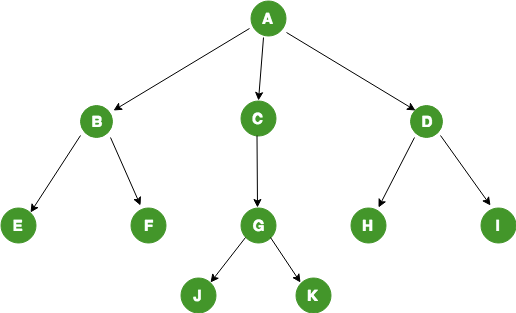
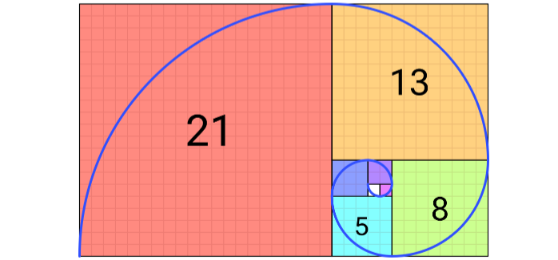
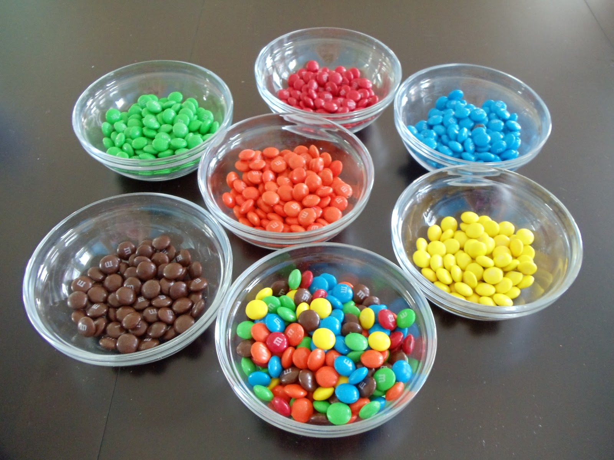
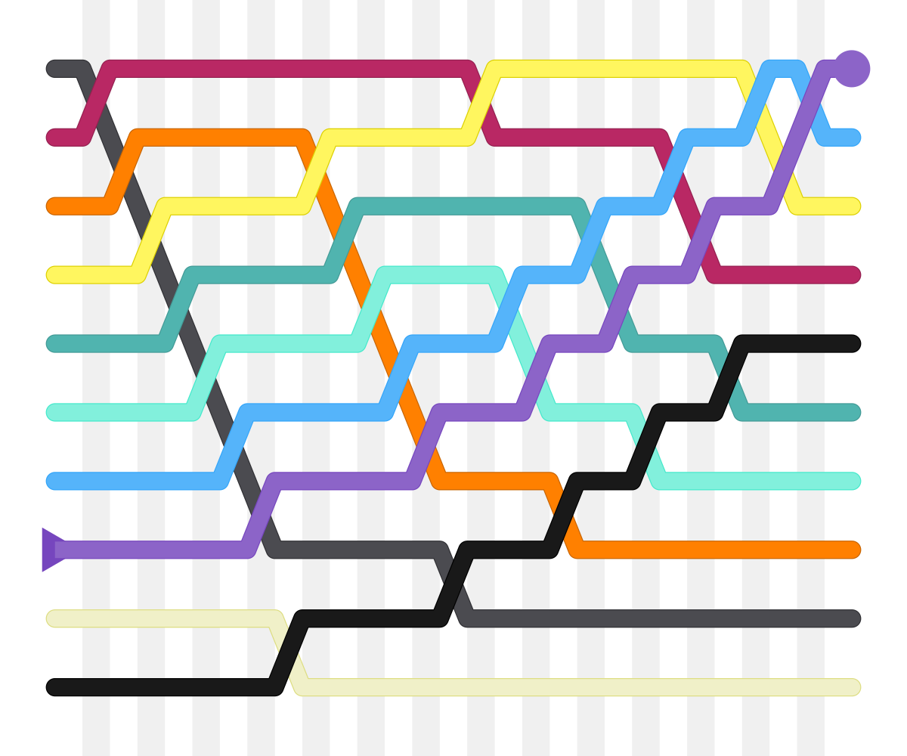

# Introduction

## 🔁 Review: Lecture 4

::: {.spacer-sm}
:::

👈 Last lecture we explored some automation methods such as:

- [Functions]{.accent}
- Branching (`if`, `else`, `else if`)
- Looping:
  - For Loops
  - While Loops
  - Repeat & Break Loops
- Control Flow

## 👀 Outline: Lecture 5


::: {.spacer-sm}
:::

👇 This lecture we will shift our focus to problem solving, including:

- [Algorithmic Thinking]{.accent}
- Branching Logic
- Iterative Logic
- Recursive Logic

# Algorithms

## 📊 Data Science

::: {.fragment}

:::{.spacer-sm}
:::

### What is Data Science?

- [Data science]{.accent} is a combination of subjects including:
  - ➕ [Math]{.accent}
  - 📊 [Statistics]{.accent}
  - 👨‍💻 [Programming]{.accent}
  - 💻 [Computer Science]{.accent}
  - 🤖 [Machine Learning]{.accent}

:::

::: {.fragment}

::: {.spacer-sm}
:::

### Data All Around Us

- [Data]{.accent} is the single most prolific commodity in the world with 
  over [1 trillion GB being generated per day]{.accent}.
- This is far too much for any human to handle, so we are required to develop 
  automated procedures using [algorithms]{.accent}.

:::

## 🧮 What is an Algorithm?

::: {.fragment}

{.slide-img-center width="700"}

:::

::: {.fragment}

::: {.spacer-sm}
:::

:::{.callout-note title="Algorithm"}
An [algorithm]{.accent} is a [process / set of rules]{.accent} performed [sequentially]{.accent} to solve some kind of problem.
:::

- The rules are often [mathematical]{.accent} but can be thought of as general functions.
- We have all used algorithms before, particularly in math classes whenever we learned to solve a problem in several steps: calculus and integral rules, long division, algebra etc.

:::

## 🌳 Branching Algorithms

::: {.fragment}

:::{.callout-note title="Branching Algorithm"}

[Branching algorithms]{.accent} can be visualized as a case-dependent tree structure, where each branch determines which steps the algorithm applies.

:::

:::

:::{.fragment}

{.slide-img-center width="600"}

:::

## Example — Branching Algorithm

::: {.fragment}

:::{.spacer-sm}
:::

### Checking the length of a character string

- Here is a simple example of a branching algorithm that checks that the 
  length of a character string is greater than 5 characters.
- If the string is greater than 5 characters, the algorithm returns `TRUE`, 
  otherwise it returns `FALSE`.

:::

:::{.fragment}

:::{.spacer-sm}
:::

```{r}
#| output-location: column
# Define the algorithm 
check_string_length <- function(string) {
  if (nchar(string) > 5) {
    return(TRUE)
  } else {
    return(FALSE)
  }
}
# Test the algorithm
check_string_length("Hello world!")
```

:::{.spacer-sm}
:::

- For more complicated logic, we can use [nested branching]{.accent} to check
  [multiple conditions]{.accent} in a single algorithm.

:::

## 🪆 Nested Branching Statements

::: {.fragment}

:::{.spacer-sm}
:::

[Branching statements can be nested]{.accent} inside one another — an `if` / `else if` / `else` block can contain another complete branching block.

- This is useful when a decision [depends on more than one condition]{.accent}, checked one at a time.
- The general structure looks like:

:::

:::{.fragment}

```{r}
#| eval: false
if (logical1) {
  if (logical2) {
    ACTION A
  } else {
    ACTION B
  }
} else {
  ACTION C
}
```

:::

::: {.fragment}

::: {.spacer-sm}
:::

### Syntax Tips

- [Indent]{.accent} each nested level further than the block containing it — this makes the structure easy to read at a glance.
- Every opening brace `{` needs a matching closing brace `}` — [close the inner block before the outer one]{.accent}.
- RStudio auto-indents and highlights matching braces for you — use this to check your work!

:::

## 🪆 Example — Nested Branching

::: {.fragment}

Suppose we want to classify a temperature, but "hot" vs "cool" means something different depending on whether it's a weekday or a weekend:

```{r}
#| output-location: column
classify_day <- function(temp, weekday) {
  if (weekday) {
    if (temp > 75) {
      return("Hot workday")
    } else {
      return("Cool workday")
    }
  } else {
    if (temp > 85) {
      return("Hot weekend")
    } else {
      return("Cool weekend")
    }
  }
}
classify_day(80, TRUE)
```

:::

::: {.fragment}

::: {.spacer-sm}
:::

:::{.emphasize}
📌 Notice the [outer branch]{.accent} picks weekday vs weekend, and the [inner branch]{.accent} then checks the temperature within it — exactly the pattern you'll need for the next exercise!
:::

:::

## 💪 Exercise — Nested Branching Practice

```{r}
#| echo: false
library(countdown)
countdown(minutes = 4)
```

Write a function `check_number` that takes a single numeric input `x` and uses [nested branching]{.accent} as follows:

::: {.nonincremental}
1. First check whether `x` is [positive]{.accent} or [non-positive]{.accent} (zero or negative).
2. If `x` is positive, nest a second branch that checks whether `x` is [even or odd]{.accent}, returning `"positive even"` or `"positive odd"`.
3. If `x` is non-positive, nest a second branch that checks whether `x` is [zero or negative]{.accent}, returning `"zero"` or `"negative"`.
:::

*Hint: the modulo operator `%%` is helpful for checking even / odd — recall `x %% 2 == 0` when `x` is even.*

## ✅ Solution — Nested Branching Practice

::: {.fragment}

```{r}
check_number <- function(x) {
  if (x > 0) {
    if (x %% 2 == 0) {
      return("positive even")
    } else {
      return("positive odd")
    }
  } else {
    if (x == 0) {
      return("zero")
    } else {
      return("negative")
    }
  }
}
```

:::

::: {.fragment}

::: {.spacer-sm}
:::

```{r}
#| layout-ncol: 3
check_number(4)
check_number(-7)
check_number(0)
```

:::{.emphasize}
📌 Notice the [outer branch]{.accent} (positive vs. non-positive) is fully resolved — including both its nested branches closed off with `}` — before the `else` for the outer branch even appears.
:::

:::

## 💪 Exercise — Branching Algorithms (Word Search)

```{r}
#| echo: false
library(countdown)
countdown(minutes = 5)
```

Consider the following `lang_matrix`:

```{r}
#| echo: true
#| output-location: column

lang_matrix <- rbind(
  c("hello", "goodbye", "friend"),
  c("hola", "adios", "amigo"),
  c("bonjour", "au revoir", "ami")
)
print(lang_matrix)
```

::: {.nonincremental}
1. Define this matrix.
2. Write a function `word_search` with two character string inputs: [language]{.accent} (`english`, `spanish` or `french`) and [type]{.accent} (`greeting`, `farewell` or `friend`).
3. The function should return the cell corresponding to the language and greeting term.
:::

```{r}
#| echo: false

# for convenience name the matrix indices
dimnames(lang_matrix) <- list(
  c("english", "spanish", "french"),
  c("greeting", "farewell", "friend")
)

word_search <- function(language, type) {
  if(
    language %in% c("english", "spanish", "french") &
    type %in% c("greeting", "farewell")
  ) {
    return(lang_matrix[language, type])
  } else {
    print("Error: Word not found!")
  }
}
```

For example:

```{r}
#| output-location: column
word_search("french", "greeting")
```

## ✅ Solution — Branching Algorithms (Word Search)

::: {.fragment}

An [inefficient first attempt]{.accent}:

```{r}
#| eval: false
word_search <- function(a, b) {
  if (a == "english" | a == "e") {
    if (b == "greeting") {return(lang_matrix[1, 1])}
    else if (b == "farewell") {return(lang_matrix[1, 2])}
  }
  else if (a == "spanish" | a == "s") {
    if (b == "greeting") {return(lang_matrix[2, 1])}
    else if (b == "farewell") {return(lang_matrix[2, 2])}
  }
  else if (a == "french" | a == "f") {
    if (b == "greeting") {return(lang_matrix[3, 1])}
    else if (b == "farewell") {return(lang_matrix[3, 2])}
  }
  else{ print("ERROR: word not found")}
}
```

:::

## ✅ Solution — A Better Approach

::: {.fragment}

To demonstrate that there are various ways to accomplish the same task we introduce the function `%in%`, which tests whether a [value is in a vector]{.accent}.

:::

:::{.fragment}
```{r}
#| output-location: column
3 %in% c(1, 2, 3, 4, 5) # TRUE
```

```{r}
#| output-location: column
6 %in% c(1, 2, 3, 4, 5) # FALSE 
```
:::

::: {.fragment}

::: {.spacer-sm}
:::

```{r}

# more efficient solution using %in%
word_search <- function(language, type) {
  # Name the matrix indices
  dimnames(lang_matrix) <- list(c("english", "spanish", "french"),
                                c("greeting", "farewell", "friend"))
  # Use named indices
  if(
    language %in% c("english", "spanish", "french") &
    type %in% c("greeting", "farewell")
  ) {
    return(lang_matrix[language, type])
  } else {
    print("Error: Word not found!")
  }
}
```

:::

## 🔁 Iterative Algorithms

::: {.fragment}

:::{.spacer-sm}
:::

### Inefficiency of Branching Algorithms

Branching algorithms are often excellent choices but they come with some 
[limitations]{.accent}:

- Larger numbers of branches are [time consuming to program]{.accent} manually.
- [Inefficient]{.accent} for traversing objects of indeterminate length.

:::

::: {.fragment}

::: {.spacer-sm}
:::

```{r}
# Example of inefficient branching algorithm
bad_in_vector <- function(v) {
  if (v[1] == 1) {print("1 is in the vector")}
  else if (v[2] == 1) {print("1 is in the vector")}
  else if (v[3] == 1) {print("1 is in the vector")}
  else if (v[4] == 1) {print("1 is in the vector")}
  else if (v[5] == 1) {print("1 is in the vector")}
  else if (v[6] == 1) {print("1 is in the vector")}
  else if (v[7] == 1) {print("1 is in the vector")}
  else {print("1 is not in the vector")}
}
```

:::

:::{.fragment}

:::{.spacer-sm}
:::

### What are Iterative Algorithms?

::: {.callout-note title="Iterative Algorithm"}
An [iterative algorithm]{.accent} is a process that repeats a set of
instructions until a specific condition is met.
:::

:::

## 🔁 Example — Iterative Algorithm

::: {.fragment}

Suppose we want to count how many negative numbers appear in a vector. An iterative algorithm [repeats the same check]{.accent} for every element:

```{r}
#| output-location: column
count_negatives <- function(v) {
  count <- 0
  for (i in 1:length(v)) {
    if (v[i] < 0) {
      count <- count + 1
    }
  }
  return(count)
}
count_negatives(c(3, -2, -7, 5, -1))
```

:::

::: {.fragment}

::: {.spacer-sm}
:::

:::{.emphasize}
📌 Notice the pattern: [loop over every index]{.accent}, [check a condition]{.accent}, then [update something]{.accent} — this is exactly the structure you'll use in the next exercise!
:::

:::

## 💪 Exercise — Iterative Algorithms

```{r}
#| echo: false
library(countdown)
countdown(minutes = 3)
```

Write a function `alter_entry` that:

::: {.nonincremental}
1. Takes a vector (of any data type) as input, and
2. Returns the same vector, but replacing every instance of the number `7` in the vector with `0`.
:::

```{r}
#| echo: false

# define alter_entry function
alter_entry <- function(v) {
  for(i in 1:length(v)) {
    if(v[i] == 7){
      v[i] <- 0
    }
  }
  return(v)
}
```

Below are some examples of the function output:

```{r}
#| layout-ncol: 2
alter_entry(c(7,2,3,7,1))
alter_entry(c(10, 7, 3, 7, 8))
```

## ✅ Solution — Iterative Algorithms

1. First we construct the surrounding function.

2. Then we define the for loop iterating over the indices of the input vector.

3. Each iteration checks whether the value at the current index is equal to 
   `7`. If it is, we replace it with `0`.

::: {.fragment}

```{r}
# define alter_entry function
alter_entry <- function(v) {
  for(i in 1:length(v)) {
    if(v[i] == 7){
      v[i] <- 0
    }
  }
  return(v)
}
```
:::

:::{.fragment}

:::{.spacer-sm}
:::

```{r}
#| layout-ncol: 2
alter_entry(c(7,2,3,7,1))
alter_entry(c(10, 7, 3, 7, 8))
```

- Remember you should still always try to avoid looping when possible.
  - Lets see if we can improve the efficiency of our previous function 
    by introducing the `which()` function.

:::


## 🔎 The `which()` Function

### A very helpful function!

- Often we would like to return the indices of the elements of a vector that 
  satisfy a certain condition.
  - For this we can use the `which()` function.
  - The `which()` function takes a logical vector as input and returns the 
    indices of the `TRUE` values.
  - It can be helpful for avoiding iterative logical queries!

- An alternative solution to our previous example using the `which()` function 
  could be:

:::{.fragment}

```{r}
alter_entry <- function(v) {
  v[which(v == 7)] <- 0
  return(v)
}
```

:::

:::{.fragment}

:::{.spacer-sm}
:::

:::{.emphasize}
📌 [Which function is more efficient?]{.accent}
:::

:::

## 🌀 Fibonacci Sequence

::: {.fragment}

In preparation for the next exercise we briefly introduce the [Fibonacci sequence]{.accent}.

:::

::: {.fragment}

::: {.spacer-sm}
:::

The Fibonacci sequence is a mathematical pattern occurring commonly in nature. It appears in the golden ratio, which is found in petals, seashells, and galaxy spirals.

{.slide-img-center width="500"}

:::

::: {.fragment}

::: {.spacer-sm}
:::

The sequence itself is constructed by starting with the [initial values]{.accent} $0$ and $1$, and every subsequent value is the [sum of the previous two]{.accent}, i.e.

$$
x_n = x_{n-1} + x_{n-2}; \quad x_1 = 0, \quad x_2 = 1.
$$

:::

## 💪 Exercise — Fibonacci Sequence

```{r}
#| echo: false
library(countdown)
countdown(minutes = 5)
```

Write an iterative function `fib_n` that returns the $n$-th term of the Fibonacci sequence:

::: {.nonincremental}
1. The function should take [one numerical scalar input]{.accent} `n`.
2. The function should [return a numeric value]{.accent} representing the $n$-th term of the Fibonacci sequence.
3. [Ignore exception cases]{.accent} and do not worry about robustness — assume the input will always be a positive integer.
:::

```{r}
#| echo: false

# define fib_n function
fib_n <- function(n){
  if(n == 1) {
    return(0)
  } else if (n==2) {
    return(1)
  } else {
    temp <- c(0,1)
    for(i in 3:n){
      temp[i] <- temp[i-1] + temp[i-2]
    }
    return(temp[n])
  }
}
```

```{r}
#| layout-ncol: 2
fib_n(10)
fib_n(25)
```

## ✅ Solution — Fibonacci Sequence

1. We start once again by defining the function and its input.

2. Next we define the base cases for the first two terms of the Fibonacci 
   sequence.

3. Finally we define a for loop that iteratively calculates the Fibonacci 
   sequence up to the $n$-th term.

:::{.fragment}

```{r}
# define fib_n function
fib_n <- function(n){
  if(n == 1) {
    return(0)
  } else if (n==2) {
    return(1)
  } else {
    temp <- c(0,1)
    for(i in 3:n){
      temp[i] <- temp[i-1] + temp[i-2]
    }
    return(temp[n])
  }
}
```

:::

:::{.fragment}

:::{.spacer-sm}
:::

```{r}
#| layout-ncol: 2
fib_n(10)
fib_n(25)
```

:::

## 🧩 Combining Everything

::: {.fragment}

Notice that in our previous example we were required to use both [branching]{.accent} and [iteration]{.accent}. It is common for algorithms to require the use of several tools.

- To understand and eventually design algorithms it is important to know how the individual pieces / steps work and what they are doing.

:::

::: {.fragment}

::: {.spacer-sm}
:::

Certain tricks come up more often than others, such as:

- [Iterating through vector indices]{.accent} ([enumeration]{.accent});
- Storing and updating [temporary]{.accent} or [intermediate]{.accent} values; and
- [Utilizing data structure]{.accent} and specific behavior.

:::

:::{.fragment}

:::{.spacer-sm}
:::

:::{.emphasize}
Let's see if we can combine these tools to solve a problem in the next exercise!
:::

:::

## 💪 Exercise — Last Negative

```{r}
#| echo: false
library(countdown)
countdown(minutes = 5)
```

Combine some of the tools we have been studying by defining a function called `last_negative` that:

::: {.nonincremental}
1. Takes a numeric vector `v`.
2. Returns the last (index-wise) negative value in `v` and its index (in a 2-element vector).
3. If `v` does not have any negative values, returns the character string `"No negative values"`.
:::

```{r}
#| echo: false

last_negative <- function(v) {

  temp <- "No negative values" # storing tempory vector

  for(i in 1:length(v)){
    if(v[i] < 0) {
      temp <- c(v[i], i)
    }
  }
  return(temp)
}
```

Below are some examples of the function output:

```{r}
#| layout-ncol: 2
last_negative(c(-1,2,6,-2,8,-9))
last_negative(c(5,2,1,4,5,6,9))
```

## ✅ Solution — Last Negative

1. We start by defining the function and its input.

2. Next we define a temporary variable `temp` to store the last negative value 
   and its index, or a message if no negative values are found.

3. Finally we define a for loop that iterates through the vector, checking for 
   negative values and updating `temp` accordingly.

::: {.fragment}

```{r}
last_negative <- function(v) {

  temp <- "No negative values" # storing tempory vector

  for(i in 1:length(v)){
    if(v[i] < 0) {
      temp <- c(v[i], i)
    }
  }
  return(temp)
}
```

:::

:::{.fragment}

:::{.spacer-sm}
:::

```{r}
#| layout-ncol: 2
last_negative(c(-1,2,6,-2,8,-9))
last_negative(c(5,2,1,4,5,6,9))
```

:::

# Nested Loops

## 🪆 Nested Loops

::: {.fragment}

Sometimes we may wish to run [loops inside other loops]{.accent} (e.g. iterating over first the rows and then the columns of a matrix), and to do so we use [nested loops]{.accent}.

:::

::: {.fragment}

::: {.spacer-sm}
:::

[**Example Nested For Loop**]{.accent}

```{r}
#| eval: false

for(LOGICAL1, often index-based) {
  DO OPERATION1

  for(LOGICAL2, often index-based){
    DO OPERATION2
  }
}
```

:::

::: {.fragment}

::: {.spacer-sm}
:::

- Nested loops are useful but [slow]{.accent}!
- Good practice is to [only use them when necessary]{.accent}, prioritising vectorized solutions.

:::

## 💪 Exercise — Two Sum

```{r}
#| echo: false
library(countdown)
countdown(minutes = 5)
```

Write a function called `two_sum` that:

::: {.nonincremental}
1. Takes an [input vector]{.accent} `v` and a [numerical scalar target]{.accent}, and
2. Returns the indices of the two entries of `v` that [add up to the target]{.accent}.
:::

Assume that:

::: {.nonincremental}
- Two indices cannot be equal (i.e. `target` will not be twice any value in `v`);
- If no values summing to `target` are found, return `NULL`; and
- Only one such pair of elements in `v` sum to the `target`.
:::

```{r}
#| echo: false

# define two_sum function
two_sum <- function(v, target) {
  n <- length(v)
  for (i in 1:(n - 1)) {
    for (j in (i + 1):n) {
      if(v[i] + v[j] == target) {
        return(c(i, j))
      }
    }
  }
return(NULL)
}
```

```{r}
two_sum(c(5,6,0,1,4),11)
```

## ✅ Solution — Two Sum

::: {.fragment}

```{r}
# define two_sum function
two_sum <- function(v, target) {
  n <- length(v)
  for (i in 1:(n - 1)) {
    for (j in (i + 1):n) {
      if(v[i] + v[j] == target) {
        return(c(i, j))
      }
    }
  }
return(NULL)
}
```

:::

::: {.fragment}

::: {.spacer-sm}
:::

:::{.emphasize}
📌 See whether you can design a more efficient function using vectors!
:::

:::

# Searching & Sorting

## 🔍 Searching & Sorting

:::{.columns}

:::{.column width="50%"}

::: {.fragment}

:::{.spacer-sm}
:::

### Famous Problems

Two very famous problems in computer science are:

1. How to [search data structures for specific values]{.accent}; and
2. How to [sort unsorted numerical vectors]{.accent}.

:::

::: {.fragment}

::: {.spacer-sm}
:::

R has [built in functions]{.accent} to handle both of these problems (i.e. `sort()` and `%in%`) but to understand the challenges of these problems we take a look at two specific solutions:

1. [Bubble sorting]{.accent}
2. (Iterative) [binary searching]{.accent}

:::

:::

:::{.column width="50%"}

<br>
<br>

{.slide-img-center width="400"}

:::

:::

## 🫧 Bubble Sort

::: {.fragment}

In 2007, former Google CEO Eric Schmidt asked then presidential candidate Barack Obama during an interview about the best way to sort one million integers.

Obama paused for a moment and replied *"I think the bubble sort would be the wrong way to go."*

{.slide-img-center width="500"}

:::

## 🫧 The Bubble Sort Algorithm

::: {.fragment}

:::{.spacer-sm}
:::

### Main Idea

  
- Assume our input is a (potentially long) vector `v` of unsorted values.
- The idea is that we let the ["lighter"]{.accent} values ["sink"]{.accent} to the bottom. 
- Apply the following algorithm:
  - Iterate through the entire vector.
  - For every pair of indices `j` and `j+1`, if `v[j] > v[j+1]` swap the values at those indices.
  - Stop iterating when the vector is fully sorted.
  - The desired output is a vector containing the sorted values of `v`.

:::

## Example — Defining Bubble Sort

::: {.fragment}

### Implementation

```{r}
bubble_sort <- function(v) {
  n <- length(v)
  for (i in 1:(n - 1)) { # iterate through n-1 loops
    is_swapped <- FALSE
      for (j in 1:(n - i)) { # swap values at specific indices
        if (v[j] > v[j + 1]) {
          temp <- v[j]
          v[j] <- v[j + 1]
          v[j + 1] <- temp
          is_swapped <- TRUE
        }
      }
    if (!is_swapped) { # break out of loop if fully sorted
      break
    }
  }
return(v)
}
```

:::

:::{.fragment}

:::{.spacer-sm}
:::

### Testing the Algorithm

As an [example of our algorithm in action]{.accent} let's define a vector of 30 numbers in a random order:

```{r}
#| output-location: column
bubble_sort_test <- sample(1:100, 30, replace = FALSE)
bubble_sort_test
```

:::

::: {.fragment}

::: {.spacer-sm}
:::

We apply the bubble sort algorithm:

```{r}
#| output-location: column
bubble_sort(bubble_sort_test)
```

:::

## 🎯 Binary Search

::: {.fragment}

:::{.spacer-sm}
:::

### Idea behind Binary Search

- Assume that I have picked a number between 1 and 1024 and tell you to 
  guess which number I have chosen. 
  - You can only use *higher* or *lower* as clues.
  - You have to guess the correct number in 11 or fewer attempts.
- Can you design an algorithm that always guesses correctly?

:::

::: {.fragment}

:::{.spacer-sm}
:::

### Binary Search Structure

The general structure of the binary search algorithm is as follows:

- Begin with a sorted vector `v` and a target value `target`.
- If the midpoint of `v` equals the `target`, end.
  - If the midpoint is greater (less) than `target`, repeat the previous step with the midpoint of the upper (lower) half of the vector.
- Repeat until `target` is found.

:::

## 🎯 Binary Search Algorithm

::: {.fragment}

### Implementation

```{r}
# define binary search algorithm
binary_search <- function(v, target) {
  left <- 1
  right <- length(v)
  while (left <= right) {
    mid <- floor((left + right) / 2) # check the vector midpoint
    if (v[mid] == target) {
      return(mid)
    } else if (v[mid] < target) { # check lower
      left <- mid + 1
    } else {
      right <- mid - 1
    }
  }
  return(NULL)
}
```

:::

:::{.fragment}

:::{.spacer-sm}
:::

### Binary Search Example

```{r}
#| output-location: column
# define a sorted vector
test_vector <- c(1, 3, 5, 7, 9, 11, 13, 15, 17, 19)
binary_search(test_vector, 7) # returns 4
```

:::

## 🔄 Recursion

::: {.fragment}

[Recursion]{.accent} is another common algorithmic pattern.

- It is the act of defining a problem in terms of simpler versions of itself.
- Recursion consists of a [**base case**]{.accent} and a [**recursive step**]{.accent}.

:::

::: {.fragment}

::: {.spacer-sm}
:::

```{r}
#| eval: FALSE
# recursion general form
recursion <- function(INPUTS) {
  if (TERMINATION CONDITION) { # base case
    END RECURSIVE FUNCTION
  } else {
    new_inputs <- DO SOMETHING # recursive step
    recursion(new_inputs)
  }
}
```

:::

## 🌀 Example — Recursive Fibonacci

::: {.fragment}

Recall that we previously wrote an [*iterative*]{.accent} Fibonacci algorithm.

- Iterative approaches are effective, and our previous function worked perfectly.
- However, iterative setups can be [complicated to implement]{.accent}.
- Furthermore, the main drawback of iteration is typically [computational cost and time]{.accent} — it is often not very efficient!

:::

::: {.fragment}

::: {.spacer-sm}
:::

Let's try using [recursion]{.accent} to create a new version of the `fib_n` function.

- We have the same setup: take an input $n$ and return the $n$-th term of the Fibonacci sequence.
- This time, construct the function using recursion.

:::

## 🌀 Recursive Fibonacci — Implementation

::: {.fragment}

```{r}
# recursive fibonacci function
fib_recur <- function(n) {
  if (n <= 2) { # base case
    return(n-1)
  }
  return(fib_recur(n - 1) + fib_recur(n - 2)) # recursive step
}
# example output
fib_recur(25)
```

:::

::: {.fragment}

::: {.spacer-sm}
:::

:::{.emphasize}
📌 The recursive Fibonacci function works exactly the same, however the implementation is [much faster]{.accent}. The drawback is that the logic behind the implementation is less intuitive.
:::

:::

# Summary

## ✅ Topics Covered

::: {.fragment}

::: {.spacer-sm}
:::

🤔 Today we began exploring problem solving:

- Algorithmic Thinking
- Branching Logic
- Iterative Logic
- Recursive Logic

:::

## 📅 Next Class

::: {.fragment}

::: {.spacer-sm}
:::

🤩 Next class we look at:

- Storing data
- Factor data

:::
