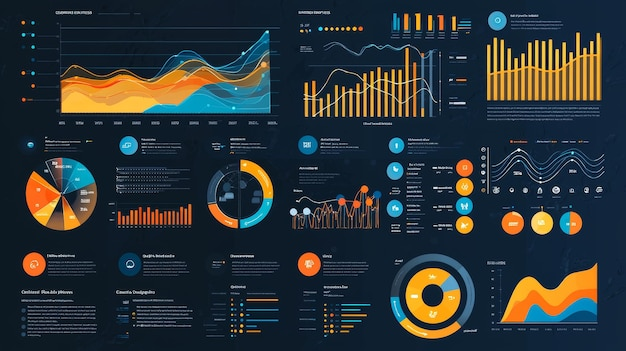
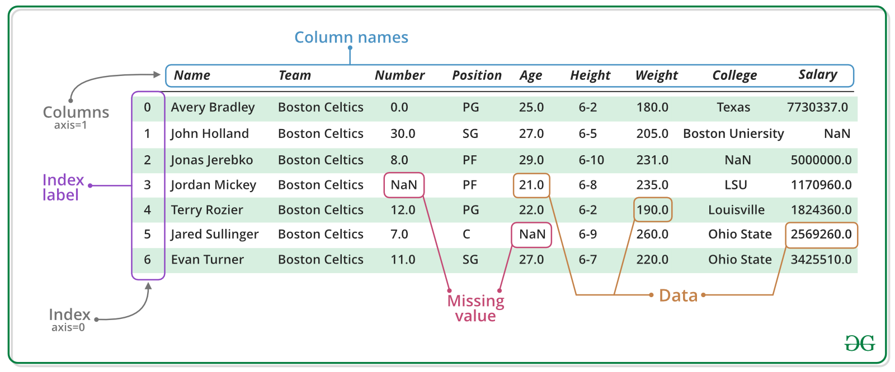

# Introduction

## 🔁 Review: Lecture 5

::: {.spacer-sm}
:::

👈 Last lecture we explored some problem solving methods:

- [Algorithmic Thinking]{.accent}
- Branching Logic
- Iterative Logic
- Recursive Logic
- Famous Algorithms:
  - Binary Search
  - Bubble Sort

## 👀 Outline: Lecture 6

::: {.spacer-sm}
:::

👇 This lecture we will shift our focus to real data, specifically:

- [Storing Data]{.accent}
- Factor Data

:::{.fragment}

{#fig-data width=75%}

:::

# Dataframes

## 🗃️ Real Data

::: {.fragment}

So far the data we have considered has typically been very simplistic:

- Scalar values
- Defined vectors, matrices and arrays
- Basic lists without much nuance

:::

::: {.fragment}

::: {.spacer-sm}
:::

The only "real" data we have considered is the `iris` dataset.

```{r}
# load data
data(iris)
# inspect data
iris[1:6, ]
```

:::

## 🗂️ Dataframes

::: {.fragment}

- When we load this data to our environment we see it is saved as a [dataframe]{.accent} object.
- Dataframes are one of the most commonly used data types in R due to them helpfully combining the following useful attributes:
  - [Dimensional]{.accent} (matrix structure)
  - [Varied datatypes]{.accent}

:::

:::{.fragment}

{#fig-dataframe width=75%}

:::

## 📦 Tidyverse

::: {.fragment}

A key package for [handling and manipulating dataframes]{.accent} is `tidyverse`, which is a very large library consisting of several sub-libraries including:

- `tibble` — dataframe / [tibble]{.accent} manipulation
- `tidyr` — [data cleaning]{.accent} and processing
- `ggplot2` — [plotting]{.accent}

:::

::: {.fragment}

::: {.spacer-sm}
:::

Make sure you have the package installed using:

```{r}
#| eval: false
install.packages("tidyverse")
```

:::

::: {.fragment}

::: {.spacer-sm}
:::

We will always load the `tidyverse` library for lectures going forward, however we will often not load the dataset libraries as they have a frustrating habit of redefining functions.

:::

::: {.fragment}

::: {.spacer-sm}
:::

Some [dataset libraries]{.accent} we shall be using include:

- `MASS` (`install.packages("MASS")`)
- `datasauRus` (`install.packages("datasauRus")`)

:::

## 📥 Loading Data

::: {.fragment}

::: {.spacer-sm}
:::

### Loading data from a library

- To [load data]{.accent} from a library (for example the `abbey` dataset from
  the `MASS` package) we use the `::` syntax.
- Whenever we load data we must use the [assignment operator]{.accent} `<-`  
  to store it in some suitably named object.

:::

:::{.fragment}

```{r}
#| output-location: column
# load abbey dataset
abbey <- MASS::abbey
head(abbey)
```

:::

::: {.fragment}

::: {.spacer-sm}
:::

:::{.emphasize}
📌 The `::` syntax allows us to avoid loading the entire `MASS` library.
:::

:::

:::{.fragment}

:::{.spacer-sm}
:::

### `head()` Function

- Above we used the `head()` function.
  - This function is very useful for [initial inspection]{.accent} of a dataset.
  - It returns the first $n$ rows of a dataframe (default $n=6$).

:::

## 🏗️ `data.frame()` Function

::: {.fragment}

::: {.spacer-sm}
:::

### Defining dataframes in R

- We can also [manually construct]{.accent} a dataframe from scratch using the `data.frame()` function.
- This function takes [one or more vectors]{.accent} as input, treating each as a column.
- It also lets us control [row names]{.accent}, [column names]{.accent}, and how [data types]{.accent} are handled.

:::

::: {.fragment}

::: {.spacer-sm}
:::

### The `data.frame()` Function

```{r}
#| eval: false
# dataframe function
data.frame(
  ..., row.names = NULL, check.rows = FALSE,
  check.names = TRUE, fix.empty.names = TRUE,
  stringsAsFactors = FALSE
)
```

:::

::: {.fragment}

::: {.spacer-sm}
:::

- We replace `...` with our data.
- Row and column names have defaults.
- There are lots of options and arguments — we will look through the main ones.

:::

## 🧱 Constructing a Dataframe

::: {.fragment}

The simplest way to [construct a data frame]{.accent} is by defining each column as a vector, for example:

```{r}
# define dataframe columns
booleans <- c(TRUE, FALSE, TRUE, TRUE)
characters <- c("dog", "seal", "cat", "cow")
numbers <- c(2, 5, 3.14, 1.26)
```

:::

::: {.fragment}

::: {.spacer-sm}
:::

Then we can construct a dataframe using the `data.frame()` function:

```{r}
#| output-location: column
df <- data.frame(
  booleans,
  characters,
  numbers
)
df
```

:::

::: {.fragment}

::: {.spacer-sm}
:::

### Indexing

We can access a specific column of a dataframe using the [`$` syntax]{.accent}:

```{r}
#| output-location: column
df$characters
```
:::

:::{.fragment}

We can also use the [indexing syntax]{.accent} we have seen before:

```{r}
#| output-location: column
df[,2] # 2nd column
```

:::{.spacer-sm}
:::

```{r}
#| output-location: column
df[1,] # 1st row
```

:::

## Example — Constructing a Dataframe

::: {.fragment}

Let's build a slightly more [complex]{.accent} dataframe — this time with four columns of student records:

```{r}
# define dataframe columns
name <- c("Priya", "Malik", "Sofia", "Owen")
age <- c(20, 22, 19, 21)
gpa <- c(3.8, 3.1, 3.95, 2.9)
enrolled <- c(TRUE, TRUE, FALSE, TRUE)
students <- data.frame(name, age, gpa, enrolled)
```

:::

::: {.fragment}

::: {.spacer-sm}
:::

Printing `students`, we again see the object names become the column names:

```{r}
#| output-location: column
students
```

:::

## 📥 Loading Real Data

::: {.fragment}

:::{.spacer-sm}
:::

The main purpose of dataframes is to allow us to [manipulate real world data sets]{.accent}. For example, consider the `cabbages` dataset.

```{r}
# load from MASS
cabbages <- MASS::cabbages
```

:::

::: {.fragment}

::: {.spacer-sm}
:::

We can use the following functions to make an [initial inspection]{.accent}
of the dataframe:

- `View()` — opens dataframe in new tab
- `head()` — (already seen) view the [first rows]{.accent} of the dataframe
- `tail()` — view the [bottom rows]{.accent} of the dataframe

:::

::: {.fragment}

:::{.spacer-sm}
:::

### 🔍 Inspecting Data

```{r}
#| layout-ncol: 2
# open in new tab (commented out for slides)
#View(cabbages)
# print first 3 rows
head(cabbages, 3)
# print last 3 rows
tail(cabbages, 3)
```

:::

## Dataframe Functions

::: {.fragment}

:::{.spacer-sm}
:::

### 📊 Summarizing Dataframes

Often we wish to construct [summary statistics]{.accent} for columns of the data frame (i.e. compute the mean, variance, minimum, maximum etc). To do so we use the `summary()` function.

```{r}
#| output-location: column
summary(cabbages)
```

:::

::: {.fragment}

:::{.spacer-sm}
:::

### 🏛️ Structure of Dataframes

Additionally, we may wish to understand the [structure]{.accent} of a dataframe, i.e. the [dimensions]{.accent}, what [datatype]{.accent} is in each column, etc.

We can do so using the `str()` function.

```{r}
#| output-location: column
str(cabbages)
```

:::

## 🎯 Indexing Dataframes

::: {.fragment}

:::{.spacer-sm}
:::

### Numerical Indexing

We [index a dataframe]{.accent} in the same way as a matrix, by using an [ordered pair]{.accent} $(i,j)$ where $i$ is the row number and $j$ is the column number:

```{r}
#| layout-ncol: 3
# 1st row, 1st column
cabbages[1,1]
# 3rd row, columns 1 to 3
cabbages[3, 1:3]
# 1st and 2nd rows, 1st and 2nd columns
cabbages[1:2, 1:2]
```

:::

:::{.fragment}

:::{.spacer-sm}
:::

### Column Name Indexing

We can also index a dataframe by [column name]{.accent}:

```{r}
#| layout-ncol: 2
# 1st row, column "HeadWt"
names(cabbages)
cabbages[1, "HeadWt"]
```

:::

## 🔪 Slicing Dataframes

::: {.fragment}

:::{.spacer-sm}
:::

### Slicing Dataframes

We can [return entire rows / columns]{.accent} by leaving the [column / row index blank]{.accent} respectively:

```{r}
#| layout-ncol: 2
# return the 3rd row
cabbages[3,]
# return the 4th column
cabbages[,4]
```

:::

:::{.fragment}

:::{.spacer-sm}
:::

### Dollar Sign `$` Indexing

We can also use the [dollar sign `$` syntax]{.accent} to return a column by name:

```{r}
#| output-location: column
head(cabbages$HeadWt)
```

:::

## 🔁 Dataframe Behavior

::: {.fragment}

:::{.spacer-sm}
:::

### Functions on Dataframes

Once we have indexed rows / columns they [behave as vectors]{.accent}, and we can perform calculations / apply functions as we have been doing in previous lectures.

```{r}
#| layout-ncol: 2
# mean of HeadWt column
mean(cabbages$HeadWt)
# length of HeadWt column
length(cabbages$HeadWt)
```

:::

::: {.fragment}

::: {.spacer-sm}
:::

Some dataframe-specific functions we will explore in upcoming lectures include:

- `order()`
- `subset()`
- `apply()`

:::

# Exploratory Data Analysis

## 🔎 Exploratory Data Analysis

::: {.fragment}

:::{.spacer-sm}
:::

Real world data is messy, and so whenever we obtain new data / start some data analysis we always begin with [exploratory data analysis (EDA)]{.accent}.

:::

:::{.fragment}

:::{.callout-note title="Exploratory Data Analysis (EDA)"}
Exploratory Data Analysis (EDA) is the process of analyzing data sets to summarize their main characteristics, often using visual methods.
:::

- It is a crucial step in any data analysis process, as it helps to:
  - Uncover patterns, spot anomalies, test hypotheses, and check assumptions with the help of summary statistics and graphical representations.

:::

::: {.fragment}

::: {.spacer-sm}
:::

We aim to investigate:

- How [spread out]{.accent} is our data?
- Are any variables [correlated]{.accent}?
- Do any values look wildly out of place? ([outliers]{.accent})
- Is any data [missing]{.accent}?

:::

## 📈 Data Visualization Tools

::: {.fragment}

Pictures paint a thousand words! Often the most intuitive way to explore data is using [visualizations]{.accent}.

::: {.columns}

::: {.column width="50%"}
[**Boxplots**]{.accent}

- Visually show the minimum, maximum, mean, upper and lower quartiles of the data.

[**Histograms**]{.accent}

- Visualize the empirical distribution of the data by grouping into bins and showing the number of counts per bin.
:::

::: {.column width="50%"}
[**Density Plots**]{.accent}

- Similar to histograms but visualize an approximate density.

[**Correlation Plots**]{.accent}

- A scatter plot of one variable against the other with a line of best fit, measuring the linear relationship between the two.
:::

:::

:::

:::{.fragment}

:::{.spacer-sm}
:::

:::{.emphasize}
📌 We will explore each of these visualization tools in more detail in the following slides.
:::

:::

## 📈 Example — Data Visualization

::: {.fragment}

We produce the following series of plots using the `iris` dataset.

```{r}
#| output-location: slide
#| fig-height: 6
#| fig-width: 12
#| out-width: 80%
#| fig-cap: "Exploratory Data Analysis Plots"
data("iris")
par(mfrow=c(2,2)) # plot a 2x2 grid of plots
# boxplot
boxplot(iris$Petal.Width, main = "Boxplot of Petal Width")
# histogram
hist(iris$Petal.Width, main = "Histogram of Petal Width",
     xlab = "Petal Width")
# density plot
plot(density(iris$Petal.Width), main = "Kernel Density of Petal Width")
# correlation plot
plot(iris$Petal.Width, iris$Petal.Length,
  main = "Correlation of Petal Length and Petal Width",
     ylab = "Petal Length",xlab = "Petal Width")
     abline(lm(iris$Petal.Length ~ iris$Petal.Width), col = "red", lty = "dashed")
text(paste("Correlation:", round(cor(iris$Petal.Width, iris$Petal.Length), 2)),
     x = 1.5, y = 2)
```

:::

## 🧮 Summary Statistics — Mean & Standard Deviation

::: {.fragment}

### Mean

Recall that the [arithmetic mean]{.accent} of a sample $\vec{x}:=(x_1, ..., x_n)$ is defined by

$$
\bar x = \frac{\sum_{i=1}^nx_i}{n}.
$$

*Intuitively, this is giving the average value of the sample (average location of all the points).*

:::

::: {.fragment}

::: {.spacer-sm}
:::

### Standard Deviation

The [standard deviation]{.accent} of a vector $\vec{x}:=(x_1, ..., x_n)$ is defined by

$$
s_x=sd(\vec{x})=\left(\frac{\sum_{i=1}^n(x_i-\bar{x})^2}{n-1}\right)^{1/2}.
$$

*Intuitively, this is computing the average distance of all points in the sample from the mean.*

:::

## 🧮 Summary Statistics — Covariance & Correlation

::: {.fragment}

### Covariance

Given two variables (vectors) $\vec{x}=(x_1, ..., x_n)$ and $\vec{y}=(y_1, ..., y_n)$ the [covariance]{.accent} of $\vec{x}$ and $\vec{y}$ is given by

$$
Cov(\vec{x}, \vec{y})=\frac{1}{n-1}\sum_{i=1}^n(x_i-\bar{x})(y_i-\bar{y}).
$$

*Intuitively, this measures whether two variables tend to move together.*

:::

::: {.fragment}

::: {.spacer-sm}
:::

:::{.emphasize}
📌 [Covariance]{.accent} is hard to interpret on its own since its scale depends on the units of `x` and `y` — [correlation]{.accent} fixes this by rescaling covariance to always fall between $-1$ and $1$.
:::

:::

::: {.fragment}

::: {.spacer-sm}
:::

### Correlation

$$
Corr(\vec{x}, \vec{y})=\frac{\sum_{i=1}^n(x_i-\bar{x})(y_i-\bar{y})}{\sqrt{\sum_{i=1}^n(x_i-\bar{x})^2\times\sum_{i=1}^n(y_i-\bar y)^2}}.
$$

Correlation is a statistical measure that expresses the extent to which two variables are linearly related (meaning they change together at a constant rate).

:::

## 🧮 Interpreting Correlation

::: {.fragment}

Correlation takes a value on the interval $[-1,1]$ where:

- $-1$ indicates [perfect negative correlation]{.accent} (as one variable increases/decreases the other decreases/increases)
- $0$ indicates [no correlation]{.accent}
- $1$ indicates [perfect positive correlation]{.accent} (as one variable increases/decreases the other increases/decreases)

:::

::: {.fragment}

::: {.spacer-sm}
:::

:::{.emphasize}
📌 We typically only note correlation values greater than 0.5 — anything lower is often [not considered significant]{.accent}.
:::

:::

::: {.fragment}

::: {.spacer-sm}
:::

:::{.emphasize}
📌 A quick, informal note on [statistical significance]{.accent}: seeing a correlation number doesn't automatically mean the relationship is "real." Significance is really just asking, "could I have gotten a number this big just by chance, from a small or noisy sample?" With very little data, even a large correlation can be a fluke; with lots of data, even a small one can be trustworthy. We won't cover the formal test for this in the course — just keep the question in the back of your mind whenever you see a correlation!
:::

:::

## ⚙️ Statistics in the Background

::: {.fragment}

These statistics can be time consuming to compute, and fortunately R has built-in functions for all three:

- `mean()` — computes the mean
- `sd()` — computes the standard deviation
- `cor()` — computes the correlation

:::

::: {.fragment}

::: {.spacer-sm}
:::

For example, considering `Petal.Length` and `Petal.Width` from the `iris` dataset:

```{r}
#| layout-ncol: 3
mean(iris$Petal.Length)
sd(iris$Petal.Length)
cor(iris$Petal.Length, iris$Petal.Width)
```

:::

## 💪 Exercise — Why Visualize?

```{r}
#| echo: false
library(countdown)
countdown(minutes = 2)
```

Evaluate the following dataset:

```{r}
# load data
dino <- datasauRus::datasaurus_dozen[1:142, ]
# initial inspection
head(dino)
```

::: {.nonincremental}
1. Using the functions from the previous slide, compute the [mean]{.accent}, [standard deviation]{.accent} and [correlation]{.accent} of the `x` and `y` columns.
2. Why might this dataset be a good example of why data visualization is important?
:::

## ✅ Solution — Why Visualize?

::: {.fragment}

```{r}
#| layout-ncol: 3
mean(dino$x)
sd(dino$x)
cor(dino$x, dino$y)
```

:::

::: {.fragment}

::: {.spacer-sm}
:::

```{r}
#| out-height: "80%"
#| fig-width: 12
#| fig-height: 7
#| fig-align: "center"
plot(dino$x, dino$y, pch = 20, main="Datasaurus Dozen", xlab = "x", ylab = "y")
```

:::

::: {.fragment}

::: {.spacer-sm}
:::

:::{.emphasize}
📌 The summary statistics of `dino` look completely unremarkable — it's only the [visualization]{.accent} that reveals the hidden structure!
:::

:::

# Categorical vs Quantitative Data

## 🏷️ Categorical vs Quantitative

::: {.fragment}

Dataframe data can roughly be broken down into the following two categories:

1. [Quantitative]{.accent} (numerical) data; and
2. [Categorical]{.accent} (factor, non-numerical) data.

:::

::: {.fragment}

::: {.spacer-sm}
:::

We need to use [different visualization techniques]{.accent} for each category:

```{r}
#| echo: false
#| fig-width: 12
#| fig-height: 4.5
#| out-height: "50%"
#| fig-cap: "Quantitative vs Categorical Visualization"
data("mtcars")
par(mfrow=c(1,2))
plot(mtcars$hp, mtcars$mpg, main= "Horsepower vs MPG",
     xlab = "Horsepower", ylab = "MPG")
c(automatic = sum(mtcars$am==0), manual = sum(mtcars$am==1)) |>
  barplot(main = "Automatic vs Manual")
```

:::

## 🏷️ Quantitative vs Categorical — Details

::: {.fragment}

:::{.spacer-sm}
:::

### Quantitative Data Types

Quantitative data separates into two types:

- [Continuous]{.accent} (age, height, weight, etc.)
  - Can take any value in a range (e.g. 1.5, 1.51, 1.511, etc.)
- [Discrete]{.accent} (usually counts, e.g. shoe size, number of students)
  - Can only take specific values (e.g. 1, 2, 3, etc.)
  - Mathematically we say the set is [countable]{.accent}.

:::

::: {.fragment}

::: {.spacer-sm}
:::

### Categorical Data

Any non-numerical data is considered categorical:

- Numbers can be considered categorical.
- Classification into [groups]{.accent} (1, 2, 3, etc.); identification numbers.
- No ordering is necessary.

:::

## 🔠 Factors

::: {.fragment}

:::{.spacer-sm}
:::

### Factors in R

- R has excellent functionality for dealing with categorical data, using a specific datatype called `factors`:
  - The distinct categories of the data are called [levels]{.accent}.
  - Each element of the data is assigned to the correct level.

:::

:::{.fragment}

:::{.spacer-sm}
:::

```{r}
#| layout-ncol: 2
# define categorical data
x <- c("red", "blue", "green", "blue", "green", "blue", "red", "yellow")
# create factor data
x <- factor(x)
# summarize the data
summary(x)
levels(x)
```

:::

## 🖼️ Visualization Tools by Data Type

::: {.fragment}

We have to adjust our exploratory data analysis (EDA) based on whether we are considering categorical (factor) data or quantitative (numerical) data.

::: {.columns}

::: {.column width="50%"}
[**Categorical Plots**]{.accent}

- Bar charts
  - Bar height/length shows the [count]{.accent} in each category.
- Pie charts
  - A circle sliced up to show each category's [share of the whole]{.accent}.
- Mosaic plots
  - Tile sizes show how two [categorical variables]{.accent} relate to each other.
:::

::: {.column width="50%"}
[**Quantitative Plots**]{.accent}

- Histograms
  - Bars show how values are [distributed]{.accent} across bins.
- Box plots
  - Summarizes [spread]{.accent} via quartiles, median, and outliers.
- Scatter plots
  - Points show the [relationship]{.accent} between two numeric variables.
- Line plots
  - Connected points track how a value [changes in order]{.accent} (e.g. over time).
:::

:::

:::

## 📊 Histograms

::: {.fragment}

[Histograms]{.accent} split the range of the continuous data into [discrete intervals]{.accent} (bins) and visualize the [count of observations in each bin]{.accent}.

```{r}
#| fig-width: 9
#| fig-height: 4
#| out-height: "60%"
hist(mtcars$mpg, main = "Histogram of Miles Per Gallon",xlab = "Miles per Gallon", breaks=8)
```

:::

# Summary

## ✅ Topics Covered

::: {.fragment}

::: {.spacer-sm}
:::

🤔 Today we looked into:

- Real Data
  - Loading Data
  - Summarizing Data
  - Visualizing Data
- Exploratory Data Analysis
  - Quantitative vs Categorical
  - Factor Data
  - Histograms

:::

## 📅 Next Class

::: {.fragment}

::: {.spacer-sm}
:::

🤩 Next class we will look more carefully at dataframes, their problems and the solution, namely:

- Tibbles
- Tidyverse Package

:::
