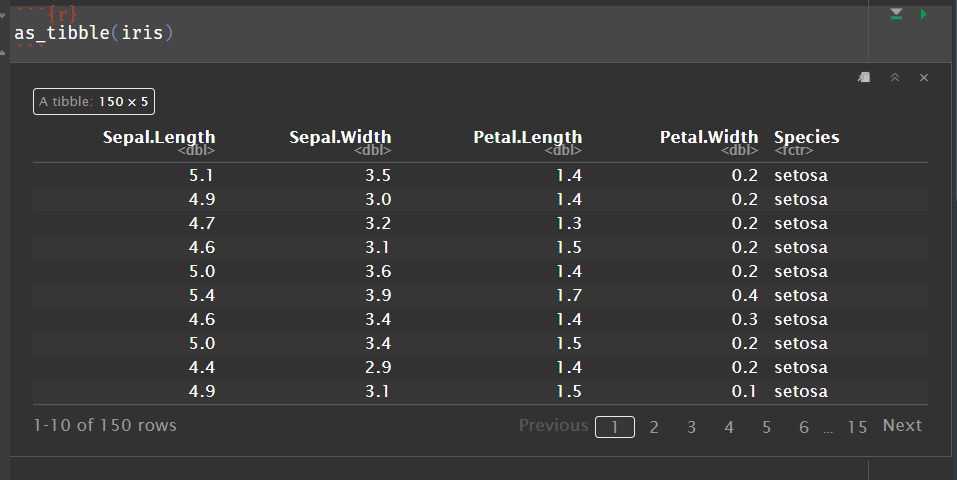

# Introduction

## 🔁 Review: Lecture 6

::: {.spacer-sm}
:::

👈 Last lecture we studied the following topics:

- [Real Data]{.accent}
  - Loading Data
  - Summarizing Data
  - Visualizing Data
- [Exploratory Data Analysis]{.accent}
  - Quantitative vs Categorical
  - Factor Data
  - Histograms

## 👀 Outline: Lecture 7

::: {.spacer-sm}
:::

👇 Today we will move on to looking at [Tibble]{.accent} objects and functions from the `tidyverse` library, specifically:

- Issues with dataframes
- [Tibble Objects]{.accent}
- The [pipe operator]{.accent} `|>`
- `dplyr` operators from the `tidyverse` package
- [Reading external data]{.accent}

:::{.fragment}

{width=50%}

:::

# Tibble Objects

## ⚠️ Problems with Dataframes

:::{.spacer-sm}
:::

We have seen that [dataframes]{.accent} are helpful but come with some frustrating drawbacks:

- They [allow numerical operations to run on non-numerical data]{.accent}, producing `NA` values.

::: {.fragment}

```{r}
#| output-location: column
iris$Species[c(1,70,150)]
```

```{r}
#| output-location: column
iris$Species[c(1,70,150)]^2
```

- [No sequential column evaluation]{.accent}.

:::

::: {.fragment}

```{r}
#| output-location: column
#| error: true
broken_df <- data.frame(x = 1:5, y = x^2)
```

- [Bad list compatibility]{.accent}.

:::

::: {.fragment}

```{r}
#| output-location: column
#| error: true
list_df <- data.frame(x = 1:3, y = list(1:5, 1:10, 1:20))
```

- Somewhat [ambiguous subsetting]{.accent}.

:::

::: {.fragment}

```{r}
#| output-location: column
is.data.frame(iris[1, ])
```

```{r}
#| output-location: column
is.data.frame(iris[,1])
```

- [Partial matching]{.accent} with `$`.
:::

::: {.fragment}


```{r}
#| output-location: column
partial_df <- data.frame(abc = 1, def = 2)
partial_df$d
```

:::

## 🎁 Tibble Objects

::: {.fragment}

The `tidyverse` package provides a solution in the form of `tibble()` objects.

First, make sure you have the `tidyverse` library loaded:

```{r}
library(tidyverse)
```

:::

::: {.fragment}

::: {.spacer-sm}
:::

We can use the `tibble()` function to convert a dataframe into a tibble.

```{r}
#| eval: false
tibble(
  ...,
  .rows = NULL,
  .name_repair = c("check_unique", "unique", "universal", "minimal")
)
```

:::{.spacer-sm}
:::

:::{.emphasize}
📌 There are lots of helpful arguments (such as `.name_repair` above) allowing us to modify dataframes to be easier to manipulate — look them up with `?tibble()`.
:::

:::

::: {.fragment}

```{r}
#| output-location: column
cabbages_tib <- tibble(MASS::cabbages); cabbages_tib
```

:::

## ✅ Tibble Benefits

::: {.columns}

::: {.column width="50%"}

::: {.fragment}

**Sequential Column Evaluation**

Tibbles [define columns sequentially]{.accent}:

```{r}
(seq_tib <- tibble(x = 1:3, y = x^2))
```

:::

::: {.fragment}

:::{.spacer-sm}
:::

**Subsetting & Matching**

Subsetting a tibble always [returns a tibble]{.accent}, and tibbles [do not allow partial matching]{.accent}:

```{r}
is_tibble(cabbages_tib[1,])
```

```{r}
#| error: true
cabbages_tib$HeadW
```

:::

:::

::: {.column width="50%"}

::: {.fragment}

**Arithmetic**

Tibbles [do not support arithmetic across columns]{.accent}:

```{r}
#| error: true
cabbages_tib[1:4, ] * 2
```

:::

::: {.fragment}

:::{.spacer-sm}
:::

**Recycling**

Tibble [recycling is extremely strict]{.accent}:

```{r}
#| error: true
tibble(a = 1, b = 1:3)
tibble(a = 1:2, b = 1:6)
```

:::

:::

:::

# Pipe Operator

## 🧬 Functional Composition

::: {.fragment}

We often wish to [apply one function after another after another]{.accent} when performing computations, a process known as [functional composition]{.accent}.

[**Example:**]{.accent} Say we wish to find which (numeric) column in the `iris` dataset has the highest mean.

```{r}
#| output-location: column
# manually composing functions
which.max(apply(iris[,-5], 2, mean))
```

:::

::: {.fragment}

::: {.spacer-sm}
:::

:::{.emphasize}
📌 Here we first used the function `mean()`, which lies inside `apply()`, which is [nested]{.accent} inside the function `which.max()` to get the desired result.
:::

:::


::: {.fragment}

:::{.spacer-sm}
:::

### 🚰 The Pipe Operator

Nesting functions works fine but can quickly become very [difficult to read]{.accent}.

The [pipe operator]{.accent} `|>` allows us to [chain (compose) several functions together]{.accent} in a clear and easy to read way. The pipe operator passes the [left-hand side item as the first argument to the right-hand side function]{.accent} and returns the result.

```{r}
#| output-location: column
# compute sepal length mean
iris$Sepal.Length |> mean()
```

:::

## 🔗 Pipe Operator Chains

### Start chaining functions!

- This is by no means limited to being applied once!

  - The pipe operator allows us to construct [long chains of functions]{.accent} where the output of the first is fed into the second and so on.

::: {.fragment}

::: {.spacer-sm}
:::

[**Example:**]{.accent} We can rewrite our previous function with pipe operators.

```{r}
#| output-location: column
# composition with pipe function
iris[-5] |>
  apply(2, mean) |>
  which.max()
```

:::{.spacer-sm}
:::

:::{.emphasize}
📌 The pipe operator is particularly helpful when we begin manipulating tibble objects using the `dplyr` functions in the following section.
:::

- Note here that we typically start a new line following every pipe operator to make the code more readable.

:::

## 💪 Exercise — Pipe Operator

```{r}
#| echo: false
library(countdown)
countdown(minutes = 3)
```

Consider the following numerical vector:

```{r}
x <- c(0.109, 0.359, 0.63, 0.996, 0.515, 0.142, 0.017, 0.829, 0.907)
```

The following nested function:

::: {.nonincremental}
1. Computes the natural log: `log(...)`
2. Computes the difference with lag 1: `diff(..., lag = 1)`
3. Computes the exponential: `exp(...)`
4. Rounds the solution to the nearest 1 d.p.: `round(..., digits = 1)`
:::

```{r}
round(exp(diff(log(x))), 1)
```

Write the equivalent function using the pipe `|>` operator.

## ✅ Solution — Pipe Operator

::: {.fragment}

We [chain]{.accent} `log()`, `diff()`, `exp()` and `round()` together using the pipe operator:

```{r}
#| output-location: column
x |>
  log() |>
  diff(1) |>
  exp() |>
  round(1)
```

:::

::: {.fragment}

::: {.spacer-sm}
:::

:::{.emphasize}
📌 If we are calling a function but the pipe has [already defined the first input]{.accent}, we still need the parentheses but leave them blank.
:::

:::

:::{.fragment}

:::{.spacer-sm}
:::

As a full function we could write:

```{r}
piped_function <- function(x){
  x |> 
    log() |> 
    diff(1) |> 
    exp() |> 
    round(1)
}
```

:::

# Tibble Manipulation

## 🛠️ `dplyr` Functions

::: {.fragment}

:::{.spacer-sm}
:::

### Working with Tibbles

The `dplyr` functions are designed to [interface easily]{.accent} with tibble data. The functions are loaded via the `tidyverse` package.

:::

::: {.fragment}

::: {.spacer-sm}
:::

The functions are:

- `select()` — [select specific columns]{.accent};
- `filter()` — [filter rows]{.accent} based on logical conditions;
- `mutate()` — [define new columns]{.accent} or [redefine existing columns]{.accent};
- `summarise()` — creates a [new data frame of summary statistics]{.accent} of data grouped by a chosen variable; and
- `arrange()` — [orders tibble rows]{.accent} based on a selected column.

:::

:::{.fragment}

:::{.spacer-sm}
:::

:::{.emphasize}

These are often referred to as the "verbs" of `dplyr` because they describe the action we are taking on the data.

:::

:::

## 🎯 `select()` Function

::: {.fragment}

:::{.spacer-sm}
:::

The `select()` function allows us to [choose specific columns of a tibble object]{.accent} using either column names or indices.

:::

::: {.fragment}

**By Name**

Select using column names:

```{r}
# define data and make tibble
cabbages <- MASS::cabbages |> tibble()
# select the Cult, Date and HeadWt columns
cabbages |> select(Cult, Date, HeadWt) |> head(2)
```

:::

::: {.fragment}

:::{.spacer-sm}
:::

**By Index**

Select using column index numbers:

```{r}
# select the columns 1 to 3
cabbages |>
  select(1:3) |>
  head(2)
```

:::

## 🎯 `select()` — Deselecting & Patterns

::: {.fragment}

**Deselecting**

Select which columns to remove:

```{r}
# deselect VitC column
cabbages |>
  select(-VitC) |>
  head(2)
```

:::

::: {.fragment}

:::{.spacer-sm}
:::

**By Name Pattern**

Select all columns whose names [share a common pattern]{.accent} using helpers like `starts_with()`:

```{r}
iris |>
  tibble() |>
  select(starts_with("Sepal")) |>
  head(2)
```

:::

## 🔍 `filter()` Function

::: {.fragment}

The `filter()` function allows us to filter rows based on logical conditions satisfied by each row.

:::

::: {.fragment}

**Single Condition**

Return rows that have `Date` of either `"d20"` or `"d21"`:

```{r}
cabbages |>
  filter(Date == "d20" | Date == "d21") |>
  head(2)
```

:::

::: {.fragment}

:::{.spacer-sm}
:::

**Multiple Conditions**

Return rows with (i) `Cult` of `"c39"`, (ii) `Date` of `"d16"`, and (iii) `HeadWt` between 2.8 and 3.3:

```{r}
cabbages |>
  filter(
    Cult == "c39" & Date == "d16" &
    HeadWt > 2.8 & HeadWt < 3.3
    ) |>
  head(2)
```

:::

## 💪 Exercise — `filter()` and `select()`

```{r}
#| echo: false
library(countdown)
countdown(minutes = 5)
```

We shall use the `painters` dataframe from the `MASS` package, loaded into our environment using the following code:

```{r}
painters <- MASS::painters
```

::: {.nonincremental}
1. Convert the `painters` dataframe into a tibble and save it to a new object called `painters_tib`.
2. Use the `select()` and `filter()` functions and the pipe operator `|>` to obtain a tibble object with columns for `School`, `Drawing` and `Expression` containing all painters from `School A` with Drawing and Expression scores [above 5]{.accent}.
:::

## ✅ Solution — `filter()` and `select()`

::: {.fragment}

We [convert]{.accent} `painters` to a tibble, then use `select()` and `filter()` to obtain the required columns and rows:

```{r}
#| output-location: column
# convert to tibble
painters_tib <- painters |> tibble()
# obtain required painters
painters_tib |>
  select(School, Drawing, Expression) |>
  filter(School == "A" & Drawing > 5 & Expression > 5)
```

:::

## 🧮 `mutate()` Function

::: {.fragment}

**New Columns**

Take the `cabbages` tibble we defined earlier. If we want to add a new column named `Color` we can do so using the `mutate()` function:

```{r}
cabbages |>
  mutate(Color = rep("Green", length(Cult))) |>
  head(2)
```

:::

::: {.fragment}

:::{.spacer-sm}
:::

**New Columns from Existing**

Alternatively we can define a new column using data from existing columns. For example, we can define a new column called `VitCPer` detailing the `VitC` per `HeadWt`.

```{r}
cabbages |>
  mutate(VitCPer = VitC / HeadWt) |>
  head(2)
```

:::

## 🧮 `mutate()` — Changing & Removing Columns

::: {.fragment}

**Changing Existing Columns**

`mutate()` can also be used to change existing columns by simply stating the name of the column you wish to change.

For example, say we discover that due to equipment failure, the `HeadWt` variable should actually be 1.6 times bigger for all observations.

```{r}
cabbages |> mutate(HeadWt = 1.6 * HeadWt) |> head(2)
```

:::

::: {.fragment}

:::{.spacer-sm}
:::

**Removing a Column**

We can also [remove a column]{.accent} entirely by setting it to `NULL`:

```{r}
cabbages |>
  mutate(HeadWt = NULL) |>
  head(2)
```

:::

# Reading Data

## 📂 Reading External Data

::: {.fragment}

:::{.spacer-sm}
:::

### Lots of file types!

- One problem with reading data into R is that data can come in a variety of [different formats]{.accent} and [file types]{.accent} (some easy to use, some challenging).

- R has lots of functionality for dealing with these subtleties, but most problems can be reduced by checking a few key things:

  - Is the file you are trying to load [in your working directory]{.accent} (i.e. the same directory as your R console and your Quarto document)?
  - Have I written the [file path of the data file]{.accent} correctly (spelling, file extension, etc.)?
  - Did I use the [correct function for the file type]{.accent}?

:::

:::{.fragment}

:::{.spacer-sm}
:::

### Some good practices

- Create a folder for each Quarto document you are working on.
- Create a sub-folder called `data` in this folder to store all your data files.
- Make sure to [check your working directory]{.accent} and [file paths]{.accent} before trying to load data files into R.


:::


## 📁 Downloading Data Files

### Data on Canvas

- On Canvas you should be able to see a module named `Data`.
  - This is where you will find the data files for this course.

- For this lecture we will be using the following three files:

  1. `class.txt`
  2. `customers-100.csv`
  3. `SampleData.xlsx`

:::{.fragment}

:::{.spacer-sm}
:::

:::{.emphasize}

If you are working along, save all three files to the `data` folder within
your current working directory.

:::

:::

## `.txt` Files

### What are `.txt` Files?

- A `.txt` file is a [plain text file]{.accent} that can be opened in any text editor (e.g. Notepad, TextEdit, etc.) and contains data in a tabular format.

- To load `.txt` files we use the function `read.table()`:

:::{.fragment}

:::{.spacer-sm}
:::

```{r}
#| output-location: column
class <- read.table("data/class.txt",
                    header = TRUE,
                    sep = " ")
head(class)
```

:::

::: {.fragment}

::: {.spacer-sm}
:::

### Reading `.txt` Files — Key Arguments

- In this case we noticed that the `.txt` file had a header, so we specified `header = TRUE`.
- We also noticed that the elements of the data were [separated by spaces]{.accent}, so we specified `sep = " "`.

:::

## `.csv` Files

### What are `.csv` Files?

- A `.csv` file is a [comma-separated value file]{.accent} (similar to an Excel spreadsheet but with fewer formatting options) that stores tabular data as plain text, with commas separating each value.

- To load `.csv` files we use the function `read.csv()`:

:::{.fragment}

:::{.spacer-sm}
:::

```{r}
#| output-location: column
customers <- read.csv("data/customers-100.csv")
head(customers[,1:4])
```

:::

::: {.fragment}

::: {.spacer-sm}
:::

### Reading `.csv` Files — Key Arguments

- `read.csv()` assumes the file has a [header row]{.accent} and is [comma-separated]{.accent} by default, so unlike `read.table()` we don't need to specify `header` or `sep` arguments.

:::

## `.xlsx` Files

### What are `.xlsx` Files?

- An `.xlsx` file is an [Excel spreadsheet]{.accent} that may contain multiple sheets of tabular data.

- To load `.xlsx` files we use the function `read_excel()` from the `readxl` package:

:::{.fragment}

:::{.spacer-sm}
:::

```{r}
#| output-location: column
SampleData <- readxl::read_excel(
    "data/SampleData.xlsx", 
    sheet = 2
)
head(SampleData)
```

:::

::: {.fragment}

::: {.spacer-sm}
:::

### Reading `.xlsx` Files — Key Arguments

- Excel workbooks can contain [multiple sheets]{.accent}, so we specify `sheet = 2` to tell `read_excel()` which sheet to read from.

:::

## 💪 Exercise — Working with External Data

```{r}
#| echo: false
library(countdown)
countdown(minutes = 6)
```

You will find on Canvas the dataset `faithful.csv`, which you will need for this final exercise.

::: {.nonincremental}
1. Download `faithful.csv` and put it in the correct directory.
2. Load the data into R, storing it in an object called `faithful` using the function `read.csv()`.
3. Convert `faithful` to a tibble.
4. Create a new column called `scaled` which contains the eruptions divided by waiting time of Old Faithful.
5. Display only the resulting rows corresponding to eruption duration of 5 or more.
:::

## ✅ Solution — Working with External Data

::: {.fragment}

We [load]{.accent} the data, convert it to a tibble, then use `mutate()` and `filter()` to compute the scaled column and select the required rows:

```{r}
#| output-location: column
# load data
faithful <- read.csv("data/faithful.csv")
# display required rows
faithful |>
  tibble() |>
  mutate(scaled = eruptions / waiting ) |>
  filter(eruptions > 5)
```

:::

# Summary

## ✅ Topics Covered

::: {.fragment}

::: {.spacer-sm}
:::

🤔 Today we looked into:

- Tibble Objects
- Pipe Operator
- Tibble Manipulation
  - Selecting
  - Filtering
  - Mutating
- Reading Data
  - `.txt`
  - `.csv`
  - `.xlsx`

:::

## 📅 Next Class

::: {.fragment}

::: {.spacer-sm}
:::

🤩 Next class we will study:

- Descriptive statistics
- Base R Plotting
- Probability
- Discrete and Continuous Random Variables

:::
