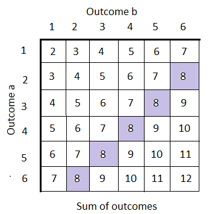

# Introduction

## 🔁 Review: Lecture 8

::: {.spacer-sm}
:::

👈 Last lecture we were studying methods to describe and visualize real world data, including:

- Descriptive statistics:
  - Location: Mean, Median, Mode
  - Spread: Standard Deviation, Variance
  - Relation: Correlation and Covariance
- Plotting:
  - Histograms
  - Scatter Plots

## 👀 Outline: Lectures 9 – 12

::: {.spacer-sm}
:::

👇 This week we will be briefly stepping away from data science and focussing more on [probability]{.accent}.

The next four lectures are relatively self-contained and will be broken down into the following subtopics:

1. Introduction to Probability
2. Discrete Random Variables
3. Continuous Random Variables
4. Monte Carlo Methods

# Introduction to Probability

## 🎲 Probability Example

::: {.fragment}

Very rarely in data science will our data show a perfectly clear relationship.

We typically assume that all data has two components: a [deterministic]{.accent} component (i.e. some function we know exactly and so can predict exactly) and a [random]{.accent} (noise) component.

:::

::: {.fragment}

::: {.spacer-sm}
:::

```{r}
#| echo: false
#| fig-width: 8
#| out-height: "60%"
#| fig-cap: "Random Noise"
# Libraries
library(tidyverse)
library(ggpubr)
# Random noise plot
set.seed(24)
data <- tibble(
  x = seq(1,8*pi,0.01),
  y = sin(x),
  z = y + rnorm(length(x),0,0.25)
)
plot1 <- data |>
  ggplot(aes(x, y)) +
  geom_line() +
  theme_light() +
  labs(
    x = "x",
    y = "sin(x)"
  )
plot2 <- data |>
  ggplot(aes(x,z)) +
  geom_line() +
  theme_light() +
  labs(
    x = "x",
    y = "sin(x) + noise"
  )
ggarrange(
  plot1, plot2,
  nrow = 2, ncol = 1
)
```

:::

## 🌊 Noisy Sin Curve

::: {.fragment}

For example, consider you run an experiment and receive the following ["noisy" sin curve]{.accent}.

```{r}
#| echo: false
#| fig-align: "center"
#| fig-cap: "Noisy Sin Curve"
#| fig-width: 8
#| fig-height: 2
plot2
```

How might we try to determine the [true value]{.accent}?

:::

## 🔁 Multiple Trials & Averaging

::: {.fragment}

We run the experiment [several times over]{.accent} and take the average after many trials! The [higher the number of trials]{.accent}, the [closer our average]{.accent} gets to the true value. This is an example of [Monte-Carlo simulation]{.accent}.

:::

::: {.fragment}

```{r}
#| echo: false
#| fig-align: "center"
#| fig-cap: "Individual trials (left) vs. their running average (right)"
#| fig-width: 9
#| fig-height: 2.5
for (i in 1:30) {
  data[[paste0("z", i)]] <- data$y + rnorm(length(data$y), 0, 0.25)
}
trials_plot <- data |>
  mutate(-y) |>
  pivot_longer(cols = 2:31, names_to = "name", values_to = "values") |>
  ggplot(aes(x, values, color = name)) +
  geom_line() +
  theme_light() +
  labs(
    x = "x",
    y = "simulations"
  ) +
  theme(legend.position = "none")
mean_plot <- data |>
  mutate(z_mean = rowMeans(across(starts_with("z")))) |>
  ggplot(aes(x, z_mean)) +
  geom_line() +
  theme_light() +
  labs(
    x = "x",
    y = "mean of simulations"
  )
ggarrange(
  trials_plot, mean_plot,
  nrow = 1, ncol = 2
)
```

:::

## 🎲 A Simple Example

::: {.fragment}

Consider [rolling two dice]{.accent}. We wish to determine the probability that the [sum of the two rolls is 8]{.accent}.

{.slide-img-center width="450"}

:::

## 🎯 Probability

::: {.fragment}

:::{.callout-note title="Probability"}

The [probability]{.accent} of some discrete event $A$ occurring is given by:

$$
\mathbb{P}(A) = \frac{\text{number of ways for event A to occur}}{\text{total number of possible outcomes}}.
$$

:::

:::

::: {.fragment}

::: {.spacer-sm}
:::

In terms of our dice rolls:

- There are 5 ways to roll an 8 (2+6, 3+5, 4+4, 5+3 and 6+2);
- There are 36 possible outcomes (6×6);
- Therefore the [probability of rolling an 8]{.accent} is 5/36.

:::

## 💪 Exercise — Coin Flips

```{r}
#| echo: false
library(countdown)
countdown(minutes = 2)
```

Suppose that you flip three fair coins, that is for each coin

$$
\mathbb{P}(H)=\mathbb{P}(T)=\frac{1}{2}.
$$

Determine the probability that you flip exactly one head by working through the following:

::: {.nonincremental}
1. Find the [number of outcomes with exactly one head]{.accent} (the order is important, i.e. HTT is not the same as TTH).
2. Find the [total number of outcomes]{.accent}.
3. Take the [ratio]{.accent}.
4. Now suppose you flip [four]{.accent} fair coins instead. Determine the probability that you flip exactly [three heads]{.accent}, following the same steps.
:::

## ✅ Solution — Coin Flips

::: {.fragment}

The number of outcomes with exactly one head is 3: $$\text{(HTT, THT, TTH)}$$

:::

::: {.fragment}

::: {.spacer-sm}
:::

The total number of outcomes is 8: $$\text{(HHH, HHT, HTH, THH, HTT, THT, TTH, TTT)}$$

:::

::: {.fragment}

::: {.spacer-sm}
:::

The ratio is therefore 3/8.

:::

::: {.fragment}

::: {.spacer-sm}
:::

For [four coins]{.accent}, the number of outcomes with exactly three heads is 4: $$\text{(HHHT, HHTH, HTHH, THHH)}$$

The total number of outcomes is $2^4=16$, so the probability is $4/16 = 1/4$.

::: {.spacer-sm}
:::

- We [list out]{.accent} the outcomes satisfying our event, being careful that order matters (HTT ≠ THT).
- We [count all possible outcomes]{.accent} — with $n$ coins there are $2^n$ total outcomes.
- The probability is simply the [ratio]{.accent} of these two counts.

:::

## 🌌 Sample Spaces

::: {.fragment}

:::{.callout-note title="Sample Space"}

The [sample space]{.accent} is the set of all possible outcomes of the experiment. It is usually denoted by the [capital Greek letter omega]{.accent} $\Omega$.

:::

:::

::: {.fragment}

::: {.spacer-sm}
:::

From our previous examples we have:

1. Coinflips:
$$
\Omega:= \{\text{HHH, HHT, HTH, THH, HTT, THT, TTH, TTT}\}
$$
2. Sum of dice rolls:
$$
\Omega:=\{2,3,4,5,6,7,8,9,10,11,12\}
$$

:::

:::{.fragment}

Each of these examples is known as a [discrete sample space]{.accent}.

:::

## 🔀 Discrete vs Continuous Sample Spaces

::: {.fragment}

:::{.callout-note title="Discrete Sample Space"}

A [sample space]{.accent} is said to be [discrete]{.accent} if it has [finite]{.accent} (more specifically countable) possible outcomes, for example:

:::

- Heads or tails of a coin flip
- Number of students in a class

:::

::: {.fragment}

::: {.spacer-sm}
:::

:::{.callout-note title="Continuous Sample Space"}

If a sample space is not discrete it is said to be [continuous]{.accent}, for example:

:::

- Height or weight
- Time taken to complete a task

:::

:::{.fragment}

:::{.emphasize}
📌 Essentially, if the outcomes are values in some [continuous interval(s)]{.accent} then the sample space is continuous.
:::

:::

## 💪 Exercise — Discrete vs Continuous Sample Spaces

```{r}
#| echo: false
library(countdown)
countdown(minutes = 3)
```

For each of the following experiments [determine the sample space]{.accent}, noting whether it is [continuous or discrete]{.accent}.

::: {.nonincremental}
1. Uniformly at random selecting an integer between 1 and 12 inclusive.
2. Uniformly at random selecting a number between 1 and 12 inclusive.
3. Flipping a coin and rolling a 6-sided dice at the same time.
4. Uniformly at random selecting an integer between 1 and 3 (inclusive) and an integer between 7 and 9 (inclusive).
:::

## ✅ Solution — Discrete vs Continuous Sample Spaces

::: {.fragment}

1. $\Omega:=\{1,2,3,4,5,6,7,8,9,10,11,12\}$ — [Discrete]{.accent}
2. $\Omega := [1,12]$ — [Continuous]{.accent}
3. $\Omega := \{H1, H2, ..., H6, T1, T2, ..., T6\}$ — [Discrete]{.accent}
4. $\Omega := \{(1,7),(1,8),(1,9), ...,(3,7),(3,8),(3,9)\}$ — [Discrete]{.accent}

:::

::: {.fragment}

::: {.spacer-sm}
:::

- Selecting an [integer]{.accent} always gives a countable (discrete) sample space, even if we list it as a range.
- Selecting [any real number]{.accent} in an interval gives an uncountable (continuous) sample space.
- Combining two [independent discrete]{.accent} experiments (e.g. coin + die, two integers) still gives a discrete sample space — just with [paired outcomes]{.accent}.

:::

# Simulation

## 🧪 Simulation

::: {.fragment}

Often times we are [unable to determine the probability analytically]{.accent} due to reasons such as:

- We don't know the number of ways an outcome can occur;
- We don't know the full sample space; or
- Our outcome can occur too many ways to count.

:::

::: {.fragment}

::: {.spacer-sm}
:::

In these cases we can [accurately approximate the solution]{.accent} using [simulation]{.accent}!

:::

::: {.fragment}

::: {.spacer-sm}
:::

### Intuition

- If we [repeat a random experiment many times]{.accent} and record whether an event happens on each repetition, then the [proportion of repetitions]{.accent} where it happens gives us a good estimate of its probability. 

- Roll a die 6000 times and count how often a 4 comes up — you should see roughly 1000 of them, i.e. roughly $1/6$ of trials, even though we never explicitly computed $1/6$.

:::

## 🎲 Example — Approximation

::: {.fragment}

Think back to our dice rolling experiment. Assuming we cannot compute the probability, we look to set up a simulation to approximate it.

We begin by outlining the [structure]{.accent} of the simulation:

::: {.nonincremental}
1. Computationally roll 2 six-sided dice (we will explore how to do this).
2. Sum their values.
3. Record `TRUE` if their sum is 8 and `FALSE` otherwise.
4. Repeat the experiment a large `n` number of times.
5. Count the number of true values `n_true` and compute the probability as `n_true/n` or equivalently `mean(n_true)`.
:::

:::

::: {.fragment}

::: {.spacer-sm}
:::

We haven't seen the code yet, but here's a preview of applying this same structure to our [coin flip exercise]{.accent} from earlier, for a growing number of trials `n`:

```{r}
#| echo: false
set.seed(9)
approx_probs <- function(n) {
  one_head_3 <- mean(replicate(n, sum(sample(c(0, 1), 3, replace = TRUE)) == 1))
  three_heads_4 <- mean(replicate(n, sum(sample(c(0, 1), 4, replace = TRUE)) == 3))
  c(one_head_3, three_heads_4)
}
results <- sapply(c(10, 100, 1000), approx_probs)
data.frame(
  n = c(10, 100, 1000),
  `P(1 head in 3 flips)` = results[1, ],
  `P(3 heads in 4 flips)` = results[2, ],
  check.names = FALSE
)
```

Notice how the approximations get [closer to the true values]{.accent} (3/8 = 0.375 and 1/4 = 0.25) as `n` grows.

:::

## 📖 Simulation Terminology

::: {.fragment}

### Experiment

An [experiment]{.accent} is a repeatable process with [random outcomes]{.accent}.

### Event

An [event]{.accent} is the set of all outcomes of an experiment satisfying a [logical condition]{.accent}.

:::

::: {.fragment}

::: {.spacer-sm}
:::

### Probability

The [probability of an event]{.accent} can be thought of as the proportion of `TRUE` outcomes divided by the total number of trials `n` as `n` [approaches infinity]{.accent}.

:::

::: {.fragment}

::: {.spacer-sm}
:::

:::{.emphasize}
📌 This is [not a rigorous definition]{.accent} — it's just a helpful, intuitive way to think about probability. Formally, probability is defined more abstractly as a [measure]{.accent}: a function assigning a number to subsets of some abstract space, satisfying a small set of axioms. We won't need this formal machinery in this course.
:::

:::

## 🎰 `sample()` Function

::: {.fragment}

The `sample()` function is the key function for [discrete probability calculation]{.accent}. It [randomly draws elements]{.accent} from a set, and is exactly the tool we need to simulate experiments like coin flips and dice rolls.

```{r}
#| eval: false
sample(x, size, replace = FALSE, prob = NULL)
```

:::

::: {.fragment}

::: {.spacer-sm}
:::

Here the arguments are:

- `x` is the set you sample from;
- `size` is the size of the sample you wish to take;
- `replace` specifies whether you replace sampled items; and
- `prob` assigns different weights (probabilities) to different outcomes.

:::

::: {.fragment}

::: {.spacer-sm}
:::

For example, to simulate a single roll of a fair six-sided die:

```{r}
sample(x = 1:6, size = 1)
```

:::{.emphasize}
📌 Careful: if `x` is a [single number]{.accent} `n` (not a vector), `sample()` treats it as shorthand for `sample(1:n, ...)`. This is a common source of bugs when `x` is meant to represent a vector containing one value — always double check what `x` actually is!
:::

:::

## 🎰 `sample()` — Without Replacement

::: {.fragment}

Let's consider randomly sampling from [animal types]{.accent}:

```{r}
# define animals vector
animals <- c("lion", "elephant", "gorilla", "crocodile", "gibbon")
```

:::

::: {.fragment}

::: {.spacer-sm}
:::

By default we sample [without replacement]{.accent}, so each time we select an animal we can no longer choose it. We therefore cannot sample more than the size of the set:

```{r}
#| error: true
#| layout-ncol: 2
sample(x = animals, size = 3)
sample(x = animals, size = 6)
```

:::

::: {.fragment}

::: {.spacer-sm}
:::

A few more examples of sampling without replacement:

```{r}
#| layout-ncol: 2
# draw 5 unique "lottery" numbers from 1-49
sample(x = 1:49, size = 5)
# randomly reorder (shuffle) all 5 animals
sample(x = animals, size = length(animals))
```

Setting `size` equal to the length of `x` is a handy way to [randomly shuffle]{.accent} a vector.

:::

## 🎰 `sample()` — With Replacement

::: {.fragment}

If we specify to sample [with replacement]{.accent} we can sample as much as we want.

We sample 1000 times from `animals` with replacement and inspect the count plot:

```{r}
#| fig-width: 10
#| fig-height: 3
#| fig-cap: "Count plot of animal types in sample."

# sample
animal_sample <- sample(animals, size = 1000, replace = TRUE)
# barplot
animal_sample |>
  table() |>
  barplot(
    main = "Count of animals in sample",
    ylab = "Count",
    xlab = "Animal",
    col = 1:5
    )
```

:::

## 🎰 `sample()` — Probabilities

::: {.fragment}

Notice that our last plot had [(roughly) equal]{.accent} bar heights, since we are equally likely to select each animal.

If we are more likely to select certain animals we can [specify the probabilities]{.accent} using the `prob` argument. `prob` takes a vector of [weights]{.accent}, one per element of `x` (matched by position), giving the relative likelihood of selecting each item — the values must be non-negative, and R automatically rescales them to sum to 1. So `prob = c(0.4, 0.3, 0.2, 0.05, 0.05)` means we should select `"lion"` about 40% of the time, `"elephant"` about 30% of the time, and so on.

We again produce the count plot to see the impact this has on our sample.

```{r}
# sample
animal_sample <- sample(
  animals, size = 1000, replace = TRUE,
  prob = c(0.4, 0.3, 0.2, 0.05, 0.05))
```

:::

## 🎰 `sample()` — Probabilities (Result)

::: {.fragment}

```{r}
#| fig-width: 10
#| fig-height: 3.5
#| fig-cap: "Count plot of animal types in sample with different probabilities."

# barplot
animal_sample |> table() |> barplot(
    main = "Count of animals in sample with probabilities",
    ylab = "Count", xlab = "Animal", col = 1:5
    )
```

:::

::: {.fragment}

- The bars are [no longer roughly equal]{.accent} — they now reflect the 
  probabilities we specified.
- The relative bar heights approximately [match the `prob` weights]{.accent}, 
  since our sample size (1000) is large.

:::

## 🎲 Example — Approximation (Continued)

::: {.fragment}

Returning to our example, you can use `sample()` to generate one dice roll. We then use a [loop]{.accent} to approximate the probability:

```{r}
#| layout-ncol: 2
sample(1:6, 1, replace = TRUE)
# function computing the probability
prob_dice_sum <- function(sims = 10000) {
  count <- 0
  for(i in seq_len(sims)) {
    dsum <- sample(1:6, 1) + sample(1:6, 1)
    if (dsum == 8) count <- count + 1
  }
  return(count / sims)
}
# compute probability example
prob_dice_sum(sims = 10000)
```

:::

::: {.fragment}

::: {.spacer-sm}
:::

We can use exactly the same structure to code up the [3 heads in 4 flips]{.accent} case from earlier:

```{r}
prob_three_heads <- function(sims = 10000) {
  count <- 0
  for (i in seq_len(sims)) {
    flips <- sample(c(0, 1), 4, replace = TRUE)
    if (sum(flips) == 3) count <- count + 1
  }
  return(count / sims)
}
prob_three_heads(sims = 10000)
```

:::

## 📈 Approximation Accuracy

::: {.fragment}

```{r}
#| echo: false
#| fig-cap: "Approximate probability against simulation count."
#| fig-align: "center"
#| fig-width: 8
n_sims <- c(10,25,50,100,200,500,1000,2000, 5000, 10000)
prob_sims <- c()
for(i in 1:length(n_sims)){
  prob_sims[i] <- prob_dice_sum(n_sims[i])
}
plot(n_sims, prob_sims, type = "l", col = "darkgreen", xlab = "No. of simulations", ylab = "Probability", main = "Approximate probability for different simulation counts", log = "x")
points(n_sims, prob_sims, pch = 20, col = "darkgreen")
abline(h = 5/36, col = "red", lty = 2)
legend("topright", legend = c("Approximation", "True Probability"), col = c("darkgreen", "red"), lty = 1:2)
```

:::

## 🎯 Why Does This Work?

::: {.fragment}

### The Law of Large Numbers

- What you're seeing in the plot above is the [Law of Large Numbers]{.accent} in action.

- In plain terms: as you [repeat a random experiment more times]{.accent}, the average of your results gets [closer and closer]{.accent} to the true expected value or probability.

  - With [few trials]{.accent} (left side of the plot), the approximation is [noisy]{.accent} and can be far from the true value.
  - With [many trials]{.accent} (right side of the plot), the noise [averages out]{.accent} and the approximation settles down near the true value.
- In short: [more trials = less noise = a more reliable approximation]{.accent}.

:::

::: {.fragment}

::: {.spacer-sm}
:::

:::{.emphasize}
📌 We'll state this more formally (with a limit) in the next lecture after we 
have defined expectation — for now, the intuition is all we need.
:::

:::

## 🔁 Replicability

::: {.fragment}

Often we would like our work to be [replicated by others]{.accent}, and if we are using random generation then others might not generate the same results. To ensure replicability we need to [set the seed]{.accent}!

{.slide-img-center width="400"}

:::

::: {.fragment}

::: {.spacer-sm}
:::

- Without a fixed seed, every run of your code produces a [different random sample]{.accent} — a classmate (or grader!) re-running your analysis would get different numbers than you did.
- Setting the seed means anyone who runs your code, [anywhere, at any time]{.accent}, gets [exactly the same results]{.accent} as you.
- This is essential for [reproducible research]{.accent} — a cornerstone of good data science practice.

:::

## 🌱 `set.seed()` Function

::: {.fragment}

When you generate random numbers in R, they are [not truly random]{.accent} but are generated using a [deterministic algorithm]{.accent}.

The function `set.seed()` initializes the random number generator to a specific state, so the sequence of random numbers can be [reproduced]{.accent}.

```{r}
#| layout-ncol: 2
# Example
set.seed(84)
sample(1:10000, 1)
set.seed(84)
sample(1:10000, 1)
```

:::

::: {.fragment}

::: {.spacer-sm}
:::

Importantly, `set.seed()` doesn't just fix the [next]{.accent} random number — it resets the [entire sequence]{.accent} that follows:

```{r}
#| layout-ncol: 3
set.seed(84)
sample(1:10000, 3) # first 3 draws
sample(1:10000, 1) # 4th draw continues the sequence
set.seed(84)
sample(1:10000, 3) # resetting gives the exact same first 3 draws again
```

Notice the [first three draws]{.accent} are identical every time we call `set.seed(84)`, while the [4th draw]{.accent} (without re-setting the seed) simply continues on from where the sequence left off.

:::

## 💪 Exercise — Computing Probability

```{r}
#| echo: false
library(countdown)
countdown(minutes = 3)
```

In our drawer we keep [6 black socks]{.accent} and [8 white socks]{.accent}. We [remove 3 socks without replacement]{.accent} and wish to determine the probability that all of our socks are black.

::: {.nonincremental}
1. Using probabilistic methods, determine the probability.

  - Think about selecting the socks one at a time and how the probability 
    changes as we remove socks from the drawer.
  - For the first draw, how many black socks out of the total number 
    of socks.  
  - For the second draw, we already have one black sock, so how many black 
    socks are left?
  - Use the [product rule]{.accent} to combine the probabilities of each draw.

:::

## ✅ Solution — Computing Probability

::: {.fragment}

The probability of selecting 3 black socks is given by:

$$
\frac{6}{14}\times\frac{5}{13}\times\frac{4}{12} = \frac{5}{91} = 0.05494505.
$$

:::

::: {.fragment}

::: {.spacer-sm}
:::

- Each fraction is the probability of drawing black [given]{.accent} what's already been removed — 6/14 for the first sock, then 5/13 (one fewer black, one fewer total), then 4/12.
- We [multiply]{.accent} the fractions since we need all three draws to succeed, one after another.
- This is [sampling without replacement]{.accent}, so the probabilities change at each step (unlike flipping coins).

:::

## 💪 Exercise — Checking with Simulation

```{r}
#| echo: false
library(countdown)
countdown(minutes = 5)
```

We will now check the solution using simulation.

::: {.nonincremental}
1. Define a vector `sock_drawer` of 1's (representing black socks) and 0's (representing white socks).
2. Define a vector `socks` representing the results of 3 selections from the drawer (without replacement) — use the `sample()` function with argument `replace = FALSE`.
:::

```{r}
#| eval: false

set.seed(453)
sock_drawer <- # CODE HERE
count <- 0
for(i in seq_len(10000)){
  socks <- # CODE HERE
  if(sum(socks) == 3) {
    count <- count + 1
  }
}
count / 10000
```

::: {.fragment}

::: {.spacer-sm}
:::

**✅ Solution:**

```{r}
#| echo: false
set.seed(453)
sock_drawer <- c(rep(1, 6), rep(0,8))
count <- 0
for(i in seq_len(10000)){
  socks <- sample(sock_drawer, 3, replace = FALSE)
  if(sum(socks) == 3) {
    count <- count + 1
  }
}
count / 10000
```

- We build `sock_drawer` from 6 ones (black) and 8 zeros (white).
- Each loop iteration draws 3 socks without replacement and checks if [all three]{.accent} are black (`sum(socks) == 3`).
- Repeating 10000 times and dividing by 10000 gives an approximate probability, which closely matches our analytical answer of $5/91\approx0.0549$.

:::

## ♻️ `replicate()` Function

::: {.fragment}

### Why Avoid Loops?

- Loops are helpful and sometimes necessary, but they are also very [computationally intensive]{.accent} and [inefficient]{.accent} in R.
- We therefore try to [minimize our use of loops]{.accent}, particularly when our iteration has no need for a loop index (like `i` in a `for` loop) — as in all of our simulation examples so far!

:::

::: {.fragment}

::: {.spacer-sm}
:::

### The `replicate()` Function

The function `replicate()` simply [replicates a task]{.accent} you set it, a specified number of times, and returns the results in an appropriate data structure. The general form is:

```{r}
#| eval: false
replicate(n, expr, simplify = "array")
```

- `n` is the [number of times]{.accent} to repeat the task;
- `expr` is the [expression (code)]{.accent} you want repeated — typically a single random draw or simulation; and
- `simplify = "array"` (the default) tells R to [simplify the list of results]{.accent} into a vector, matrix, or array where possible, rather than returning a plain list.

:::

## ♻️ Example — `replicate()` Function

::: {.fragment}

First, let's use `replicate()` to simulate [100 individual dice rolls]{.accent} — the expression `sample(1:6, size = 1, replace = TRUE)` (one dice roll) is repeated 100 times, and the results are simplified into a single vector:

```{r}
#| output-location: column
replicate(100, sample(1:6, size = 1, replace = TRUE)) # 100 dice rolls
```

:::

::: {.fragment}

::: {.spacer-sm}
:::

Now let's revisit our [two-dice sum]{.accent} example. We replicate "roll two dice and sum them" 10000 times, storing every sum in `dice_sum`, then compute the proportion equal to 8 — no `for` loop required!

```{r}
#| output-location: column
dice_sum <- replicate(10000, sum(sample(1:6, size = 2, replace = TRUE)))
mean(dice_sum == 8)
```

:::

::: {.fragment}

::: {.spacer-sm}
:::

We can apply exactly the same pattern to our [coin flip example]{.accent} — replicate "flip 4 coins and check for 3 heads" 10000 times:

```{r}
#| output-location: column
four_flips <- replicate(10000, sum(sample(c(0, 1), size = 4, replace = TRUE)))
mean(four_flips == 3)
```

:::

## 💪 Exercise — Eliminating Loops

```{r}
#| echo: false
library(countdown)
countdown(minutes = 3)
```

Suppose you roll 2 fair dice. What is the probability that their product is greater than 15? Simulate with at least 10000 trials.

:::{.emphasize}
📌 [Hint:]{.accent} use `replicate()` (not a `for` loop) to generate the 10000 products, and `prod()` to multiply the two rolled values together.
:::

## ✅ Solution — Eliminating Loops

::: {.fragment}

```{r}
dice_prod <- replicate(
  10000,
  prod(sample(1:6, size = 2, replace = TRUE))
)
mean(dice_prod > 15)
```

:::

::: {.fragment}

::: {.spacer-sm}
:::

- `replicate()` runs `prod(sample(1:6, size = 2, replace = TRUE))` 10000 times, storing each dice product in `dice_prod`.
- `dice_prod > 15` produces a `TRUE`/`FALSE` vector, and `mean()` of a logical vector gives the [proportion of `TRUE`s]{.accent} — exactly the probability we want.

:::

::: {.fragment}

::: {.spacer-sm}
:::

:::{.emphasize}
📌 The true probability is $11/36\approx 0.3056$.
:::

:::

# Summary

## ✅ Topics Covered

::: {.fragment}

::: {.spacer-sm}
:::

🤔 Today we introduced ourselves to probability, specifically:

- Probability Definition
- Sample Spaces
- Simulation
- `sample()` Function
- `replicate()` Function

:::

## 📅 Next Class

::: {.fragment}

::: {.spacer-sm}
:::

🤩 Next class we will continue exploring probability by formally defining [random variables]{.accent} and exploring some [discrete probability distributions]{.accent}, including:

- Uniform Distributions
- Bernoulli Distributions
- Binomial Distributions
- Poisson Distributions

:::
