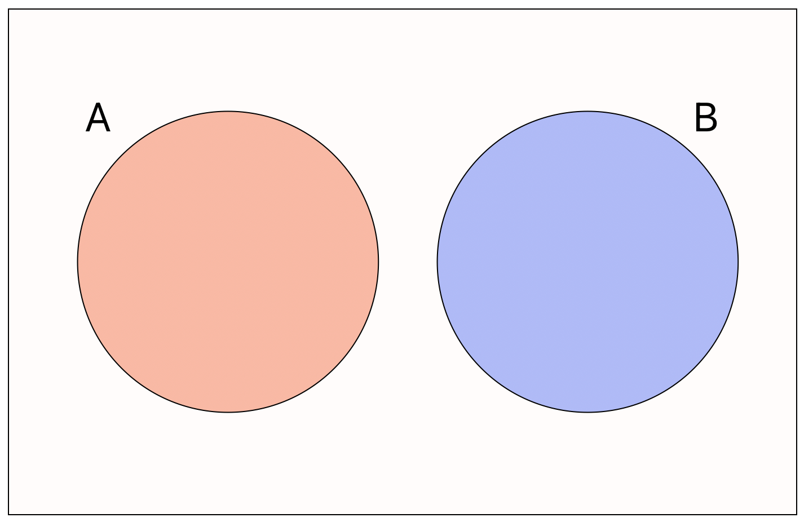
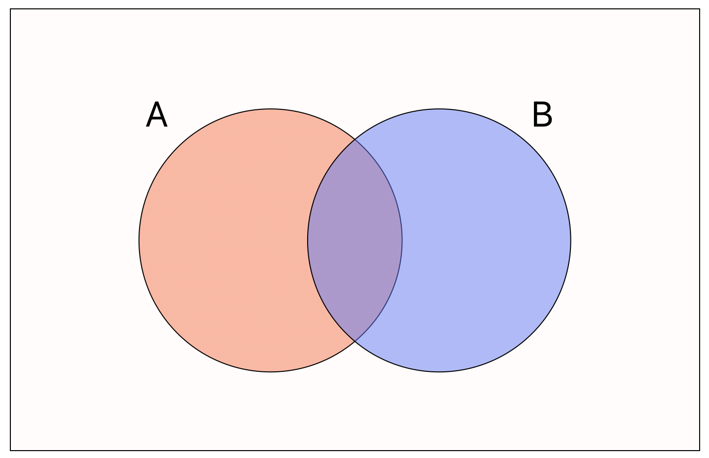
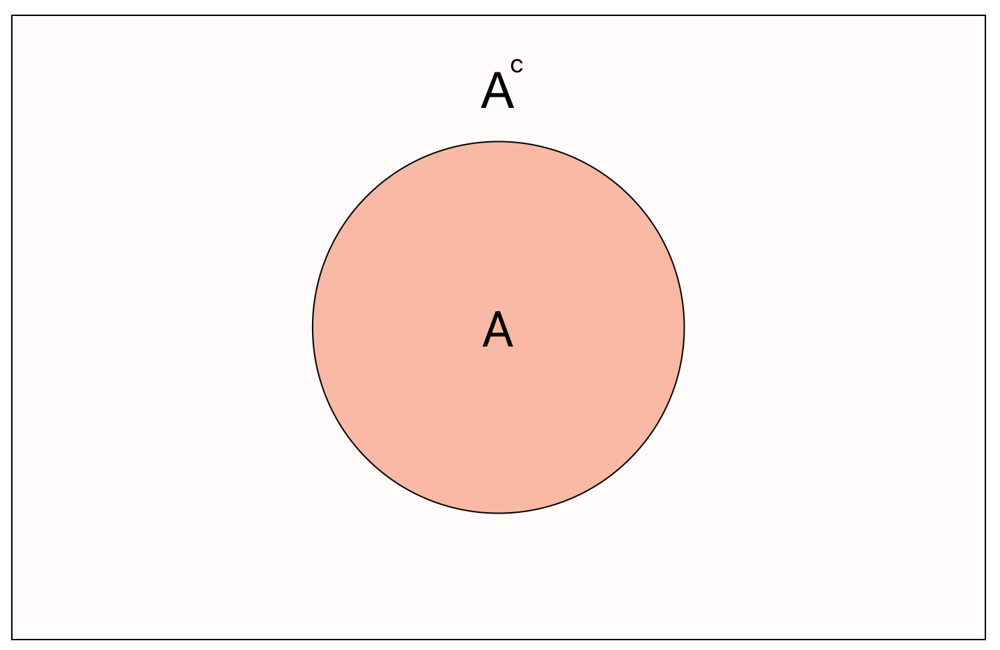

```{r}
#| echo: false
library(tidyverse)
library(ggforce)
```

# Introduction

## 🔁 Review: Lecture 9

::: {.spacer-sm}
:::

👈 Last lecture we looked at the fundamentals of probability, including:

- Events (outcomes)
- Sample Spaces
- Frequentist Probability
- Simulation
  - `sample()` Function
  - `replicate()` Function

## 👀 Outline: Lecture 10

::: {.spacer-sm}
:::

👇 This week we will be continuing our exploration of probability by studying:

- Types of events
- Conditional probability
- Discrete random variables
- Discrete Probability Distributions
  - Discrete Uniform
  - Bernoulli
  - Binomial
  - Poisson

# Events

## 🎲 Events

::: {.spacer-sm}
:::

::: {.fragment}

::: definition

The [sample space]{.accent} $\Omega$ is the collection of all 
[outcomes]{.accent} $\omega$ of a random [experiment]{.accent}.

:::

- A [collection of outcomes]{.accent} is known as an [event]{.accent}.
- We typically denote events with capital letters, e.g. $A$, $B$ or $C$.

:::

::: {.fragment}

::: {.spacer-sm}
:::

[**Example:**]{.accent}

A dice rolling experiment has [6 possible outcomes]{.accent}, rolling a number 1 through 6.

- Our first event of interest might be to roll a six (i.e. one outcome).
- Our second event of interest might be to roll a number greater than 3 (i.e. the three outcomes 4, 5 and 6).

:::

## 🎯 Certain and Probability-Zero Events

:::{.spacer-sm}
:::

:::{.fragment}

### Clarifying Terminology

- We say that an event is [certain]{.accent} (guaranteed, ensured, definitely going to happen) if it occurs [with probability 1]{.accent}.

- Additionally, we say that an event occurs [with probability zero]{.accent} if it "never" happens.

:::

:::{.fragment}

:::{.spacer-sm}
:::

:::{.emphasize}
📌 [This is not the same as being impossible!]{.accent}
:::

:::

::: {.fragment}

::: {.spacer-sm}
:::

[**Example**]{.accent}

- In the dice rolling experiment a [certain event]{.accent} might be the event that we roll a number less than 7.
- An event that occurs [with probability zero]{.accent} might be to roll a 7.
  - Okay in this case it's the same as being impossible, but not always!
  - In particular, when we consider continuous random variables, we will see that events can occur with probability zero but are not impossible.

:::

## ⁉️ Probability Zero and Impossible

::: {.spacer-sm}
:::

::: {.fragment}

:::{.spacer-sm}
:::

There is a subtle difference between an event that is [impossible]{.accent} and an event that occurs [with probability zero]{.accent}.

:::

::: {.fragment}

::: {.spacer-sm}
:::

:::{.callout-important title="Infinite Bullseye"}

- To gain an intuitive understanding of the difference, consider a dartboard with area $2\pi$ (therefore with radius of 1).
- We define an [infinitely small bullseye]{.accent}, i.e. it is exactly the coordinate $(0,0)$.
- What is the probability a dart thrown uniformly at random exactly hits $(0,0)$?

:::

:::{.spacer-sm}
:::

- The probability of hitting the bullseye is [zero]{.accent} since the area of the bullseye is zero, but it is not [impossible]{.accent} to hit the bullseye.
  - In fact, any point on the dartboard has probability zero of being hit, but it is not impossible to hit any point.
  - This is a little counter-intuitive!

:::

## 🎯 Theoretical Dartboard

::: {.spacer-sm}
:::

::: {.fragment}

```{r}
#| echo: false
#| fig-cap: "Dartboard with infinitely small bullseye"
ggplot() +
  geom_point() +
  geom_circle(aes(x0=0, y0=0, r=1), inherit.aes=FALSE) +
  geom_circle(aes(x0=0, y0=0, r=.75), inherit.aes=FALSE) +
  geom_circle(aes(x0=0, y0=0, r=.5), inherit.aes=FALSE) +
  geom_circle(aes(x0=0, y0=0, r=.25), inherit.aes=FALSE) +
  geom_circle(aes(x0=0, y0=0, r=.01, col = "red"), inherit.aes=FALSE) +
  labs(x = "x", y = "y",
    title = "Theoretical Dart Board") +
  coord_fixed() +
  theme_minimal() +
  theme(legend.position = "none")
```

:::

## 🎯 Example — Probability Zero Events

:::{.spacer-sm}
:::

- Equivalently, consider the interval $[0,1]$. 
  - If we randomly select any number within the interval, what is the [probability that we pick exactly]{.accent} $1/2$?
  - Since there are [infinite numbers]{.accent} in the interval between 0 and 1, the [probability]{.accent} of selecting 1/2 at random is 0.

::: {.fragment}

::: {.spacer-sm}
:::

:::{.emphasize}
‼️ [**This doesn't mean that it will never happen!**]{.accent}
:::

:::{.spacer-sm}
:::

In fact, anytime we [randomly select a number]{.accent} from a continuous distribution we are observing a probability zero event.

:::

## 🎯 Visualizing a Probability-Zero Event

::: {.spacer-sm}
:::

::: {.fragment}

```{r}
#| echo: false
#| fig-cap: "Selecting 1/2 from the continuous interval from 0 to 1."
plot(NA,
  type = "n",
  xlim = c(0,1), ylim = c(0,2),
  xlab = "x", ylab = "y",
  main = "Continuous Uniform Distribution")
segments(0,1,1,1)
segments(0,0.9,0,1.1)
segments(1,0.9,1,1.1)
segments(1/2,0.9,1/2,1.1, col = "red")
text(1/2, 0.8, "1/2", col = "red")
```

:::

## ⚡ Probability Paradox

::: {.spacer-sm}
:::

::: {.fragment}

:::{.spacer-sm}
:::

### Lack of Intuition

- Events with [probability zero]{.accent} [can occur]{.accent} — and do all the time.

  - The [odds]{.accent} of them happening are still zero.
  - Intuition goes out the window.

:::

::: {.fragment}

::: {.spacer-sm}
:::

- [Intuitive breakdowns]{.accent} are common in many probability settings:

  - We can avoid (faulty) intuition with simulation.
  - Discrete logic simplifies things — computers figured this one out.

:::

:::{.fragment}

:::{.spacer-sm}
:::

:::{.emphasize}
Let's now turn to the topic of [mutually exclusive]{.accent} and [mutually inclusive]{.accent} events.
:::

:::

## 🚫 Mutual Exclusivity

::: {.spacer-sm}
:::

::: {.fragment}

:::{.spacer-sm}
:::

We say that two events are [mutually exclusive]{.accent} when

$$
\mathbb{P}(A\cap B) = \mathbb{P}(A~\text{AND}~B)= 0.
$$

{.slide-img-center width=70%}

:::

## 🔀 Mutual Inclusivity

::: {.spacer-sm}
:::

::: {.fragment}

:::{.sacer-sm}
:::

When two events are [not mutually exclusive]{.accent} we have that

$$
\mathbb{P}(A\cap B) > 0.
$$

{.slide-img-center width=70%}

:::

## ➕ Addition Rule

:::{.spacer-sm}
:::

### What is the addition rule?

::: {.fragment}

::: definition

The [addition rule]{.accent} in probability states that

$$
\mathbb{P}(A\cup B) = \mathbb{P}(A) + \mathbb{P}(B) - \mathbb{P}(A\cap B).
$$

:::

- Inutitively, the probability that event $A$ or $B$ occurs is equal to the [sum]{.accent} of the probabilities that events $A$ and $B$ occur, [minus]{.accent} the probability that both events $A$ and $B$ occur.
  - Can you see why we need to subtract the intersection?

:::

::: {.fragment}

:::{.spacer-sm}
:::

### Addition Rule — Mutual Exclusivity

Recall that when $A$ and $B$ are [mutually exclusive]{.accent} we have $\mathbb{P}(A\cap B) = 0$, and so for such events

$$
\mathbb{P}(A\cup B)=\mathbb{P}(A)+\mathbb{P}(B).
$$

:::

## 🚫 Complementary Events

:::{.spacer-sm}
:::

::: {.fragment}

The [complement]{.accent} of an event $A$, written $A^c$, means all other outcomes besides those contained in $A$, i.e. the event such that

$$
\mathbb{P}(A^c) = 1-\mathbb{P}(A)
$$

{.slide-img-center width=60%}

:::

## ❓ Conditional Events

::: {.spacer-sm}
:::

::: {.fragment}

### What is conditional probability?

Sometimes it is useful to think of the probability of an event $A$ assuming some [condition]{.accent} about a different event $B$.

::: definition

Formally, the [conditional probability]{.accent} of event $A$ [given]{.accent} $B$ is denoted

$$
\mathbb{P}(A|B)=\frac{\mathbb{P}(A\cap B)}{\mathbb{P}(B)}.
$$

:::

:::

::: {.fragment}

::: {.spacer-sm}
:::

[**Examples**]{.accent}

1. When rolling a 6-sided fair dice, what is the probability that we roll a number greater than 3 given that you roll an even number?
2. When drawing a card from a standard 52 card deck, what is the probability that you draw the ace of spades given that you draw an ace?

:::

## 🔗 Independent Events

::: {.spacer-sm}
:::

::: {.fragment}

### Mutual Exclusivity vs Independence

- [Mutually exclusive]{.accent} events means that two events cannot happen at the same time.

- [Independence]{.accent}, on the other hand, simply means that the outcome of one event [does not impact]{.accent} the outcome of another.

:::

::: {.fragment}

::: {.spacer-sm}
:::

::: definition

Formally, two events $A$ and $B$ are [independent]{.accent} when:

$$
\mathbb{P}(A|B) = \mathbb{P}(A),
$$

:::

- That is, when $A$ conditioned on $B$ occurs with the [same probability]{.accent} as $A$ unconditioned on $B$.

:::

## 📐 Bayes' Theorem

::: {.spacer-sm}
:::

- It is often very [hard]{.accent} to solve $\mathbb{P}(A|B)$ but very [easy]{.accent} to solve $\mathbb{P}(B|A)$.

- In this case, [Bayes' Theorem]{.accent} provides a useful identity for linking the two.

::: {.fragment}

::: definition

[Bayes' Theorem]{.accent} states that:

$$
\mathbb{P}(A|B) = \frac{\mathbb{P}(B|A)\cdot \mathbb{P}(A)}{\mathbb{P}(B)}.
$$

:::

:::

::: {.fragment}

::: {.spacer-sm}
:::

:::{.emphasize}
📌 Bayes' Theorem is particularly useful when it is [easy to simulate]{.accent} $\mathbb{P}(A)$, $\mathbb{P}(B)$ and $\mathbb{P}(B|A)$, but very difficult to simulate $\mathbb{P}(A|B)$.
:::

:::

## 💪 Exercise — Conditional Probability

::: {.spacer-sm}
:::

```{r}
#| echo: false
library(countdown)
countdown(minutes = 4)
```

Suppose you roll 3 fair 6-sided dice.

::: {.nonincremental}
1. Write code using `m = 10000` simulations to approximate the probability that their [sum is at least 12 given that their product is at least 9]{.accent}.
:::

Make sure to set a seed using `set.seed()` — you might find the functions `apply()` and `which()` helpful.

## ✅ Solution — Conditional Probability

::: {.spacer-sm}
:::

::: {.fragment}

```{r}
set.seed(63864836)
n <- 10000
dice_rolls <- replicate(n, sample(1:6, 3, replace = TRUE))
# Not Using Bayes Rule
mean(apply(dice_rolls[, which(apply(dice_rolls, 2, prod) >= 9)],2,sum) >= 12)
```

- Simulate `n = 10000` rolls of 3 dice, storing each roll as a column of `dice_rolls`.
- Use `which()` to find the columns (rolls) whose [product is at least 9]{.accent}, then subset `dice_rolls` down to just those columns.
- Among that subset, use `apply()` and `mean()` to compute the [proportion whose sum is at least 12]{.accent} — this directly approximates $\mathbb{P}(\text{sum} \geq 12 \mid \text{product} \geq 9)$.

:::

::: {.fragment}

::: {.spacer-sm}
:::

```{r}
# Using Bayes Rule
sum_rolls <- apply(dice_rolls, 2, sum)
prod_rolls <- apply(dice_rolls, 2, prod)
length(which(prod_rolls >= 9 & sum_rolls >= 12)) /
  length(which(prod_rolls >= 9))
```

- Compute the sum and product of [every]{.accent} roll across all `n` trials — no subsetting yet.
- Count how many rolls satisfy [both]{.accent} conditions (`sum_rolls >= 12 & prod_rolls >= 9`) and divide by the count satisfying just the [conditioning event]{.accent} (`prod_rolls >= 9`).
- This is the simulation version of $\mathbb{P}(A\mid B) = (\mathbb{P}(A\cap B)) / \mathbb{P}(B)$.

:::

# Discrete Random Variables

## 📚 More Formal Concepts

::: {.spacer-sm}
:::

::: {.fragment}

In the next section we will introduce the following concepts:

- Discrete Random Variables
- Supports
- Probability Mass Functions
- Cumulative Distribution Functions

:::

::: {.fragment}

::: {.spacer-sm}
:::

We will first quickly cover some [heuristic definitions]{.accent} before considering several examples.

:::{.emphasize}
📌 Don't worry too much about the mathematics — focus on intuition!
:::

:::

## 🎲 Random Variables

::: {.spacer-sm}
:::

::: {.fragment}

### What are random variables?

::: definition

A [random variable]{.accent} is a mathematical object that can [take numerical values corresponding to outcomes]{.accent} of a random experiment.

:::

:::

::: {.fragment}

::: {.spacer-sm}
:::

- We typically denote a [random variable]{.accent} with capital letters, e.g. $X,Y$ or $Z$, and their [realizations]{.accent} (i.e. the values they take) by lowercase $x,y$ or $z$.
- The range of values that each random variable $X$ can take is known as the [support]{.accent} of $X$.
- Intuitively, you can think of a random variable as a [function]{.accent} that takes a value [randomly]{.accent} according to some underlying probability.

:::

## 🎲 Examples — Random Variables

::: {.spacer-sm}
:::

::: {.fragment}

- For coin flips we could define $X\in \{0,1\}$ where $X=1$ corresponds to heads and $X=0$ tails.
- For fair 6-sided dice rolls we could define $X\in\{1,2,...,6\}$ where $X=4$ means we rolled a 4.
- For the sum of dice rolls we could define $X\in\{2,3,...,12\}$.

:::

::: {.fragment}

::: {.spacer-sm}
:::

```{r}
#| echo: false
#| fig-cap: "Sum of Two Dice Rolls — Probability Mass Function"
#| out-height: "60%"
k <- 2:12
probs <- c(1, 2, 3, 4, 5, 6, 5, 4, 3, 2, 1) / 36
plot(
  x = k, y = probs, xlab = "k", ylab = "P(X=k)", type = "h",
  main = "Sum of Two Dice Rolls",
  pch = 20, col = "darkgreen")
points(k, probs, pch = 20, col = "darkgreen")
```

:::

## 🔢 Discrete Random Variables

::: {.spacer-sm}
:::

::: {.fragment}

::: definition

Each of the above random variables have a [discrete]{.accent} (more specifically a countable) support, and are therefore called [discrete random variables]{.accent}.

:::

- Intuitively, a discrete random variable's possible values can be [listed out]{.accent} one by one, even if the list is infinite (e.g. the counting numbers).
- Examples: the number of [heads in coin flips]{.accent}, the [sum of dice rolls]{.accent}, or the [number of customers]{.accent} arriving in an hour.

:::

::: {.fragment}

::: {.spacer-sm}
:::

::: definition

If a random variable can take (uncountably) [infinite]{.accent} values (i.e. a continuous interval) we say that the random variable is [continuous]{.accent}.

:::

- Intuitively, a continuous random variable's possible values [cannot be listed out]{.accent} — between any two possible values there are infinitely many more.
- Examples: a person's exact [height]{.accent}, the [time]{.accent} until a bus arrives, or a [temperature]{.accent} reading.

:::

## 📊 Probability Mass Functions

::: {.spacer-sm}
:::

::: {.fragment}

::: definition

The [probability mass function (PMF)]{.accent} of a [discrete random variable]{.accent} $X$ is a function $p_X(k)=\mathbb{P}(X=k)$ describing the [probability]{.accent} of the random variable taking different values in its support.

:::

:::

::: {.fragment}

::: {.spacer-sm}
:::

[**Example:**]{.accent}

Consider the dice roll experiment. The probability that $X$ takes the values $1, ..., 6$ are all $\frac{1}{6}$ and $0$ for all other integers. We can write this

$$
p_X(x)=\mathbb{P}(X=x)=\begin{cases}
\frac{1}{6} & \text{if } x\in\{1,2,...,6\} \\
0 & \text{otherwise}.
\end{cases}
$$

This is known as a [discrete uniform distribution]{.accent}, one of several common named distributions.

:::

## 📋 Common Discrete Distributions

::: {.spacer-sm}
:::

::: {.fragment}

The following are some of the [most common probability distributions]{.accent} for discrete random variables:

- Uniform Discrete Distribution
  - E.g. rolling a fair die, or drawing a random card rank.
- Bernoulli Distribution
  - E.g. a single coin flip, or whether a customer clicks an ad.
- Binomial Distribution
  - E.g. the number of heads in 10 coin flips, or the number of defective items in a batch.
- Poisson Distribution
  - E.g. the number of emails received per hour, or the number of earthquakes per year.

:::

## 🎲 Uniform (Discrete) Distribution

::: {.spacer-sm}
:::

::: {.fragment}

::: definition

A [uniform (discrete) random variable]{.accent} $X\sim\mathcal{U}(n)$ describes the outcome of an experiment with $n$ [equally likely outcomes]{.accent}.

:::

Since we have $n$ equal probabilities which must all add to one, the [probability mass function]{.accent} of $X$ is given by

$$
p_X(k)=\frac{1}{n};\quad k\in\{1, ..., n\}
$$

:::

::: {.fragment}

::: {.spacer-sm}
:::

:::{.emphasize}
📌 Often we do not specify that the [mass function is zero]{.accent} for values other than the support and leave it implied.
:::

::: {.spacer-sm}
:::

We have already demonstrated how we use the `sample()` function for the discrete uniform.

:::

::: {.fragment}

::: {.spacer-sm}
:::

[**Example:**]{.accent} sampling a single value from $X\sim\mathcal{U}(6)$ (e.g. rolling one fair die):

```{r}
sample(1:6, size = 1)
```

:::

## 📊 Long-Run Averages

::: {.spacer-sm}
:::

::: {.fragment}

Often we are not interested in the [probability of a specific event]{.accent} but instead wish to know about the [average behaviour]{.accent} of all events.

Let's consider the set of 12 counts of 2 summed dice.

```{r}
#| layout-ncol: 2
set.seed(12)
rolls <- replicate(12, sum(sample(1:6, 2, replace = TRUE)))
rolls
mean(rolls)
```

:::

::: {.fragment}

::: {.spacer-sm}
:::

:::{.emphasize}
💡 [**Intuition:**]{.accent} If we kept rolling [forever]{.accent}, the running average would settle down and stop changing — that settling-down number is what we call the [expectation]{.accent}.
:::

:::

## 🎯 Expectation

::: {.spacer-sm}
:::

::: {.fragment}

Suppose that we run a large number of random trials.

```{r}
many_rolls <- replicate(1000, sum(sample(1:6, 2, replace = T)))
mean(many_rolls)
```

The [expected value]{.accent} or [expectation]{.accent} is given by the [average]{.accent} of all trials as the number of trials goes to infinity.

:::

::: {.fragment}

::: {.spacer-sm}
:::

::: definition

Formally, the expectation of a (discrete) random variable $X$ is given by

$$
\mathbb{E}[X] = \sum_{x\in\mathcal{X}} x\cdot \mathbb{P}(X=x).
$$

where $\mathcal{X}$ is the [support]{.accent} of $X$.

:::

:::

:::{.fragment}

In this course, we can think of the expectation of a random variable $X$ is given by the [limit of the sample mean]{.accent}

$$
\mathbb{E}[X] = \lim_{n\to\infty}\left(\frac{\sum_{i=1}^n x_i}{n}\right).
$$

:::

## 🎯 Example — Expectation of a Uniform RV

::: {.spacer-sm}
:::

::: {.fragment}

Recall $X\sim\mathcal{U}(6)$ (one fair die roll) has PMF $p_X(k)=\frac{1}{6}$ for $k\in\{1,...,6\}$.

Applying the definition of expectation:

$$
\mathbb{E}[X] = \sum_{k=1}^{6} k\cdot\frac{1}{6} = \frac{1+2+3+4+5+6}{6} = 3.5
$$

:::

::: {.fragment}

::: {.spacer-sm}
:::

We can confirm this by simulating many die rolls and averaging:

```{r}
set.seed(1)
many_die_rolls <- replicate(10000, sample(1:6, size = 1))
mean(many_die_rolls)
```

:::

::: {.fragment}

::: {.spacer-sm}
:::

:::{.emphasize}
📌 In general, for $X\sim\mathcal{U}(n)$, $\mathbb{E}[X] = \frac{n+1}{2}$.
:::

:::

## 💪 Exercise — Expectation

::: {.spacer-sm}
:::

```{r}
#| echo: false
library(countdown)
countdown(minutes = 4)
```

Suppose we [repeatedly flip two fair coins]{.accent}. We are interested in determining the expected number of flips it takes to get both coins to land on tails.

::: {.nonincremental}
1. Simulate 100 trials (one trial is flipping 2 coins).
2. Count the number of trials it takes to get two tails.
3. Record that number.
4. Repeat this experiment 1000 times.
:::

Write a function using `replicate()` to calculate the number of trials until a double-tails flip, then use `replicate()` again for the 1000 experiments.

*Again, you may find the function `which()` to be helpful.*

## ✅ Solution — Expectation

::: {.spacer-sm}
:::

::: {.fragment}

```{r}
tt <- function() {
  flips <- replicate(
    100, sum(sample(0:1, 2, replace = T))
    )
  return(which(flips == 2)[1])
}
expected_flips <- replicate(1000, tt())
mean(expected_flips)
```

- `tt()` flips two coins 100 times — `sum(sample(0:1, 2))` equals 2 exactly when [both land tails]{.accent} — and returns the [index of the first double-tails flip]{.accent} using `which(flips == 2)[1]`.
- `replicate(1000, tt())` repeats that experiment 1000 times, giving 1000 simulated [waiting times]{.accent} until a double-tails result.
- `mean(expected_flips)` averages those waiting times to approximate the [expected number of flips]{.accent}.

:::

## 🪙 Bernoulli Distribution

::: {.spacer-sm}
:::

::: {.fragment}

::: definition

A [Bernoulli random variable]{.accent} $X\sim\text{Bernoulli}(p)$ describes the outcome of an experiment with a [binary outcome]{.accent} (a [Bernoulli trial]{.accent}) where the probability of a "successful outcome" is $p$ and the probability of failure is $1-p$.

:::

- A Bernoulli random variable only ever takes [two possible values]{.accent}: $X=1$ (success) or $X=0$ (failure).
- E.g. a single coin flip, whether a patient recovers, or whether an email is spam.

:::

::: {.fragment}

::: {.spacer-sm}
:::

The [probability mass function]{.accent} of $X$ is given by

$$
p_X(k)=p^k(1-p)^{1-k};\quad k\in\{0,1\}.
$$

:::

::: {.fragment}

::: {.spacer-sm}
:::

Plugging in $k=0$ and $k=1$ shows why this formula makes sense:

$$
p_X(0) = p^0(1-p)^{1-0} = 1-p, \qquad p_X(1) = p^1(1-p)^{1-1} = p.
$$

:::

## 🪙 Example — Bernoulli Distribution

::: {.spacer-sm}
:::

::: {.fragment}

### Back to coin flipping...

- Consider flipping a [biased coin]{.accent} that is three times as likely to land on heads than on tails.
- Let $X$ describe this experiment where $X=1$ means heads and $X=0$ means tails.
- The probability mass function of this Bernoulli random variable is $p_X(k) = 0.75^k\cdot 0.25^{1-k}$ for $k\in\{0,1\}$.
- This gives the probabilities $\mathbb{P}(X=1)= 0.75$ and $\mathbb{P}(X=0)=0.25$.

:::

## 🎯 Binomial Distribution

::: {.spacer-sm}
:::

::: {.fragment}

::: definition

A [Binomial random variable]{.accent} $X\sim\text{Bin}(n,p)$ describes the experiment of [counting the number of successes]{.accent} in $n$ independent Bernoulli trials, each with success probability $p$.

:::

- Intuitively, a Binomial random variable is just a [sum of $n$ independent Bernoulli$(p)$ trials]{.accent}, i.e. $X = X_1 + X_2 + \dots + X_n$ where each $X_i\sim\text{Bernoulli}(p)$.
- Each $X_i$ contributes a $1$ if that trial succeeds and $0$ otherwise, so $X$ simply [counts up the successes]{.accent}.

:::

::: {.fragment}

::: {.spacer-sm}
:::

The [probability mass function]{.accent} of $X$ is given by

$$
\mathbb{P}(X=k) = {n \choose k}p^k(1-p)^{n-k}; \quad k \in\{0,1,...,n\},
$$

where the [support]{.accent} is all integers from $0$ (no successes) to $n$ (all successes).

:::

## 🔢 Choose Function

::: {.spacer-sm}
:::

::: {.fragment}

In the PMF we used the [choose function]{.accent} ${n \choose k}$ — $n$ choose $k$ — which is defined as

$$
{n\choose k} = \frac{n!}{k!(n-k)!}.
$$

This definition uses [factorials]{.accent} where

$$
n! = \prod_{i=1}^n i = 1 \times 2 ~\times~ ...~ \times~ n.
$$

:::

::: {.fragment}

::: {.spacer-sm}
:::

:::{.emphasize}
📌 Combinatorially, ${n\choose k}$ counts the [number of ways to choose $k$ items from a set of $n$]{.accent}, without regard to order.
:::

:::

::: {.fragment}

::: {.spacer-sm}
:::

We can use the built-in function `choose(n,k)` to compute this in R.

:::

## 🎯 Example — Binomial Distribution

::: {.spacer-sm}
:::

::: {.fragment}

Consider an experiment where we [flip the biased coin]{.accent} from our Bernoulli example 12 times. We wish to determine the probability that we obtain 8 heads.

We define the random variable $X$, which describes the [number of heads]{.accent} from the 12 throws. Therefore $X\sim\text{Bin}(12,0.75)$ with support $\{0,1,...,12\}$, which gives

$$
\begin{align}
\mathbb{P}(X=8) & = {12 \choose 8}\cdot(0.75)^8\cdot (0.25)^4.
\end{align}
$$

:::

::: {.fragment}

::: {.spacer-sm}
:::

Using the `choose(n=12, k=8)` function we find:

```{r}
#| output-location: column
choose(12, 8) * (0.75)^8 * (0.25)^4
```

:::

::: {.fragment}

::: {.spacer-sm}
:::

A couple more quick examples with different $n$, $k$ and $p$ values:

```{r}
#| layout-ncol: 2
# Bin(n=10, p=0.5): P(X=4)
choose(10, 4) * (0.5)^4 * (0.5)^6
# Bin(n=20, p=0.3): P(X=5)
choose(20, 5) * (0.3)^5 * (0.7)^15
```

:::

## 🎯 Binomial Distribution — p = 0.75

::: {.spacer-sm}
:::

::: {.fragment}

```{r}
#| echo: false
#| fig-cap: "Binomial(n=12, p = 0.75) Probability Mass Function"
#| out-height: "80%"
plot(
  x = 0:12, y = dbinom(0:12, size = 12, prob = 0.75), xlab = "k", ylab = "P(X=k)", type = "h",
  main = "Binomial(n=12, p = 0.75)",
  pch = 20, col = "darkgreen")
points(0:12, dbinom(0:12, size = 12, prob = 0.75), pch = 20, col = "darkgreen")
```

:::

## 🎯 Binomial Distribution — p = 0.3

::: {.spacer-sm}
:::

::: {.fragment}

```{r}
#| echo: false
#| fig-cap: "Binomial(n=12, p = 0.3) Probability Mass Function"
#| out-height: "80%"
plot(
  x = 0:12, y = dbinom(0:12, size = 12, prob = 0.3), xlab = "k", ylab = "P(X=k)", type = "h",
  main = "Binomial(n=12, p = 0.3)",
  pch = 20, col = "darkgreen")
points(0:12, dbinom(0:12, size = 12, prob = 0.3), pch = 20, col = "darkgreen")
```

:::

## 🎯 Example — Expectation of a Binomial RV

::: {.spacer-sm}
:::

::: {.fragment}

Since $X\sim\text{Bin}(n,p)$ is the sum of $n$ independent Bernoulli$(p)$ trials, and each trial succeeds with probability $p$ on average, the expected number of successes is simply

$$
\mathbb{E}[X] = np.
$$

:::

::: {.fragment}

::: {.spacer-sm}
:::

Recall $X\sim\text{Bin}(12, 0.75)$ from our biased-coin example. Applying the formula:

$$
\mathbb{E}[X] = 12 \times 0.75 = 9.
$$

:::

::: {.fragment}

::: {.spacer-sm}
:::

We can confirm this by simulating many sets of 12 biased-coin flips and averaging the number of heads:

```{r}
set.seed(1)
many_binom_trials <- replicate(10000, sum(sample(0:1, 12, replace = TRUE, prob = c(0.25, 0.75))))
mean(many_binom_trials)
```

:::

::: {.fragment}

::: {.spacer-sm}
:::

:::{.emphasize}
📌 In general, for $X\sim\text{Bin}(n,p)$, $\mathbb{E}[X] = np$.
:::

:::

## 📈 Cumulative Distribution Functions

::: {.spacer-sm}
:::

::: {.fragment}

::: definition

The [cumulative distribution function (CDF)]{.accent} of a random variable $X$, denoted $F_X(x)$, describes the probability that $X$ takes a value [less than or equal to]{.accent} some value $x$, i.e.

$$
F_X(x) = \mathbb{P}(X\leq x).
$$

:::

:::

::: {.fragment}

::: {.spacer-sm}
:::

For a discrete random variable this probability is just the [sum of the probabilities]{.accent} of the random variable taking the values [below]{.accent} $x$, i.e.

$$
F_X(x) = \sum_{k\leq x} p_X(k).
$$

- The [PMF]{.accent} gives the probability of hitting one [specific]{.accent} value; the [CDF]{.accent} accumulates (adds up) the PMF over all values up to $x$.
- Consequently the CDF is [non-decreasing]{.accent} in $x$, and $\mathbb{P}(X=k) = F_X(k) - F_X(k-1)$ recovers the PMF from the CDF.

:::

## 📈 Example — Binomial CDF

::: {.spacer-sm}
:::

::: {.fragment}

Returning to our binomial random variable example, let's look at [computing the CDF]{.accent}, specifically $F_X(2)$, which is equivalent to

$$
\begin{aligned}
F_X(2) & =\mathbb{P}(X\leq 2) \\
& =  \mathbb{P}(X=0) + \mathbb{P}(X=1) + \mathbb{P}(X=2) \\
& = {12\choose 0}\cdot0.75^0\cdot0.25^{12} + {12 \choose 1}\cdot 0.75^1\cdot 0.25^{11} + \\
& \quad \quad \quad {12\choose 2}\cdot 0.75^2\cdot 0.25^{10} \\
& = \frac{12!}{0!\,12!}\cdot0.75^0\cdot0.25^{12} + \frac{12!}{1!\,11!}\cdot 0.75^1\cdot 0.25^{11} + \\
& \quad \quad \quad \frac{12!}{2!\,10!}\cdot 0.75^2\cdot 0.25^{10} \\
& \approx 0.0000376.
\end{aligned}
$$

:::

## 📈 Example — Binomial CDF in R

::: {.spacer-sm}
:::

::: {.fragment}

We can quickly compute this in R.

```{r}
# define function
binomial_cdf <- function(n = 10, p = 0.5, k=5) {
  result <- 0
  for(i in 0:k){
    result <- result + choose(n, i) * p^i * (1-p)^(n-i)
  }
  return(result)
}
binomial_cdf(n = 12, p = 0.75, k = 2)
```

:::

::: {.fragment}

::: {.spacer-sm}
:::

:::{.emphasize}
📌 Writing our own `binomial_cdf()` function works, but R actually has a [built-in function]{.accent} for this — we'll meet it next.
:::

:::

## 🧮 Binomial R Functions

::: {.spacer-sm}
:::

::: {.fragment}

R has several [in-built functions]{.accent} for computing and generating realizations from probability mass functions:

1. `dbinom()`
   - Computes the [PMF]{.accent}: $\mathbb{P}(X=k)$.
2. `pbinom()`
   - Computes the [CDF]{.accent}: $\mathbb{P}(X\leq k)$.
3. `qbinom()`
   - Computes [quantiles]{.accent} — the inverse of the CDF.
4. `rbinom()`
   - [Generates random realizations]{.accent} of the random variable.

:::

::: {.fragment}

::: {.spacer-sm}
:::

:::{.emphasize}
📌 This `d`/`p`/`q`/`r` naming pattern is [consistent across every distribution family]{.accent} in R — e.g. `dnorm()`, `dpois()` and `dunif()` all follow the same syntax.
:::

:::

## 🧮 `dbinom()` Function

::: {.spacer-sm}
:::

::: {.fragment}

The `dbinom()` function computes the density of a binomial distribution.

The general syntax is:

```{r}
#| eval: false
dbinom(x = k, size = n, prob = p, log = FALSE)
```

:::

::: {.fragment}

::: {.spacer-sm}
:::

[**Example:**]{.accent}

For our $X\sim\text{Bin}(n = 12, p = 0.75)$ we compute $\mathbb{P}(X=8)$:

```{r}
#| layout-ncol: 2
choose(12, 8) * (0.75^8) * (0.25^4)
dbinom(8, size = 12, prob = 0.75)
```

:::

::: {.fragment}

::: {.spacer-sm}
:::

[**Another Example:**]{.accent}

For $X\sim\text{Bin}(n = 20, p = 0.4)$ we compute $\mathbb{P}(X=6)$:

```{r}
#| layout-ncol: 2
choose(20, 6) * (0.4^6) * (0.6^14)
dbinom(6, size = 20, prob = 0.4)
```

:::

## 🧮 `pbinom()` Function

::: {.spacer-sm}
:::

::: {.fragment}

The `pbinom()` function computes the cumulative distribution function of a binomial distribution.

The general syntax is the same:

```{r}
#| eval: false
pbinom(x = k, size = n, prob = p, log = FALSE)
```

:::

::: {.fragment}

::: {.spacer-sm}
:::

[**Example:**]{.accent}

For our $X\sim\text{Bin}(n = 12, p = 0.75)$ we compute $\mathbb{P}(X\leq 2)$:

```{r}
#| layout-ncol: 2
binomial_cdf(n = 12, p = 0.75, k = 2)
pbinom(2, size = 12, prob = 0.75, lower.tail = TRUE)
```

:::

::: {.fragment}

::: {.spacer-sm}
:::

[**Another Example:**]{.accent}

For $X\sim\text{Bin}(n = 20, p = 0.4)$ we compute $\mathbb{P}(X\leq 6)$:

```{r}
#| layout-ncol: 2
binomial_cdf(n = 20, p = 0.4, k = 6)
pbinom(6, size = 20, prob = 0.4, lower.tail = TRUE)
```

:::

## 🧮 `rbinom()` Function

::: {.spacer-sm}
:::

::: {.fragment}

The `rbinom()` function generates realizations of a binomial random variable.

The general syntax is the same:

```{r}
#| eval: false
rbinom(n = n_sims, size = n, prob = p, log = FALSE)
```

:::

::: {.fragment}

::: {.spacer-sm}
:::

[**Example:**]{.accent}

To simulate 10000 realizations of $X\sim\text{Bin}(n = 12, p = 0.75)$ and produce a histogram we have:

```{r}
#| output-location: slide
binomial_simulations <- rbinom(n = 10000, size = 12, prob = 0.75)
hist(
  binomial_simulations,
  main = "Binomial(12,0.75) simulations"
)
```

:::

::: {.fragment}

::: {.spacer-sm}
:::

[**Another Example:**]{.accent}

To simulate 10000 realizations of $X\sim\text{Bin}(n = 20, p = 0.4)$ and produce a histogram we have:

```{r}
#| output-location: slide
binomial_simulations_2 <- rbinom(n = 10000, size = 20, prob = 0.4)
hist(
  binomial_simulations_2,
  main = "Binomial(20,0.4) simulations"
)
```

:::

# Summary

## ✅ Topics Covered

::: {.spacer-sm}
:::

::: {.fragment}

::: {.spacer-sm}
:::

🤔 Today we covered a lot of material, including:

- Random Variables
- Probability Mass Functions
- Cumulative Distribution Functions
- Binomial Distributions
- Binomial R Functions:
  - `dbinom()`
  - `pbinom()`; and
  - `rbinom()`

:::

## 📅 Next Class

::: {.spacer-sm}
:::

::: {.fragment}

::: {.spacer-sm}
:::

🤩 Next class we will continue exploring probability by looking into:

- Poisson Distributions
- Generalizing R Functions
- Continuous Random Variables
- Continuous Uniform Distribution
- Normal (Gaussian) Distribution

:::
