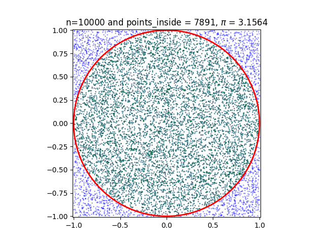
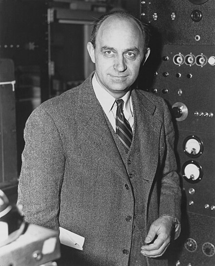
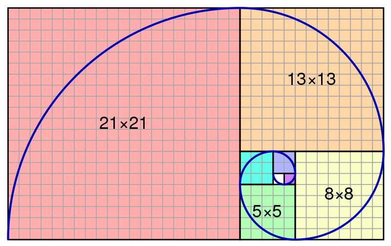
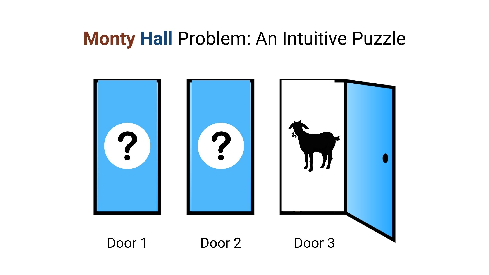

```{r}
#| echo: false
library(plotrix)
```

# Introduction

## 🔁 Review: Lecture 11

::: {.spacer-sm}
:::

👈 Last lecture we had yet another [very math heavy]{.accent} lecture covering:

- Poisson Distributions
- Generalizing R Functions
- Continuous Random Variables
- Continuous Uniform Distribution
- Normal (Gaussian) Distribution

## 👀 Outline: Lecture 12

::: {.spacer-sm}
:::

👇 This lecture we will conclude our study of probability by looking at:

- Simulation
- Harder probability questions
- Monte Carlo methods

:::{.emphasize}
📌 This will be our last R-focused lecture until Lecture 19, but R will still appear in homework and section exercises.
:::

# Simulating Pi

## 🥧 History of Estimating $\pi$

::: {.spacer-sm}
:::

::: {.fragment}

One of the oldest [approximation problems]{.accent} humans have been working on is estimating $\pi$.

::: {.columns}

::: {.column width="50%"}
There is evidence of estimating $\pi$ as far back as:

- Ancient Babylon and Egypt (1700 - 1600 BCE)
- Ancient India (600 BCE)
- Ancient Greece (300 BCE)
- Ancient China (250 CE)
:::

::: {.column width="50%"}
More recently we have estimated $\pi$ using:

- Infinite series and trigonometric identities (middle ages)
- Rapidly converging infinite series (19th & 20th centuries)
- [Supercomputers]{.accent} (modern day)
:::

:::

:::

:::{.fragment}

{.slide-img-center width="400"}

:::

## 🥧 Estimating Pi

::: {.spacer-sm}
:::

::: {.fragment}

### Proposed Methodology

We attempt to [construct our own estimate]{.accent} of $\pi$ using simulation on the unit circle.

:::

:::{.fragment}

### Area of a Circle

Recall from basic trigonometry that the area of a circle is given by:

$$
A = \pi \times r^2.
$$

:::

::: {.fragment}

::: {.spacer-sm}
:::

When considering a unit circle $r=1$, and so

$$
A = \pi.
$$

Hence if we can [approximate the area of a unit circle]{.accent} we approximate $\pi$.

:::

## 🥧 Approximate Unit Circle Area

::: {.spacer-sm}
:::

::: {.fragment}

### Step by Step Approach

To approximate the area of the unit circle our approach is as follows:

1. Draw a unit circle.
2. Enclose the unit circle perfectly in a unit square.
3. Simulate points uniformly in the square.
4. Determine the proportion of points that land within the unit circle.
5. This proportion is an approximation of the area of the circle $\pi$ over the area of the square $4$, and so we compute:

:::

:::{.fragment}

$$
\pi \approx 4 \times \text{Prop}
$$

:::

## ⭕ Draw a Circle

::: {.spacer-sm}
:::

::: {.fragment}

We draw a circle!

```{r}
#| echo: false
#| fig-width: 8
#| fig-height: 5
#| out-height: "80%"
plot(
  NA, type = "n",
  xlim = c(-1.2, 1.2), ylim = c(-1.2, 1.2),
  xlab = "x", ylab = "y",
  main = "A circle", asp = 1
)
draw.circle(0,0,1, border = "blue")
```

:::

## ⬜ Draw a Square

::: {.spacer-sm}
:::

::: {.fragment}

Then perfectly draw a square around our circle:

```{r}
#| echo: false
#| fig-width: 8
#| fig-height: 5
#| out-height: "80%"
plot(
  NA, type = "n",
  xlim = c(-1.2, 1.2), ylim = c(-1.2, 1.2),
  xlab = "x", ylab = "y",
  main = "A circle and a square", asp = 1
)
draw.circle(0,0,1, border = "blue")
rect(-1,-1,1,1, border = "red")
```

:::

## 🎯 Simulate Points

::: {.spacer-sm}
:::

::: {.fragment}

Then simulate a lot of points uniformly within the square:

```{r}
#| echo: false
#| fig-width: 8
#| fig-height: 5
#| out-height: "80%"
plot(
  NA, type = "n",
  xlim = c(-1.2, 1.2), ylim = c(-1.2, 1.2),
  xlab = "x", ylab = "y",
  main = "A circle and a square and lots of point", asp = 1
)
draw.circle(0,0,1, border = "blue")
rect(-1,-1,1,1, border = "red")
set.seed(314159265)
# simulate points
n <- 100
x <- runif(n, min = -1, max = 1)
y <- runif(n, min = -1, max = 1)
count <- 0
# plot points
for(i in 1:n){
  if(sqrt((x[i])^2 + (y[i])^2) <= 1) {
    points(x[i], y[i],col = "orange", pch = 20)
    count <- count + 1
  } else {
    points(x[i], y[i], col = "darkgreen", pch = 20)
  }
}
```

:::

## 🧮 Compute the Proportion

::: {.spacer-sm}
:::

::: {.fragment}

### From $n=100$ points 

Here we have `r count` points within the circle, and so we compute

$$
\pi \approx 4 \times 0.77 = 3.08.
$$

- This is clearly not a very good approximation of $\pi$.
- We have only simulated [100 points]{.accent} and so we have a [high variance]{.accent} in our estimate.

:::

:::{.fragment}

:::{.spacer-sm}
:::

### Increasing accuracy!

⬆️ To increase our accuracy we increase the number of simulations.

:::

::: {.fragment}

::: {.spacer-sm}
:::

Let's up our simulation count from [100]{.accent} points to [100,000]{.accent} points and see what approximation we get.

:::

## 📈 Increasing Accuracy

::: {.spacer-sm}
:::

::: {.fragment}

```{r}
#| echo: false
#| cache: true
#| fig-width: 8
#| fig-height: 5
#| out-height: "80%"
plot(
  NA, type = "n",
  xlim = c(-1.2, 1.2), ylim = c(-1.2, 1.2),
  xlab = "x", ylab = "y",
  main = "A circle and a square and lots of point", asp = 1
)
draw.circle(0,0,1, border = "blue")
rect(-1,-1,1,1, border = "red")
set.seed(314159265)
# simulate points
n <- 100000
x <- runif(n, min = -1, max = 1)
y <- runif(n, min = -1, max = 1)
count <- 0
# plot points
for(i in 1:n){
  if(sqrt((x[i])^2 + (y[i])^2) <= 1) {
    points(x[i], y[i],col = "orange", pch = 20)
    count <- count + 1
  } else {
    points(x[i], y[i], col = "darkgreen", pch = 20)
  }
}
```

Here our approximation is `r count / n * 4`.

:::

## 📊 Convergence to $\pi$

::: {.spacer-sm}
:::

::: {.fragment}

Let's see how our estimate [converges]{.accent} as we increase the number of simulated points $n$.

```{r}
#| echo: false
#| cache: true
#| fig-width: 8
#| fig-height: 5
#| out-height: "80%"
set.seed(314159265)
n_values <- c(100, 500, 1000, 5000, 10000, 50000, 100000)
estimates <- sapply(n_values, function(n) {
  x <- runif(n, min = -1, max = 1)
  y <- runif(n, min = -1, max = 1)
  4 * mean(sqrt(x^2 + y^2) <= 1)
})
plot(
  n_values, estimates, type = "b", pch = 20, col = "orange",
  log = "x", xlab = "Number of simulated points (n)", ylab = "Estimate of pi",
  main = "Monte Carlo Estimate of Pi vs. n"
)
abline(h = pi, col = "red", lty = 2)
legend(
  "topright",
  legend = c("Estimate", expression(paste("True ", pi))),
  col = c("orange", "red"), lty = c(1, 2), pch = c(20, NA)
)
```

:::

::: {.fragment}

::: {.spacer-sm}
:::

:::{.emphasize}
📌 As $n$ grows, the estimate [settles down]{.accent} around the true value $\pi \approx 3.14159$ — the same [long-run averaging]{.accent} behaviour we saw earlier with expectation.
:::

:::

# Monte Carlo Methods

## 🎲 Monte Carlo Methods

::: {.spacer-sm}
:::

::: {.fragment}

::: {.columns}

::: {.column width="50%"}

### What are Monte Carlo Methods?

[Monte Carlo (MC) methods]{.accent} are a study of these types of problems:

- Consider a deterministic but hard to measure value (such as $\pi$).
- Assume we have access to [controlled random sampling]{.accent} (e.g. `runif()`).
- We can approximate the deterministic value from a large number of samples.
:::

::: {.column width="50%"}
{.slide-img-center width="250"}
:::

:::

:::

::: {.fragment}

::: {.spacer-sm}
:::

### Still essential today

- [Finance]{.accent} — pricing options and simulating portfolio risk under uncertain market conditions.
- [Physics & engineering]{.accent} — modelling particle transport, nuclear reactions, complex systems.
- [Machine learning & statistics]{.accent} — approximating intractable integrals in Bayesian inference.
- [Operations research]{.accent} — estimating outcomes for scheduling, logistics, and queuing problems.

:::

## ⏱️ MC Considerations — Computational Cost

::: {.spacer-sm}
:::

::: {.fragment}

[**Consideration 1:**]{.accent} Time and computation effort.

Let's compare how long it takes to simulate 100 versus 1,000,000 random values:

```{r}
#| layout-ncol: 2
t1 <- Sys.time()
rands <- runif(100)
t2 <- Sys.time()
t2 - t1
```

```{r}
#| layout-ncol: 2
t1 <- Sys.time()
rands <- runif(1000000)
t2 <- Sys.time()
t2 - t1
```

:::

::: {.fragment}

::: {.spacer-sm}
:::

- Simulating [more values takes more time]{.accent}, even though each individual draw is essentially instant.
- For [large-scale simulations]{.accent} (millions or billions of trials), this added computation time can become a real bottleneck.
- There is a direct [trade-off between accuracy and runtime]{.accent} — more samples generally means better accuracy, but longer to compute.

:::

## ⏱️ MC Considerations — Error Bounds

::: {.spacer-sm}
:::

::: {.fragment}

[**Consideration 2:**]{.accent} Error bounds.

Let's compare the [absolute error]{.accent} of our $\pi$ estimate using $m=100$ versus $m=100{,}000$ samples:

```{r}
#| layout-ncol: 2
# estimating pi using our previous method
m <- 100; x <- runif(m, -1, 1); y <- runif(m, -1, 1)
distances <- sqrt(x^2 + y^2)
est <- length(which(distances < 1)) * 4 / m
(error <- abs(est - pi))
```

```{r}
#| layout-ncol: 2
m <- 100000; x <- runif(m, -1, 1); y <- runif(m, -1, 1)
distances <- sqrt(x^2 + y^2)
est <- length(which(distances < 1)) * 4 / m
(error <- abs(est - pi))
```

:::

::: {.fragment}

::: {.spacer-sm}
:::

- The error [shrinks]{.accent} as we increase the number of samples $m$.
- However, this reduction in error is [not free]{.accent} — it comes at the cost of extra computation time, as we saw previously.
- In general, MC error [decreases at a rate of]{.accent} roughly $1/\sqrt{m}$, so [quadrupling]{.accent} the sample size only [halves]{.accent} the error.

:::

## ⚖️ Evaluating MC Methods

::: {.spacer-sm}
:::

::: {.fragment}

### Considerations

These considerations are essential in evaluating MC methods.

- How [quickly]{.accent} can we simulate trials?
- What [sort of error]{.accent} do we have?
- How [fast does the approach converge]{.accent}?

:::

::: {.fragment}

::: {.spacer-sm}
:::

### Ideal Situation

A method that is [easy to do]{.accent} (fast sampling), with [predictable error rates]{.accent} that [rapidly converges]{.accent} to the true value.

- This [usually doesn't exist]{.accent}!
- Generally need to make a [trade off]{.accent} between speed and accuracy.

:::

# Buffon's Needle

## 🪡 Buffon's Needle

::: {.spacer-sm}
:::

::: {.fragment}

[Buffon's needle]{.accent} is a famous thought problem from the 1700s:

- Suppose we have a floor made out of wooden planks evenly spaced some distance `d` apart.
- If we drop a needle of length 1 onto the floor, what is the [probability that it crosses between two planks]{.accent}?

:::

::: {.fragment}

::: {.spacer-sm}
:::

[{.slide-img-center width="500"}](https://www.wolframcloud.com/env/40940839-5a56-4a2b-b0a1-0ce77d701c6a)

:::

## 🪡 Buffon's Needle — Simplest Case

::: {.spacer-sm}
:::

::: {.fragment}

Interestingly, the probability $p$ has a closed form expression which we can rearrange to estimate $\pi$:

$$
p = \frac{2}{\pi}\times \frac{1}{d} \implies \pi = \frac{2}{p} \times \frac{1}{d}.
$$

:::

::: {.fragment}

::: {.spacer-sm}
:::

We will [simulate the simplest case]{.accent}:

- Board distance $d = \text{needle length} = 1$
- Needle angle $= \theta$
- Distance from needle center to nearest plank $=D$
- Needle intersects lines when $D > 0.5 \times \sin(\theta)$.

:::

::: {.fragment}

::: {.spacer-sm}
:::

[{.slide-img-center width="400"}](https://mste.illinois.edu/activity/buffon/)

:::

## 🪡 Buffon's Needle Diagram

::: {.spacer-sm}
:::

::: {.fragment}

[{.slide-img-center width="500"}](https://mste.illinois.edu/activity/buffon/)

:::

## 🪡 Buffon's Needle Simulation

::: {.spacer-sm}
:::

::: {.fragment}

We conduct the following simulation:

```{r}
m <- 1000

D <- runif(m, 0, 0.5) # randomly place needle centers
theta <- runif(m, 0, pi) # randomly select angles
p <- sum(D < 0.5*sin(theta))/m # number with D < 0.5*sin(θ)
```

:::

::: {.fragment}

::: {.spacer-sm}
:::

- `D <- runif(m, 0, 0.5)` simulates the [distance from the needle's center to the nearest plank]{.accent}, uniform between $0$ and $0.5$.
- `theta <- runif(m, 0, pi)` simulates the [angle]{.accent} of the needle, uniform between $0$ and $\pi$.
- `p <- sum(D < 0.5*sin(theta))/m` computes the [proportion of needles that cross a plank]{.accent} — our estimate of $p$.

:::

::: {.fragment}

::: {.spacer-sm}
:::

We obtain the following estimate for $\pi$.

```{r}
#| output-location: column
(pi_est <- 2/p)
```

:::

## 🪡 Buffon's Needle — Increasing Accuracy

::: {.spacer-sm}
:::

::: {.fragment}

We can [increase our accuracy]{.accent} by increasing our simulation count.

```{r}
#| cache: true
m <- 1000000

D <- runif(m, 0, 0.5) # randomly place needle centers
theta <- runif(m, 0, pi) # randomly select angles
p <- sum(D < 0.5*sin(theta))/m # number with D < 0.5*sin(θ)
```

:::

::: {.fragment}

::: {.spacer-sm}
:::

We obtain the following new estimate for $\pi$.

```{r}
#| output-location: column
(pi_est <- 2/p)
```

:::

::: {.fragment}

::: {.spacer-sm}
:::

- Increasing $m$ from [1,000]{.accent} to [1,000,000]{.accent} gives us a much [closer approximation]{.accent} to the true value of $\pi$.
- This mirrors exactly what we saw with our [circle-and-square approach]{.accent} earlier — more samples means lower error, at the cost of additional computation.
- Buffon's needle is a nice illustration that MC estimation [isn't limited to one setup]{.accent} — many different random experiments can be engineered to approximate the same constant.

:::

# Euler's Number

## 🔢 Euler's Number

::: {.spacer-sm}
:::

::: {.fragment}

Another interesting mathematical constant is [Euler's number]{.accent} $e$.

```{r}
#| output-location: column
exp(1)
```

:::

::: {.fragment}

::: {.spacer-sm}
:::

We have worked with $e$ every time we have used the `exp()` function, which is defined as:

$$
\exp(x) = e^x
$$

i.e. raising $e$ to the power of the input of the function.

- It is therefore the [base of the natural logarithm]{.accent} $\ln$.
- It also appears in a [large number]{.accent} of the standard distribution functions (e.g. Poisson, Exponential, Normal, Gamma).

:::

## 💪 Exercise — Lex Fridman Problem

::: {.spacer-sm}
:::

```{r}
#| echo: false
library(countdown)
countdown(minutes = 5)
```

Consider how we might estimate $e$ with Monte Carlo simulation.

{.slide-img-center width="450"}

Write and replicate a function that:

::: {.nonincremental}
1. Selects numbers with `runif()` until the sum is $>1$;
2. Determines how many selections it takes; and
3. Repeats `m=10000` times to approximate $e$.
:::

## ✅ Solution — Lex Fridman Problem

::: {.spacer-sm}
:::

::: {.fragment}

```{r}
#| output-location: column-fragment
above_one <- function() {
  i <- 0
  count <- 0

  while (i < 1) {
    i <- i + runif(1, 0, 1)
    count <- count + 1
  }
  return(count)
}

m <- 10000
mean(replicate(m, above_one()))
```

:::

::: {.fragment}

::: {.spacer-sm}
:::

- `above_one()` keeps [drawing uniform random numbers]{.accent} and adding them to a running total `i`, counting how many draws it takes until that total exceeds $1$.
- `count` is therefore the [number of draws needed]{.accent} for a single trial's running sum to pass $1$.
- `mean(replicate(m, above_one()))` repeats this trial `m=10000` times and [averages the counts]{.accent}, giving our Monte Carlo estimate of $e$.

:::

# Golden Ratio

## 🌀 Golden Ratio

::: {.spacer-sm}
:::

::: {.fragment}

The [golden ratio]{.accent} $\phi$ is another important mathematical constant, which is defined as

$$
\phi = \frac{a}{b}\quad s.t.\quad \frac{a+b}{a} = \frac{a}{b}.
$$

We have encountered $\phi$ previously when working with the [Fibonacci sequence]{.accent}.

{.slide-img-center width="500"}

:::

## 🌀 Golden Ratio MC Estimation

::: {.spacer-sm}
:::

::: {.fragment}

We [estimate the golden ratio]{.accent} as follows:

::: {.nonincremental}
1. Generate pairs of numbers $a,b$ such that $a>b$ at random;
2. Compute $U = (a+b)/a$ and $L=a/b$ for each pair;
3. Compute the ratio of $U/L$; and
4. Return the $a,b$ values giving $U/L$ closest to 1.
:::

:::

::: {.fragment}

::: {.spacer-sm}
:::

:::{.emphasize}
📌 This approach requires [many trials]{.accent}.
:::

:::

::: {.fragment}

::: {.spacer-sm}
:::

```{r}
golden <- function() {
  a <- runif(1, 0, 1)
  b <- runif(1, 0, a)
  U <- (a + b) / a
  L <- a / b
  ratio <- U / L
  return(c(ratio, a, b))
}
vals <- replicate(10000, golden())
estimates <- which.min(abs(vals[1,] - 1))
(phi <- vals[,estimates][2]/vals[,estimates][3])
```

:::

::: {.fragment}

::: {.spacer-sm}
:::

:::{.emphasize}
📌 Recall that the actual value is: 1.61803...
:::

:::

## 🌀 Golden Ratio Convergence

::: {.spacer-sm}
:::

::: {.fragment}

Let's see how our estimate [converges]{.accent} as we increase the number of trials $m$.

```{r}
#| echo: false
#| cache: true
#| fig-width: 8
#| fig-height: 5
#| out-height: "80%"
set.seed(24)
m_values <- c(10, 50, 100, 500, 1000, 5000, 10000)
golden <- function() {
  a <- runif(1, 0, 1)
  b <- runif(1, 0, a)
  U <- (a + b) / a
  L <- a / b
  ratio <- U / L
  return(c(ratio, a, b))
}
phi_estimates <- sapply(m_values, function(m) {
  vals <- replicate(m, golden())
  best <- which.min(abs(vals[1,] - 1))
  vals[,best][2] / vals[,best][3]
})
plot(
  m_values, phi_estimates, type = "b", pch = 20, col = "orange",
  log = "x", xlab = "Number of trials (m)", ylab = "Estimate of phi",
  main = "Monte Carlo Estimate of the Golden Ratio vs. m"
)
abline(h = (1 + sqrt(5)) / 2, col = "red", lty = 2)
legend(
  "topright",
  legend = c("Estimate", expression(paste("True ", phi))),
  col = c("orange", "red"), lty = c(1, 2), pch = c(20, NA)
)
```

:::

::: {.fragment}

::: {.spacer-sm}
:::

:::{.emphasize}
📌 As $m$ grows, the estimate [settles down]{.accent} around the true value $\phi \approx 1.61803$.
:::

:::

# Monte Carlo Integration

## ∫ Monte Carlo Integration

::: {.spacer-sm}
:::

::: {.fragment}

### We can approximate integrals

We compute the following [integral via simulation]{.accent}

$$
\int_0^5 x^3 dx.
$$

Granted this is not a very interesting integral, but at least it is quite simple.

:::

::: {.fragment}

::: {.spacer-sm}
:::

[**Idea:**]{.accent} Express the integral as the [expectation of a random variable]{.accent}, say $X\sim\mathcal{U}(0,5)$ with PDF

$$
f_X(x) = \frac 15\quad \text{for}\quad 0<x<5.
$$

:::

## ∫ Rewrite the Integral

::: {.spacer-sm}
:::

::: {.fragment}

We can rewrite the integral as follows:

$$
\begin{aligned}
\int_0^5 x^3 dx & = \int_0^5 5x^3 \times 1/5 ~dx \\
& = \int_0^5 5x^3 f_X(x)~dx \\
& = \mathbb{E}[5X^3].
\end{aligned}
$$

Where $X\sim\mathcal{U}(0,5)$. The problem reduces to:

- Simulating many $\mathcal{U}(0,5)$ random variables;
- Cubing all simulations and multiplying them by 5;
- Taking the mean to estimate the integral.

:::

## ∫ Approximate the Integral

::: {.spacer-sm}
:::

::: {.fragment}

### Integrating by MC

```{r}
#| output-location: column
set.seed(24)
m <- 10000
sims <- runif(m, 0, 5)
mean(5 * sims^3)
```

:::

::: {.fragment}

::: {.spacer-sm}
:::

Computing the [actual value analytically]{.accent} we have:

$$
\int_0^5 x^3dx = \left[\frac{x^4}{4}\right]_0^5=\frac{5^4}{4} = 156.25.
$$

:::

::: {.fragment}

::: {.spacer-sm}
:::

- Here we could easily compute the integral [analytically]{.accent}, so simulation wasn't strictly necessary.
- This approach becomes [genuinely useful]{.accent} when the integral is [not tractable]{.accent} — e.g. it has no closed form, or is too high-dimensional to solve by hand.
- MC integration only requires that we can [simulate from]{.accent} and [evaluate]{.accent} the function — no calculus required!

:::

# The Monty Hall Problem

## 🚪 The Monty Hall Problem

::: {.spacer-sm}
:::

::: {.fragment}

The [Monty Hall problem]{.accent} is another famous probability puzzle with the following setup:

- You are a contestant on a game show;
- You are shown [three doors]{.accent}: a [new car]{.accent} is behind one door and a [goat]{.accent} is behind each of the others;
- You [select a door at random]{.accent} and have the chance to keep whatever is behind the door;
- After choosing a door, the show host opens one of the two remaining doors to show a goat, at which point they ask you whether you would like to [change your guess]{.accent}.

:::

::: {.fragment}

::: {.spacer-sm}
:::

:::{.emphasize}
📌 [**Question:**]{.accent} Should you change your guess?
:::

:::

:::{.fragment}

{.slide-img-center width="350"}

:::

## 🚪 The Monty Hall Solution

::: {.spacer-sm}
:::

::: {.fragment}

[**Solution:**]{.accent} It is [**always**]{.accent} better to switch doors!

:::

::: {.fragment}

::: {.spacer-sm}
:::

Computing the odds of winning using [conditional probability]{.accent} we find that:

::: {.nonincremental}
- your odds of winning if you choose to stay are $1/3$; whilst
- your odds of winning if you choose to change are $2/3$.
:::

This seems [counter intuitive]{.accent}! Surely it is just 50/50, i.e. $1/2$ for both — there are two doors and 1 is the winner?

:::

## 🚪 Monty Hall Simulation

::: {.spacer-sm}
:::

::: {.fragment}

```{r}
monty_hall_game <- function(strategy) {
  prize_door <- sample(1:3, 1) # set door with car
  player_choice <- sample(1:3, 1) # set player choice
  remaining_doors <- setdiff(1:3, c(prize_door, player_choice))
  if (length(remaining_doors) == 1) { revealed_door <- remaining_doors}
  else { revealed_door <- sample(remaining_doors, 1)} # open door
  if (strategy == "stay") { # stay put
    final_choice <- player_choice
  } else { # switch doors
    options <- setdiff(1:3, c(revealed_door, player_choice))
    if (length(options) == 1) {
      final_choice <- options
    } else {
      final_choice <- sample(options, 1)
    }
  }
  win <- final_choice == prize_door; return(win)
}
```

:::

::: {.fragment}

::: {.spacer-sm}
:::

- `monty_hall_game()` plays [one round]{.accent} of the game for a given `strategy` (`"stay"` or `"switch"`) and returns whether the player [won]{.accent}.
- It [randomly places]{.accent} the prize and the player's initial choice, then has the host [reveal a goat door]{.accent} from whatever remains.
- Depending on the `strategy`, the player's [final choice]{.accent} is either their original pick or the one remaining unopened door.
- We'll break this function down [line by line]{.accent} on the next slide.

:::

## 🚪 Monty Hall Simulation Breakdown

::: {.spacer-sm}
:::

::: {.fragment}

We initially [set the door with the prize]{.accent}, selected door and remaining door.

```{r}
#| eval: false
monty_hall_game <- function(strategy) {
  prize_door <- sample(1:3, 1)
  player_choice <- sample(1:3, 1)
  remaining_doors <- setdiff(1:3, c(prize_door, player_choice))
```

:::

::: {.fragment}

::: {.spacer-sm}
:::

We then [simulate the host picking a door]{.accent}.

```{r}
#| eval: false
  if (length(remaining_doors) == 1) {
    revealed_door <- remaining_doors
  } else {
    revealed_door <- sample(remaining_doors, 1) # open door
  }
```

:::

::: {.fragment}

::: {.spacer-sm}
:::

We then [decide whether to switch or stick]{.accent} with the current door.

```{r}
#| eval: false
  if (strategy == "stay") {
    final_choice <- player_choice
  } else {
    options <- setdiff(1:3, c(revealed_door, player_choice))
    if (length(options) == 1) {
      final_choice <- options
    } else {
      final_choice <- sample(options, 1)
  }
```

:::

::: {.fragment}

::: {.spacer-sm}
:::

```{r}
#| eval: false
  win <- final_choice == prize_door

  return(win)
```

:::

## 🚪 Testing the Claim

::: {.spacer-sm}
:::

::: {.fragment}

Let's use our simulation to [test the claim]{.accent} that switching is better, by playing many games under each strategy.

```{r}
#| output-location: column
set.seed(24)
m <- 10000
mean(replicate(m, monty_hall_game("stay")))
mean(replicate(m, monty_hall_game("switch")))
```

:::

::: {.fragment}

::: {.spacer-sm}
:::

- Staying wins about [1/3]{.accent} of the time, and switching wins about [2/3]{.accent} of the time — exactly matching our [theoretical solution]{.accent}.
- This is a great example of using [simulation to sanity-check]{.accent} a counter-intuitive probability result, without needing to trust the maths alone.
- The larger we make `m`, the [closer]{.accent} these simulated win rates get to the true $1/3$ and $2/3$ probabilities.
- This same [general strategy]{.accent} — write a function for one trial, replicate it many times, and average the results — is exactly how we approached [every Monte Carlo problem]{.accent} in this lecture.

:::

# Summary

## ✅ Topics Covered

::: {.spacer-sm}
:::

::: {.fragment}

::: {.spacer-sm}
:::

🤔 We have now looked through several examples of more complex simulation, including simulating:

- Pi
- Buffon's Needle
- Euler's Number
- Golden Ratio
- Integrals
- Monty Hall Problem

:::

:::{.fragment}

:::{.emphasize}
📌 That's all we need for probability in PSTAT 10!
:::

:::

## 📅 Next Class

::: {.spacer-sm}
:::

::: {.fragment}

::: {.spacer-sm}
:::

🤩 Next class we will be moving away from RStudio and will instead be focusing on:

- Databases; and
- Introduction to SQL.

:::
