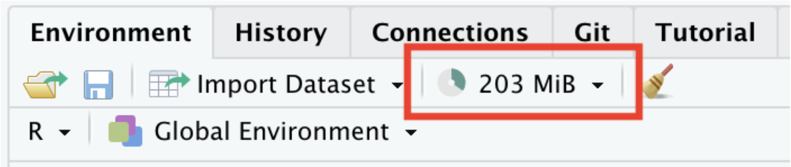
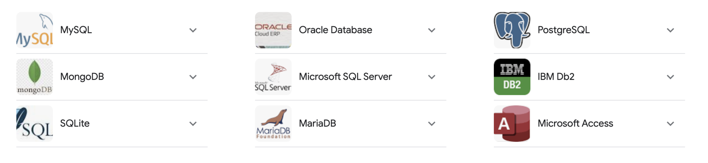

# Introduction

## 🔁 Review: Lectures 9 – 12

::: {.spacer-sm}
:::

🤔 This week we will move away from the language `R` and instead focus on `SQL`.

- The following lectures will (explicitly) use [minimal R]{.accent}.
- It is still important to be comfortable with topics such as simulation, random variables and Monte Carlo methods.

:::{.spacer-sm}
:::

:::{.fragment}

:::{.emphasize}
📌 The bulk of the [final exam]{.accent} will focus on the language R. Assignment 5 and the last labs will also use R.
:::

:::

## 👀 Outline: Lecture 13

::: {.spacer-sm}
:::

👇 In today's lecture we will introduce ourselves to larger, more complex [database structures]{.accent}. We aim to answer the questions:

- What is a [database]{.accent}?
- What is a [relational database]{.accent}?
- What is a [database management system (DBMS)]{.accent}?

:::{.fragment}

Furthermore we will cover the [relational model]{.accent}, both the:

- [Structural]{.accent} portion; and
- [Integrity]{.accent} portion

:::

# Databases

## 🗄️ What is a Database?

::: {.spacer-sm}
:::

::: {.fragment}

::: definition
A [database]{.accent} is an [organized collection of structured information]{.accent}, or [data]{.accent}, typically stored electronically in a computer system.
:::

::: {.columns}

::: {.column width="50%"}
- Medical records
- Bank accounts
- Credit histories
- Historical security prices
- Census data
:::

::: {.column width="50%"}
- Airline schedules and bookings
- Bus and train timetables
- Student records
- Customer purchasing histories
- Medical trial data
:::

:::

:::

::: {.fragment}

::: {.spacer-sm}
:::

:::{.emphasize}
📌 Essentially anything can be stored as a set of [related data values]{.accent}.
:::

:::

## 🗄️ Why Do We Use Databases?

::: {.spacer-sm}
:::

::: {.fragment}

We have to when datasets get [incredibly large]{.accent}.

For example, a standard Excel document can store roughly:

- 1 million rows
- 16000 columns

:::

:::{.fragment}

Most Excel documents however are much smaller, around 0.5MB to 1MB.

:::

::: {.fragment}

::: {.spacer-sm}
:::

:::{.emphasize}

What happens if we are dealing with a [very large]{.accent} dataset?

:::

:::


## 🗄️ Example — Why Do We Use Databases?

::: {.spacer-sm}
:::

::: {.fragment}

Consider the `nycflights13` data from previous weeks.

```{r}
#| echo: true
#| output-location: column
library(nycflights13)
format(object.size(nycflights13::flights), units ="Mb")
```

:::

::: {.fragment}

::: {.spacer-sm}
:::

This is still a [fairly small dataset]{.accent}. Really large datasets can be many (GB) or even (TB).

For example:

- High-frequency securities data
- Medical trials data
- Advertising data

:::

## 💾 Memory Usage

::: {.spacer-sm}
:::

::: {.fragment}

If we import a [large dataset]{.accent} into R, then we are storing that data in our computer's [memory]{.accent}.

In our [environment tab]{.accent} in RStudio we can see a read-out of the amount of memory we are currently using.

{.slide-img-center width="500"}

:::

::: {.fragment}

::: {.spacer-sm}
:::

:::{.emphasize}
📌 RStudio can only use so much memory before computer performance [declines rapidly]{.accent} with high memory usage.
:::

:::

## 💪 Exercise — Available Memory

::: {.spacer-sm}
:::

```{r}
#| echo: false
library(countdown)
countdown(minutes = 3)
```

::: {.nonincremental}
1. Determine how much [random access memory (RAM)]{.accent} your computer has.
   - For Macs go to `Apple -> About This Mac -> Memory`
   - For Windows go to `Task Manager -> Performance -> Memory`
2. Determine how much memory `R` has available.
   - Explore `?gc`.
   - Run `gc()` (results will vary!)
:::

## ✅ Solution — Available Memory

::: {.spacer-sm}
:::

::: {.fragment}

My Mac has [1TB of storage]{.accent} and [16GB of RAM]{.accent} (which is starting to lag behind 2026 laptops now).

```{r gc-function}
#| echo: true
gc()
```

:::

::: {.fragment}

::: {.spacer-sm}
:::

- The [`used`]{.accent} columns report the memory `R` is [currently occupying]{.accent}.
- The [`max used`]{.accent} columns report the [peak]{.accent} usage so far this session.
- Values are shown for both [`Ncells`]{.accent} (objects) and [`Vcells`]{.accent} (vectors/data).

:::

## 📦 Too Much Data

::: {.spacer-sm}
:::

::: {.fragment}

The table below details several databases that are [too large]{.accent} to load into R.

| File Number | File Name | Size |
|:---:|:---|:---:|
| 1 | Diabetic Retinopathy Detection | 82.2 GiB |
| 2 | American Epilepsy Society Seizure Prediction Challenge | 59.6 GiB |
| 3 | Avito Duplicate Ads Detection | 48.4 GiB |
| 4 | Microsoft Malware Classification Challenge (BIG 2015) | 35.3 GiB |
| 5 | GE Flight Question | 34.4 GiB |

: Large Data File Examples

:::

## 🗄️ Dealing with Big Data

::: {.spacer-sm}
:::

::: {.fragment}

Our approach:

- [Store]{.accent} the data on an [external disk]{.accent}
- Open a [connection]{.accent} to the data
- Load [portions]{.accent} of the data into local memory as needed
- The dataset stored on this disk is a [database]{.accent}

:::

::: {.fragment}

::: {.spacer-sm}
:::

:::{.emphasize}
📌 We only ever hold [what we need]{.accent} in memory — the [connection]{.accent} lets us query a [database]{.accent} far larger than our RAM.
:::

:::

## 📖 Formal Definitions

::: {.spacer-sm}
:::

::: {.fragment}

We defined a database earlier as an [organized collection of structured information]{.accent}, or data, typically stored electronically in a computer system.

Our databases will satisfy the following [two traits]{.accent}:

1. They will be [machine-updatable]{.accent} (i.e. a collection of variables).
2. They will be [logically coherent]{.accent} (i.e. they will have some understandable organizational structure).

:::

## 🖥️ Database Management Systems (DBMS)

::: {.spacer-sm}
:::

::: {.fragment}

We [manage]{.accent} databases through [Database Management Systems (DBMS)]{.accent}.

:::

::: {.fragment}

::: {.spacer-sm}
:::

There are [four]{.accent} main types:

- [Hierarchical]{.accent}
- [Network Model]{.accent}
- [Relational Model]{.accent}
- [Object-Oriented Model]{.accent}

:::

::: {.fragment}

::: {.spacer-sm}
:::

Broadly, we can classify DBMS into:

1. [Relational]{.accent} Database Management Systems (RDBMS); and
2. [Non-Relational]{.accent} Database Management Systems (NoSQL).

:::

## 🖥️ Databases in PSTAT 10

::: {.spacer-sm}
:::

::: {.fragment}

In PSTAT 10 we will specifically work with [Relational Databases]{.accent}.

- The most common databases used in industrial settings.
- Easy to interface with using [structured query language (SQL)]{.accent}.
- Secure and very flexible design.
- Easy to maintain, been in use for over 50 years.

:::

:::{.fragment}

{.slide-img-center width="800"}

:::

# Relational Database Model

## 🧩 Relational Database Model Parts

::: {.spacer-sm}
:::

::: {.fragment}

We divide the [relational database model]{.accent} into three parts:

- Data [structure]{.accent}
- Data [integrity]{.accent}
- Data [manipulation]{.accent}

:::

::: {.fragment}

::: {.spacer-sm}
:::

:::{.emphasize}
📌 Today we discuss [data structure]{.accent} and [data integrity]{.accent}.
:::

:::

## 📖 Core Definitions

::: {.spacer-sm}
:::

::: {.fragment}

We will consider the following definitions:

1. [Relation]{.accent}: table of columns and rows ("table")
2. [Attribute]{.accent}: column of a relation
3. [Domain]{.accent}: allowable attribute values
4. [Tuple]{.accent}: row of a relation
5. [Keys]{.accent} (Super, Candidate, Primary, Foreign): identifiers

:::

## 🧩 Relational Databases

::: {.spacer-sm}
:::

::: {.fragment}

::: definition
A [relational database]{.accent} is a collection of [structured data]{.accent} organized into [relations]{.accent}.
:::

For example, see the table below:

| StudentId | FirstName | Course# |
|:---:|:---:|:---:|
| S1 | Remy | PSTAT8 |
| S1 | Remy | PSTAT131 |
| S2 | Sam | PSTAT10 |
| S3 | Taylor | PSTAT131 |
| S4 | Jordan | PSTAT174 |

: Relations Example

:::

## 🔎 Interpretation

::: {.spacer-sm}
:::

::: {.fragment}

| StudentId | FirstName | Course# |
|:---:|:---:|:---:|
| S1 | Remy | PSTAT8 |

: First Row

From the first row we see that a student with ID `S1`, named `Remy`, is enrolled in `PSTAT8`.

:::

::: {.fragment}

::: {.spacer-sm}
:::

- What other information can we see?
- What other course is Remy enrolled in?
- Who does Remy share a course with?

:::

## 🧩 Relations

::: {.spacer-sm}
:::

::: {.fragment}

Relations have the following [properties]{.accent}:

- [Order is irrelevant]{.accent};
- Each row (tuple) must be [unique]{.accent};
- Every relation must have a [unique name]{.accent}; and
- Relations can be [updated]{.accent} (tuples added) as desired.

:::


## 🧩 Relation Attributes

::: {.spacer-sm}
:::

::: {.fragment}

| StudentId | FirstName | Course# |
|:---:|:---:|:---:|
| S1 | Remy | PSTAT8 |

: First Row

:::

::: {.fragment}

::: {.spacer-sm}
:::

- The [heading values]{.accent} are all [attributes]{.accent}, i.e. `StudentId`, `FirstName`, `Course#`.
- The [attribute values]{.accent} are in the columns.
- [Rows]{.accent} are called [tuples]{.accent}.
- [Structurally]{.accent} relations are very similar to data frames in R.

:::

## 🌐 Domains and Tuples

::: {.spacer-sm}
:::

::: {.fragment}

::: definition
The [domain]{.accent} of a [relation attribute]{.accent} is the [set of atomic values]{.accent} used to model that attribute's data.
:::

- Every relation attribute is linked to a domain.
- For example, the domain for `Course#` would be `PSTAT5A, PSTAT5LS, PSTAT8, PSTAT10, ...`

:::

::: {.fragment}

::: {.spacer-sm}
:::

- Note that this is the set of all values [a relation attribute can take]{.accent} — the values themselves do not have to be present in the relation.
- The [tuples]{.accent} are all of the non-header rows.

:::

# Keys

## 🔑 Keys

::: {.spacer-sm}
:::

::: {.fragment}

[Keys]{.accent} are (subjectively) the [most important structural component]{.accent} of the relational model.

::: definition
A [key]{.accent} is a set of attributes that [determine the other attributes]{.accent} in each tuple, [establish and identify links]{.accent} between relations, and [set any required constraints]{.accent} on a database.
:::

::: {.slide-img-center}
{width="600"}
:::

:::

## 🔑 Super Keys

::: {.spacer-sm}
:::

::: {.fragment}

| StudentId | FirstName | Course# |
|:---:|:---:|:---:|
| S1 | Remy | PSTAT8 |
| S1 | Remy | PSTAT131 |
| S2 | Sam | PSTAT10 |
| S3 | Taylor | PSTAT131 |
| S4 | Jordan | PSTAT174 |

:::

::: {.fragment}

::: {.spacer-sm}
:::

::: definition
A [super key]{.accent} is a set of attributes [uniquely identifying a tuple]{.accent} in a relation.
:::

:::

## 💪 Exercise — Super Keys

::: {.spacer-sm}
:::

```{r}
#| echo: false
library(countdown)
countdown(minutes = 3)
```

| StudentId | FirstName | Course# |
|:---:|:---:|:---:|
| S1 | Remy | PSTAT8 |
| S1 | Remy | PSTAT131 |
| S2 | Sam | PSTAT10 |
| S3 | Taylor | PSTAT131 |
| S4 | Jordan | PSTAT174 |

Which of the following are [super keys]{.accent}?

::: {.nonincremental}
1. `(StudentId, FirstName, Course#)`
2. `(StudentId, FirstName)`
3. `(StudentId, Course#)`
4. `(StudentId)`
:::

## ✅ Solution — Super Keys

::: {.spacer-sm}
:::

::: {.fragment}

| StudentId | FirstName | Course# |
|:---:|:---:|:---:|
| S1 | Remy | PSTAT8 |
| S1 | Remy | PSTAT131 |
| S2 | Sam | PSTAT10 |
| S3 | Taylor | PSTAT131 |
| S4 | Jordan | PSTAT174 |

The following are both [super keys]{.accent}:

1. `(StudentId, FirstName, Course#)`
2. `(StudentId, Course#)`

:::

::: {.fragment}

::: {.spacer-sm}
:::

- A super key must [uniquely identify]{.accent} every tuple.
- `Remy` (`S1`) appears in [two rows]{.accent}, so `(StudentId)` and `(StudentId, FirstName)` are [not]{.accent} super keys — they cannot tell those rows apart.
- Adding `Course#` [distinguishes]{.accent} the tuples, so any set containing it uniquely identifies a row.

:::

## 🔑 Candidate Keys

::: {.spacer-sm}
:::

::: {.fragment}

| StudentId | FirstName | Course# |
|:---:|:---:|:---:|
| S1 | Remy | PSTAT8 |
| S1 | Remy | PSTAT131 |
| S2 | Sam | PSTAT10 |
| S3 | Taylor | PSTAT131 |
| S4 | Jordan | PSTAT174 |

::: definition
A [candidate key]{.accent} is a unique tuple identifier (super key) with [no redundancy]{.accent}.
:::

Consider the previous example's super keys:

`{StudentId, FirstName, Course#}` & `{StudentId, Course#}`

:::

::: {.fragment}

::: {.spacer-sm}
:::

- These two keys encode (effectively) the [same information]{.accent}.
- The `FirstName` attribute is [redundant]{.accent}; both attribute sets point to the same tuple.
- Only `{StudentId, Course#}` is a candidate key.

:::

## 🔑 Primary Keys

::: {.spacer-sm}
:::

::: {.fragment}

::: definition
A [primary key]{.accent} is a set of attributes that [uniquely identifies any tuple in a given relation]{.accent}.
:::

- Each relation has [one primary key]{.accent}, selected from the candidate keys.
- The primary key is [chosen to minimize the number of attributes]{.accent}.
- Primary keys [cannot be duplicated]{.accent}, i.e. the same primary key cannot refer to multiple relations.
- Primary key values cannot be `null`.

:::

::: {.fragment}

::: {.spacer-sm}
:::

:::{.emphasize}
📌 In our previous example `{StudentId, Course#}` was the primary key for `ENROLLMENT`.
:::

:::

## 🔑 Foreign Keys

::: {.spacer-sm}
:::

::: {.fragment}

::: definition
A [foreign key]{.accent} is a set of attributes that [links attributes across relations]{.accent}.
:::

- Specifically: given two relations `R1` and `R2`, the foreign key links attributes from `R1` to those in `R2`.
- This is [not intuitive]{.accent} — we will look at an example.

:::

::: {.fragment}

::: {.spacer-sm}
:::

Before we do though, think about why foreign keys might be [useful]{.accent}?

- When would we want to link relations?
- What sort of structure does a relational DB take?

:::

## 🔑 Example — Foreign Keys

::: {.spacer-sm}
:::

::: {.columns}

::: {.column width="50%"}

::: {.fragment}

| StudentId | FirstName |
|:---:|:---:|
| S1 | Remy |
| S2 | Sam |
| S3 | Taylor |
| S4 | Jordan |

: `STUDENT` Relation

**Primary Key:** `{StudentId}`

:::

:::

::: {.column width="50%"}

::: {.fragment}

| StudentId | GPA |
|:---:|:---:|
| S1 | 3.81 |
| S2 | 3.97 |
| S3 | 3.02 |
| S4 | 2.79 |

: `GPA` Relation

**Primary Key:** `{StudentId, GPA}`

**Foreign Key:** `{StudentId}`

:::

:::

:::

## 🔑 Key Summary

::: {.spacer-sm}
:::

::: {.fragment}

The [structure of keys]{.accent} may remind you of the basics of set theory:

- Super Keys [contain]{.accent} Candidate Keys.
- Candidate Keys [contain]{.accent} Primary Keys.

:::

::: {.fragment}

::: {.spacer-sm}
:::

Written in the language of [set theory]{.accent} we have that:

$$
\{\text{Super Keys}\}\supset \{\text{Candidate Keys}\}\supset \{\text{Primary Keys}\}
$$

Foreign keys [link]{.accent} relations together.

:::

# Data Integrity

## 🔒 Data Integrity

::: {.spacer-sm}
:::

::: {.fragment}

The first portion of this lecture was focused on [data structure]{.accent}, i.e.:

- [Organization]{.accent} of databases; and
- Technical vocabulary.

:::

::: {.fragment}

::: {.spacer-sm}
:::

The next portion focuses on [data integrity]{.accent}:

- The rules all relational databases must obey.
- Requirements to ensure [consistency]{.accent} and [completeness]{.accent}.
- Integrity rules:
  1. [Entity]{.accent}
  2. [Referential]{.accent}

:::

## 🔒 Entity Integrity

::: {.spacer-sm}
:::

::: {.fragment}

::: definition
A relation has [entity integrity]{.accent} when its primary keys are [unique]{.accent} and have [values that are unique]{.accent} and not `NULL` for every attribute (column).
:::

:::

::: {.fragment}

::: {.spacer-sm}
:::

:::{.emphasize}
📌 [Entity integrity]{.accent} ensures we [do not have (potential) duplicate tuples]{.accent} in a relation.
:::

- How would duplicates impact [storage]{.accent}?
- How would they impact [accessing data]{.accent}?
- How would they impact the role of primary keys?

:::

## 🔒 Example — Entity Integrity

::: {.spacer-sm}
:::

::: {.fragment}

| StudentId | FirstName | Course# |
|:---:|:---:|:---:|
| S1 | Remy | PSTAT8 |
| S1 | Remy | PSTAT131 |
| S2 | Sam | PSTAT10 |
| S3 | Taylor | PSTAT131 |
| S4 | Jordan | PSTAT174 |

Primary Key: `{StudentId, Course#}`

:::

::: {.fragment}

::: {.spacer-sm}
:::

Suppose we want to add a new student named `Sam` who is enrolled in `PSTAT174`.

- Could we do this?
- If not, what would we still need?

:::

## 🔗 Integrity Between Relations

::: {.spacer-sm}
:::

::: {.fragment}

We considered two types of keys:

- Super Keys, Candidate Keys, Primary Keys (all referring to a [single relation]{.accent})
- Foreign Keys (linking to [multiple relations]{.accent})

:::

::: {.fragment}

::: {.spacer-sm}
:::

We think of [integrity]{.accent} the same way:

- [Entity integrity]{.accent} dealt with [individual relations]{.accent}.
- [Referential integrity]{.accent} constrains [relations between relations]{.accent}.

:::

## 🔗 Referential Integrity

::: {.spacer-sm}
:::

::: {.fragment}

Foreign keys can take two types of values:

- They can be `NULL`.
- They can correspond to a [specific primary key]{.accent}.

:::

::: {.fragment}

::: {.spacer-sm}
:::

::: definition
[Referential integrity]{.accent} ensures that we never attempt to reference a nonexistent tuple.
:::

- Allows for easy [cross-referencing]{.accent} across relations.
- Prevents calls to nonexistent data.

:::

## 🔗 Example — Referential Integrity

::: {.spacer-sm}
:::

::: {.columns}

::: {.column width="50%"}

::: {.fragment}

| CUST_NO | NAME | Age |
|:---:|:---:|:---:|
| C1 | Alex | 21 |
| C2 | Charlie | 26 |

: `CUSTOMER` Relation

Primary Key: `{CUST_NO}`

:::

:::

::: {.column width="50%"}

::: {.fragment}

| ORDER_NO | DATE | CUST_NO |
|:---:|:---:|:---:|
| 011 | 6/11/23 | C1 |
| 012 | 6/24/23 | null |
| 013 | 7/1/23 | C3 |
| 015 | 7/12/23 | C2 |

: `SALES_ORDER` Relation

Foreign Key: `{CUST_NO}`

:::

:::

:::

## 🔗 Example — Referential Integrity (Note)

::: {.spacer-sm}
:::

::: {.fragment}

Note the third tuple of the `SALES_ORDER` relation:

$$
\{013,~7/1/23,~C_3\}.
$$

In customers, we have `CUST_NO` values:

$$
\{C_1, C_2\}.
$$

:::

::: {.fragment}

::: {.spacer-sm}
:::

:::{.emphasize}
📌 Thus referential integrity is [violated]{.accent} — we reference a primary key value which does not exist.
:::

:::

## 💪 Exercise — Evaluating Integrity

::: {.spacer-sm}
:::

```{r}
#| echo: false
library(countdown)
countdown(minutes = 4)
```

::: {.columns}

::: {.column width="60%"}
| Product | Price ($) | Category | Manufacturer |
|:---|:---:|:---|:---|
| Galaxy S23 | 899 | Phones | Samsung |
| null | 829 | Phones | Apple |
| Macbook Air | 1099 | Laptops | Apple |
| Fire TV | 449 | Televisions | Amazon |

: `ITEMS`
:::

::: {.column width="40%"}
| Product | Order_NO | Cust_ID |
|:---|:---:|:---:|
| Fire TV | 1 | CS1 |
| Galaxy S23 | 2 | CS11 |
| Macbook Pro | 3 | CS11 |

: `ORDERS`
:::

:::

We are given the tables above: `ITEMS` and `ORDERS`, with primary keys `Product` and `Cust_ID`.

::: {.nonincremental}
1. What is the foreign key in `ORDERS`?
2. Is entity integrity violated? If so, how?
3. Is referential integrity violated? If so, how?
:::

## ✅ Solution — Evaluating Integrity

::: {.spacer-sm}
:::

::: {.fragment}

::: {.columns}

::: {.column width="60%"}
| Product | Price ($) | Category | Manufacturer |
|:---:|:---:|:---:|:---:|
| Galaxy S23 | 899 | Phones | Samsung |
| null | 829 | Phones | Apple |
| Macbook Air | 1099 | Laptops | Apple |
| Fire TV | 449 | Televisions | Amazon |

: `ITEMS`
:::

::: {.column width="40%"}
| Product | Order_NO | Cust_ID |
|:---:|:---:|:---:|
| Fire TV | 1 | CS1 |
| Galaxy S23 | 2 | CS11 |
| Macbook Pro | 3 | CS11 |

: `ORDERS`
:::

:::

1. `Product`
2. [Yes]{.accent}; [entity integrity]{.accent} fails — `null` primary key in `ITEMS` → `Product`.
3. [Yes]{.accent}; [referential integrity]{.accent} fails — `Macbook Pro` in `ORDERS` → `Product` has no matching tuple.

:::

# Schema

## 📐 Relation Schema

::: {.spacer-sm}
:::

::: {.fragment}

::: definition
The [relation schema]{.accent} is the [relation name and its attributes]{.accent}.
:::

| StudentId | FirstName | Course# |
|:---:|:---:|:---:|
| S1 | Remy | PSTAT8 |
| S1 | Remy | PSTAT131 |
| S2 | Sam | PSTAT10 |
| S3 | Taylor | PSTAT131 |
| S4 | Jordan | PSTAT174 |

Schema: `Enrollment {StudentId, FirstName, Course#}`

:::

::: {.fragment}

::: {.spacer-sm}
:::

- Conventionally, the primary key would be indicated in some fashion.
- Recall that the primary key here was the pair `{StudentId, Course#}`; this type of key is known as a [composite key]{.accent}.

:::

## 📐 Database Schema

::: {.spacer-sm}
:::

::: {.fragment}

::: definition
The [database schema]{.accent} is the set of all [relation schema]{.accent} in a database.
:::

- New relations can be added at any point.
- New relations must conform to integrity constraints.

:::

::: {.fragment}

::: {.spacer-sm}
:::

For example, the earlier `STUDENT` and `GPA` relations together form a database schema:

$$
\texttt{Student \{StudentId, FirstName\}},\quad \texttt{GPA \{StudentId, GPA\}}.
$$

:::{.emphasize}
📌 The database schema records both the [relations]{.accent} and the [keys]{.accent} that link them.
:::

:::

# Summary

## ✅ Topics Covered

::: {.spacer-sm}
:::

::: {.fragment}

::: {.spacer-sm}
:::

🙌 This lecture we introduced ourselves to databases, specifically:

- The [relational database]{.accent} model
- [Keys]{.accent}
- [Data Integrity]{.accent}; and
- [Schema]{.accent}

:::

## 📅 Next Class

::: {.spacer-sm}
:::

::: {.fragment}

::: {.spacer-sm}
:::

👉 Next class we will discuss [accessing]{.accent} and [modifying]{.accent} databases.

- The database schema will form a core reference tool.
- We will often discuss database schema theoretically.

:::
