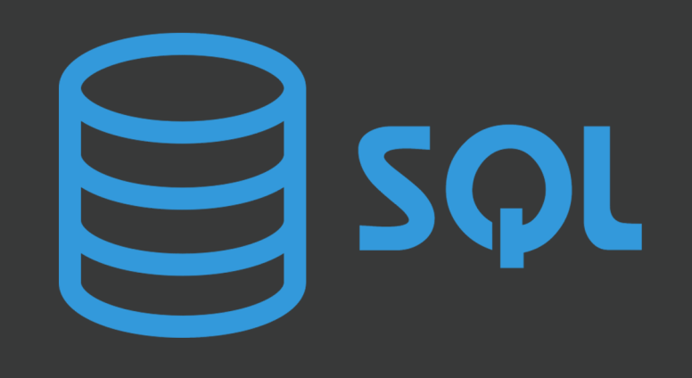
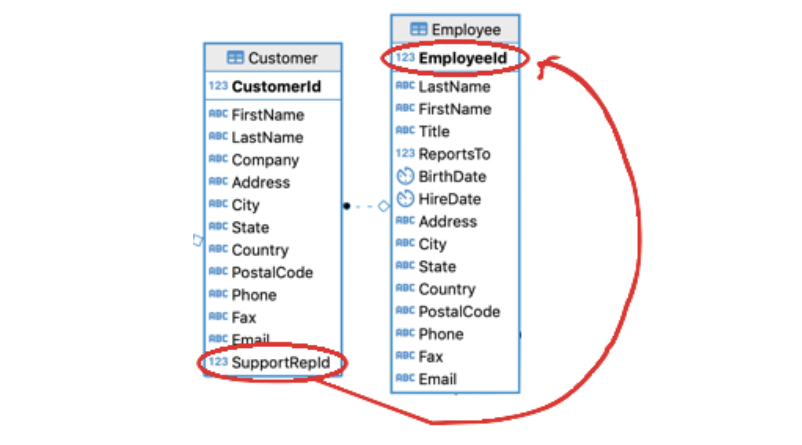
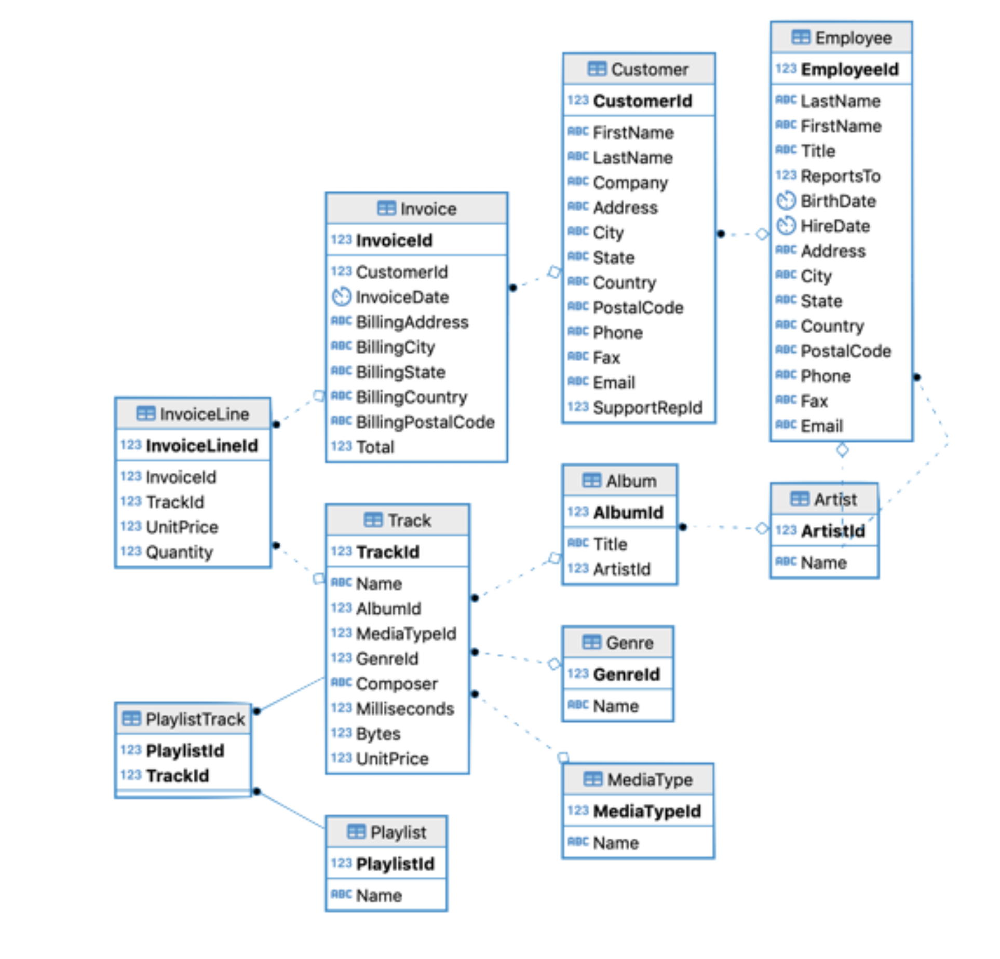

# Introduction

## 🔁 Review: Lecture 13

::: {.spacer-sm}
:::

👈 Last lecture we looked at databases, specifically:

- [Relational Databases]{.accent}
- [Data structure]{.accent}
  - Terminology (relations, tuples, domains, attributes)
  - Super, candidate, primary and foreign keys
- [Data integrity]{.accent}

:::{.fragment}

Also recall the following topics:

- The `tidyverse` library
- The [pipe]{.accent} `|>` operator

:::

## 👀 Outline: Lecture 14

::: {.spacer-sm}
:::

👇 Today we will cover the following material:

- Preliminaries
  - The [relational model]{.accent}
  - [Structured Query Language (SQL)]{.accent}
- Core Pieces
  - [Database engines (SQLite)]{.accent}
  - Interfacing databases in R
  - [SQL Queries]{.accent}

# Data Manipulation

## 🔁 Recap — Relational Model

::: {.spacer-sm}
:::

::: {.fragment}

Last lecture we discussed the [relational model]{.accent}.

- We emphasized [data structure]{.accent} (relations, keys, etc.).
- We discussed [data integrity]{.accent}.
- We did not discuss the third piece: [data manipulation]{.accent}.

:::

::: {.fragment}

::: {.spacer-sm}
:::

Data manipulation is a [slight misnomer]{.accent} — manipulating data could mean many things.

- Defining new database schema
- Searching for data within schema objects
- Controlling use permissions

:::

## 📝 Structured Query Language (SQL)

::: {.spacer-sm}
:::

::: {.fragment}

{.slide-img-center width="300"}

::: definition

[SQL]{.accent} is the most common language used in [storing]{.accent}, [querying]{.accent} and [manipulating]{.accent} structured data.

:::

:::

::: {.fragment}

::: {.spacer-sm}
:::

- [Data Definition Language (DDL)]{.accent} — define database schema
- [Data Manipulation Language (DML)]{.accent} — add, modify or delete data
- [Data Query Language (DQL)]{.accent} — retrieves data

:::

## 📝 DCL & TCL

::: {.spacer-sm}
:::

::: {.fragment}

{.slide-img-center width="300"}

Note that in PSTAT 10 we will not cover:

- [Data Control Language (DCL)]{.accent} — manages [access permissions]{.accent} (e.g. `GRANT`, `REVOKE`).
- [Transaction Control Language (TCL)]{.accent} — manages [transactions]{.accent} (e.g. `COMMIT`, `ROLLBACK`).

:::

::: {.fragment}

::: {.spacer-sm}
:::

:::{.emphasize}
📌 These matter for [multi-user, production databases]{.accent} — beyond our scope, where a single analyst queries a local database.
:::

:::

## ⚙️ Database Engines and SQLite

::: {.spacer-sm}
:::

::: {.fragment}

{.slide-img-center width="350"}

::: definition

The [database engine]{.accent} is the software a DBMS uses to interface with its contents.

:::

- It is not a database itself.
- We will use the `SQLite` database engine.
- `SQLite` is the [most widely used database engine worldwide]{.accent}.
- Phones, computers, televisions, etc. all use `SQLite`.

:::

## 🔌 Databases and R

::: {.spacer-sm}
:::

::: {.fragment}

To [interface with databases]{.accent} using `R` we will use `RSQLite`.

- `RSQLite` embeds `SQLite` in `R`.
- This grants us access to the `SQLite` functionality with an `R` interface.
- We also install some additional helpful database packages.

:::

:::{.fragment}

:::{.spacer-sm}
:::

```{r}
#| eval: false

# Package installation (do not include in documents)
install.packages("RSQLite")
install.packages("DBI") # database interface
install.packages("sqldf") # SQL dataframe
```

:::

## 📦 Database Packages

::: {.spacer-sm}
:::

::: {.fragment}

Load the required packages by running the code below:

```{r}
#| message: false
#| warning: false
library(RSQLite)
library(DBI)
library(sqldf)
```

:::

::: {.spacer-sm}
:::

- `RSQLite` allows us to interface with DBs using SQL code in `R`.
- `DBI` constructs the database interface.
- `sqldf` allows us to manipulate `R` data frames using SQL.

::: {.fragment}

::: {.spacer-sm}
:::

:::{.emphasize}
📌 If you do not have [all three libraries]{.accent} loaded, code appearing later in the lecture will break.
:::

:::

# Tiny Clothes Database

## 💪 Exercise — Loading the Database

::: {.spacer-sm}
:::

```{r}
#| echo: false
library(countdown)
countdown(minutes = 2)
```

Our initial database work in this course uses the `TinyClothesDB`.

- This database contains the orders of a small online clothing store.
- It stores [customer]{.accent}, [product]{.accent} and [sales]{.accent} information.
- Our first step is to establish a connection to the database.

:::{.fragment}

Download the `tc_clean.sqlite` file from Canvas and put it in your [current working directory]{.accent}.

:::

## 🔌 Database Connections

::: {.spacer-sm}
:::

::: {.fragment}

To access the database, we need to [create a connection]{.accent} to the database file. We do so using the `dbConnect()` function:

```{r}
#| eval: false
dbConnect(SQLite(), "path_to_my_db/my_db.sqlite")
```

:::

::: {.fragment}

::: {.spacer-sm}
:::

Since we store our data in a separate `data` folder, our function is:

```{r}
#| eval: false
dbConnect(SQLite(), "data/tc_clean.sqlite")
```

:::


::: {.fragment}

::: {.spacer-sm}
:::

### 🔌 Database Connection Object

We cannot interface with the database using the `<SQLiteConnection>` directly. We must [save it as an object]{.accent}.

```{r}
tc_db <- dbConnect(SQLite(),"data/tc_clean.sqlite")
```

:::

::: {.fragment}

::: {.spacer-sm}
:::

We now have all the pieces we need:

- Our [database connection]{.accent} `tc_db`
- [SQL]{.accent} and [database interfaces]{.accent} (`DBI`, `RSQLite`, `sqldf`)

:::

## 🔍 Exploring Databases

::: {.spacer-sm}
:::

::: {.fragment}

A `dbConnect` object only lets us [interface]{.accent} with the database.

- It tells us [nothing]{.accent} about its structure.
- A useful first step (especially for a small database) is to explore it.

:::

::: {.fragment}

::: {.spacer-sm}
:::

The `dbListTables()` function returns the [relation names]{.accent} in the remote database.

```{r}
#| eval: false
dbListTables(database_connection_object)
```

:::

::: {.fragment}

::: {.spacer-sm}
:::

The `dbListFields()` function returns the [field names]{.accent} of a remote relation.

```{r}
#| eval: false
dbListFields(database_connection_object, "table")
```

:::

## 🔍 Tiny Clothes Database — `dbListTables()`

::: {.spacer-sm}
:::

::: {.fragment}

We apply the `dbListTables()` and `dbListFields()` functions to our `tc_db` connection object.

```{r}
dbListTables(tc_db)
```

:::

::: {.fragment}

::: {.spacer-sm}
:::

We see our database has four tables:

- `Customer`
- `Product`
- `SalesOrder`
- `SalesOrderLine`

:::

## 🔍 Tiny Clothes Database — `dbListFields()`

::: {.spacer-sm}
:::

::: {.fragment}

```{r}
dbListFields(tc_db, "Customer")
```

The attributes of the relation of interest are:

- `CustomerId`
- `Name`
- `Address`

:::

::: {.fragment}

::: {.spacer-sm}
:::

:::{.emphasize}
📌 In general these functions become less useful as database and relation size increases!
:::

:::

## 💪 Exercise — Database Exploration

::: {.spacer-sm}
:::

```{r}
#| echo: false
library(countdown)
countdown(minutes = 3)
```

Use the `dbListFields()` command to determine the attributes of the `Product`, `SalesOrder` and `SalesOrderLine` tables.

- As you go through, think: which attributes could make up [primary keys]{.accent} for each table?
- Which attributes could be [foreign keys]{.accent} linking tables?

## ✅ Solution — Database Exploration

::: {.spacer-sm}
:::

::: {.fragment}

```{r}
#| layout-ncol: 3
dbListFields(tc_db, "Product")
dbListFields(tc_db, "SalesOrder")
dbListFields(tc_db, "SalesOrderLine")
```

:::

::: {.fragment}

::: {.spacer-sm}
:::

Likely [primary keys]{.accent} — the `Id` attribute that uniquely identifies each row:

- `ProductId` for `Product`, `OrderId` for `SalesOrder`, `SalesOrderLineId` for `SalesOrderLine`.

:::

::: {.fragment}

::: {.spacer-sm}
:::

Likely [foreign keys]{.accent} — attributes that point to another table's primary key:

- `SalesOrder` holds a `CustomerId` → links each order to the `Customer` who placed it.
- `SalesOrderLine` holds an `OrderId` and a `ProductId` → links each line to its `SalesOrder` and to the `Product` sold.

:::

## 🔑 Accessing Table Attributes

::: {.spacer-sm}
:::

::: {.fragment}

So far, we have functions to:

- [Identify all database tables]{.accent}
- [Identify header attributes]{.accent} of any table

:::

::: {.fragment}

::: {.spacer-sm}
:::

The next step is actually accessing table data, which will require us to write our first [SQL query]{.accent}:

- Everything we've done so far is just R.
- Both `dbListTables()` and `dbListFields()` are just R functions.

:::

## 📝 SQL Query Structure

::: {.spacer-sm}
:::

::: {.fragment}

Basic [SQL query structure]{.accent} is detailed below:

```{r}
#| eval: false
SELECT attributes
FROM relations
WHERE conditions
```

For example, the following query would return the `ProductId` and `Name` columns from all rows of `Product` where `ProductId > 1`:

```{r}
#| error: true
SELECT ProductId, Name FROM Product WHERE ProductId > 1
```

:::

::: {.fragment}

::: {.spacer-sm}
:::

:::{.emphasize}
📌 [R cannot interpret SQL code directly.]{.accent}
:::

:::

## 📝 Interpreting SQL

::: {.spacer-sm}
:::

::: {.fragment}

```{r}
#| eval: false
dbGetQuery(database_connection_object, SQL_query)
dbExecute(database_connection_object, SQL_query)
```

To work with SQL queries in R, we can use the functions `dbGetQuery()` and `dbExecute()` from the `DBI` library.

:::

::: {.fragment}

::: {.spacer-sm}
:::

- Use `dbGetQuery()` for `SELECT` queries only.
- `dbGetQuery()` returns the query result as an [R dataframe]{.accent}.
- Queries that [alter database tables]{.accent} use `dbExecute()`.

:::

:::{.fragment}

:::{.emphasize}
📌 `dbGetQuery()` may ostensibly work with commands that should use `dbExecute()`, but you can very quickly run into errors and compatibility issues.
:::

:::

## 📝 Example — Running SQL Queries

::: {.spacer-sm}
:::

::: {.fragment}

Let's consider our previous query, which returned the `ProductId` and `Name` columns from all rows of `Product` where `ProductId > 1`.

:::

::: {.fragment}

::: {.spacer-sm}
:::

Using the query as an argument in the `dbGetQuery()` command yields the result of interest.

```{r}
#| output-location: column
dbGetQuery(tc_db,
          "SELECT ProductId, Name
           FROM Product
           WHERE ProductId > 1")
```

:::

## 💪 Exercise — Basic Queries

::: {.spacer-sm}
:::

```{r}
#| echo: false
library(countdown)
countdown(minutes = 5)
```

`SELECT` queries are the bread and butter of SQL! You're going to be writing several of them in the next few assignments, so write two for practice now.

::: {.nonincremental}
1. Write and execute a query to return a dataframe containing the `CustomerId`, `Name` and `Address` values of all customers whose addresses are either `"State"` or `"Ocean"`.
2. Write and execute a query to return the `Date` values of all sales orders where `OrderId` is greater than 5.
:::

## ✅ Solution — Basic Queries

::: {.spacer-sm}
:::

::: {.fragment}

```{r}
#| layout-ncol: 2
dbGetQuery(tc_db,
          "SELECT CustomerId, Name, Address
           FROM Customer
           WHERE Address = 'State' or Address = 'Ocean'")
dbGetQuery(tc_db,
          "SELECT Date
           FROM SalesOrder
           WHERE OrderId > 5")
```

:::

::: {.fragment}

::: {.spacer-sm}
:::

Reading each query as `SELECT` (columns) `FROM` (table) `WHERE` (condition):

- Query 1 selects three columns from `Customer`; the `WHERE` uses [`or`]{.accent} so a row qualifies if `Address` is `'State'` *or* `'Ocean'`.
- Query 2 selects only `Date` from `SalesOrder`; the `WHERE` keeps rows where the [`OrderId > 5`]{.accent} comparison is true.

:::

## 🔄 Improving Queries

::: {.spacer-sm}
:::

::: {.fragment}

Our queries so far have been [very basic]{.accent} — we are working with a very basic database.

Let's see how queries translate to a much more [complex]{.accent} database.

:::

::: {.fragment}

::: {.spacer-sm}
:::

Before connecting to the new database, [close the old connection]{.accent} using the code below.

```{r}
dbDisconnect(tc_db) # no outputs; closes database connection
```

:::

# Chinook Database

## 🎸 Chinook Database

::: {.spacer-sm}
:::

::: {.fragment}

For the remaining exercises we will use the `Chinook` database. This database is a useful training tool for several reasons:

- It is [fairly complex]{.accent}, as it consists of [11 interconnected relations]{.accent}.
- The [structural complexities]{.accent} discussed in previous lectures are on full display.
- The database contains [lots of data]{.accent}; its tables span thousands of tuples.

:::

::: {.fragment}

::: {.spacer-sm}
:::

Download the `Chinook_Sqlite.sqlite` file from Canvas. Put it in your [working directory]{.accent}.

Save it to an object using the code below.

```{r}
chinook_db <- dbConnect(SQLite(), "data/Chinook_Sqlite.sqlite")
```

:::

## 🔍 Exploring Complex Databases

::: {.spacer-sm}
:::

::: {.fragment}

[Exploring tables]{.accent} is usually an appropriate first step.

```{r}
#| output-location: column
dbListTables(chinook_db)
```

:::

::: {.fragment}

::: {.spacer-sm}
:::

Several of these tables are [much larger]{.accent} than those in `tc_db`.

```{r}
#| output-location: column
dbListFields(chinook_db, "Customer")
```

:::

## 📊 More than Dataframes

::: {.spacer-sm}
:::

::: {.fragment}

Running a SQL query through `dbGetQuery()` returns a [dataframe]{.accent}:

```{r}
#| output-location: column
dbGetQuery(
    chinook_db,
    "SELECT CustomerId, FirstName, LastName, Country
    FROM customer
    LIMIT 5"
)
```

:::

::: {.fragment}

::: {.spacer-sm}
:::

:::{.emphasize}
📌 The `LIMIT` argument functions similarly to the second argument of `head()` in R.
:::

:::

## ⚙️ PRAGMA Command

::: {.spacer-sm}
:::

::: {.fragment}

::: definition

The `PRAGMA` command is a [special tool]{.accent} for `SQLite`.

:::

It is an SQL extension specific to SQLite and used to:

1. [Modify the operation]{.accent} of the SQLite library; or
2. Query the SQLite library for [internal (non-table) data]{.accent}.

:::

::: {.fragment}

::: {.spacer-sm}
:::

:::{.emphasize}
📌 Queries with `PRAGMA` can get [quite complex]{.accent}!
:::

We will mainly work with:

- `PRAGMA table_info(table)`
- `PRAGMA foreign_key_list(table)`

:::

## ⚙️ Example — PRAGMA Command

::: {.spacer-sm}
:::

::: {.fragment}

```{r}
#| output-location: fragment
dbGetQuery(chinook_db,
          "PRAGMA table_info(Customer)")
```

:::

:::{.spacer-sm}
:::

::: {.fragment}

```{r}
#| output-location: fragment
dbGetQuery(chinook_db,
          "PRAGMA foreign_key_list(Customer)")
```

:::

::: {.fragment}

::: {.spacer-sm}
:::

:::{.emphasize}
📌 Remember that a [foreign key points to the primary key]{.accent} of another table.
:::

Here `SupportRepId` in `Customer` points to `EmployeeId` in `Employee`.

:::

## 🔑 `foreign_key_list()`

::: {.spacer-sm}
:::

::: {.fragment}

`PRAGMA foreign_key_list(table)` lists every [foreign key]{.accent} defined on a relation.

- Each row is one foreign key on the queried table.
- `from` is the [attribute in this table]{.accent} that acts as the foreign key.
- `table` and `to` name the [relation and attribute]{.accent} it points to.

:::

::: {.fragment}

```{r}
#| output-location: column
dbGetQuery(chinook_db,
          "PRAGMA foreign_key_list(Customer)")
```

{.slide-img-center width="500"}

:::

## 🗄️ Dataframe Structure

::: {.spacer-sm}
:::

:::{.columns}

:::{.column width="50%"}

{.slide-img-center width=90%}

:::

:::{.column width="50%"}

:::{.fragment}

This diagram shows the [same relationships]{.accent} that `foreign_key_list()` reported, but for the [whole database]{.accent} at once.

- Each box is a [relation]{.accent}; each arrow is a [foreign key]{.accent} pointing to another table's primary key.
- The 11 tables are [interconnected]{.accent} — few tables stand alone.
- Reading these links is what lets us [join tables together]{.accent} in later queries.

:::

:::

:::


## 🔒 Data Integrity in Practice

::: {.spacer-sm}
:::

::: {.fragment}

So far we have only worked with `SELECT` (i.e. DQL queries). We can use `INSERT` to [add to a table]{.accent}. This is a [modification]{.accent} to the table, so we use `dbExecute()`.

:::

::: {.fragment}

::: {.spacer-sm}
:::

```{r}
#| layout-ncol: 2
dbExecute(chinook_db,
          "INSERT INTO Customer (CustomerId, FirstName, LastName, Email)
          VALUES (97, 'John', 'Inston', 'johninston@ucsb.edu')")
dbGetQuery(chinook_db,
           "SELECT CustomerId,  FirstName, LastName, Email
           FROM Customer
           WHERE CustomerId = 97")
```

:::

## 🔒 Data Integrity — Table Modification

::: {.spacer-sm}
:::

::: {.fragment}

We must satisfy [entity integrity]{.accent} when modifying tables.

- Recall that primary key values must be [unique]{.accent}.

:::{.spacer-sm}
:::

:::

:::{.fragment}

```{r}
#| error: true
dbExecute(chinook_db,
          "INSERT INTO Customer (CustomerId, FirstName, LastName, Email)
          VALUES (97, 'Blythe', 'King', 'blytheking@pstat.ucsb.edu')")
```

:::

::: {.fragment}

::: {.spacer-sm}
:::

:::{.emphasize}
📌 Note that `SQLite` allows `NULL` primary key values, [violating entity integrity]{.accent}.
:::

```{r}
#| eval: false
dbExecute(chinook_db,
          "INSERT INTO Customer (CustomerId, FirstName, LastName, Email)
          VALUES (NULL, 'Blythe', 'King', 'blytheking@pstat.ucsb.edu')")
```

:::

## 🔗 Referential Integrity in Practice

::: {.spacer-sm}
:::

::: {.fragment}

We must also satisfy [referential integrity]{.accent} when modifying tables.

- Recall that foreign keys must either [point to an existing value]{.accent} or be `NULL`.
- `SupportRepId` is the `Customer` foreign key for `EmployeeId`.
- Referential integrity is [not enforced by default]{.accent}.

:::

::: {.fragment}

::: {.spacer-sm}
:::

```{r}
#| layout-ncol: 2
dbExecute(chinook_db,
          "INSERT INTO Customer (CustomerId, FirstName, LastName, Email, SupportRepId)
          VALUES (92, 'Blythe', 'King', 'blytheking@pstat.ucsb.edu', 16384)")
dbExecute(chinook_db,
          "INSERT INTO Customer (CustomerId, FirstName, LastName, Email, SupportRepId)
          VALUES (90, 'Blythe', 'King', 'blytheking@pstat.ucsb.edu', 16384)")
```

:::

## 🧹 Cleaning Up the Mess

::: {.spacer-sm}
:::

::: {.fragment}

Let's look at what we have added to our database.

```{r}
#| output-location: column
dbGetQuery(
    chinook_db,
    "SELECT CustomerId, FirstName, LastName, Email
    FROM Customer
    WHERE FirstName = 'Blythe' OR LastName = 'Inston'"
)
```

:::

## ⚠️ `DELETE` Syntax

::: {.spacer-sm}
:::

::: {.fragment}

:::{.emphasize}
📌 Be [very careful]{.accent} if you decide to use the `DELETE` syntax, as it does not allow you to undo mistakes and you will have to re-download the database.
:::

In our case we delete the individuals that we added using the following code (you do not need to run this):

```{r}
dbExecute(chinook_db,
  "DELETE FROM Customer
   WHERE FirstName = 'Blythe' OR LastName = 'Inston'")
```

:::

## ✅ Final Checks

::: {.spacer-sm}
:::

::: {.fragment}

We perform a final check to ensure that we have left the database as we started:

```{r}
#| output-location: column
dbGetQuery(
    chinook_db,
    "SELECT CustomerId, FirstName, LastName, Email
    FROM Customer
    WHERE FirstName = 'Blythe' OR LastName = 'Inston'"
)
```

:::

## 📁 Wrapping Up

::: {.spacer-sm}
:::

::: {.fragment}

For the next few lectures, you should be thinking about [organization]{.accent}.

- It is very easy to run into issues with database connections.
- Keep your database connection file somewhere logical.
- Close your connections after use!

:::

:::{.fragment}

:::{.spacer-sm}
:::

```{r}
dbDisconnect(chinook_db)
```

:::

# Summary

## ✅ Topics Covered

::: {.spacer-sm}
:::

::: {.fragment}

🤔 Today we looked at:

- Data Manipulation
- Tiny Clothes Database; and
- Chinook Database

:::

## 📅 Next Class

::: {.spacer-sm}
:::

::: {.fragment}

🤩 Next class we will continue our exploration of databases and SQL with:

- Complex data selection
- SQL functions
- SQL syntax and convention

:::{.emphasize}
📌 Next lecture is code / syntax heavy, similar to early R lectures!
:::

:::
