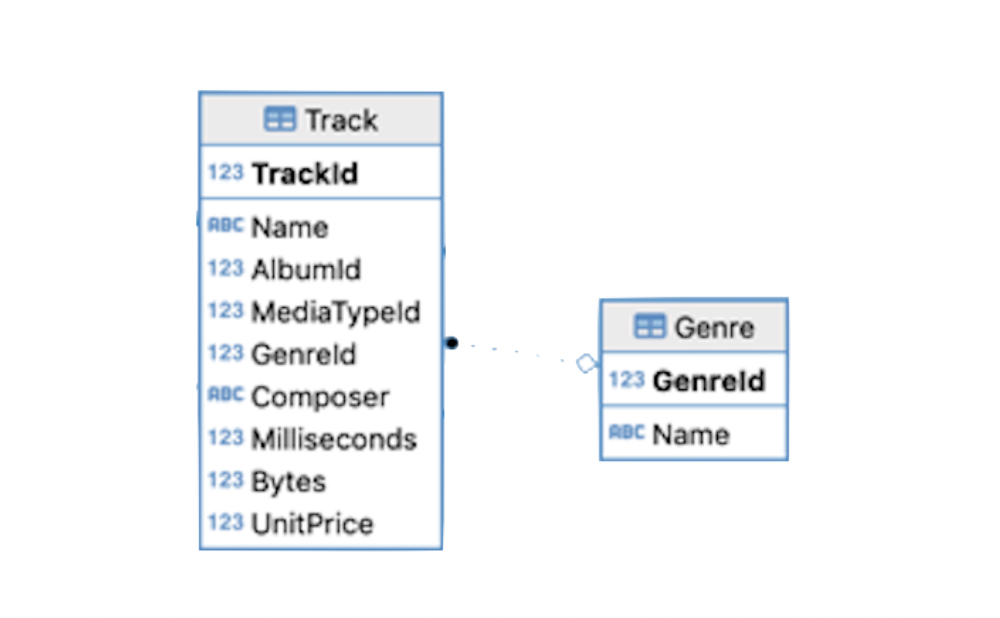
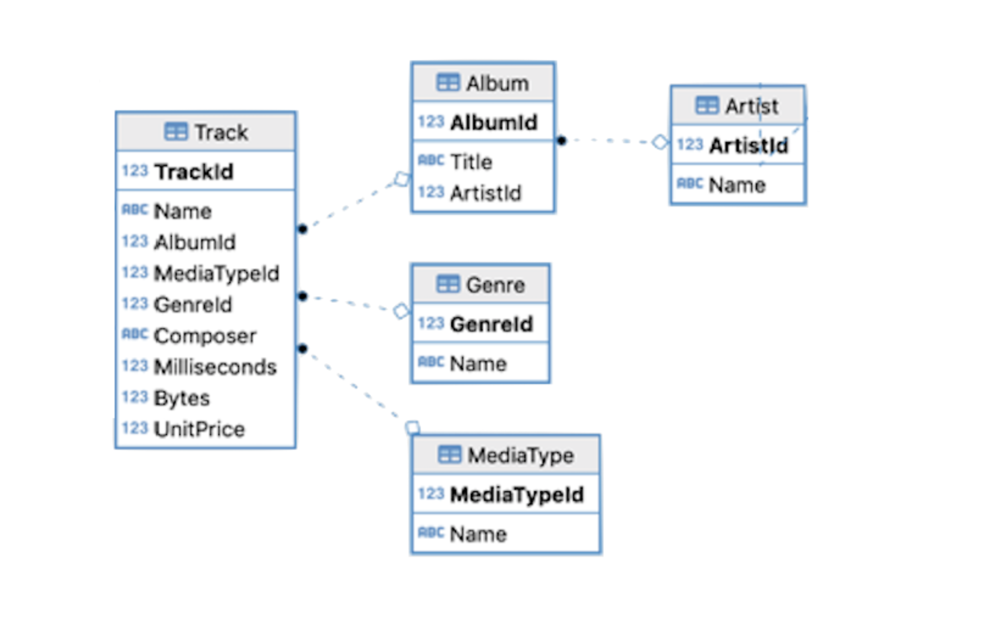
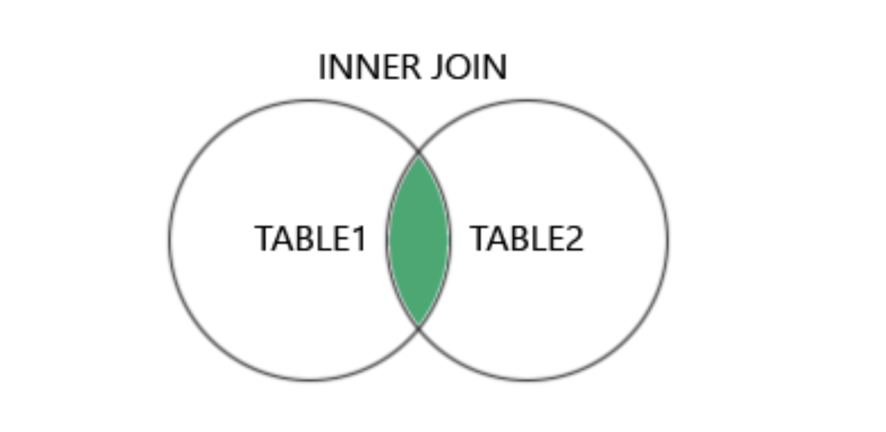
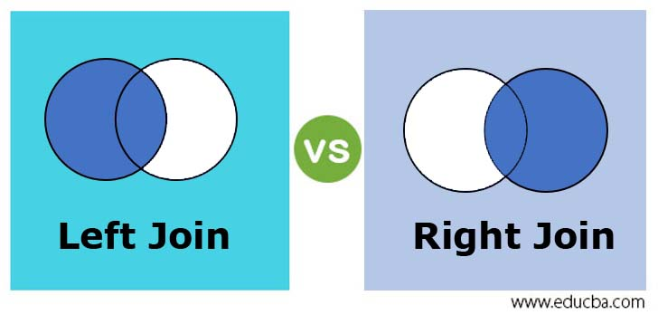
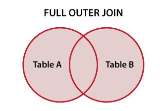

# Introduction

## 🔁 Review: Lecture 15

::: {.spacer-sm}
:::

👈 So far we have looked at:

- Database connections
- `SELECT` queries
- [Aliases]{.accent}
- [Aggregation]{.accent} (`MAX`, `MIN`, `COUNT`)

## 👀 Outline: Lecture 16

::: {.spacer-sm}
:::

👇 Today we will look more closely at:

- [Aggregation]{.accent}
- `COUNT`, `SUM`, `AVERAGE`, etc.
- [Grouping]{.accent}

::: {.fragment}

::: {.spacer-sm}
:::

We will also look at Joins, specifically:

- [Inner joins]{.accent}
- Left, right and full [outer joins]{.accent}

:::

# Connecting

## 🔌 Chinook Database

::: {.spacer-sm}
:::

::: {.fragment}

For this lecture you will need the usual [database connection]{.accent}. Make sure you have it set up now:

```{r}
library(DBI)
library(RSQLite)
library(sqldf)
```

Create an appropriate database object:

```{r}
chinook_db <- dbConnect(
    SQLite(),
    "data/Chinook_Sqlite.sqlite"
)
```

:::

::: {.fragment}

::: {.spacer-sm}
:::

:::{.emphasize}
📌 As usual, if you do not have an appropriate file path pointing to the `.sqlite` file, R will populate an empty database object. If you wish to avoid working with file paths, place the `.sqlite` file in your current working directory.
:::

:::

## 🔍 Advanced Queries

::: {.spacer-sm}
:::

::: {.fragment}

All of our queries in previous lectures had something in common:

- They retrieved information from a [single table]{.accent}!

:::

:::{.fragment}

`SELECT [attributes] FROM [table] WHERE [logicals]`

:::

::: {.fragment}

::: {.spacer-sm}
:::

::: definition
A [simple query]{.accent} retrieves information from a single table.
:::

:::

::: {.fragment}

::: {.spacer-sm}
:::

::: definition
A [complex query]{.accent} searches for information across multiple tables.
:::

:::

:::{.fragment}

:::{.emphasize}
To retrieve information across multiple tables, we will need to use 
[joins]{.accent}.
:::

- But first, we will look at [aggregation]{.accent} and [grouping]{.accent}.

:::

# Aggregation

## ➕ Basic Aggregation Functions — `SUM`

::: {.spacer-sm}
:::

::: {.fragment}

[Aggregation functions]{.accent} collapse many rows into a [single summary value]{.accent}. We have previously worked with `COUNT`, `MIN` and `MAX`.

- `SUM` returns the [total]{.accent} of a numeric column.
- Here we [sum]{.accent} every track length on album 154 (converted to minutes):

:::

:::{.fragment}

```{r}
#| output-location: fragment
chinook_db |>
  dbGetQuery(
    "SELECT SUM(milliseconds)/60000 AS album_length_min
    FROM Track
    WHERE AlbumId = 154"
  )
```

:::

## ➗ Basic Aggregation Functions — `AVG`

::: {.spacer-sm}
:::

::: {.fragment}

We often want to find the [average]{.accent} of a numeric column.

- `AVG` returns the [mean]{.accent} of a numeric column.
- Here we take the [average]{.accent} track length on album 154 (again in minutes):

:::

::: {.fragment}

```{r}
#| output-location: fragment
chinook_db |>
  dbGetQuery(
    "SELECT AVG(milliseconds)/60000 AS avg_minutes
    FROM Track
    WHERE AlbumId = 154"
  )
```

:::

## 🎯 Motivating Aggregation

::: {.spacer-sm}
:::

::: {.fragment}

What if we wanted to find the [average track length for each album]{.accent} with `AlbumId` between 150 and 155?

- We are not looking for the [cumulative average]{.accent}.
- Our desired output looks something like this:

:::

::: {.fragment}

```{r}
#| echo: false
chinook_db |>
  dbGetQuery(
    "SELECT AlbumId, AVG(Milliseconds)/60000 
      AS avg_minutes
    FROM Track
    GROUP BY AlbumId
    LIMIT 5"
  )
```

:::

## 📊 Aggregation

::: {.spacer-sm}
:::

::: {.fragment}

### Not quite right...

Directly using [logicals]{.accent} we run into problems:

```{r}
#| output-location: column
chinook_db |>
  dbGetQuery(
    "SELECT AlbumId,AVG(Milliseconds)/60000 
      AS avg_minutes
    FROM Track
    WHERE AlbumId >= 150 AND AlbumId <= 155")
```

:::

::: {.fragment}

::: {.spacer-sm}
:::

### 📊 Aggregation — `GROUP BY`

We need to [specify groups]{.accent} with `GROUP BY`:

```{r}
#| output-location: column-fragment
chinook_db |>
  dbGetQuery(
    "SELECT AlbumId, AVG(Milliseconds)/60000 
      AS avg_minutes
    FROM Track GROUP BY AlbumId
    LIMIT 5"
  )
```

:::

## 📊 Querying with Aggregation

::: {.spacer-sm}
:::

::: {.fragment}

### Again, not quite right...

We can combine `GROUP BY` with `WHERE` clauses. However if we try just using `WHERE` we run into problems:

```{r}
#| error: true
chinook_db |>
  dbGetQuery(
    "SELECT AlbumId, AVG(Milliseconds)/60000 
      AS avg_minutes
    FROM Track
    GROUP BY AlbumId
    WHERE AlbumId >= 150 AND AlbumId <= 155 ")
```

:::


::: {.fragment}

::: {.spacer-sm}
:::

### 📊 Querying with Aggregation — `HAVING`

We must use `HAVING` to [declare clauses on aggregates]{.accent}:

```{r}
#| output-location: column-fragment
chinook_db |>
  dbGetQuery(
    "SELECT AlbumId, AVG(Milliseconds)/60000 
      AS avg_minutes
    FROM Track GROUP BY AlbumId
    HAVING AlbumId BETWEEN 150 AND 155"
  )
```

:::

## 🧮 Example — Combined Aggregation

::: {.spacer-sm}
:::

::: {.fragment}

Suppose we wish to select `AlbumId`, alongside a column detailing the [number of tracks]{.accent} on each album with `AlbumId` between 150 and 155.

```{r}
#| output-location: column-fragment
chinook_db |>
  dbGetQuery(
    "SELECT AlbumId, COUNT(*)
    FROM Track GROUP BY AlbumId
    HAVING AlbumId >= 150 AND AlbumId <= 155"
  )
```

:::

::: {.fragment}

::: {.spacer-sm}
:::

We can add appropriate [aliasing]{.accent} for reader clarity when possible:

```{r}
#| output-location: column-fragment
chinook_db |>
  dbGetQuery(
    "SELECT AlbumId, COUNT(*) as Track_Count
    FROM Track GROUP BY AlbumId
    HAVING AlbumId >= 150 AND AlbumId <= 155"
  )
```

:::

## ⚖️ Combining `WHERE` and Aggregation

::: {.spacer-sm}
:::

::: {.fragment}

It is important to understand the [structure]{.accent} of SQL queries with 
aggregation.

- `WHERE` is used when [creating clauses applied on all data]{.accent}.
- `WHERE` [cannot]{.accent} be combined with `GROUP BY`.
- `GROUP BY` combines [all data]{.accent} corresponding to an appropriate 
    clause.
- `HAVING` is used with [queries on aggregate clauses]{.accent}.

:::

::: {.fragment}

::: {.spacer-sm}
:::

:::{.emphasize}
📌 All of these tools can be [combined]{.accent} in the same query.
:::

:::

## ⚖️ Example — Combining `WHERE` and Aggregation

::: {.spacer-sm}
:::

::: {.fragment}

Suppose we are interested in returning the `AlbumId`, and the `Total_Price` of
all albums with `MediaTypeId` of 3 and `AlbumId` between 220 and 250:

```{r}
#| output-location: fragment
chinook_db |>
  dbGetQuery(
    "SELECT AlbumId, SUM(UnitPrice) 
      AS Total_Price
    FROM Track 
    WHERE MediaTypeID = 3 
    GROUP BY AlbumId
    HAVING AlbumId BETWEEN 220 AND 250")
```
:::

:::{.fragment}

:::{.spacer-sm}
:::

:::{.emphasize}

As soon as we add aggregation, we need to [group]{.accent} the data 
appropriately. We can then use `HAVING` to filter on the [grouped]{.accent}
data.

:::

:::

## 📝 Query Organization

::: {.spacer-sm}
:::

::: {.fragment}

Recall our simple queries followed the structure:

`SELECT [attribute] FROM [table] WHERE [clause]`

- We can generalize the [structure]{.accent} to include aggregates.
- We can also consider [ordering]{.accent}.

:::

::: {.fragment}

```{r}
#| eval: false
# GENERAL SELECT QUERY
SELECT attributes
FROM relations
WHERE conditions
GROUP By attributes
HAVING conditions
ORDER BY attributes
```

:::

## 💪 Exercise — Full Queries

::: {.spacer-sm}
:::

```{r}
#| echo: false
library(countdown)
countdown(minutes = 5)
```

Try to construct the query returning the `AlbumId`, `GenreId`, and length of each album in minutes as `Album_Length` (use scaled `Milliseconds` to compute, and use aliasing) of all albums with ID [between]{.accent} 100 and 200 from the relation `Track`.

::: {.nonincremental}
1. You will need to [group]{.accent} the tracks by album.
2. Only select albums with `GenreId` of 3.
3. Order the results by album length ([descending]{.accent}).
4. Return the first 10 rows of your query.
:::

## ✅ Solution — Full Queries

::: {.spacer-sm}
:::

::: {.fragment}

```{r}
#| output-location: fragment
chinook_db |>
  dbGetQuery(
    "SELECT AlbumId, GenreId, SUM(Milliseconds)/60000 as AlbumLength
    FROM Track WHERE GenreId = 3
    GROUP BY AlbumId
    HAVING AlbumId BETWEEN 100 AND 200
    ORDER BY AlbumLength DESC
    LIMIT 7"
  )
```

:::

::: {.fragment}

::: {.spacer-sm}
:::

Reading the query [clause by clause]{.accent}:

- `WHERE GenreId = 3` filters to the right genre [before]{.accent} grouping.
- `GROUP BY AlbumId` collapses tracks so `SUM` gives [one length per album]{.accent}.
- `HAVING AlbumId BETWEEN 100 AND 200` filters on the [grouped]{.accent} result.
- `ORDER BY AlbumLength DESC` then `LIMIT 7` return the [longest]{.accent} albums first.

:::

# Joins

## 🔗 Limits of Simple Queries

::: {.spacer-sm}
:::

::: {.fragment}

### Know your limitations

- Our queries have gotten progressively more complex, but they have still only involved a [single table]{.accent} (usually `Track`).
- This simplified query structure is useful, but [insufficient]{.accent} for relational databases.
- Remember we [split related data]{.accent} across tables.

:::

::: {.fragment}

::: {.spacer-sm}
:::

For example, what if we want the [album name]{.accent}? There is no such attribute in `Track`!

```{r}
#| eval: false
chinook_db |>
  dbGetQuery(
    "SELECT TrackId, Name, AlbumId
    FROM Track
    WHERE AlbumId = 194 LIMIT 5"
  )
```

:::

## 🔗 Querying Across Tables

::: {.spacer-sm}
:::

::: {.fragment}

I will prove it to you:

```{r}
#| output-location: column
dbListFields(chinook_db, "track")
```

:::

::: {.fragment}

::: {.spacer-sm}
:::

You see! Album titles do appear in `Album` though:

```{r}
#| output-location: column
dbListFields(chinook_db, "album")
```

:::

## 🔗 Naive Approach

::: {.spacer-sm}
:::

::: {.fragment}

### Step 1:

Query tracks:

```{r}
#| output-location: column
chinook_db |>
  dbGetQuery(
    "SELECT TrackId, Name, AlbumId
    FROM Track WHERE AlbumId = 194
    LIMIT 10"
  )
```

:::

::: {.fragment}

::: {.spacer-sm}
:::

### Step 2

Query albums:

```{r}
#| output-location: column
chinook_db |>
  dbGetQuery(
    "SELECT *
    FROM Album
    WHERE AlbumId = 194"
  )
```

:::

::: {.fragment}

::: {.spacer-sm}
:::

:::{.emphasize}
😭 There has to be a better way!!
:::

:::

## 🕸️ Structure

::: {.spacer-sm}
:::

::: {.fragment}

{.slide-img-center width="450"}

:::

::: {.fragment}

- Each box is a [table]{.accent}; each arrow links a [foreign key]{.accent} to the [primary key]{.accent} it references.
- To pull `Track` and `Album` info together, we follow the arrow on `AlbumId`.

:::

## 🔗 Better Approach: Joins

::: {.spacer-sm}
:::

::: {.fragment}

Recall the [structure]{.accent} of [relational databases]{.accent} from lectures 13-15:

- `AlbumId` is the [primary key]{.accent} in `Album`.
- `AlbumId` is the [foreign key]{.accent} in `Track` corresponding to `AlbumId` in `Album`.
- To combine inputs, we will `JOIN` on the keys!

:::

::: {.fragment}

```{r}
#| output-location: fragment
# INNER JOIN
chinook_db |>
  dbGetQuery(
    "SELECT TrackId, Name, Track.AlbumId, Title
    FROM Track 
    INNER JOIN Album ON Track.AlbumId = Album.AlbumId
    WHERE Track.AlbumId = 194 
    LIMIT 3")
```

:::

## 🔗 Inner Join Syntax

::: {.spacer-sm}
:::

::: {.fragment}

[Inner join]{.accent} structure is as follows:

`[Table 1] INNER JOIN [Table 2] ON [key1] = [key2]`

- Note that we need to specify `Track.AlbumId` and `Album.AlbumId`.
- The `Table.Attribute` syntax is used when [identically named attributes]{.accent} exist in multiple tables.
- SQL will not know what you mean by default.
- It is common to [use aliases]{.accent} in these queries.

:::

## 💪 Exercise — Aggregation and Joins

::: {.spacer-sm}
:::

```{r}
#| echo: false
library(countdown)
countdown(minutes = 5)
```

Write a [single query]{.accent} that does the following:

::: {.nonincremental}
1. Returns the [average length]{.accent} of tracks in each genre in seconds, in a column called `GenreAvg`.
2. Returns the name of each corresponding genre.
:::

:::{.emphasize}
📌 [**Hint 1:**]{.accent} You will need to join the `Track` and `Genre` tables. [**Hint 2:**]{.accent} You will need to group by `GenreId`.
:::

{.slide-img-center width="500"}

## ✅ Solution — Aggregation and Joins

::: {.spacer-sm}
:::

::: {.fragment}

```{r}
#| output-location: column
chinook_db |>
  dbGetQuery(
    "SELECT AVG(Milliseconds)/60000 AS GenreAvg, g.Name
    FROM Track t 
    JOIN Genre g ON t.GenreId = g.GenreId
    GROUP BY t.GenreId 
    LIMIT 3")
```

:::

::: {.fragment}

::: {.spacer-sm}
:::

- `JOIN` can directly replace `INNER JOIN`.
- We can make joins less cumbersome with [aliases]{.accent}.

:::

::: {.fragment}

:::{.emphasize}
📌 Make sure you understand how aliases were used here — this format will appear throughout assignments.
:::

:::

## 🔗 No Key Specification

::: {.spacer-sm}
:::

::: {.fragment}

We can also join tables [without specifying the key]{.accent} to join on.

::: definition
The [Cartesian product]{.accent} of two tables returns every combination of records in both tables.
:::

```{r}
#| output-location: column
chinook_db |>
  dbGetQuery(
    "SELECT al.Title, al.ArtistId, ar.ArtistId, ar.Name
    FROM Album al 
    JOIN Artist ar LIMIT 3")
```

:::

::: {.fragment}

::: {.spacer-sm}
:::

- We usually [do not want to do this!]{.accent} — it produces a huge, mostly meaningless table.
- Similar functionality exists using `CROSS JOIN`.

:::

## 🔗 Implicit Joins

::: {.spacer-sm}
:::

::: {.fragment}

We can effectively construct an inner join using the Cartesian product:

- Join tables together using an inner join.
- Use `WHERE` clauses to select appropriate attributes.

:::

::: {.fragment}

```{r}
#| output-location: column
chinook_db |>
  dbGetQuery(
    "SELECT al.Title, al.ArtistId, ar.ArtistId, ar.Name
    FROM Album al 
    JOIN Artist ar
    WHERE al.ArtistID = ar.ArtistID LIMIT 2")
```

:::

::: {.fragment}

::: definition
An [implicit join]{.accent} constructs an inner join from the Cartesian product by adding a `WHERE` clause on the keys.
:::

:::

::: {.fragment}

::: {.spacer-sm}
:::

:::{.emphasize}
📌 [Do not use this technique!]{.accent} Specify your joins explicitly.
:::

:::

## 🔑 Foreign and Primary Key Alignment

::: {.spacer-sm}
:::

::: {.fragment}

{.slide-img-center width="500"}

Note that [foreign key]{.accent} names often [match]{.accent} primary key names:

- `AlbumId` is [foreign key]{.accent} in `Track`, [primary key]{.accent} in `Album`.
- `GenreId` is [foreign key]{.accent} in `Track`, [primary key]{.accent} in `Genre`.
- `ArtistId` is [foreign key]{.accent} in `Album`, [primary key]{.accent} in `Artist`.

:::

## 🔗 Natural Joins

::: {.spacer-sm}
:::

::: {.fragment}

When foreign and primary key [names align]{.accent}, `NATURAL JOIN` can be used.

```{r}
#| output-location: column
chinook_db |>
  dbGetQuery(
    "SELECT * FROM Album 
    NATURAL JOIN Artist 
    LIMIT 5"
  )
```

:::

::: {.fragment}

::: {.spacer-sm}
:::

- The one case where SQL [infers]{.accent} the appropriate keys.
- [Natural joins]{.accent} need to be used with [extreme care]{.accent}.

:::

## 🔗 Understanding Natural Joins

::: {.spacer-sm}
:::

::: {.fragment}

What is happening here?

```{r}
#| output-location: column
chinook_db |>
  dbGetQuery(
    "SELECT TrackId, Name, MediaTypeId 
    FROM Track 
    NATURAL JOIN MediaType")
```

:::

::: {.fragment}

::: {.spacer-sm}
:::

- `Name` appears in both `Track` and `MediaType`.
- `Name` corresponds to a [different thing]{.accent} in each table.
- SQL does not know what to do.

:::

::: {.fragment}

:::{.emphasize}
📌 If you use natural joins, you need to be [extremely careful]{.accent} — use [explicit joins]{.accent}!
:::

:::

## 🔗 Inner Join

::: {.spacer-sm}
:::

::: {.fragment}

So far every join we have seen is an [inner join]{.accent} — it keeps only rows with a [match in both tables]{.accent}.

[{.slide-img-center width="700"}](https://www.w3schools.com/sql/sql_join_inner.asp)

:::

## 🔗 Motivating Outer Joins

::: {.spacer-sm}
:::

::: {.fragment}

- Inner joins [combine matching attributes across tables]{.accent}.
- We have inner-joined matching `ArtistId` and `AlbumId` values.
- This is the most common type of join, and the main type used in PSTAT 10.

:::

::: {.fragment}

::: {.spacer-sm}
:::

Suppose we add a track to the database. Let's add "Cardigan":

```{r}
#| eval: false
dbExecute(
  chinook_db,
  "INSERT INTO Track (TrackId, Name, AlbumId, MediaTypeId,
    Composer, Milliseconds,UnitPrice)
  VALUES (9995, 'Cardigan', 999, 1,
    'Taylor Swift', 239000, 0.99)"
)
```

:::

::: {.fragment}

::: {.spacer-sm}
:::

### 🔗 Limitations of Inner Joins

We want to join this song to its album. Using an [inner join]{.accent} gets us nowhere:

```{r}
#| output-location: column
chinook_db |>
  dbGetQuery(
    "SELECT t.TrackId, t.Name,
    t.AlbumId, a.Title
    FROM Track t
    INNER JOIN Album a ON t.AlbumId = a.AlbumId
    WHERE t.TrackId = 9995"
  )
```

:::


## 🔗 Outer Joins

::: {.spacer-sm}
:::

::: {.fragment}

A [left outer join]{.accent} solves the problem:

```{r}
#| output-location: column
chinook_db |>
  dbGetQuery(
    "SELECT t.TrackId, t.Name,
    t.AlbumId, a.Title
    FROM Track t
    LEFT JOIN Album a ON t.AlbumId = a.AlbumId
    WHERE t.TrackId = 9995"
  )
```

- What is happening here?
  - The left join keeps all rows from the [left table]{.accent} (`Track`), 
    and matches rows from the [right table]{.accent} (`Album`) where possible.

:::

## 🔗 Left and Right Outer Joins

::: {.spacer-sm}
:::

::: {.fragment}

{.slide-img-center width="700"}

- Left and right joins function similarly.
- Each joins the [intersection]{.accent} of T1 and T2 with the [remainder]{.accent} of the (left/right) table.

:::

## 🔗 Full Outer Joins

::: {.spacer-sm}
:::

::: {.fragment}

{.slide-img-center width="500"}

- Full outer joins complete the [trifecta]{.accent}.
- They return the [complete union]{.accent} between both tables — every row from [both]{.accent} sides, matched where possible.

:::

# Summary

## ✅ Topics Covered

::: {.fragment}

::: {.spacer-sm}
:::

🤔 This lecture covered aggregation and joins, including:

- `GROUP BY` command
- `WHERE` versus `HAVING`
- Inner and natural joins
- Left, right, and full outer joins

:::

## 📅 Next Class

::: {.fragment}

::: {.spacer-sm}
:::

🤩 Next class we will look at:

- How to [modify]{.accent} database contents
- Database design
- Exercises with aggregation and joins

:::
