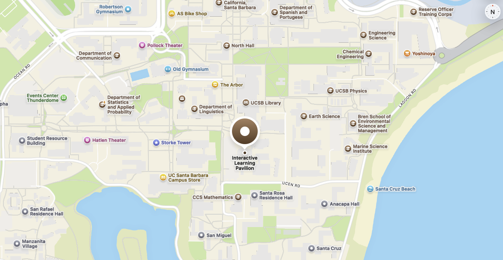

::: {#hero-heading}
<div class="h1">Welcome to PSTAT100!</div>

My name is [John Inston](about.qmd) and I will be the instructor for this course, I am a 4th year Ph.D. candidate in the Department of Statistics and Applied Probability here at UC Santa Barbara.  Thank you all for taking this course. I hope that you find it both interesting and informative.

This course aims to provide an overview of key concepts in data science and the use of tools for data retrieval, analysis, visualization, and reproducible research in preparation for advanced data science courses.  Topics include an introduction to inference and prediction, principles of measurement, missing data, and notions of causality, statistical traps, and concepts in data ethics and privacy.

#### 🔍 Reference Material

The contents of this course was prepared using past teaching material provided by [Ethan P. Marzpan](https://epm027.github.io) as well as historical course material made available online by the UCSB Department of Statistics and Applied Probability.

:::

## 📚 Material

- **Lecture Notes:**
  - [Online lecture notes.](../../notes/pstat100-notes/00-introduction/index.qmd)
  - Course GitHub repository.
- **Helpful Resources:**


## ✏️ Information

### Teaching Staff

| Name          | Role       | Email                 | Office Hours               |
|---------------|------------|-----------------------|----------------------------|
| John Inston   | Instructor | johninston@ucsb.edu   | SH 5431T R 1:00PM - 3:00PM |
| Lauren Hughes | TA         | laurenhughes@ucsb.edu | TBD                        |
| TBD           | TA         | TBD                   | TBD                        |
| TBD           | TA         | TBD                   | TBD                        |

### Instruction

Course instruction will comprise of **20 lectures** (held twice per week) and **10 programming labs** (held weekly).  

- **Lecture:** 
  - TR 11:00AM - 12:15PM ILP 1101
- **Labs:**
  - M 1:00PM - 1:50PM ILP 4107
  - M 2:00PM - 2:50PM ILP 3209
  - M 3:00PM - 3:50PM ILP 3209
  - M 4:00PM - 4:50PM Girvetz Hall 2129
  - M 5:00PM - 5:50PM ILP 3209
  - M 6:00PM - 6:50PM ILP 3205



### Assessments

You will be required to complete 10 lab worksheets which will be due for submission the following Friday.

You will be required to complete 4 assignments which will be due for submission every 2 weeks (Friday of Weeks 2,4,6 and 8).

You final assessment will be a group project (groups up to 3) which will comprise of cleaning and analyzing a data set of your choice.  You will be required to submit a project proposal in Week 5 specifying your data set as well as providing a rough project outline.


### Course Schedule

Please check this schedule regularly throughout the term as it is updated with the latest material and reading suggestions.

| Week | Date        | Item                             | Reading | Materials |
|------|-------------|----------------------------------|---------|-----------|
| 1    | Tue, Mar 31 | **Lec0:** Course Information <br> **Lec1:** Introduction to Data   |         |           |
|      | Thu, Apr 2  | **Lec2:** Data Structure         |         |           |
| 2    | Tue, Apr 7  | **Lec3:** Data Visualization I   |         |           |
|      | Thu, Apr 9  | **Lec4:** Data Visualization II  |         |           |
| 3    | Tue, Apr 14 | **Lec5:** Data Geometry          |         |           |
|      | Thu, Apr 16 | **Lec6:** PCA                    |         |           |
| 4    | Tue, Apr 21 | **Lec7:** Review Session         |         |           |
|      | Thu, Apr 23 | **ICA 1**                        |         |           |
| 5    | Tue, Apr 28 | **Lec8:** Study Design           |         |           |
|      | Thu, Apr 30 | **Lec9:** Sampling Distributions |         |           |
| 6    | Tue, May 5  | **Lec10:** Confidence Intervals  |         |           |

```{python}
#| echo: false
#| eval: false

### 🙏 Thanks!

If you found any of this material helpful consider buying me a coffee but only if you can afford to!  Thank you for visiting this course page. 😊

<div style="text-align: center;">
  <script type="text/javascript" 
          src="https://cdnjs.buymeacoffee.com/1.0.0/button.prod.min.js" 
          data-name="bmc-button" 
          data-slug="johnrobininston" 
          data-color="#FF5F5F" 
          data-emoji="" 
          data-font="Cookie" 
          data-text="Buy me a coffee! " 
          data-outline-color="#000000" 
          data-font-color="#ffffff" 
          data-coffee-color="#FFDD00">
  </script>
</div>
```


