# Course Introduction

## 👋 Introduction {.intro-two-col}

::: {.spacer-sm}
:::

::: {.welcome-lead .welcome-trigger .fragment}
Welcome to [PSTAT100 Data Science Concepts and Analysis]{.accent}! 🎉 
:::

::: {.columns .fragment}
::: {.column width="55%"}

::: {.spacer-sm}
:::

### 🤝 About Me

- My name is [John Inston]{.accent}.
  - [Pronouns:]{.accent} I use he/him/his pronouns.
- I am a [4th year PhD candidate]{.accent} 👴 in the [Department of Statistics and Applied Probability]{.accent}.
- My research interests include [stochastic games]{.accent} 🎲 and [numerical optimization]{.accent} 💻.

:::

::: {.column width="45%"}

<br>

{.profile-hex}

:::
:::

::: {.columns .fragment}

::: {.column width="50%"}

### 📧 Contact Information

::: {.spacer-sm}
:::

✉️ [Email:]{.accent} [johninston@ucsb.edu](mailto:johninston@ucsb.edu)

🌐 [Website:]{.accent} [johnrobininston.com](https://johnrobininston.com)

:::

::: {.column width="50%"}

### Office Hours

::: {.spacer-sm}
:::

🏢 [OH:]{.accent} South Hall 5431T R 1PM to 3PM.

:::

:::

## 👩‍🏫 Teaching Staff

:::{.fragment}

::: {.spacer-sm}
:::

I am being assisted this term by the following wonderful [teaching assistants]{.accent}:

:::

:::{.fragment}

:::{.nonincremental}

::: {.columns}
::: {.column width="75%"}

- ### Lauren Hughes
    - [Pronouns:]{.accent} she/her/hers 
    - ✉️ [Email:]{.accent} [laurenhughes@ucsb.edu](mailto:laurenhughes@ucsb.edu)
    - 🏢 [OH:]{.accent} TBD.

- ### Yuting Ma
    - [Pronouns:]{.accent} she/her/hers
    - ✉️ [Email:]{.accent} [yutingma@ucsb.edu](mailto:yutingma@ucsb.edu)
    - 🏢 [OH:]{.accent} TBD.

- ### Zhuojun Lyu
    - [Pronouns:]{.accent} she/her/hers
    - ✉️ [Email:]{.accent} [zhuojun@ucsb.edu](mailto:zhuojun@ucsb.edu)
    - 🏢 [OH:]{.accent} TBD.

:::

::: {.column width="25%"}

::: {.staff-photo-stack}
{.profile-hex}
{.profile-hex}
{.profile-hex}
:::

:::
:::

:::
:::

:::{.fragment}

::: {.emphasize}
❗ Due to space availability section switching must be [confirmed in advance]{.accent} with your TA.
:::

:::

## ℹ️ Prerequisites

:::{.fragment}

::: {.spacer-sm}
:::

### Programming Language

- This course will be taught in `python` 🐍.
    - A working knowledge of `python` is [not required]{.accent} but it is expected that you have some familiarity with similar programming languages.
    - You are also expected to create documents using [Jupyter notebooks]{.accent} or [Quarto markdown]{.accent}.

:::

::: {.fragment}

::: {.spacer-sm}
:::

### Prerequisite Courses

::: {.columns}
::: {.column width="33%"}
- [PSTAT 120A]{.accent}
    - Probability Theory
    - Statistics
:::
::: {.column width="33%"}
- [CS 9 or CS 16]{.accent}
    - Python Programming
    - Data Structures
    - Algorithms
:::
::: {.column width="33%"}
- [Math 4A]{.accent}
    - Linear Algebra
:::
:::

:::

:::{.fragment}

:::{.emphasize}
📝 [Supplementary materials]{.accent} summarizing these topics will be made available in the [online lecture notes](https://johnrobininston.com/notes/pstat100-notes/00-introduction/index.html) for review.
:::

:::

## ℹ️ Course Information

:::{.fragment}

::: {.spacer-sm}
:::

### 📝 Course Materials

- You will be provided with:
    - 📝 [Lecture Notes]{.accent} (slides, online, pdf)
    - 📚 [Suggested reading]{.accent} (textbooks, online notebooks)
    - 🧪 Lab and assignment [solutions]{.accent}

- You can access all course material through the [Canvas page]{.accent}.    
    - All material that is not assessed will also be made available on the [course website](https://johnrobininston.com).

:::

:::{.fragment}

::: {.spacer-sm}
:::

### 👩‍⚖️ Course Policies

:::{.columns}
::: {.column width="50%"}

- Communication is key! 💬 

- No plagiarism! ❌

- 🤖 AI tools are encouraged for learning.

- Be respectful. 🤝

:::

::: {.column width="50%"}
:::{.emphasize}
Please make sure to read through the course policies detailed in the syllabus.  
:::
:::
:::
:::


## 📝 Assessments

:::{.fragment}

::: {.spacer-sm}
::: 

### 📝 Assignments (40%)

- [4 assignments]{.accent} throughout the quarter.  
    - These will be released and submitted on [Canvas]{.accent}
    - Due at the end of weeks 2, 4, 6, and 8.  

:::

:::{.fragment}

::: {.spacer-sm}
:::

### 💻 Labs (30%)

- 8 [lab worksheets]{.accent} 
    - Submitted to [Canvas]{.accent} by the end of the week.
    - In lab sessions your TA will help you with problems.

:::
:::{.fragment}

::: {.spacer-sm}
:::

### 📊 Project (30%)

- You are required to complete a [data analysis project]{.accent}.
    - [Individual or group]{.accent}.
    - [Details]{.accent} of this project will be specified in the coming weeks.

:::

## ✅ Topic Outline

The following is a tentative course outline:

::: {.columns}
::: {.column width="50%"}

<ol class="topic-outline-ol">
<li class="fragment"><span class="accent">Introduction to Data Science</span>
<ul>
<li>Python Fundamentals</li>
<li>Data Lifecycle</li>
</ul>
</li>
<li class="fragment"><span class="accent">Data Preparation</span>
<ul>
<li>Data Cleaning</li>
<li>Missingness</li>
</ul>
</li>
<li class="fragment"><span class="accent">Exploratory Data Analysis</span>
<ul>
<li>Data Visualization</li>
<li>Data Summarization</li>
</ul>
</li>
<li class="fragment"><span class="accent">Statistical Foundations</span>
<ul>
<li>Probability</li>
<li>Hypothesis Testing</li>
</ul>
</li>
</ol>

:::

::: {.column width="50%"}

<ol class="topic-outline-ol" start="5">
<li class="fragment"><span class="accent">Regression</span>
<ul>
<li>Simple / Multiple Linear Regression</li>
<li>Ridge / Lasso / Elastic Net Regression</li>
</ul>
</li>
<li class="fragment"><span class="accent">Classification Methods</span>
<ul>
<li>Logistic Regression</li>
<li>Support Vector Machines</li>
</ul>
</li>
<li class="fragment"><span class="accent">Tree-Based Methods</span>
<ul>
<li>Decision Trees / Random Forests</li>
</ul>
</li>
<li class="fragment"><span class="accent">Unsupervised Learning</span>
<ul>
<li>PCA &amp; Clustering</li>
</ul>
</li>
<li class="fragment"><span class="accent">Introduction to Deep Learning</span></li>
<li class="fragment"><span class="accent">Data Science Ethics</span>
<ul>
<li>Privacy, Fairness and Bias</li>
</ul>
</li>
</ol>

:::
:::

## 📈 Maximizing Your Learning

:::{.fragment}

::: {.spacer-sm}
:::

### 💼 Professional Skills

In addition to technical topics we will also develop your [professional skills]{.accent} as a data scientist including:

- [Technical document production]{.accent}.
- 🗣️ Precise and clear [communication]{.accent}.
- 🤝 [Collaboration]{.accent} and team work.
- Version control (GitHub).
- Independent learning.

:::

:::{.fragment}

::: {.spacer-sm}
:::

### 🎯 Course Aims

Your course aims should be:

- 🛠️ Build a [toolkit]{.accent} for your future career.
- Independently learning new tools and techniques based on the problem at hand.
- To have a project to showcase your skills and knowledge for job applications.
    - And have the start of a project portfolio on GitHub!

:::

## 💪 Python Bootcamp

:::{.fragment}

:::{.emphasize}
What about if I am not familiar with Python? 🤔
:::

:::

:::{.fragment}

::: {.spacer-sm}
:::

::: {.columns}

::: {.column .column-center width="50%"}

<br>

{width="70%" fig-align="center"}

:::

::: {.column width="50%"}

::: {.spacer-sm}
:::

### When and Where?

I will be hosting a [Python Bootcamp]{.accent} this Thursday from 1:00pm to 3:00pm in South Hall 5421.

:::{.emphasize}
❗ Attendance is [optional]{.accent}!
:::

:::{.spacer-sm}
:::

### Who is this for?

- Encouraged for anybody who is unfamiliar with Python or needs a refresher.
- Focus will be on IDE setup, basic functionality and document creation.

:::

:::

:::

# Data Science Fundamentals

## 📊 Data Science

:::{.fragment}

::: {.spacer-sm}
:::

### What is Data Science?

Let's see what Claude thinks:

:::

:::{.fragment}

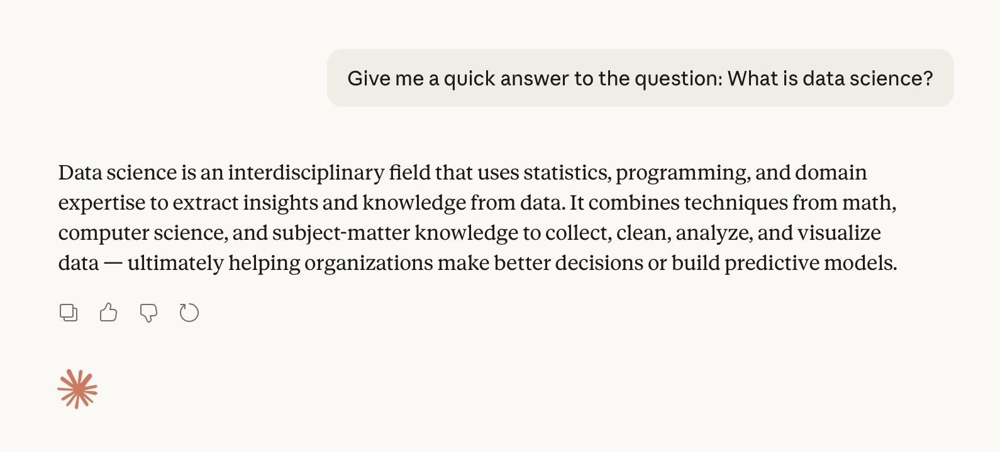

:::

## Fundamental Aims

:::{.fragment}

::: {.spacer-sm}
:::

### Simply put...

:::{.emphasize}
Data science is the practice of using data to extract insights and knowledge. 👍
:::

:::

:::{.fragment}

:::{.columns}
::: {.column width="50%"}

:::{.spacer-sm}
:::

### How does it work?

- Data science is an [interdisciplinary]{.accent} field, requiring:
    - [Statistics]{.accent}
    - [Mathematics]{.accent}
    - [Computer science]{.accent}
    - [Domain knowledge]{.accent}

- Required to manage and interpret [large]{.accent}, [complicated]{.accent} data sets.

:::

::: {.column width="50%"}


:::
:::

:::

:::{.fragment}

:::{.emphasize}
🤔 Notice that these disciplines loosely correspond to the prerequisites for this course.
:::

:::

## Data Science Disciplines

### Intersection of the Disciplines

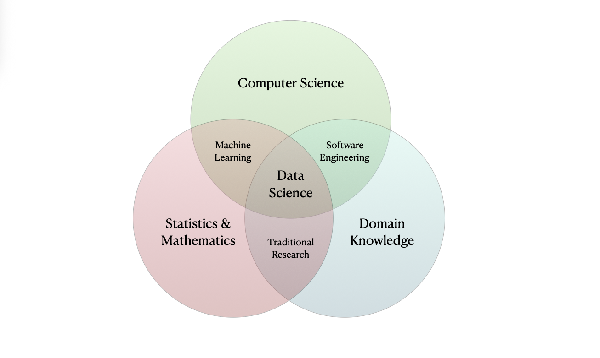

## 🔢 Data 

:::{.fragment}

::: {.spacer-sm}
:::

### What is Data?

:::{.fragment}

::: {.callout-important title="Definition: Data"}
[Data]{.accent} is (digital) information (such as measurements or statistics) used as a basis for reasoning, discussion, or calculation.
:::

- Raw data is often difficult or even impossible to interpret.
    - Hence, the need for Data Science!

:::

:::{.fragment}

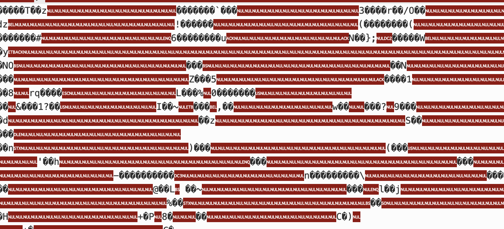{width="50%" fig-align="center"}

:::

:::

## Data Growth

### 🫩 Sooo much data!

:::{.fragment}

- The amount of data being collected, stored, and processed is [growing exponentially]{.accent}!

- Larger variety of [increasingly complicated]{.accent} data types.

:::

:::{.fragment}

:::{.spacer-sm}
:::

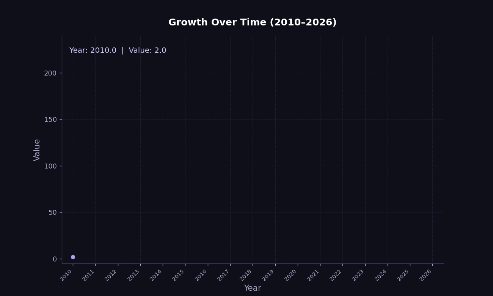{width="50%" fig-align="center"}

:::

## 🔢 Datasets

:::{.fragment}

::: {.spacer-sm}
:::

### Datasets

::: {.callout-important title="Definition: Dataset"}
A [dataset]{.accent} is a collection of [observations]{.accent} taken on [observational units]{.accent}, consisting of values measured on a set of [variables]{.accent}.  
:::

:::

:::{.fragment}

::: {.spacer-sm}
:::

### Terminology

- An [observational unit]{.accent} is the entity that is being measured.
    - People in a study, cars on a production line, etc.
- An [observation]{.accent} is a collection of values (e.g. a vector) measured on various [variables]{.accent}.
    - One person, car in particular is an [observation]{.accent}.
    - [Variables]{.accent} might be the person's age, the car's engine size, etc.

:::

:::{.fragment}

::: {.spacer-sm}
:::

:::{.emphasize}
Let's look at our first example dataset.
:::

:::

## Dataset Example - `cats.csv`

:::{.fragment}

::: {.spacer-sm}
:::

### 🐈 A New Cat Dataset

```{python}
#| echo: false
#| tbl-cap: "First 5 rows of `cats.csv`"
import pandas as pd

cats = pd.read_csv("data/cats.csv")
cats.head(5)
```

:::

:::{.fragment}

<br>

### Identifying Observations and Variables

- The `cats` dataset was provided by [Waqar Ali](https://www.kaggle.com/datasets/waqi786/cats-dataset?resource=download) on Kaggle.

- Here the [observational unit]{.accent} is a cat.

- This dataset of 1000 [observations]{.accent} (rows, individual cats) each with 5 [variables]{.accent} (columns).

:::

## Semantics vs Structure

### What is the difference?

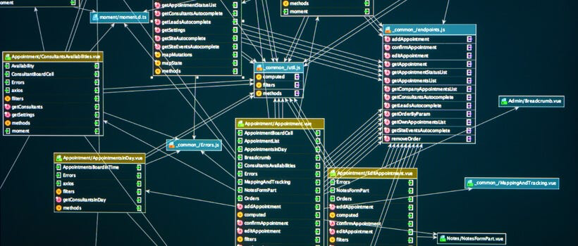{width="50%" fig-align="center"}

- In general, we distinguish between the [semantics]{.accent} and [structure]{.accent} of a dataset.

- The [semantics]{.accent} of a dataset refers to the meaning behind the data.
    - [Interpretation]{.accent} and [representation]{.accent}.

- The [structure]{.accent} of a dataset refers to the way the data is organized.
    - [Shape]{.accent}, [organization]{.accent} and [storage]{.accent}.


## 🔢 Types of Data

:::{.fragment}

::: {.spacer-sm}
:::

### 🔢 Quantitative Data

- [Quantitative Data (Numerical)]{.accent}: Represents measurable quantities.
    - [Discrete]{.accent}: Counted items that are distinct and whole (e.g., number of children, product sales).
    - [Continuous]{.accent}: Measured items that can be any value within a range (e.g., height, weight).

:::

:::{.fragment}

::: {.spacer-sm}
:::

### ⚖️ Qualitative Data

- [Qualitative Data (Categorical)]{.accent}: Represents descriptive characteristics or labels.
    - [Nominal]{.accent}: Named categories with no inherent order (e.g., gender, hair color, blood type).
    - [Ordinal]{.accent}: Categories with a logical order or ranking (e.g., satisfaction surveys, education level).

:::


:::{.fragment}

::: {.spacer-sm}
:::

### 🏢 Structured vs. Unstructured Data

- [Structured vs. Unstructured Data]{.accent}:
    - [Structured]{.accent}: Organized, formatted data (e.g., Excel sheets, SQL databases).
    - [Unstructured data]{.accent}: Data without a fixed schema (e.g., video, audio, free text).

:::

## Data Type Example - `cats.csv`

:::{.fragment}

::: {.spacer-sm}
:::

### 🐈 The Cats Strike Back!

```{python}
#| echo: false
#| tbl-cap: "First 5 rows of `cats.csv`"
cats.head(5)
```

:::

:::{.fragment}

:::{.spacer-sm}
:::

### Identifying Variable Types

- The Breed, Color, and Gender variables are [qualitative variables]{.accent} since they are categorical.

- The Age and Weight variables are [quantitative variables]{.accent} since they are numerical.
    - Both are [continuous variables]{.accent} since they can take on any value within a range.
    - ❗ We note however that they have both been [discretized into bins]{.accent}.

:::

## 🔄 Transformations

:::{.fragment}

::: {.spacer-sm}
:::

### Variable Transformations

- Variables can be [transformed]{.accent} from one type to another, often for:
    - Improved interpretability.
    - Removing excessive detail.
    - Subsequent analysis (e.g. PCA).
    
:::

:::{.fragment}

::: {.spacer-sm}
:::

### 🐈 Return of the Cat Dataset

Suppose we are interested in transforming the quantitative age variable into the categories young, middle-aged, and senior.

- We create a new variable `AgeGroup` with the following values:
    - `Young`: 0-5 years
    - `Middle-Aged`: 6-10 years
    - `Senior`: 11+ years

:::

## Transformations Example - `cats.csv`

:::{.fragment}

::: {.spacer-sm}
:::

### 🐕 Transformed Cat Dataset

```{python}
#| echo: false
#| tbl-cap: "First 5 rows of `cats.csv` with `AgeGroup` variable"
cats['AgeGroup'] = pd.cut(cats['Age (Years)'], bins=[0, 5, 10, float('inf')], labels=['Young', 'Middle-Aged', 'Senior'])
cats.head(5)
```

:::

:::{.fragment}

::: {.spacer-sm}
:::

### Interpretation of the Transformed Variable

- We have now transformed the numerical `Age (Years)` variable into a qualitative `AgeGroup` variable.

- We will revisit variable transformations in more detail later in the course when we discuss [data preparation]{.accent}.

:::

## Data Type Hierarchy

:::{.fragment}

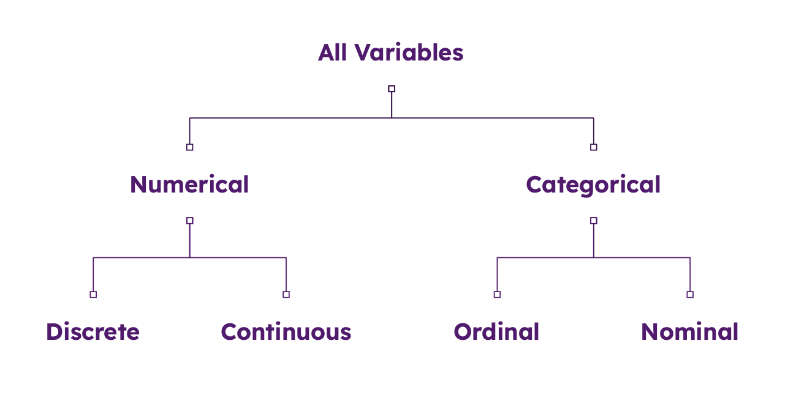{width="70%" fig-align="center"}
:::

:::{.fragment}

::: {.spacer-sm}
:::

### 🔢 Tabular Data

- We will primarily be working with [tabular data]{.accent}.
    - Spreadsheet style datasets containing both [quantitative]{.accent} and [qualitative]{.accent} data.
    - We will occasionally deal with more complex structures such as [databases]{.accent}.

:::

## Complicated Data

:::{.fragment}

::: {.spacer-sm}
:::

### 😵‍💫 More Complicated Data Types

In reality there is a wide variety of different data types:

- [Time series data]{.accent} - stock prices, weather patterns, etc.
- [Spatial data]{.accent} - map data, satellite imagery, etc.
- [Textual data]{.accent} - social media posts, news articles, etc.
- [Image data]{.accent} - photos, videos, etc.
- [Audio data]{.accent} - audio recordings, podcasts, etc.
- [Video data]{.accent} - videos, etc.
- [Network / graphical data]{.accent} - social media networks, etc.

:::

:::{.fragment}

<br>

::: {.emphasize}
Each data type has its own unique set of challenges and techniques for data scientists to apply.
:::
:::

## Complicated Data Example - MNIST

::: {.spacer-sm}
:::

### 🖐️ Handwritten Digits

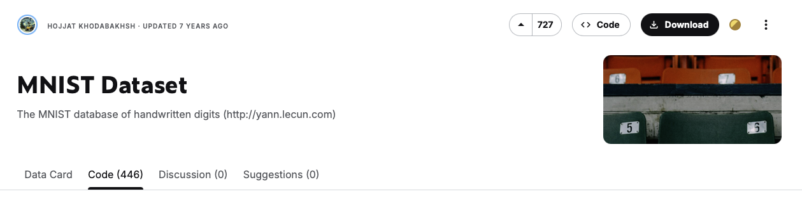

- The database is of [handwritten digits]{.accent}.
    - White text on a black background.

- The data is [complicated]{.accent}!
  - There are 70,000 observations total (60,000 training and 10,000 testing).
  - Each observation consists of 28x28 pixels, with a total of 784 pixels per observation.
  - Each pixel is a grayscale value between 0 and 255 (0 = black, 255 = white). 

## Handwritten Digits

### 🖐️ Handwritten Digits

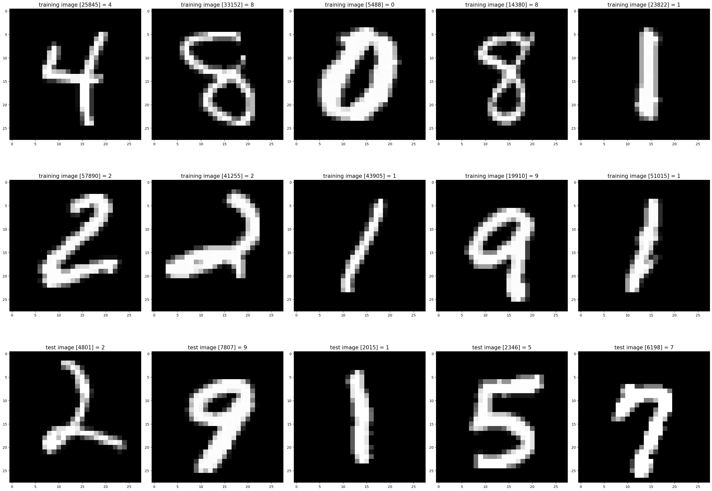

## 📖 Data Literacy

:::{.fragment}

:::{.columns}
::: {.column width="50%"}

::: {.spacer-sm}
:::

### My point is...

The world of data is [confusing]{.accent}! 😵‍💫

- Different [data types]{.accent} with different [formats]{.accent} and different [dimensions]{.accent}.
- Each has unique challenges and [techniques]{.accent} for data scientists to learn.
- We do not have time to go over everything, but we will cover some of the most important cases!
- It is a long road to build up your [data literacy]{.accent}.

:::
::: {.column width="50%"}

<br>


:::
:::

:::

:::{.fragment}

:::{.callout-important title="Definition: Data Literacy"}

[Data Literacy]{.accent} is the ability to explore, understand, and communicate with data in a meaningful way. ([Tableau](https://www.tableau.com/data-insights/data-literacy/what-is#definition))

:::

:::

# Data Science Lifecycle

## 🔄 Data Science Lifecycle

:::{.fragment}

::: {.spacer-sm}
:::

### What is the Data Science Lifecycle?

The [data science lifecycle]{.accent} (DLS) is the following multi-step process used to extract actionable insights from data:

:::

:::{.fragment}

:::{.columns}
::: {.column width="50%"}

1. ❓ [Hypothesize:]{.accent}
    - Formulate a question of interest.
2. 🧹 [Collect and Prepare:]{.accent} 
    - Sample or acquire data.
    - Understand your dataset (origins, limits).
    - Clean up and organize your data.
3. 📈 [Explore and Analyze:]{.accent}
    - Explore the data to understand its structure.
    - Analyze data relationships.
4. 🗣️ [Interpret and Communicate:]{.accent}
    - Interpret the results of the analysis.
    - Communicate your results.

:::

::: {.column width="50%"}

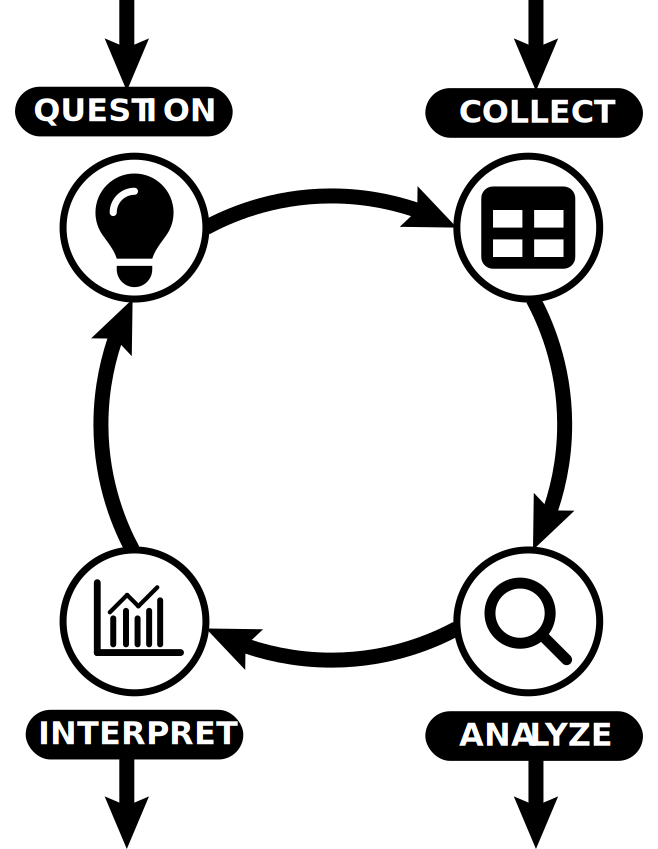{width="70%" fig-align="center"}

:::
:::

:::

## Guidelines

:::{.columns}
::: {.column width="50%" .fragment}

### Don't feel restricted!

:::{.fragment}

- This lifecycle is not necessarily sequential.
    - You may start with a data set that needs processing before forming your hypothesis.
    - You may need to reformulate your hypothesis as your understanding deepens.
- Think of this as a guide to help structure your approach.

:::{.fragment}

:::{.emphasize}
In reality, the data science lifecycle has a more complex structure.
:::

:::

:::

:::

::: {.column width="50%" .fragment}
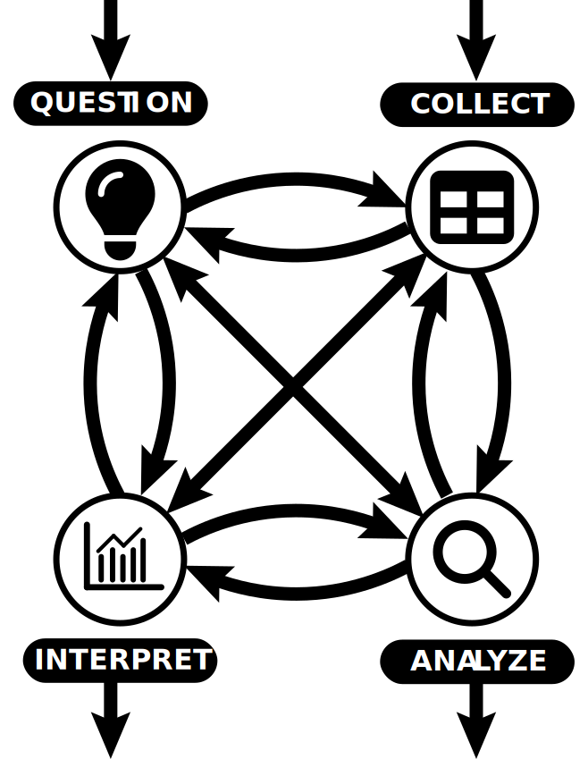{width="70%" fig-align="center"}
:::

:::

## ❓ Hypothesize

### Deceptively Simple

:::{.columns}
::: {.column width="50%"}

- Typically we begin with a [question]{.accent} we want to answer.
    - 💉 Does this new drug improve patient outcomes?
    - 🛳️ What impact has increased shipping had on marine mammal populations?
    - 🎓 Does this new policy improve student performance?

- The [scope]{.accent} of your hypothesis should inform the data you collect.
    - Am I considering a specific population?
    - Do I wish to generalize?
    - Does this data already exist?

:::

::: {.column width="50%"}
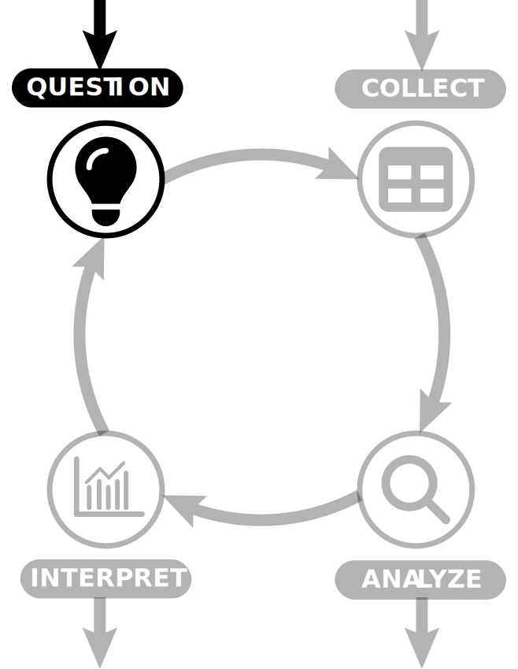{width="70%" fig-align="center"}

:::
:::

## 🧹 Collect and Prepare

### This takes time!

:::{.columns}
::: {.column width="50%"}

- Design [experiment]{.accent} / [survey]{.accent} or collect [second-hand data]{.accent}.
    - There are whole courses dedicated to experimental design.

- ➡️ Our hypothesis informs the data we collect.
    - ⬅️ With second-hand data, this is often reversed.

- 🧹 [Data preparation]{.accent} is often a time consuming process.
    - [Errors]{.accent} are challenging to locate.
    - [Missing data]{.accent} needs to be handled appropriately.
    - [Formatting]{.accent} and readability issues.

:::

::: {.column width="50%"}
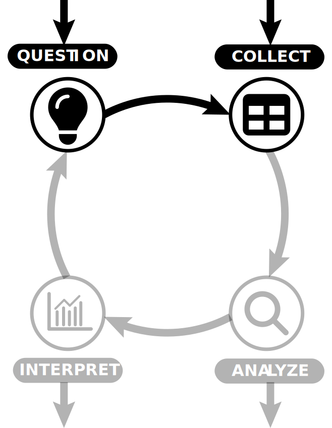{width="70%" fig-align="center"}

:::
:::

## 📈 Explore and Analyze

### Understanding the data

:::{.columns}
::: {.column width="50%"}

- [Analyze]{.accent} the data to understand its [structure]{.accent}.
    - Visualizations.
    - Descriptive statistics.

- Identify [relationships between variables]{.accent}.
    - Inferential modelling.
    - Hypothesis testing.

- Sometimes we wish to [forecast]{.accent} future outcomes.
    - Predictive modelling.

- Sometimes we solely focus on [model outcomes]{.accent}.
    - Model selection and evaluation.
    - Machine learning models.

:::

::: {.column width="50%"}

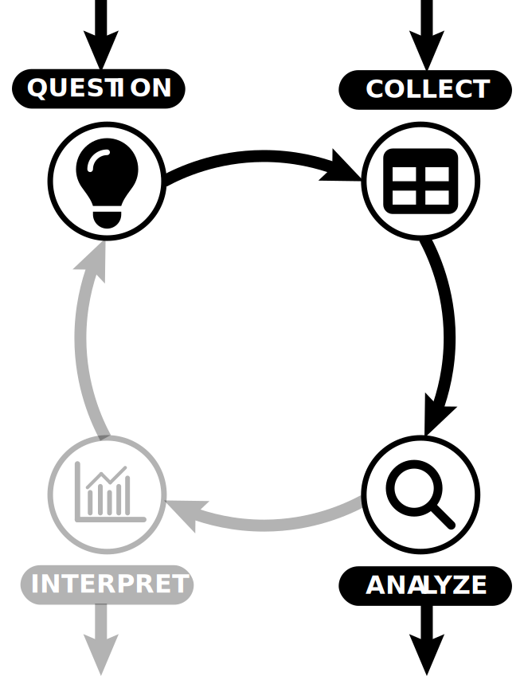{width="70%" fig-align="center"}

:::
:::

## 🗣️ Interpret and Communicate

### Refer back to your hypothesis

:::{.columns}
::: {.column width="50%"}

- [Interpret]{.accent} our results.
    - How do our results fit our hypothesis?
    - How significant are our results?
    - How do our results compare to other studies?

- [Communicate]{.accent} our results.
    - Write a report.
    - Present your findings.

- Ensure [reproducibility]{.accent}.
    - Share your code and data.
    - Maximize transparency.

- Let's look at an example...
    
:::

::: {.column width="50%"}

{width="70%" fig-align="center"}

:::
:::

## DSL Example - `mammals.csv`

:::{.fragment}

### `mammals.csv`

Suppose we are provided with the following data set:

```{python}
#| echo: false
#| classes: mammals-preview-table
#| tbl-cap: "The first few rows of the mammals data set."

import pandas as pd
df = pd.read_csv('data/mammals.csv')
df.head()
```

<br>

- The `mammals.csv` data set ([web source](https://zief0002.github.io/bespectacled-antelope/codebooks/mammals.html#ref-Allison:1976)) comes from @Allison.Cicchetti1976 and contains data for 62 mammals.
- What questions might we be able to answer with this data?

:::

:::{.fragment}

:::{.spacer-sm}
:::

:::{.emphasize}
Suppose we are interested in how the size of an animal's brain scales with their body size.
:::

:::

## DSL Example - Prepare

### Data Cleaning

- The data is already immaculately cleaned and organized.
- We therefore check the dimensions and inspect the data for any missing values.

:::{.fragment}

```{python}
#| echo: false

print("Dimensions: ", "\n", df.shape)
# missing values?
print("Missingness analysis: ", "\n", df.isna().sum(axis = 0))
```

:::

## DSL Example - Hypothesize

:::{.fragment}

:::{.spacer-sm}
:::

### Make sure we understand our limitations!

- We need to understand the limitations of the data.
    - The data only contains mammals.
    - The data is aggregated at the species level.
    - The data was not collected to represent mammals as a whole.
- What does this mean?
    - We cannot generalize our findings to all mammals.
- How does this impact the questions we can ask?

:::

:::{.fragment}
:::{.spacer-sm}
:::

### Final Hypothesis

:::{.spacer-sm}
:::

:::{.emphasize}
Does this data suggest evidence of a relationship between a mammal's brain size and body weight?
:::

:::

## DSL Example - Explore

:::{.fragment}
### Summarizing the data

- Both variables are quantitative and continuous.
    - We can therefore use descriptive statistics to summarize the data (more on this later).

:::

:::{.fragment}

```{python}
#| echo: false

# summary statistics
print("Summary statistics: ", "\n", df[["body_weight", "brain_weight"]].describe())
# correlation
print("Correlation: ", "\n", df[["body_weight", "brain_weight"]].corr())
```

- Some observations:
    - Correlation is high suggesting a positive relationship between the variables.
    - Data appears heavily skewed (we will discuss this later).

- We can also produce a scatter plot to visualize the relationship between the variables.

:::

## DSL Example - Visualize

::: {.panel-tabset title="Brain Weight (g) vs Body Weight (kg)"}

### Log–log axes

```{python}
#| echo: false
#| fig-align: "center"
import matplotlib.pyplot as plt
fig, ax = plt.subplots()
ax.scatter(
    df["body_weight"],
    df["brain_weight"],
    color="steelblue",
    edgecolors="white",
    linewidths=0.5,
    alpha=0.8,
    s=60,
)
ax.set_xlabel("Body weight (kg)")
ax.set_ylabel("Brain weight (g)")
ax.spines[["top", "right"]].set_visible(False)
ax.set_xscale("log")
ax.set_yscale("log")
ax.set_title("Brain Weight (g) vs Body Weight (kg)")
plt.tight_layout()
plt.show()
```

:::{.incremental}

- There is a clear linear relationship between the variables on the log scale.

:::

### Linear axes

```{python}
#| echo: false
#| fig-align: "center"
fig, ax = plt.subplots()
ax.scatter(
    df["body_weight"],
    df["brain_weight"],
    color="steelblue",
    edgecolors="white",
    linewidths=0.5,
    alpha=0.8,
    s=60,
)
ax.set_xlabel("Body weight (kg)")
ax.set_ylabel("Brain weight (g)")
ax.spines[["top", "right"]].set_visible(False)
ax.set_title("Brain Weight (g) vs Body Weight (kg)")
plt.tight_layout()
plt.show()
```

:::{.incremental}

- The plot shows a positive relationship between the variables.
- To better see the relationship, we can use log-log axes.

:::

:::

## DSL Example - Analyze

### Linear Model

:::{.fragment}

Our visualization suggests that the relationship could be modeled as

$$
\begin{aligned}
\log(\text{brain}) & = \beta_0 + \beta_1 \log(\text{body})\\
\text{brain} & = \exp(\beta_0 + \beta_1 \log(\text{body})) \\ 
\text{brain} & = c\cdot\exp(\log(\text{body}^{\beta_1})) \\
\implies \text{brain} & \propto \text{body}^{\beta_1}.
\end{aligned}
$$

:::

:::{.fragment}

This suggests that the relationship is a [power law]{.accent}.

- To determine the parameters of the model, we can use [linear regression]{.accent}.
    - We will discuss this in more detail later.
    - Let's have a quick look at the fitted model details.

:::

## DSL Example - Model

```{python}
#| echo: false

import statsmodels.formula.api as smf
import numpy as np

model = smf.ols(
    'np.log(brain_weight) ~ np.log(body_weight)', data=df
    ).fit()
print(model.summary())
```

- [R-squared]{.accent} = 0.921 — $\log(\text{body weight})$ explains 92.1% of the variance in $\log(\text{brain weight})$. 
- [F-statistic p-value]{.accent} = 9.84e-35 — the model is highly statistically significant overall.
- [Slope]{.accent} = 0.7517
    - p-values of 0.000, so [highly significant]{.accent}.

## DSL Example - Interpret

:::{.fragment}

Our fitted model is:

$$
\text{brain} \propto \text{body}^{0.7517}.
$$

- This means that a 1% increase in body weight is associated with a ~0.75% increase in brain weight. 

- This leads us to draw the following conclusion:

:::

:::{.fragment}

:::{.emphasize}
For these 62 mammals there is evidence that brain weight changes in proportion to a power of body weight.
:::

- Note that this conclusion is not very strong since:
    - Data set is relatively small.
    - Not representative of mammals in general.
    - Aggregated data, not individual level. 
    
:::

# Conclusion

## Conclusion

:::{.fragment}

::: {.spacer-sm}
:::

### ✅ What we covered

:::{.incremental}

- Course information.
- What is data science?
    - [Data]{.accent} and [Datasets]{.accent}
    - Key terminology.
    - [Data types]{.accent}.
- The [data science lifecycle]{.accent}.

:::

:::

:::{.fragment}

::: {.spacer-sm}
:::

### 📅 What's next?

:::{.incremental}

- Handling data in Python.
- Data structure.
- Data preparation. 


:::

:::

## References