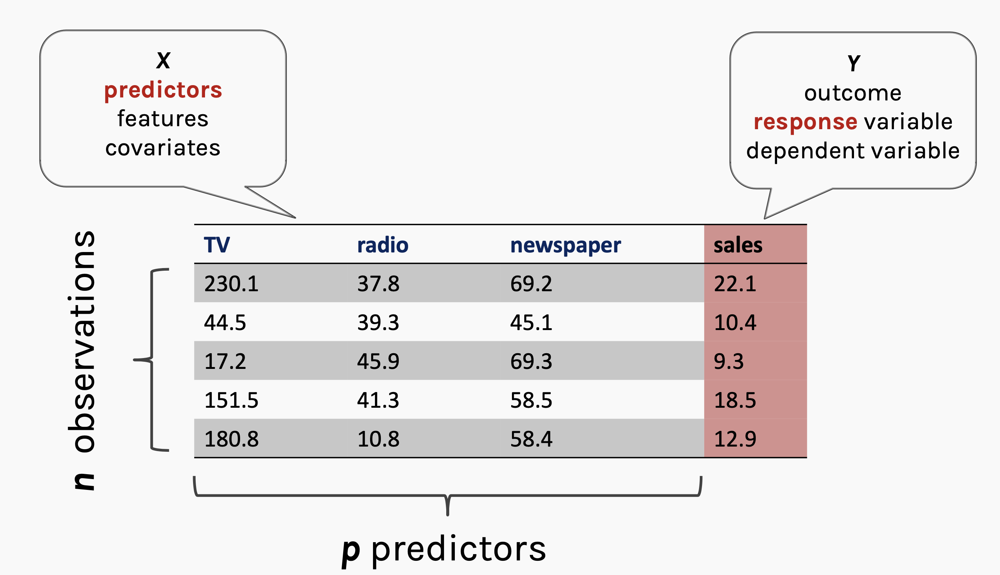
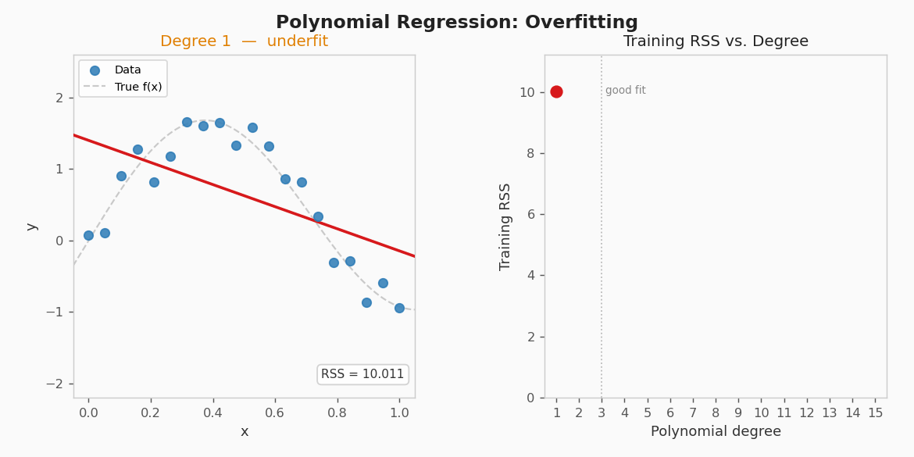

## 🚁 Overview

:::{.columns}
:::{.column width="50%" .fragment}
:::{.spacer-sm}
:::

### Aims of the lecture

- Introduce **multiple linear regression (MLR)**: modelling $Y$ as a linear function of multiple predictors $X_1, \ldots, X_p$.
- Derive the **OLS estimator** $\hat{\boldsymbol{\beta}} = (\mathbf{X}^\top\mathbf{X})^{-1}\mathbf{X}^\top\mathbf{Y}$.
- Establish **properties** of MLR OLS: 
  - Unbiasedness
  - Variance-covariance matrix, and BLUE.
- Conduct inference with **$t$-tests** and the **overall $F$-test**.
- Measure fit with **adjusted $R^2$** and information criteria (AIC, BIC).

:::

:::{.column width="50%" .fragment}

:::{.spacer-sm}
:::

### 📚 Required Libraries

```{python}
import numpy as np
import pandas as pd
import matplotlib.pyplot as plt
import seaborn as sns
from scipy.stats import f as f_dist, t as t_dist
from sklearn.model_selection import train_test_split
from sklearn.linear_model import LinearRegression
from sklearn.datasets import fetch_california_housing
```

### 💅 Figure Styles

```{python}
sns.set_style('whitegrid')
sns.set_palette('Set2')
```

:::
:::


# Multiple Linear Regression

## 🔄 Why Multiple Predictors?

### Maximize use of information

- Most real phenomena are driven by **multiple factors** simultaneously.

- We wish to capture the **multivariate relationships**.

- Omitting relevant predictors leads to the SLR slope absorbing the effect of missing variables that are correlated with $X$.
  - This is known as **omitted variable bias**.

:::{.fragment}

:::{.spacer-sm}
:::

### Recall from Lecture 10

> The SLR residual plot for body mass vs. flipper length showed **systematic banding** — a strong hint that **species** was acting as an omitted variable.

- Adding species and other measurements can:
  - Reduce bias in coefficient estimates.
  - Increase the proportion of variance explained.
  - Improve prediction accuracy.

:::

## The MLR Model

:::{.fragment}

:::{.callout-important title="Multiple Linear Regression Model"}
For response $y$ with $p$ predictors $x_1, \ldots, x_p$, the MLR model is defined as
$$y_i = \beta_0 + \beta_1 x_{i1} + \beta_2 x_{i2} + \cdots + \beta_p x_{ip} + \varepsilon_i, \qquad i = 1, \ldots, n,$$
where $\varepsilon_i \stackrel{\text{iid}}{\sim} \mathcal{N}(0, \sigma^2)$ (under the Gauss-Markov assumptions).
:::

:::

- There are $p + 1$ parameters: one **intercept** $\beta_0$ and $p$ **slopes** $\beta_1, \ldots, \beta_p$.
- There are $n$ observations: $\{(y_i, x_{i1}, \ldots, x_{ip})\}_{i=1}^n$.
- SLR is the special case $p = 1$.
- We require $n > p + 1$ observations to fit the model.

## MLR Table



## Partial Slopes — A Critical Difference

### SLR vs MLR

- In SLR, $\hat{\beta}_1$ captures the total marginal relationship between $X$ and $Y$.

- In MLR, each slope is a **partial slope**:
    - $\beta_j$ is the expected change in $Y$ for a **one-unit increase in $X_j$, holding all other predictors constant** (ceteris paribus).

:::{.fragment}

:::{.spacer-sm}
:::

### Example

- In SLR of body mass on flipper length, $\hat{\beta}_1$ includes the indirect effect of species (Gentoo penguins are larger *and* have longer flippers).
- In MLR with both flipper length and species, $\hat{\beta}_{\text{flipper}}$ measures the flipper–mass relationship **within the same species**.
- This is why partial slopes can differ substantially — even in sign — from SLR slopes.

:::

## Matrix Notation

To simplify notation, we will express the MLR model in **matrix form**. We define the following:

:::{.fragment}
$$
\mathbf{X} = \begin{pmatrix}
1 & x_{11} & x_{12} & \cdots & x_{1p} \\
1 & x_{21} & x_{22} & \cdots & x_{2p} \\
\vdots & \vdots & \vdots & \ddots & \vdots \\
1 & x_{n1} & x_{n2} & \cdots & x_{np}
\end{pmatrix}, \quad
\boldsymbol{\beta} = \begin{pmatrix} \beta_0 \\ \beta_1 \\ \vdots \\ \beta_p \end{pmatrix},\quad
\mathbf{Y} = \begin{pmatrix} Y_1 \\ Y_2 \\ \vdots \\ Y_n \end{pmatrix}. \quad 
\boldsymbol{\varepsilon} = \begin{pmatrix} \varepsilon_1 \\ \varepsilon_2 \\ \vdots \\ \varepsilon_n \end{pmatrix}.
$$

:::

:::{.fragment}

Then we can write our model as

:::

:::{.fragment}
$$
\boldsymbol{Y} = \boldsymbol{X}\boldsymbol{\beta} + \boldsymbol{\varepsilon}.
$$

where we have that $\boldsymbol{\varepsilon}\sim\mathcal{N}(\mathbf{0}, \sigma^2 \mathbf{I}_n)$.

:::

- Note here that $\boldsymbol{X}$ has $p+1$ columns (including the intercept) and $n$ rows (observations).

- This matrix formulation is more compact and allows us to derive the **OLS estimator** using linear algebra.

## Gauss-Markov Assumptions

### Gauss-Markov assumptions in matrix form

| Assumption | Matrix statement |
|---|---|
| Linearity | $\mathbb{E}[\boldsymbol{\varepsilon}] = \mathbf{0}$ |
| Independence + Homoscedasticity | $\text{Var}(\boldsymbol{\varepsilon}) = \sigma^2 \mathbf{I}_n$ |
| Normality | $\boldsymbol{\varepsilon} \sim \mathcal{N}(\mathbf{0},\, \sigma^2 \mathbf{I}_n)$ |
| Full rank | $\text{rank}(\mathbf{X}) = p + 1$ (columns linearly independent) |

- Together these imply $$\mathbf{Y} \sim \mathcal{N}(\mathbf{X}\boldsymbol{\beta},\, \sigma^2\mathbf{I}_n).$$

## Constructing the Design Matrix in Python

```{python}
#| output-location: slide
#| code-line-numbers: "1-6|8-12|"
#| fig-cap: "Heatmap of the first 10 rows of the design matrix X (p = 3 predictors). The first column is all ones (intercept term)."

# Set seed and define true parameters
rng = np.random.default_rng(42)
n, p = 150, 3
beta0_true = 3.0 # intercept
beta_true = np.array([2.0, -1.5, 0.8]) # slopes
sigma_true = 2.0 # noise level

# Define the design matrix and response vector
X_pred   = rng.normal(0, 1, size=(n, p))
X_design = np.column_stack([np.ones(n), X_pred])
y = X_design @ np.r_[beta0_true, beta_true] + rng.normal(0, sigma_true, size=n)

# Plot the first 10 rows of the design matrix
fig, ax = plt.subplots(figsize=(8, 4))
im = ax.imshow(X_design[:10], aspect='auto', cmap='Blues')
ax.set_xticks(range(p + 1))
ax.set_xticklabels(['$\\mathbf{1}$', '$x_1$', '$x_2$', '$x_3$'], fontsize=13)
ax.set_yticks(range(10))
ax.set_yticklabels([f'$i = {i+1}$' for i in range(10)])
ax.set_title('First 10 rows of the design matrix $\\mathbf{X}$  (n=150, p=3)')
plt.colorbar(im, ax=ax, shrink=0.8)
plt.tight_layout(); plt.show()
```

## Scatterplot of $Y$ vs. $X_1$ (with points coloured by $X_2$ and sized by $X_3$) to illustrate the multivariate relationship.

```{python}
#| output-location: slide
#| fig-cap: "Scatterplot of $Y$ vs. $X_1$, coloured by $X_2$ and sized by $X_3$. The relationship between $Y$ and $X_1$ depends on the values of the other predictors, illustrating the need for MLR."
#| code-line-numbers: "1-2|4-7|9-12|"

plt.figure(figsize=(8, 5))
scatter = plt.scatter(X_pred[:, 0], y, c=X_pred[:, 1], s=100 * np.abs(X_pred[:, 2]),
                      cmap='viridis', alpha=0.7, edgecolor='k')
plt.xlabel('$X_1$', fontsize=12)
plt.ylabel('$Y$', fontsize=12)
plt.title('Scatterplot of $Y$ vs. $X_1$ (coloured by $X_2$, sized by $X_3$)', fontsize=13)
cbar = plt.colorbar(scatter)
cbar.set_label('$X_2$ value', fontsize=12)
plt.tight_layout(); plt.show()
```

## Pairplot of $Y$ and the three predictors to visualise their relationships.

### Correlation Matrix

```{python}
#| output-location: column-fragment
df = pd.DataFrame(
    X_pred, 
    columns=[f'$X_{j}$' for j in range(1, p + 1)]
    )
df['$Y$'] = y
print(df.corr().round(3))
```

```{python}
#| output-location: slide
#| fig-cap: "Pairplot of $Y$ and the three predictors. The relationships are complex and multivariate, reinforcing the need for MLR."
#| fig-height: 4
sns.pairplot(df, diag_kind='kde', plot_kws={'alpha': 0.6, 'edgecolor': 'k'}, height=1.5, aspect=1.0)
plt.suptitle('Pairplot of $Y$ and the three predictors', fontsize=13, y=1.02)
plt.tight_layout(); plt.show()
```

# OLS Estimation in MLR

## 🎯 The OLS Criterion in Matrix Form

:::{.fragment}

Once again we will estimate $\boldsymbol{\beta}$ using **ordinary least squares (OLS)**.  The OLS estimator is the value of $\boldsymbol{\beta}$ that minimises the **residual sum of squares**:

:::

:::{.fragment}

$$
\text{RSS}(\boldsymbol{\beta}) = \|\mathbf{Y} - \mathbf{X}\boldsymbol{\beta}\|^2 = (\mathbf{Y} - \mathbf{X}\boldsymbol{\beta})^\top(\mathbf{Y} - \mathbf{X}\boldsymbol{\beta}).
$$

:::

:::{.fragment}

Expanding the objective we get that

$$
\text{RSS}(\boldsymbol{\beta}) = \mathbf{Y}^\top\mathbf{Y} - 2\boldsymbol{\beta}^\top\mathbf{X}^\top\mathbf{Y} + \boldsymbol{\beta}^\top\mathbf{X}^\top\mathbf{X}\boldsymbol{\beta}.
$$

:::

:::{.fragment}

Taking the **matrix gradient** with respect to $\beta$ and setting it to zero gives the **normal equations**:

$$\mathbf{X}^\top\mathbf{X}\,\hat{\boldsymbol{\beta}} = \mathbf{X}^\top\mathbf{Y}.$$

:::

:::{.fragment}

Provided $\mathbf{X}^\top\mathbf{X}$ is invertible (i.e. $\mathbf{X}$ has full column rank), the unique solution is:

$$\hat{\boldsymbol{\beta}} = (\mathbf{X}^\top\mathbf{X})^{-1}\mathbf{X}^\top\mathbf{Y}.$$

:::

:::{.fragment}

> This derivation is beyond the scope of the course but we see again that our parameter estimates are given explicitly. 

:::

## Connection to SLR ($p = 1$)

When $p = 1$ and $\mathbf{X} = [\mathbf{1},\, \mathbf{x}]$, we have:

:::{.fragment}

$$\mathbf{X}^\top\mathbf{X} = \begin{pmatrix} n & \sum x_i \\ \sum x_i & \sum x_i^2 \end{pmatrix}, \quad \mathbf{X}^\top\mathbf{Y} = \begin{pmatrix} \sum y_i \\ \sum x_i y_i \end{pmatrix}.$$

:::

:::{.fragment}

Computing $\hat{\boldsymbol{\beta}} = (\mathbf{X}^\top\mathbf{X})^{-1}\mathbf{X}^\top\mathbf{Y}$ and simplifying (using $S_{xx} = \sum(x_i - \bar{x})^2$), we recover:

:::

:::{.fragment}

$$\hat{\beta}_1 = \frac{S_{xy}}{S_{xx}}, \qquad \hat{\beta}_0 = \bar{y} - \hat{\beta}_1\bar{x}.$$

:::

- MLR OLS is a **direct generalisation** of the SLR formulas from Lecture 9.

## The Hat Matrix

:::{.fragment}

The **fitted values** are:

$$\hat{\mathbf{Y}} = \mathbf{X}\hat{\boldsymbol{\beta}} = \mathbf{X}(\mathbf{X}^\top\mathbf{X})^{-1}\mathbf{X}^\top\mathbf{Y} = \mathbf{H}\mathbf{Y},$$

where $\mathbf{H} = \mathbf{X}(\mathbf{X}^\top\mathbf{X})^{-1}\mathbf{X}^\top$

- This is the **hat matrix** (it "puts a hat" on $\mathbf{Y}$).
- This matrix is central to understanding the **geometry** of OLS and the properties of residuals and is studied in depth in advanced linear regression courses.
 
:::

:::{.fragment}

:::{.spacer-sm}
:::

### Properties of $\mathbf{H}$

- **Symmetric**: $\mathbf{H}^\top = \mathbf{H}$.
- **Idempotent**: $\mathbf{H}^2 = \mathbf{H}$ — projecting twice is the same as projecting once.
- **Rank**: $\text{rank}(\mathbf{H}) = p + 1$.
- **Leverages**: diagonal entries $h_{ii} = [\mathbf{H}]_{ii}$ measure how unusual observation $i$'s predictor values are. High leverage $\Rightarrow$ more influence on the fitted line.

:::

## Hat Matrix and Residuals

### What is the Hat Matrix?

- The hat martix $H$ is the **orthogonal projection matrix** onto the subspace spanned by the columns of $\boldsymbol{X}$. 
  - The fitted values $\hat{\boldsymbol{y}}$ are the closest point in the column space of $\boldsymbol{X}$ to the observed $\boldsymbol{y}$.
  - This is definitely beyond the scope of the course but it is a fundamental geometric fact about OLS.

:::{.fragment}

:::{.spacer-sm}
:::

### Hat Matric and Residuals

Since the residuals can be written as

:::

:::{.fragment}

$$
\boldsymbol{e} = \boldsymbol{Y} - \hat{\boldsymbol{Y}} = (\boldsymbol{I}-\boldsymbol{H})\boldsymbol{Y}.
$$

:::

:::{.fragment}

the variance of the residuals is 

$$
\text{Var}(\boldsymbol{e}) = \sigma^2(\boldsymbol{I}-\boldsymbol{H}).
$$

:::

- Hence the residuals are not i.i.d. even when the errors are.


## Computing OLS from Scratch

```{python}
#| output-location: slide
#| fig-cap: "OLS estimates vs. true parameter values (p = 3). The estimator closely recovers all four true parameters."
#| code-line-numbers: "1-2|4-8|10-22|"

# Solve the normal equations (numerically stable — avoids forming the explicit inverse)
beta_hat = np.linalg.solve(X_design.T @ X_design, X_design.T @ y)

# Compare to the true values
beta_all_true = np.r_[beta0_true, beta_true]
print("Parameter | True   | Estimated")
print("-" * 36)
for j, (tv, ev) in enumerate(zip(beta_all_true, beta_hat)):
    print(f"  β_{j}      |  {tv:5.2f}  |  {ev:8.3f}")

# Plot
labels = [f'$\\hat{{\\beta}}_{j}$' for j in range(p + 1)]
x_pos  = np.arange(p + 1)
fig, ax = plt.subplots(figsize=(8, 4))
ax.bar(x_pos - 0.18, beta_all_true, width=0.35,
       label='True $\\boldsymbol{\\beta}$', color='crimson', alpha=0.75)
ax.bar(x_pos + 0.18, beta_hat,      width=0.35,
       label='OLS $\\hat{\\boldsymbol{\\beta}}$', color='steelblue', alpha=0.75)
ax.set_xticks(x_pos); ax.set_xticklabels(labels, fontsize=12)
ax.set_ylabel('Coefficient value')
ax.set_title('OLS Estimates vs. True Parameters')
ax.legend(); plt.tight_layout(); plt.show()
```

# Properties of the MLR OLS Estimator

## ✅ Unbiasedness

:::{.fragment}

Substituting $\mathbf{Y} = \mathbf{X}\boldsymbol{\beta} + \boldsymbol{\varepsilon}$ into the OLS formula:

$$
\hat{\boldsymbol{\beta}}
= (\mathbf{X}^\top\mathbf{X})^{-1}\mathbf{X}^\top(\mathbf{X}\boldsymbol{\beta} + \boldsymbol{\varepsilon})
= \boldsymbol{\beta} + (\mathbf{X}^\top\mathbf{X})^{-1}\mathbf{X}^\top\boldsymbol{\varepsilon}.
$$

:::

:::{.fragment}

Taking expectations (using $\mathbb{E}[\boldsymbol{\varepsilon}] = \mathbf{0}$ and treating $\mathbf{X}$ as fixed):

$$\mathbb{E}[\hat{\boldsymbol{\beta}}] = \boldsymbol{\beta}. \quad \checkmark$$

:::

:::{.fragment}

:::{.spacer-sm}
:::

- Unbiasedness holds under GM1–GM3 (**normality is not required**).
- On average across many datasets, OLS returns the true parameter vector.

:::

## Variance-Covariance Matrix of $\hat{\boldsymbol{\beta}}$

:::{.callout-important title="Collinearity"}
Collinearity refers to the case in which two or more predictors are correlated (related).
:::

- When predictors are highly correlated, $\mathbf{X}^\top\mathbf{X}$ becomes close to singular, causing the OLS estimator to become unstable and have large variance.


:::{.fragment}
:::{.spacer-sm}:
:::

### Covariance of $\boldsymbol{\beta}$

We wish to compute $\text{Cov}(\hat{\boldsymbol{\beta}})$.  We have that

$$
\hat{\boldsymbol{\beta}} = (\mathbf{X}^\top\mathbf{X})^{-1}\mathbf{X}^\top\mathbf{Y} = \boldsymbol{C}\boldsymbol{Y}.
$$

:::
:::{.fragment}

Applying the linear transformation rule for variance we have

$$
\text{Var}(\hat{\boldsymbol{\beta}}) = C\text{Var}(\sigma^2\boldsymbol{I})C^\top = \sigma^2 CC^\top = \sigma^2 (\mathbf{X}^\top\mathbf{X})^{-1}.
$$

:::

## What drives precision?

### Properties of Variance-Covariance Matrix

- **Diagonal** entry $j$: $\text{Var}(\hat{\beta}_j) = \sigma^2 [(\mathbf{X}^\top\mathbf{X})^{-1}]_{jj}$.
- **Off-diagonal** entries: covariances between different coefficient estimates.
- We estimate this matrix by substituting $\hat{\sigma}^2 = \text{RSS}/(n-p-1)$.
- Standard errors: $\widehat{\text{SE}}(\hat{\beta}_j) = \hat{\sigma}\sqrt{[(\mathbf{X}^\top\mathbf{X})^{-1}]_{jj}}$.

:::{.fragment}

### Precision Drivers

| Factor | Effect on $\text{Var}(\hat{\boldsymbol{\beta}})$ |
|---|---|
| More observations (↑ $n$) | Smaller — more information |
| Less noise (↓ $\sigma^2$) | Smaller — cleaner signal |
| More spread in predictors | Smaller — better leverage |
| High multicollinearity | Larger — $(\mathbf{X}^\top\mathbf{X})^{-1}$ blows up |

:::

## Gauss-Markov Theorem in MLR

:::{.fragment}

:::{.callout-important title="Gauss-Markov Theorem (Matrix Form)"}
Under GM1–GM3 (**normality is not required**), the OLS estimator $\hat{\boldsymbol{\beta}}$ is **BLUE**:

For any other linear unbiased estimator $\tilde{\boldsymbol{\beta}} = \mathbf{C}\mathbf{Y}$,
$$\text{Var}(\tilde{\beta}_j) \geq \text{Var}(\hat{\beta}_j) \quad \text{for all } j.$$
:::

:::

:::{.fragment}

:::{.spacer-sm}
:::

### Estimating $\sigma^2$

Fitting $p + 1$ parameters costs $p + 1$ degrees of freedom. The **unbiased** estimator is:

$$\hat{\sigma}^2 = \frac{\text{RSS}}{n - p - 1}.$$

We divide by $n - p - 1$, not $n - 2$ as in SLR.

:::

## Simulating the Sampling Distribution

```{python}
#| output-location: slide
#| fig-cap: "Sampling distributions of β̂₁, β̂₂, β̂₃ across 2 000 simulated datasets. Each estimator is centred on the true value (red dashed line), confirming unbiasedness."

rng2 = np.random.default_rng(7)
beta_hat_sims = []

for _ in range(2000):
    y_s  = X_design @ np.r_[beta0_true, beta_true] + rng2.normal(0, sigma_true, size=n)
    bh_s = np.linalg.solve(X_design.T @ X_design, X_design.T @ y_s)
    beta_hat_sims.append(bh_s)

beta_hat_sims = np.array(beta_hat_sims)   # shape (2000, 4)

fig, axes = plt.subplots(1, 3, figsize=(13, 4))
for j in range(3):
    lab = rf'$\hat{{\beta}}_{j+1}$'
    tv  = beta_true[j]
    sns.histplot(beta_hat_sims[:, j + 1], bins=40, kde=True,
                 color='steelblue', ax=axes[j])
    axes[j].axvline(tv, color='crimson', lw=2.5, linestyle='--',
                    label=f'True = {tv}')
    axes[j].axvline(beta_hat_sims[:, j+1].mean(), color='navy', lw=2, linestyle=':',
                    label=f'Mean = {beta_hat_sims[:, j+1].mean():.3f}')
    axes[j].set_xlabel(lab)
    axes[j].set_title(f'Sampling distribution of {lab}')
    axes[j].legend(fontsize=8)

plt.suptitle('Unbiasedness of MLR OLS Estimators (2 000 simulations)',
             fontsize=13, y=1.01)
plt.tight_layout(); plt.show()
```

# Statistical Inference in MLR

## 📊 $t$-Tests for Individual Coefficients

:::{.fragment}

Under GM1–GM4 (including normality):

$$T_j = \frac{\hat{\beta}_j}{\widehat{\text{SE}}(\hat{\beta}_j)} \sim t_{n - p - 1}.$$

:::

:::{.fragment}

:::{.spacer-sm}
:::

### The test and its interpretation

- Tests $H_0: \beta_j = 0$ **given all other predictors are already in the model**.
- Equivalently: does $X_j$ add explanatory power **beyond** what the other predictors already provide?
- A large $p$-value for $\hat{\beta}_j$ does **not** mean $X_j$ is unrelated to $Y$ — it may simply be collinear with the others.

:::

:::{.fragment}

```{python}
#| output-location: column-fragment
y_hat   = X_design @ beta_hat
RSS     = np.sum((y - y_hat)**2)
sigma_h = np.sqrt(RSS / (n - p - 1))
XtX_inv = np.linalg.inv(X_design.T @ X_design)
SE      = sigma_h * np.sqrt(np.diag(XtX_inv))

print(f"{'':5} {'β̂':>8} {'SE':>8} {'t':>7} {'p-val':>10}")
for j in range(p + 1):
    tv = beta_hat[j] / SE[j]
    pv = 2 * t_dist.sf(abs(tv), df=n - p - 1)
    print(f"β_{j}   {beta_hat[j]:>8.3f} {SE[j]:>8.4f}"
          f" {tv:>7.3f} {pv:>10.3e}")
```

:::

## The Overall $F$-Test

:::{.fragment}

Tests whether **any** predictor is useful:

$$H_0: \beta_1 = \beta_2 = \cdots = \beta_p = 0 \quad \text{vs.} \quad H_1: \text{at least one } \beta_j \neq 0.$$

:::

:::{.fragment}

:::{.callout-important title="Overall $F$-Statistic"}
$$F = \frac{\text{SSR}/p}{\text{SSE}/(n - p - 1)} = \frac{R^2/p}{(1 - R^2)/(n - p - 1)} \sim F_{p,\, n-p-1} \quad \text{under } H_0.$$
:::

:::

:::{.fragment}

```{python}
#| output-location: column-fragment
SST    = np.sum((y - y.mean())**2)
SSE    = np.sum((y - y_hat)**2)
SSR    = SST - SSE
R2     = SSR / SST

F_stat = (SSR / p) / (SSE / (n - p - 1))
p_val  = f_dist.sf(F_stat, dfn=p, dfd=n - p - 1)

print(f"R²      = {R2:.4f}")
print(f"F-stat  = {F_stat:.2f}")
print(f"p-value = {p_val:.2e}")
```

:::

# Model Selection 

## Model Selection

### What is model selection?

:::{.callout-important title="Model selection"}
**Model selection** is the application of a principled method to determine the complexity of the model, e.g. choosing a subset of predictors, choosing the degree of the polynomial model etc.
:::

- A strong motivation for performing model selection is to avoid overfitting!

:::{.fragment}

### Overfitting

:::{.callout-important title="Overfitting"}
**Overfitting** is the phenomenon where the model is
**unnecessarily complex**, in the sense that portions of the
model captures the random noise in the observation, rather
than the relationship between predictor(s) and response.
:::

- Overfitting causes the model to lose predictive power on new
data.

:::

## Overfitting Visualization



- We will consider model selection in a later lecture but we will briefly discuss some common model selection criteria in this lecture.

## 📏 Why $R^2$ Is Not Enough in MLR

:::{.fragment}

:::{.callout-important title="$R^2$ Always Increases"}
Adding a predictor to a model **never decreases** $R^2$, even if the predictor is pure noise.
:::

:::

:::{.fragment}

:::{.spacer-sm}
:::

```{python}
#| output-location: column-fragment
rng3 = np.random.default_rng(99)
R2_vals = []
Xk_full = rng3.normal(0, 1, (n, 25))
for k in range(1, 25):
    Xk = np.column_stack([
      np.ones(n),
      Xk_full[:, :k]
    ])
    bk = np.linalg.solve(Xk.T @ Xk, Xk.T @ y)
    yk = Xk @ bk
    R2_vals.append(1 - np.sum((y - yk)**2) / SST)

plt.figure(figsize=(7, 3))
plt.plot(range(1, 25), R2_vals, 'o-', color='steelblue')
plt.axvline(3, color='crimson', lw=1.5, linestyle='--',
            label='True $p = 3$')
plt.xlabel('Number of predictors (noise after $p=3$)')
plt.ylabel('$R^2$')
plt.title('$R^2$ never decreases as we add predictors')
plt.legend(); plt.tight_layout(); plt.show()
```

:::

## Adjusted $R^2$

:::{.fragment}

:::{.callout-important title="Adjusted $R^2$"}
$$\bar{R}^2 = 1 - \frac{\text{SSE}/(n - p - 1)}{\text{SST}/(n - 1)} = 1 - (1 - R^2)\frac{n - 1}{n - p - 1}.$$
:::

:::

:::{.fragment}

:::{.spacer-sm}
:::

- Penalises for adding predictors: compares **mean squared errors**, not raw sums.
- $\bar{R}^2$ **can decrease** when an added predictor does not reduce SSE enough to offset the lost degree of freedom.
- Use $\bar{R}^2$ (not $R^2$) to compare models with different numbers of predictors.

:::

:::{.fragment}

```{python}
#| output-location: column-fragment
adj_R2_vals = [1 - (1 - r2) * (n - 1) / (n - k - 1)
               for k, r2 in enumerate(R2_vals, start=1)]

plt.figure(figsize=(7, 3))
plt.plot(range(1, 25), R2_vals, 'o-',
         color='steelblue', label='$R^2$')
plt.plot(range(1, 25), adj_R2_vals, 's--',
         color='crimson', label='Adj. $R^2$')
plt.axvline(3, color='gray', lw=1.5, linestyle=':',
            label='True $p = 3$')
plt.xlabel('Number of predictors')
plt.ylabel('Fit statistic')
plt.title('$R^2$ vs. Adjusted $R^2$')
plt.legend(fontsize=9); plt.tight_layout(); plt.show()
```

:::

## AIC and BIC

:::{.fragment}

**Information criteria** balance goodness of fit against model complexity.

$$\text{AIC} = n\log\!\left(\frac{\text{RSS}}{n}\right) + 2(p + 2), \qquad
\text{BIC} = n\log\!\left(\frac{\text{RSS}}{n}\right) + (p + 2)\log(n).$$

:::

:::{.fragment}

:::{.spacer-sm}
:::

| Criterion | Penalty term | Best used for |
|---|---|---|
| AIC | $2(p+2)$ — mild | Maximising predictive accuracy |
| BIC | $(p+2)\log n$ — stronger | Identifying the true model |

- **Lower** is better.
- BIC penalises extra parameters more heavily for large $n$, so it selects sparser models.
- Unlike $\bar{R}^2$, AIC/BIC can compare non-nested models.

:::

## Partial $F$-Tests: Comparing Nested Models

:::{.fragment}

A **partial $F$-test** compares a **full** model to a **reduced** (nested) model:

$$F = \frac{(\text{SSE}_\text{red} - \text{SSE}_\text{full})/q}{\text{SSE}_\text{full}/(n - p_\text{full} - 1)} \sim F_{q,\, n - p_\text{full} - 1},$$

where $q$ is the number of additional predictors in the full model.

:::

:::{.fragment}

:::{.spacer-sm}
:::

### When to use a partial $F$-test

- Test whether a **group** of predictors (e.g. all species dummies, all interaction terms) collectively improves fit.
- One individual $t$-test cannot capture the joint contribution of several correlated terms.
- In Python/statsmodels: `anova_lm(reduced_model, full_model)` — more on this in Lecture 12.

:::

# Multicollinearity

## ⚠️ What Is Multicollinearity?

:::{.fragment}

**Multicollinearity** occurs when two or more predictors are highly linearly correlated with each other.

:::

:::{.fragment}

:::{.spacer-sm}
:::

### What goes wrong?

- $\mathbf{X}^\top\mathbf{X}$ becomes **nearly singular** — its inverse has very large entries.
- This **inflates** standard errors $\widehat{\text{SE}}(\hat{\beta}_j)$.
- Individual $t$-statistics become small (high $p$-values) even when predictors collectively predict $Y$ well.
- The **sign** of $\hat{\beta}_j$ can be unstable across samples.

:::

:::{.fragment}

:::{.spacer-sm}
:::

### Important note

- Multicollinearity does **not** bias $\hat{\boldsymbol{\beta}}$ — estimates remain unbiased.
- It inflates **variance** — estimates become imprecise and unreliable for interpretation.
- The overall $F$-test may remain highly significant even when all $t$-tests are not.

:::

## Summary: SLR vs. MLR

:::{.fragment}

| Component | SLR ($p = 1$) | MLR ($p$ predictors) |
|---|---|---|
| Model | $Y_i = \beta_0 + \beta_1 x_i + \varepsilon_i$ | $\mathbf{Y} = \mathbf{X}\boldsymbol{\beta} + \boldsymbol{\varepsilon}$ |
| OLS estimator | $\hat{\beta}_1 = S_{xy}/S_{xx}$ | $\hat{\boldsymbol{\beta}} = (\mathbf{X}^\top\mathbf{X})^{-1}\mathbf{X}^\top\mathbf{Y}$ |
| Fitted values | $\hat{y}_i = \hat{\beta}_0 + \hat{\beta}_1 x_i$ | $\hat{\mathbf{Y}} = \mathbf{H}\mathbf{Y}$ |
| Var of $\hat{\beta}$ | $\sigma^2/S_{xx}$ | $\sigma^2(\mathbf{X}^\top\mathbf{X})^{-1}$ |
| Residual df | $n - 2$ | $n - p - 1$ |
| Inference | $t_{n-2}$ | $t_{n-p-1}$; $F_{p,\,n-p-1}$ |
| Fit metric | $R^2$ | Adj. $R^2$, AIC, BIC |

:::

## Conclusion

:::{.fragment}

::: {.spacer-sm}
:::

### ✅ What we covered

- **MLR model**: extending SLR to $p$ predictors; partial slope interpretation (ceteris paribus).
- **Matrix formulation**: $\mathbf{Y} = \mathbf{X}\boldsymbol{\beta} + \boldsymbol{\varepsilon}$; the design matrix and Gauss-Markov in matrix form.
- **OLS derivation**: $\hat{\boldsymbol{\beta}} = (\mathbf{X}^\top\mathbf{X})^{-1}\mathbf{X}^\top\mathbf{Y}$ from the normal equations; the hat matrix $\mathbf{H}$.
- **Properties**: unbiasedness, variance-covariance matrix $\sigma^2(\mathbf{X}^\top\mathbf{X})^{-1}$, Gauss-Markov (BLUE).
- **Inference**: $t$-tests for individual slopes; overall $F$-test; partial $F$-tests for nested models.
- **Goodness of fit**: why $R^2$ is insufficient in MLR; adjusted $R^2$, AIC, BIC.
- **Multicollinearity**: causes, consequences, and detection via VIF.

:::

:::{.fragment}

::: {.spacer-sm}
:::

### 📅 What's next?

- **Lecture 12 — MLR in Python**: fitting multi-predictor models with `statsmodels`, handling categorical variables with dummy coding, model comparison, interaction terms, residual diagnostics, added-variable plots, and VIF.
- We return to the Palmer Penguins dataset and add species, bill dimensions, and interaction terms — and see how the diagnostic plots improve.

:::

## References
