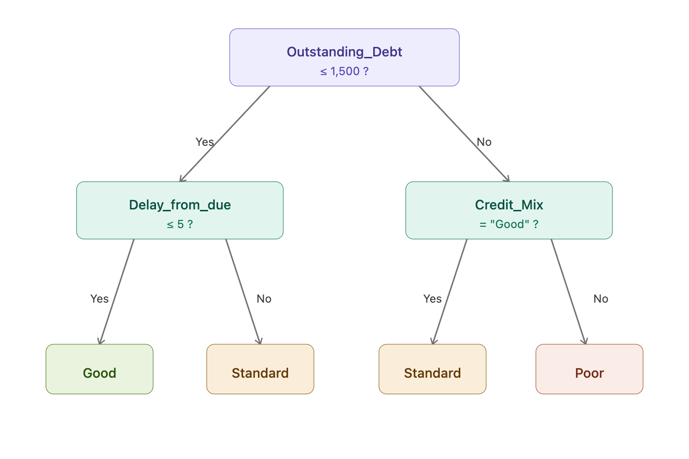

## 🚁 Overview

:::{.columns}
:::{.column width="50%" .fragment}
:::{.spacer-sm}
:::

### Aims of the lecture

- Understand what **classification** is and how it differs from regression.
- Extend **logistic regression** from binary to multiclass problems.
- Introduce **decision trees**: how splits are chosen and trees are grown.
- Understand **random forests** as an ensemble that reduces variance.
- Evaluate and **compare all three classifiers** on a real credit scoring problem.

:::

:::{.column width="50%" .fragment}

:::{.spacer-sm}
:::

### 📚 Required Libraries

```{python}
import numpy as np
import pandas as pd
import matplotlib.pyplot as plt
import seaborn as sns
import re

from sklearn.linear_model import LogisticRegression
from sklearn.tree import DecisionTreeClassifier, plot_tree
from sklearn.ensemble import RandomForestClassifier
from sklearn.preprocessing import StandardScaler, OneHotEncoder
from sklearn.impute import SimpleImputer
from sklearn.pipeline import Pipeline
from sklearn.compose import ColumnTransformer
from sklearn.model_selection import train_test_split
from sklearn.metrics import (
    confusion_matrix, ConfusionMatrixDisplay,
    classification_report, accuracy_score,
    precision_recall_fscore_support,
)
```

### 💅 Figure Styles

```{python}
sns.set_style('whitegrid')
sns.set_palette('Set2')
```

:::
:::


# From Regression to Classification

## The Classification Problem

- In regression, the response is **continuous**: $Y \in \mathbb{R}$.

- In **classification**, the response is **categorical**: $Y \in \{1, 2, \ldots, K\}$.

:::{.fragment}

:::{.spacer-sm}
:::

### Some examples

| Task | Response classes |
|---|---|
| Email spam detection | Spam / Not Spam |
| Medical diagnosis | Disease / No Disease |
| Handwritten digit recognition | 0, 1, 2, …, 9 |
| **Credit scoring** | **Good / Standard / Poor** |

:::

:::{.fragment}

:::{.spacer-sm}
:::

> The goal is to learn a **decision rule** $\hat{f}: \mathcal{X} \to \{1, \ldots, K\}$ that maps features to class labels as accurately as possible.

:::

## Recap: Binary Logistic Regression (Lecture 13)

:::{.fragment}

For a **binary** response $Y \in \{0, 1\}$, logistic regression models the probability of the positive class via the **sigmoid** function:

$$P(Y = 1 \mid \mathbf{x}) = \sigma(\mathbf{x}^\top \boldsymbol{\beta}) = \frac{1}{1 + e^{-\mathbf{x}^\top \boldsymbol{\beta}}}$$

:::

:::{.fragment}

The **decision rule** is simply:

$$\hat{y} = \begin{cases} 1 & \text{if } P(Y=1 \mid \mathbf{x}) \geq 0.5 \\ 0 & \text{otherwise} \end{cases}$$

This corresponds to a **linear decision boundary** $\mathbf{x}^\top\boldsymbol{\beta} = 0$ in feature space.

:::

:::{.fragment}

### Key properties

| Strength | Limitation |
|---|---|
| Interpretable coefficients | Assumes a **linear** boundary |
| Calibrated class probabilities | Struggles with interactions and non-linearity |
| Computationally efficient | Requires feature engineering for complex patterns |

:::

## Extending to Multiple Classes

:::{.fragment}

Binary logistic regression generalises to $K > 2$ classes in two main ways:

- **One-vs-Rest (OvR)**: fit $K$ separate binary classifiers, each asking "is this observation class $k$ or not?". Predict the class whose classifier returns the highest probability.

- **Multinomial (softmax)**: fit all classes simultaneously using a single model:

:::

:::{.fragment}

$$P(Y = k \mid \mathbf{x}) = \frac{\exp(\mathbf{x}^\top \boldsymbol{\beta}_k)}{\displaystyle\sum_{j=1}^{K} \exp(\mathbf{x}^\top \boldsymbol{\beta}_j)}$$

:::

:::{.fragment}

:::{.spacer-sm}
:::

> `sklearn`'s `LogisticRegression` uses the multinomial (softmax) approach by default when $K > 2$. The decision boundary remains **linear** — each class is still separated by a hyperplane.

:::

## Why Go Beyond Logistic Regression?

```{python}
#| echo: false
#| output-location: slide
#| fig-cap: "Two concentric circles cannot be separated by any straight line — logistic regression is structurally unable to solve this problem. A decision tree carves the space into axis-aligned rectangles and recovers the circular boundary well."

from sklearn.datasets import make_circles
from sklearn.linear_model import LogisticRegression
from sklearn.model_selection import train_test_split as tts
from matplotlib.colors import ListedColormap

X_c, y_c = make_circles(n_samples=500, noise=0.12, factor=0.45, random_state=42)
X_c_tr, X_c_te, y_c_tr, y_c_te = tts(X_c, y_c, test_size=0.3, random_state=42)

xx, yy = np.meshgrid(
    np.linspace(-1.6, 1.6, 300),
    np.linspace(-1.6, 1.6, 300),
)
grid = np.c_[xx.ravel(), yy.ravel()]

cmap_bg = ListedColormap(['#dce9ff', '#ffe4d6'])
cmap_pt = ListedColormap(['#2f5aa8', '#fc8d62'])

fig, axes = plt.subplots(1, 2, figsize=(13, 4.5))
for ax, clf, title in zip(
    axes,
    [LogisticRegression(),
     DecisionTreeClassifier(max_depth=5, random_state=42)],
    ['Logistic Regression (linear boundary)',
     'Decision Tree (depth 5)'],
):
    clf.fit(X_c_tr, y_c_tr)
    Z = clf.predict(grid).reshape(xx.shape)
    ax.contourf(xx, yy, Z, alpha=0.35, cmap=cmap_bg)
    # draw the decision boundary as a crisp contour line
    ax.contour(xx, yy, Z, levels=[0.5], colors='k', linewidths=1.2)
    ax.scatter(X_c_te[:, 0], X_c_te[:, 1], c=y_c_te,
               cmap=cmap_pt, s=25, edgecolors='k', lw=0.3)
    test_acc = accuracy_score(y_c_te, clf.predict(X_c_te))
    ax.set_title(f'{title}\nTest accuracy = {test_acc:.2f}', fontsize=10)
    ax.set_xlabel('$x_1$'); ax.set_ylabel('$x_2$')
    ax.set_xlim(-1.6, 1.6); ax.set_ylim(-1.6, 1.6)

plt.suptitle('Decision Boundaries: Logistic Regression vs. Decision Tree',
             fontsize=12, y=1.02)
plt.tight_layout()
plt.show()
```


# Meet the Data

## 💳 The Credit Score Dataset

:::{.fragment}

**Source**: Kaggle - Credit Score Classification dataset

:::

:::{.fragment}

:::{.spacer-sm}
:::

### The business problem

- A bank wants to automatically assign each customer to a credit score band:

  - **Good** — low credit risk; eligible for favourable rates
  - **Standard** — moderate risk; standard products
  - **Poor** — high risk; restricted lending

:::

:::{.fragment}

:::{.spacer-sm}
:::

### The data

- **100,000** labelled records across 8 months
- **27 raw features**: income, payment history, loan counts, credit utilisation, ...
- Each customer appears in multiple monthly snapshots

:::

## Loading the Data

### Training Data

- We download the file `train.csv` from Kaggle and load it into a DataFrame:

:::{.fragment}

```{python}
#| output-location: fragment
raw = pd.read_csv('data/train.csv', low_memory=False)
```

- We print the shape of the data:

:::

:::{.fragment}

```{python}
#| output-location: column-fragment
print('Train Data Size : ',raw.shape)
```

- We also check the first few rows to get a sense of the data:

:::

:::{.fragment}

```{python}
#| output-location: slide
raw.head()
```

:::

## A First Look at the Features

:::{.fragment}

```{python}
#| output-location: column-fragment
raw.info()
```

- Several numeric columns are stored as **strings** with dirty values (`_`, trailing letters, embedded underscores).
- Data is **missing** in many columns, but not with a consistent placeholder.
- Cleaning is needed before any modelling.

:::

## Data Cleaning

```{python}
#| echo: false
def to_float(s):
    if pd.isna(s): return np.nan
    s = str(s).strip()
    if s in ('_', '', 'nan', 'NaN', 'NA'): return np.nan
    s = re.sub(r'[^\d.\-]', '', s)
    try: return float(s)
    except ValueError: return np.nan

def parse_credit_age(s):
    if pd.isna(s) or str(s).strip() in ('NA', ''): return np.nan
    y = re.search(r'(\d+)\s*Year',  str(s))
    m = re.search(r'(\d+)\s*Month', str(s))
    return (int(y.group(1)) if y else 0) * 12 + (int(m.group(1)) if m else 0)

dirty_num = [
    'Age', 'Annual_Income', 'Num_of_Loan',
    'Num_of_Delayed_Payment', 'Changed_Credit_Limit',
    'Outstanding_Debt', 'Amount_invested_monthly', 'Monthly_Balance',
]

def clean(df):
    df = df.copy()
    df = df.drop(columns=['ID', 'Customer_ID', 'Name', 'SSN', 'Type_of_Loan'], errors='ignore')
    for col in dirty_num:
        if col in df.columns:
            df[col] = df[col].apply(to_float)
    df['Credit_History_Months'] = df['Credit_History_Age'].apply(parse_credit_age)
    df = df.drop(columns=['Credit_History_Age'])
    df['Credit_Mix'] = df['Credit_Mix'].replace('_', np.nan)
    return df

df = clean(raw)
```

:::{.fragment}

The raw data required several steps before modelling:

- **Dropped identifier and sensitive columns**: `ID`, `Customer_ID`, `Name`, `SSN`, `Type_of_Loan`
- **Coerced dirty numeric strings**: stripped embedded underscores and trailing characters from 8 columns
- **Parsed credit history age**: `"22 Years and 1 Months"` → integer months (`Credit_History_Months`)
- **Replaced `_` placeholder** with `NaN` in `Credit_Mix`

:::

:::{.fragment}

```{python}
#| output-location: column-fragment
print(f"Raw: {raw.shape} -> Cleaned: {df.shape}")
print(f"\nMissing values after cleaning:")
missing = df.isnull().sum()
print(
    missing[missing > 0]
    .sort_values(ascending=False)
    .to_string()
)
```

:::

## Target Distribution

- **Standard** is the majority class (~53 %), **Good** is the rarest (~18 %) — the dataset is moderately imbalanced.
- This means a naive classifier predicting "Standard" every time would achieve ~53 % accuracy — our models must do meaningfully better.

:::{.fragment}

```{python}
#| output-location: slide
#| fig-cap: "Credit score class distribution. Standard is the majority class (53 %); Good is the rarest (18 %). Imbalance will matter for evaluation."

fig, ax = plt.subplots(figsize=(7, 4))
sns.countplot(data=df, x='Credit_Score', ax=ax)

n = len(df)
for bar in ax.patches:
    pct = bar.get_height() / n * 100
    ax.text(bar.get_x() + bar.get_width() / 2,
            bar.get_height() + 400,
            f'{pct:.1f} %', ha='center', fontsize=10)

ax.set_xlabel('Credit Score Band')
ax.set_ylabel('Count')
ax.set_title('Credit Score Class Distribution')
plt.tight_layout()
plt.show()
```

:::

## Building the Feature Matrix

- We select **17 numeric** and **5 categorical** features, encode the target as an integer, then perform an **80/20 stratified train/validation split** — keeping **class proportions equal in both sets**.
  - We use the function `train_test_split` from `sklearn.model_selection` with `stratify=y`.

:::{.fragment}

```{python}
#| output-location: fragment
num_features = [
    'Age', 'Annual_Income', 'Monthly_Inhand_Salary', 'Num_Bank_Accounts',
    'Num_Credit_Card', 'Interest_Rate','Num_of_Loan', 'Delay_from_due_date',
    'Num_of_Delayed_Payment', 'Changed_Credit_Limit', 'Num_Credit_Inquiries',
    'Outstanding_Debt', 'Credit_Utilization_Ratio', 'Credit_History_Months',
    'Total_EMI_per_month', 'Amount_invested_monthly', 'Monthly_Balance',
]
cat_features = [
    'Month', 'Occupation', 'Credit_Mix',
    'Payment_of_Min_Amount', 'Payment_Behaviour',
]
# Encode target: Poor=0, Standard=1, Good=2
label_map = {'Poor': 0, 'Standard': 1, 'Good': 2}
y = df['Credit_Score'].map(label_map).values
X = df[num_features + cat_features]

X_train, X_val, y_train, y_val = train_test_split(
    X, y, test_size=0.2, stratify=y, random_state=42
)
print(f"Train: {X_train.shape[0]:,}")
print(f"Validation: {X_val.shape[0]:,}")
```

:::

## Preprocessing Pipeline

- Numeric features are **median-imputed** then **standardised**; categorical features are **mode-imputed** then **one-hot (dummy) encoded**.
- The preprocessor is **fitted on the training set only** and then applied to the validation set — preventing any **data leakage** - *where information from the validation set influences the training process*.

:::{.fragment}

```{python}
num_pipe = Pipeline([
    ('impute', SimpleImputer(strategy='median')),
    ('scale',  StandardScaler()),
])
cat_pipe = Pipeline([
    ('impute', SimpleImputer(strategy='most_frequent')),
    ('encode', OneHotEncoder(handle_unknown='ignore', sparse_output=False)),
])
preprocessor = ColumnTransformer([
    ('num', num_pipe, num_features),
    ('cat', cat_pipe, cat_features),
])

X_train_p = preprocessor.fit_transform(X_train)
X_val_p   = preprocessor.transform(X_val)

ohe_cols     = (preprocessor.named_transformers_['cat']['encode']
                .get_feature_names_out(cat_features).tolist())
feature_names = num_features + ohe_cols
print(f"Processed feature matrix: {X_train_p.shape}")
```

:::


# Evaluating Classifiers

## Choosing an Evaluation Metric

:::{.fragment}

**Accuracy** — the simplest metric: fraction of all predictions that are correct.

$$\text{Accuracy} = \frac{\text{Number correct}}{\text{Total predictions}}$$

:::

:::{.fragment}

**But accuracy can be misleading.** In our dataset, 53 % of customers are "Standard" — a classifier that always predicts "Standard" scores 53 % accuracy without learning anything useful.

:::

:::{.fragment}

For each class $k$ we also compute:

- **Precision** - Of all customers we predicted as $k$, what fraction truly are $k$?
- **Recall** - Of all customers that truly are $k$, what fraction did we identify?
- **F1** - Harmonic mean of precision and recall — balances the two.

:::

:::{.fragment}

> When classes are **imbalanced**, a model can game accuracy by favouring the majority class. Precision and recall expose this — they measure performance *within* each class separately.

:::

## Beyond Accuracy: The Confusion Matrix

:::{.fragment}

:::{.callout-important title="Confusion Matrix"}

For $K$ classes, a $K \times K$ table where entry $(i, j)$ is the number of observations of **true class $i$** predicted as **class $j$**.

- **Diagonal** entries: correct predictions.
- **Off-diagonal** entries: misclassifications.

:::

:::

:::{.fragment}

For our credit score problem ($K = 3$):

| | Predicted Poor | Predicted Standard | Predicted Good |
|---|---|---|---|
| **True Poor** | TP | FN | FN |
| **True Standard** | FP | TP | FN |
| **True Good** | FP | FP | TP |

:::

## Precision, Recall, and F1-Score

:::{.fragment}

For each class $k$, treating it as "positive" vs. "all others":

$$\text{Precision}_k = \frac{TP_k}{TP_k + FP_k} \qquad \text{Recall}_k = \frac{TP_k}{TP_k + FN_k}$$

$$F_{1,k} = \frac{2 \cdot \text{Precision}_k \cdot \text{Recall}_k}{\text{Precision}_k + \text{Recall}_k}$$

:::

:::{.fragment}

- **Precision**: of all customers *predicted* as class $k$, what fraction truly belong to $k$? High precision means few false alarms.
- **Recall**: of all customers who *truly* belong to class $k$, what fraction did we correctly identify? High recall means few missed cases.
- **F1**: the harmonic mean of precision and recall — useful when you care about both equally, and penalises extreme imbalances between the two.

:::

:::{.fragment}

:::{.spacer-sm}
:::

> In credit scoring, **recall for "Poor"** is critical — a missed high-risk customer can be very costly. But **precision** also matters — falsely flagging a "Good" customer harms trust.

:::

## Aggregating Across Classes

- Precision, recall, and F1 are defined **per class**, but we often want a **single number** to compare models. We aggregate across classes in different ways depending on how much we care about each one.

:::{.fragment}

| Strategy | How |
|---|---|
| **Macro average** | Unweighted mean across all $K$ classes |
| **Weighted average** | Mean weighted by class support (# true samples) |
| **Micro average** | Pool TP/FP/FN across all classes first, then compute |

:::

:::{.fragment}

:::{.spacer-sm}
:::

> **Weighted average** is usually most informative when class sizes differ — as they do here (Good is the rarest band).

:::


# Logistic Regression in Practice

## Fitting a Logistic Regression

- We fit a **multinomial logistic regression** on the preprocessed training data; `max_iter=1000` ensures convergence.
- The model is then used to predict the validation set, with overall accuracy printed as a quick baseline check.

:::{.fragment}

```{python}
#| output-location: fragment
lr = LogisticRegression(
    max_iter=1000,    # multinomial is the default for 3+ classes in sklearn ≥ 1.5
    random_state=42,
)
lr.fit(X_train_p, y_train)

y_pred_lr = lr.predict(X_val_p)
print(f"Validation accuracy: {accuracy_score(y_val, y_pred_lr):.4f}")
```

:::

## Evaluating Logistic Regression

- `classification_report` prints **per-class precision, recall, and F1** alongside macro and weighted averages.
- This gives a richer picture than accuracy alone — especially important given the class imbalance (Good ≈ 18 %, Standard ≈ 53 %).

:::{.fragment}

```{python}
#| output-location: fragment

print(classification_report(
    y_val, y_pred_lr,
    target_names=['Poor', 'Standard', 'Good'],
))
```

:::

## Confusion Matrix — Logistic Regression

- We produce the confusion matrix which summarizes the counts of true vs. predicted classes.

:::{.fragment}

```{python}
#| output-location: slide
#| fig-cap: "Confusion matrix for logistic regression (validation set). The linear boundary struggles most with the 'Good' class, which overlaps heavily with 'Standard'."

fig, ax = plt.subplots(figsize=(6, 5))
ConfusionMatrixDisplay(
    confusion_matrix(y_val, y_pred_lr),
    display_labels=['Poor', 'Standard', 'Good'],
).plot(ax=ax, colorbar=False, cmap='Oranges')
ax.set_title('Logistic Regression — Confusion Matrix', fontsize=11)
plt.tight_layout()
plt.show()
```

:::


# Decision Trees

## 🌳 What is a Decision Tree?

:::{.fragment}

A **decision tree** partitions the feature space into **rectangular regions** using a recursive sequence of binary splits. Each leaf is assigned the **majority class** of training observations that land there.

:::

:::{.fragment}

{width="50%"}

:::

:::{.fragment}

> Decision trees are **fully non-parametric** — no distributional assumption about the boundary shape. The tree structure *is* the model.

:::

## How Splits are Chosen: Gini Impurity

:::{.fragment}

At each node we search for the feature $j$ and threshold $t$ that **most reduce impurity** in the resulting child nodes.

:::

:::{.fragment}

:::{.callout-important title="Gini Impurity"}

For a node containing observations with class proportions $p_1, \ldots, p_K$:

$$G = 1 - \sum_{k=1}^{K} p_k^2$$

$G = 0$ means the node is **pure** (all one class). $G$ is maximised when classes are equally represented.

:::

:::

:::{.fragment}

The **Gini gain** of a candidate split is:

$$\Delta G = G(\text{parent}) - \frac{n_L}{n}\,G(\text{left}) - \frac{n_R}{n}\,G(\text{right})$$

We choose $(j^*, t^*)$ that **maximises** $\Delta G$.

:::

## Gini Impurity — Visualized

```{python}
#| echo: false
#| output-location: slide
#| fig-cap: "Gini impurity and (scaled) entropy as a function of the positive-class proportion in a 2-class problem. Both criteria are maximised at p = 0.5 and zero at pure nodes."

p = np.linspace(1e-9, 1 - 1e-9, 300)
gini    = 1 - p**2 - (1 - p)**2
entropy = -(p * np.log2(p) + (1 - p) * np.log2(1 - p))

fig, ax = plt.subplots(figsize=(9, 4))
ax.plot(p, gini,         lw=2.5, color='steelblue',
        label='Gini impurity')
ax.plot(p, entropy / 2,  lw=2.5, color='#fc8d62', linestyle='--',
        label='Entropy / 2  (scaled for comparison)')
ax.set_xlabel('Proportion of positive class $p$', fontsize=11)
ax.set_ylabel('Impurity', fontsize=11)
ax.set_title('Gini Impurity vs. Entropy (2-class case)', fontsize=12)
ax.legend(fontsize=10)
plt.tight_layout()
plt.show()
```

## Growing and Stopping a Tree

:::{.fragment}

A decision tree is grown **recursively**:

1. Find the best split $(j^*, t^*)$ at the current node.
2. Partition observations into left ($x_{j^*} \leq t^*$) and right ($x_{j^*} > t^*$) children.
3. Recurse on each child.
4. **Stop** when a stopping criterion is met.

:::

:::{.fragment}

### Stopping criteria

| Parameter | Effect |
|---|---|
| `max_depth` | Hard cap on tree height |
| `min_samples_split` | Minimum observations needed to attempt a split |
| `min_samples_leaf` | Minimum observations required in each resulting leaf |
| `min_impurity_decrease` | Only split if $\Delta G$ exceeds this threshold |

:::

## Overfitting with Decision Trees

```{python}
#| echo: false
#| output-location: slide
#| fig-cap: "Train and validation accuracy as a function of max_depth. Shallow trees underfit; very deep trees memorise the training set and generalise poorly."

depths       = range(1, 21)
train_accs   = []
val_accs     = []

for d in depths:
    dt_d = DecisionTreeClassifier(max_depth=d, random_state=42)
    dt_d.fit(X_train_p, y_train)
    train_accs.append(accuracy_score(y_train, dt_d.predict(X_train_p)))
    val_accs.append(accuracy_score(y_val,   dt_d.predict(X_val_p)))

fig, ax = plt.subplots(figsize=(9, 4.5))
ax.plot(depths, train_accs, lw=2.5, color='steelblue',
        marker='o', ms=4, label='Train accuracy')
ax.plot(depths, val_accs,   lw=2.5, color='#fc8d62',
        marker='s', ms=4, label='Validation accuracy')
best_d = int(np.argmax(val_accs)) + 1
ax.axvline(best_d, color='gray', lw=1.2, linestyle=':',
           label=f'Best depth = {best_d}')
ax.set_xlabel('Tree Depth (max_depth)', fontsize=11)
ax.set_ylabel('Accuracy', fontsize=11)
ax.set_title('Decision Tree: Train vs. Validation Accuracy by Depth', fontsize=12)
ax.legend(fontsize=10)
plt.tight_layout()
plt.show()
```

## Post-Pruning: Cost-Complexity

:::{.fragment}

The stopping criteria above are **pre-pruning** controls — they prevent the tree from growing too large in the first place.

**Post-pruning** takes the opposite approach: grow the full tree first, then *cut back* branches whose impurity reduction is outweighed by the cost of keeping them.

:::

:::{.fragment}

:::{.callout-important title="Cost-Complexity Criterion"}

For a subtree $T$ with $|T|$ leaves, define the penalised training cost:

$$R_\alpha(T) = R(T) + \alpha \cdot |T|$$

where $R(T)$ is the weighted leaf impurity and $\alpha \geq 0$ is the **complexity parameter**.

:::

:::

:::{.fragment}

| Value of $\alpha$ | Effect |
|---|---|
| $\alpha = 0$ | No penalty — the full, unpruned tree is returned |
| $\alpha$ small | Only the weakest branches are removed |
| $\alpha$ large | Heavy pruning; tree shrinks toward a single node |

The **optimal $\alpha$** is chosen by evaluating held-out performance across the pruning path.

:::

## Choosing $\alpha$ by Validation

- `cost_complexity_pruning_path` returns every $\alpha$ at which a branch would be pruned; we evaluate validation accuracy across this path and select the best value.

:::{.fragment}

```{python}
#| echo: false
#| output-location: slide
#| fig-cap: "Validation accuracy peaks at an intermediate α — just enough pruning to improve generalisation without discarding useful splits."

path   = DecisionTreeClassifier(random_state=42).cost_complexity_pruning_path(
             X_train_p, y_train)
alphas = path.ccp_alphas[:-1]          # drop the degenerate root (α → ∞)

# subsample so fitting stays fast (~60 candidate values)
step   = max(1, len(alphas) // 60)
alphas = alphas[::step]

train_accs_p, val_accs_p = [], []
for a in alphas:
    clf = DecisionTreeClassifier(ccp_alpha=a, random_state=42)
    clf.fit(X_train_p, y_train)
    train_accs_p.append(accuracy_score(y_train, clf.predict(X_train_p)))
    val_accs_p.append(accuracy_score(y_val,     clf.predict(X_val_p)))

best_idx   = int(np.argmax(val_accs_p))
best_alpha = alphas[best_idx]

fig, ax = plt.subplots(figsize=(9, 4.5))
ax.plot(alphas, train_accs_p, lw=2.5, color='steelblue',
        marker='o', ms=3, label='Train accuracy')
ax.plot(alphas, val_accs_p,   lw=2.5, color='#fc8d62',
        marker='s', ms=3, label='Validation accuracy')
ax.axvline(best_alpha, color='gray', lw=1.2, linestyle=':',
           label=f'Best α = {best_alpha:.5f}')
ax.set_xlabel('Complexity parameter α (ccp_alpha)', fontsize=11)
ax.set_ylabel('Accuracy', fontsize=11)
ax.set_title('Cost-Complexity Pruning: Accuracy vs. α', fontsize=12)
ax.legend(fontsize=10)
plt.tight_layout()
plt.show()
```

:::


# Decision Trees in Practice

## Fitting Our First Decision Tree

- To fit our decision tree we use `sklearn.tree.DecisionTreeClassifier` with `max_depth=8` and `min_samples_leaf=50` to prevent overfitting.
- We then predict the validation set and print the accuracy as a quick check.

:::{.fragment}

```{python}
dt = DecisionTreeClassifier(
    max_depth=8,
    min_samples_leaf=50,
    random_state=42,
)
dt.fit(X_train_p, y_train)

y_pred_dt = dt.predict(X_val_p)
print(f"Validation accuracy: {accuracy_score(y_val, y_pred_dt):.4f}")
```

:::

## Visualizing the Top of the Tree

- We produce a visualization of the top 3 levels of the tree using `sklearn.tree.plot_tree`.        
  - Each node displays the splitting feature, Gini impurity, sample count, and class distribution. 
  - Leaf colours indicate the predicted class.

:::{.fragment}

```{python}
#| output-location: slide
#| fig-cap: "The first three levels of the decision tree. Each node shows the splitting feature, Gini impurity, sample count, and class distribution. Leaf colours indicate the predicted class."

fig, ax = plt.subplots(figsize=(14, 5))
plot_tree(
    dt,
    max_depth=3,
    feature_names=feature_names,
    class_names=['Poor', 'Standard', 'Good'],
    filled=True,
    rounded=True,
    fontsize=7,
    ax=ax,
)
ax.set_title('Decision Tree — Top 3 Levels', fontsize=12)
plt.tight_layout()
plt.show()
```

:::

## Evaluating the Decision Tree

- To evaluate the decision tree, we print the classification report which includes precision, recall, and F1-score for each class, as well as macro and weighted averages.

:::{.fragment}

```{python}
print(classification_report(
    y_val, y_pred_dt,
    target_names=['Poor', 'Standard', 'Good'],
))
```

- We see that the tree performs reasonably well on "Poor" and "Standard" classes, but struggles with "Good" — likely due to overlap with "Standard" and the linear splits.
- It has higher recall for "Poor" than logistic regression, but lower precision — it flags more high-risk customers but also more false alarms.

:::

## Confusion Matrix — Decision Tree

- Finally we plot the confusion matrix for the decision tree predictions on the validation set, which shows the counts of true vs. predicted classes.

:::{.fragment}

```{python}
#| output-location: slide
#| fig-cap: "Confusion matrix for the decision tree (validation set). Rows are true labels; columns are predicted labels."

fig, ax = plt.subplots(figsize=(6, 5))
ConfusionMatrixDisplay(
    confusion_matrix(y_val, y_pred_dt),
    display_labels=['Poor', 'Standard', 'Good'],
).plot(ax=ax, colorbar=False, cmap='Blues')
ax.set_title('Decision Tree — Confusion Matrix', fontsize=11)
plt.tight_layout()
plt.show()
```

:::

# From Trees to Forests

## 🌲 The Variance Problem with Single Trees

:::{.fragment}

Decision trees have **high variance**: small changes in the training data can produce very different trees.

:::

:::{.fragment}

### Why?

- Each split depends entirely on which observations happened to be in the training set.
- A single influential observation can **redirect an entire branch**.
- **Deep trees memorise noise** rather than signal.

:::

:::{.fragment}

:::{.spacer-sm}
:::

> Can we reduce variance **without** substantially increasing bias?

:::

## Bagging: Bootstrap Aggregating

:::{.fragment}

**Idea**: train many trees on **different bootstrap samples** of the training data, then combine their predictions by majority vote.

:::

:::{.fragment}

:::{.callout-important title="Bagging Algorithm"}

For $b = 1, \ldots, B$:

1. Draw a **bootstrap sample** $\mathcal{D}^*_b$ of size $n$ from the training data (sampling *with* replacement).
2. Fit a full, unpruned decision tree $T_b$ on $\mathcal{D}^*_b$.

**Prediction**: $\hat{y} = \text{mode}\!\left\{T_1(\mathbf{x}), \ldots, T_B(\mathbf{x})\right\}$.

:::

:::

:::{.fragment}

- Each tree sees $\approx 63\%$ of observations; the rest form a natural **out-of-bag (OOB)** validation set.
- Averaging over $B$ trees reduces variance by a factor of $\approx B$ — *provided trees are uncorrelated*.

:::

## Random Forests: Decorrelating the Trees

:::{.fragment}

**The problem with plain bagging**: if one feature is very strong, all trees split on it first → trees are correlated → variance reduction is limited.

:::

:::{.fragment}

:::{.callout-important title="Random Forest"}

Bagging + **feature subsampling**: at each candidate split, consider only a **random subset of $m$ features** (default: $m = \lfloor\sqrt{p}\rfloor$) rather than all $p$.

:::

:::

:::{.fragment}

- Decorrelates trees → greater variance reduction than plain bagging.
- Slight bias increase (fewer features considered per split), but usually a net improvement.
- The OOB observations give a **free internal accuracy estimate** — no separate validation set needed.

:::

## Feature Importance from Random Forests

:::{.fragment}

Random forests provide a natural **variable importance** measure:

:::

:::{.fragment}

:::{.callout-important title="Mean Decrease in Impurity (MDI)"}

For feature $j$, sum the weighted Gini gain from every split on $j$ across all trees:

$$\text{Importance}(j) = \frac{1}{B}\sum_{b=1}^{B} \sum_{\substack{v \in T_b \\ \text{split on } j}} \frac{n_v}{n}\,\Delta G_v$$

Features with large, frequent Gini gains are ranked most important.

:::

:::

:::{.fragment}

> **Caveat**: MDI can overstate importance for high-cardinality or continuous features. Permutation importance is a more reliable alternative for such cases.

:::


# Random Forests in Practice

## Fitting a Random Forest

- We fit a random forest using `sklearn.ensemble.RandomForestClassifier` with 200 trees, `max_features='sqrt'`, and `min_samples_leaf=10` to prevent overfitting.
- We also set `oob_score=True` to compute the out-of-bag accuracy, which provides an internal validation estimate without needing a separate validation set.

:::{.fragment}

```{python}
rf = RandomForestClassifier(
    n_estimators=200,       # 200 trees in the ensemble
    max_features='sqrt',    # √p features considered per split
    min_samples_leaf=10,
    n_jobs=-1,              # parallelise across all CPU cores
    oob_score=True,         # compute out-of-bag accuracy
    random_state=42,
)
rf.fit(X_train_p, y_train)

y_pred_rf = rf.predict(X_val_p)
print(f"OOB accuracy:        {rf.oob_score_:.4f}")
print(f"Validation accuracy: {accuracy_score(y_val, y_pred_rf):.4f}")
```

:::

## Evaluating the Random Forest

- To evaluate the random forest, we print the classification report which includes precision, recall, and F1-score for each class, as well as macro and weighted averages.

:::{.fragment}

```{python}
#| output-location: slide

print(classification_report(
    y_val, y_pred_rf,
    target_names=['Poor', 'Standard', 'Good'],
))
```

:::

## Confusion Matrix — Random Forest

- We produce the confusion matrix for the random forest predictions on the validation set, which shows the counts of true vs. predicted classes.

:::{.fragment}

```{python}
#| output-location: slide
#| fig-cap: "Confusion matrix for the random forest (validation set). Compare the off-diagonal entries with the decision tree."

fig, ax = plt.subplots(figsize=(6, 5))
ConfusionMatrixDisplay(
    confusion_matrix(y_val, y_pred_rf),
    display_labels=['Poor', 'Standard', 'Good'],
).plot(ax=ax, colorbar=False, cmap='Greens')
ax.set_title('Random Forest — Confusion Matrix', fontsize=11)
plt.tight_layout()
plt.show()
```

:::

## Feature Importance Plot

- The following code produces a horizontal bar plot of the top 15 most important features according to mean decrease in Gini impurity. 
- The features at the top produce the largest, most frequent gains across all 200 trees in the random forest.

:::{.fragment}

```{python}
#| output-location: slide
#| fig-cap: "Top 15 most important features by mean decrease in Gini impurity. Features at the top produce the largest, most frequent gains across all 200 trees."

importances = pd.Series(rf.feature_importances_, index=feature_names)
top15 = importances.sort_values(ascending=False).head(15)

fig, ax = plt.subplots(figsize=(9, 5))
top15.sort_values().plot.barh(ax=ax, color='steelblue', edgecolor='white')
ax.set_xlabel('Mean Decrease in Impurity', fontsize=11)
ax.set_title('Random Forest — Top 15 Feature Importances', fontsize=12)
plt.tight_layout()
plt.show()
```

:::

## Comparing All Three Classifiers

- To compare the three classifiers head-to-head, we compute per-class precision, recall, and F1 for each model and visualise them side by side in a grouped bar chart.

:::{.fragment}

```{python}
#| output-location: slide
#| fig-cap: "Per-class precision, recall, and F1 for all three classifiers. The random forest leads across most metrics; logistic regression sets the linear baseline."

classes = ['Poor', 'Standard', 'Good']

results = {}
for name, pred in [('Logistic Reg.', y_pred_lr),
                   ('Decision Tree', y_pred_dt),
                   ('Random Forest', y_pred_rf)]:
    p, r, f, _ = precision_recall_fscore_support(
        y_val, pred, labels=[0, 1, 2])
    results[name] = pd.DataFrame(
        {'Class': classes, 'Precision': p, 'Recall': r, 'F1': f})

combined = (
    pd.concat(results, names=['Model'])
    .reset_index(level=0)
    .rename(columns={'level_0': 'Model'})
)
melted = combined.melt(
    id_vars=['Model', 'Class'],
    value_vars=['Precision', 'Recall', 'F1'],
    var_name='Metric', value_name='Score',
)

fig, axes = plt.subplots(1, 3, figsize=(13, 4.5), sharey=True)
palette = ['#fc8d62', 'steelblue', '#66c2a5']
for ax, metric in zip(axes, ['Precision', 'Recall', 'F1']):
    sub = melted[melted['Metric'] == metric]
    sns.barplot(data=sub, x='Class', y='Score', hue='Model', ax=ax,
                palette=palette)
    ax.set_title(metric, fontsize=11)
    ax.set_ylim(0, 1.05)
    ax.set_xlabel('')
    ax.set_ylabel('Score' if ax is axes[0] else '')
    ax.legend(fontsize=7)

plt.suptitle('Logistic Regression vs. Decision Tree vs. Random Forest — Per-Class Metrics',
             fontsize=11, y=1.02)
plt.tight_layout()
plt.show()
```

:::

## Summary Table

- We also summarise the key results in a table comparing validation accuracy, OOB accuracy (for random forest), whether the model has a linear decision boundary, and interpretability.

:::{.fragment}

```{python}
#| output-location: slide
summary = pd.DataFrame({
    'Model': [
        'Logistic Regression',
        'Decision Tree (depth 8)',
        'Random Forest (200 trees)',
    ],
    'Val. Accuracy': [
        round(accuracy_score(y_val, y_pred_lr), 4),
        round(accuracy_score(y_val, y_pred_dt), 4),
        round(accuracy_score(y_val, y_pred_rf), 4),
    ],
    'OOB Accuracy':   ['—', '—', round(rf.oob_score_, 4)],
    'Linear boundary?': ['Yes', 'No', 'No'],
    'Interpretable?':   ['Coefficients', 'Tree diagram', 'Feature importance only'],
})
print(summary.to_string(index=False))
```

:::

# Conclusion

## ✅ What We Covered

- **Classification** — predicting a categorical response and how it differs from regression.
- **Logistic regression** — binary sigmoid recap; multinomial extension; linear decision boundaries; applied as our baseline.
- **Decision trees** — recursive binary splitting via Gini impurity; overfitting and depth control; applied and visualized.
- **Random forests** — bagging + feature subsampling to reduce variance; OOB error; feature importance; applied and compared.
- **Evaluation** — confusion matrix, precision, recall, F1, and their multiclass extensions.
- **Three-way comparison** — the Kaggle Credit Score dataset taken from raw data to three fitted classifiers with a head-to-head performance summary.

:::{.fragment}

### 📅 What's Next?

- **Lecture 17**: Time Series — stationarity, autocorrelation, ARIMA, and forecasting with a real economic dataset.
- **Lectures 18–20**: Unsupervised learning, neural networks, and ethics in data science.

:::
