## 🚁 Overview

:::{.columns}
:::{.column width="50%" .fragment}
:::{.spacer-sm}
:::

### Aims of the lecture

- [Concepts of sampling and statistical bias:]{.accent}
    - Understand the different types of sampling mechanisms.
    - Learn how to critically assess data quality based on how it was collected.
    - Understand the different types of missingness and how to handle them.
    - Learn about the Miller case study and the ethical issues involved.

- [Concepts of missing data:]{.accent}
    - Understand the different types of missingness.
    - Learn how to handle missing data.
    - Learn about the Miller case study and the ethical issues involved.

:::

:::{.column width="50%" .fragment}

<br>

- [Case study: voter fraud:]{.accent}
    - Steven Miller's analysis of 'Voter Integrity Fund' surveys
    - Sources of bias
    - Ethical issues

:::{.fragment}

<br>

### 📚 Required Libraries

In this lecture we will be using the following libraries:

```{python}
import pandas as pd
import numpy as np
```

:::

:::
:::

# Sampling and statistical bias

## Sampling Terminology

:::{.fragment}

:::{.emphasize}
Here we'll introduce standard statistical terminology to describe data collection.
:::

### Populations and Samples

- All data are collected somehow. 
- A **sampling design** is a **way of selecting observational units for measurement**. 
- It can be construed as a particular relationship between:
    - a **population** (all entities of interest);
    - a **sampling frame** (all entities that are possible to measure); and
    - a **sample** (a specific collection of entities).

:::

:::{.fragment}

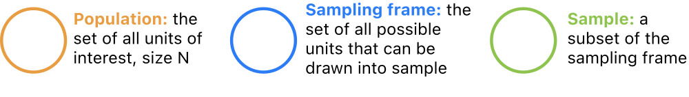

:::

## Population

### Remember Observational Units

- Last week, we introduced the terminology [observational unit]{.accent} to mean a certain (usually physical) entity measured for a study.
    - Using this terminology, datasets consist of observations made on observational units.
    - All data are data on some kind of thing, such as countries, species, locations, etc.

:::{.fragment}

### Populations

- A statistical [population]{.accent} is the [collection of all units of interest]{.accent}. For example:

    - All countries (GDP data).
    - All mammal species (Allison 1976).
    - All babies born in the US (babynames data).

:::

:::{.fragment}

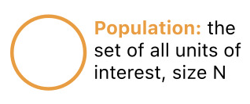

:::


## Sampling Frame

:::{.fragment}

### Unmeasurable Units

- There are usually some units in a population that can't be measured due to practical constraints
    - Example: many adult U.S. residents don't have phones or addresses.

:::

:::{.fragment}

### Sampling Frame

- For this reason, it is useful to introduce the concept of a [sampling frame]{.accent}, which refers to the collection of all units in a population that can be observed for a study. 
- Some examples might be:
    -  All countries reporting economic output between 1961 and 2019.
    - All nonendagered mammals that die of natural causes in monitored areas.
    - All babies with birth certificates from U.S. hospitals born between 1990 and 2018.

:::

:::{.fragment}

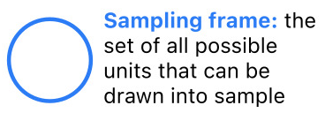

:::

## Sample

:::{.fragment}

### Sample of Measurable Units

- Finally, it's rarely feasible to measure every observable unit due to limited data collection resources
    - States don't have the time or money to call every phone number every year.
- A [sample]{.accent} is a collection of units in the sampling frame actually selected for study. For instance:
    - 234 countries;
    - 62 mammal species;
    - 13,684,689 babies born in CA;

:::

:::{.fragment}

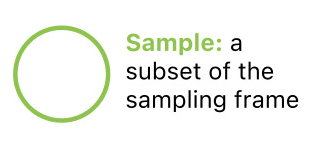

:::

## Sampling

### Common Scenarios

:::{.emphasize}
We can now imagine a few common sampling scenarios by varying the relationship between population, frame, and sample. 
:::

:::{.fragment}

Let's introduce some notation. Denote an observational unit by $U_i$, and let:

$$
\begin{alignat*}{2}
\mathscr{U} &= \{U_i\}_{i \in I} &&\quad(\text{universe}) \\
P &= \{U_1, \dots, U_N\} &&\quad(\text{population}) \\
    F &= \{U_j: j \in J \subset I\} &&\quad(\text{frame})\\
    S &\subseteq F &&\quad(\text{sample})
\end{alignat*}
$$

:::

## Sampling Scenarios: Population Census

Perhaps the simplest scenario is a [population census]{.accent}, where the entire population is observed. In this case:

$$S = F = P$$

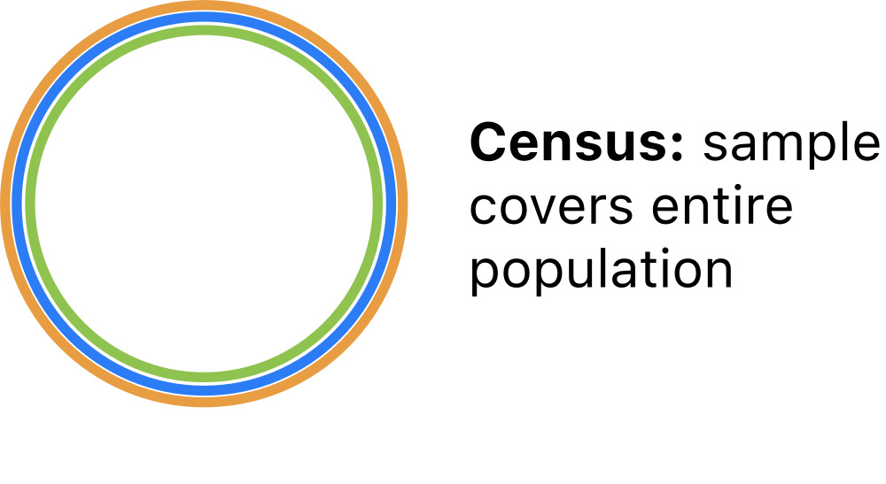

:::{.fragment}

:::{.emphasize}
From a census, all properties of the population are definitevely [known]{.accent}.
:::

- No need to model census data!

:::

## Sampling Scenarios: Simple Random Sample

The statistical gold standard is the [simple random sample]{.accent} (SRS) in which units are [selected at random]{.accent} from the population. In this case:

$$S \subset F = P$$

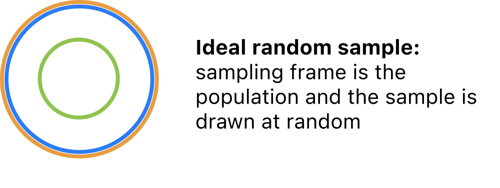

:::{.fragment}

:::{.emphasize}
From a SRS, sample properties are [reflective]{.accent} of population properties.
:::

- Can safely extrapolate from the sample to the population.

:::

## Sampling Scenarios: Typical Sample

More common in practice is a SRS from a sampling frame that [overlaps]{.accent} with the population but does not cover the population. In this case:

$$S \subset F \quad\text{and}\quad F \cap P \neq \emptyset$$

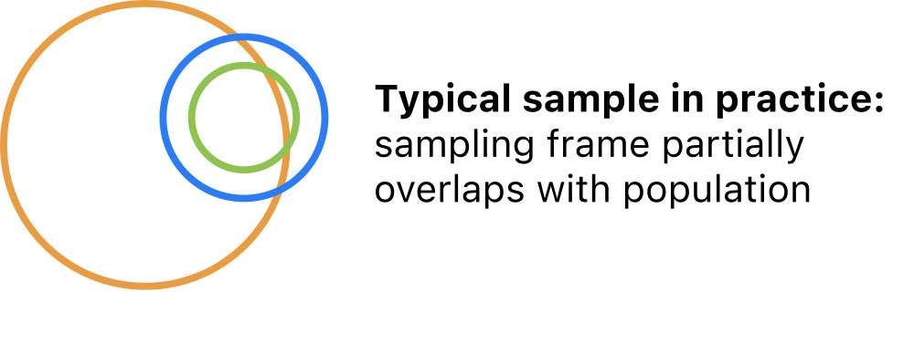

:::{.fragment}

:::{.emphasize}
In this scenario, sample properties are [reflective of the frame]{.accent}.
:::

- Can extrapolate to a subpopulation, but not the full population.

:::

## Sampling scenarios: administrative data


Also common is [administrative data]{.accent} in which all units are selected from a convenient frame that partly covers the population. In this case:

$$S = F \quad\text{and}\quad F\cap P \neq \emptyset$$

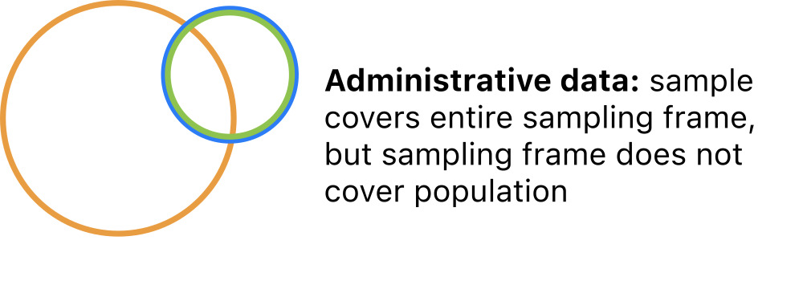

:::{.fragment}

:::{.emphasize}
Administrative data are [singular]{.accent}; they do not represent any broader group.
:::

- No reliable extrapolation is possible.

:::

## Extrapolation

:::{.fragment}

### Generalizing from Samples

- The relationships among the population, frame, and sample determine the [scope of inference]{.accent}.
    - The extent to which conclusions based on the sample are [generalizable]{.accent}. 

- A [good sampling design]{.accent} can ensure that the statistical properties of the sample are expected to match those of the population. If so, it is [sound to generalize]{.accent}:
    - The sample is said to be [representative]{.accent} of the population 
    - And the scope of inference is [broad]{.accent}.

:::

:::{.fragment}

- A [poor sampling design]{.accent} will produce samples that distort the statistical properties of the population. If so, it is not [sound to generalize]{.accent}:

    - Sample statistics are subjet to [bias]{.accent}
    - Scope of inference is [narrow]{.accent}.

:::

## Characterizing Sampling Designs

### Design Attributes

:::{.fragment}

The sampling scenarios above can be differentiated along two key [attributes]{.accent}:

1. The [overlap]{.accent} between the sampling frame and the population. 
    - frame $=$ population
    - frame $\subset$ population 
    - frame $\cap$ population $\neq \emptyset$

2. The [mechanism]{.accent} of obtaining a sample from the sampling frame.
    - Census.
    - Random sample.
    - Probability sample.
    - Nonrandom (convenience) sample

:::

:::{.fragment}

:::{.emphasize}
If you can articulate these two points, you have fully characterized the sampling design.
:::

:::

## Inclusion Probabilities

### Some more terminology...

- In order to describe sampling mechanisms precisely, we need a little terminology.

- For any way of drawing a sample from a frame, each unit has some [inclusion probability]{.accent} 
    - The [probability of being included in the sample]{.accent}.

:::{.fragment}

Let's suppose that the frame $F$ comprises $N$ units, and denote the inclusion probabilities by:

$$p_i = P(\text{unit } i \text{ is included in the sample})$$

:::

:::{.fragment}
:::{.emphasize}
The inclusion probability of each unit is usually determined by the [physical procedure]{.accent} of collecting data, rather than fixed [a priori]{.accent}.
:::

:::


## Sampling mechanisms

### What are Sampling Mechanisms?

- [Sampling mechanisms]{.accent} are [methods of drawing samples]{.accent} and are categorized into four types based on inclusion probabilities.

- In a [census]{.accent} every unit is included:
    - $p_i = 1$ for every unit $i = 1, \dots, N$.

- In a [random sample]{.accent} every unit is equally likely to be included:
    - $p_i \propto \frac{1}{N}$ for every unit $i = 1, \dots, N$.

- In a [probability sample]{.accent} units have different inclusion probabilities:
    - $p_i \neq p_j$ for at least one $i \neq j$.

- In a [nonrandom sample]{.accent} inclusion probabilities are indeterminate:
    - $p_i = \;?$ for at least one unit $i$.

- Let's characterize the sampling designs of some example datasets.

## GDP Data

### GDP Data

Annual observations of GDP growth for 234 countries from 1961 - 2018.

:::{.fragment}

```{python}
#| echo: false
gdp = pd.read_csv(
    "data/annual_growth.csv",
    encoding="latin1",
    index_col="Country Name"
)
gdp.head()
```

- [Population]{.accent}: all countries existing between 1961-2019.
- [Frame]{.accent}: all countries reporting economic output for some year between 1961 and 2019.
- [Sample]{.accent}: equal to frame.

:::

## GDP Data Scope

### GDP Data

```{python}
#| echo: false
gdp.head()
```

1. [Overlap]{.accent}: frame partly overlaps population.
2. [Mechanism:]{.accent} sample is a census of the frame.

:::{.fragment}

:::{.emphasize}
This is administrative data. [Scope of inference]{.accent}: none.
:::

:::

## Mammal Data

### Mammal data

Observations of average brain and body weights for 62 mammal species.

```{python}
#| echo: false
mammal = pd.read_csv("data/mammals.csv")
mammal.iloc[:, :5].head()
```

- [Population]{.accent}: all mammals.
- [Frame]{.accent}: all mammal species that die of natural causes in monitorerd areas.
- [Sample]{.accent}: individuals from 62 species sampled opportunistically.

## Mammal Data Scope

### Mammal Data

```{python}
#| echo: false
mammal.iloc[:, :5].head()
```


1. [Overlap]{.accent}: frame is a subset of population.
2. [Mechanism:]{.accent} convenience sampling.

:::{.fragment}

:::{.emphasize}
Let's call this convenience data. [Scope of inference]{.accent}: none.
:::

:::

## Baby Names Data

### Baby Names Data

Records of given names of babies in CA from 1990 - 2018.

```{python}
#| echo: false
baby_names = pd.read_csv("data/baby_names.csv")
baby_names.head()
```

- [Population]{.accent}: all babies born in CA between 1990 and 2018.
- [Frame]{.accent}: all babies born in CA between 1990 and 2018.
- [Sample]{.accent}: equal to frame.

## Baby Names Data

### Baby Names Data

Records of given names of babies in CA from 1990 - 2018.

```{python}
#| echo: false
baby_names = pd.read_csv("data/baby_names.csv")
baby_names.head()
```

1. Overlap: 
2. Mechanism:  

:::{.emphasize}
This is __________________ data. [Scope of inference]{.accent}: ______.
:::

# Statistical Bias

## Statistical bias

### What is bias?

- Statistical [bias]{.accent} is the average difference between a sample property and a population property across all possible samples under a particular sampling design.
    - In short, arises from systematic over- or under-representation of units.


## Data quality

### Making Judgements

- It's easy to fall into value judgements about a dataset based on scope of inference and bias.
    - But there's nothing inherently better or worse about the scenarios we've considered.
    - Our goal in all this is to create a framework for understanding the limitations of a given dataset so that we can make pragmatic choices about how to use it that align with the information it has to offer.

:::{.fragment}

It may help to map the scenarios we've considered onto an 'informativeness' spectrum:

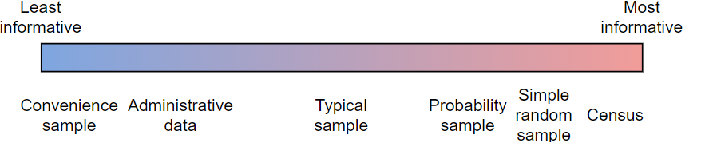

:::


# Missing Data

## The Missing Data Problem

### Missingness

:::{.emphasize}
[Missing data]{.accent} arise when one or more variable measurements fail for a subset of observations.
:::

- [Missingness]{.accent} modulates sampling design.
- [Types of missingness]{.accent}: MCAR, MAR, and MNAR.
- Common in pratice due to, for instance:
    - Equipment failure.
    - Sample contamination or loss.
    - Respondents leaving questions blank.
    - Attrition of study participants (dropping out).

- Missingness gets a bad rap. 
    - It is often derided, downplayed, minimized, and overlooked.
    - There is publication bias against studies with lots of missing data.
    - Many researchers and data scientists ignore it by simply deleting affected observations. 

- But it's a reality in most datasets, and deserves attention.

## Missing representations

### `NA`, `NaN`, `NULL`, `None`, etc.

- It is standard practice to record observations with missingness but enter a special symbol (`..`, `-`, `NA`, etcetera) for missing values.

- In python, missing values are mapped to a special float: `NaN`

- Pandas has the ability to map specified entries to `NaN` when parsing data files.

## Missing Data Example

Here is some made-up data with two missing values:

```{python}
some_data = pd.read_csv('data/some_data.csv', index_col = 'obs')
some_data.head()
```

## Missing representations

Pandas has the ability to map specified entries to NaN when parsing data files:

:::{.fragment}

```{python}
some_data = pd.read_csv('data/some_data.csv', index_col = 'obs', na_values = '-')
some_data
```

:::

## Calculations with NaNs

NaNs halt calculations on numpy arrays.

```{python}
# mean in numpy -- halt
some_data.values.mean()
```

:::{.fragment}

However, the default behavior in pandas is to ignore the NaN's, which allows the computation to proceed:

:::

:::{.fragment}

```{python}
# mean in pandas -- ignore
some_data.mean()
```

:::

:::{.fragment}

But here's the rub: those missing values could have been anything, and ignoring them changes the result from what it would have been!

:::

:::{.fragment}

```{python}
# one counterfactual scenario
some_data.loc[[2, 5], 'value'] = [5, 6] 
some_data.mean()
```

:::

---

## The missing data problem

In a nutshell, the [missing data problem]{.accent} is:

:::{.emphasize}
How should missing values be handled in a data analysis?
:::


:::{.fragment}

> Getting the software to run is one thing, but this alone does not address the challenges posed by the missing data. Unless the analyst, or the software vendor, provides some way to work around the missing values, the analysis cannot continue because calculations on missing values are not possible. There are many approaches to circumvent this problem. Each of these affects the end result in a different way. (Stef van Buuren, 2018)

:::

:::{.fragment}

- There's no universal approach to the missing data problem. The choice of method depends on:
    - The analysis objective;
    - The [missing data mechanism]{.accent}.

:::

## Missing data in PSTAT100

### Covering the Basics

- We will briefly cover the topic of missing data in this course.
- Specifically we will look into:
    - How to inspect for missing data.
    - Some simple options for handling missing data.
    - Characterizing types of missingness (missing data mechanisms).
    - Understanding missingness as a potential source of bias.
    - Basic do's and don't's when it comes to missingness. 

:::{.fragment}

### Further Reading

If you are interested in the topic, [Stef van Buuren's *Flexible Imputation of Missing Data*](https://stefvanbuuren.name/fimd/) (the source of one of your readings this week) provides an excellent introduction.

:::

## Missing data mechanisms

### Standard Framework

- The standard framework for understanding missingness is much like that for understanding sampling
    - Just as every unit has a probability of being selected in a sample, every observation has some probablitiy of going missing.


:::{.fragment}
:::{.emphasize}
A [missing data mechanism]{.accent} is a [process causing missingness]{.accent}.
:::
:::

::::{.fragment}

Suppose we have a dataset $\mathbf{X}$ (tidy) consisting of $n$ rows/observations and $p$ columns/variables, and define:

$$q_{ij} = P(x_{ij} \text{ is missing})$$

:::

:::{.fragment}

- [Missing data mechanisms]{.accent} are classified into three categories based on these probabilities:

1. [Missing completely at random (MCAR)]{.accent}
2. [Missing at random (MAR)]{.accent}
3. [Missing not at random (MNAR)]{.accent}

:::

## Missing Completely at Random (MCAR)

### MCAR Definition

:::{.emphasize}
Data are [missing completely at random (MCAR)]{.accent} if the [probabilities of missing entries are uniformly equal]{.accent}. 
:::

:::{.fragment}

$$q_{ij} = q \quad\text{for all}\quad i, j$$

:::

- This implies that the cause of missingness is unrelated to the data: missing values can be ignored.

- This is the easiest scenario to handle.*

## Missing at Random (MAR)

### MAR Definition

:::{.emphasize}
Data are [missing at random (MAR)]{.accent} if the [probabilities of missing entries depend on observed data]{.accent}.
:::

:::{.fragment}

$$q_{ij} = f(\mathbf{x}_i)$$

:::

:::{.fragment}

- This implies that information about the cause of missingness is captured within the dataset: it is possible to model the missing data.

- [Missing data methods]{.accent} typically address this scenario.

:::

## Missing Not at Random (MNAR)

### MNAR Definition

:::{.emphasize}
Data are [missing not at random (MNAR)]{.accent} if the [probabilities of missing entries depend on unobserved data]{.accent}.
:::

:::{.fragment}

$$q_{ij} = \; ?$$

:::

:::{.fragment}

- This implies that information about the cause of missingness is unavailable.
- This is the most complicated scenario.
:::


## GDP Missingness Example

In the GDP growth data, growth measurements are missing for many countries before a certain year. 

```{python}
#| echo: false
gdp.head()
```


- We might be able to hypothesize about why -- perhaps a country didn't exist or didn't keep reliable records for a period of time.

- However, the data as they are contain no additional information that might explain the cause of missingness. So these data are MNAR.


## Missing Data Fixes - Dropping

### Dropping Missing Data

:::{.emphasize}
The easiest approach to missing data is to drop observations with missing values: `df.dropna()`. 
:::

```{python}
gdp.dropna()
```

- Induces [information loss]{.accent}, but is otherwise appropriate if data are MCAR.
- Induces [bias]{.accent} if data are [MAR]{.accent} or [MNAR]{.accent}.


## Missing Data Fixes - Mean Imputation

### Perils of Mean Imputation

:::{.emphasize}
Imputation is the process of replacing missing values with estimated values, typically statistical estimates.
:::

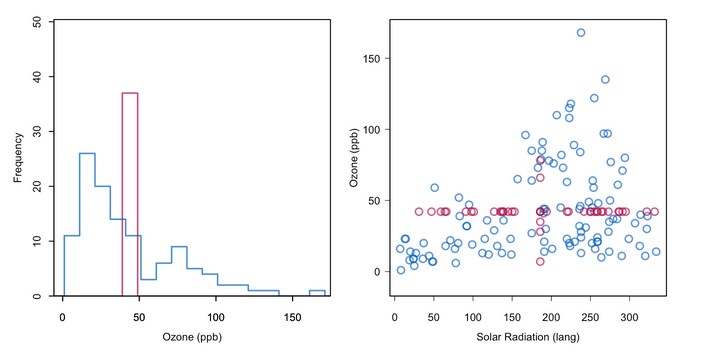

- Imputing too many missing values distorts the distribution of sample values.*

## Do's and don't's

- [Do:]{.accent}

    1. Always check for missing values *upon import*.
        - Tabulate the proportion of observations with missingness
        - Tabulate the proportion of values for each variable that are missing
    2. Take time to find out the reasons data are missing.
        - Determine which outcomes are coded as missing.
        - Investigate the physical mechanisms involved.
    3. Report missing data if they are present.

- [Don't:]{.accent}

    1. Use software defaults for handling missing values blindly.
    2. Drop missing values if data are not MCAR.

# Case Study: Voter Fraud

## Miller Case

### What is the Miller case?

- On November 21, 2020, a professor at Williams College, Steven Miller, filed an affidavit alleging that an analysis of phone surveys showed that among registered republican voters in PA:
    - ~40K mail ballots were fraudlently requested;
    - ~48K mail ballots were not counted.

:::{.fragment}

> President Donald J. Trump amplified the statement in a tweet, the Chairman of the Federal Elections Commission (FEC) referenced the statement as indicative of fraud, and a conservative group prominently featured it in a legal brief seeking to overturn the Pennsylvania election results. (Samuel Wolf, Williams Record, 11/25/20)

:::

:::{.fragment}

The Miller affidavit was criticized by statisticians as incorrect, irresponsible, and unethical.

:::

---

## The flawed assumption

On a purely mathematical level, Miller's calculations were standard. The key issue was a single flawed assumption:

> The analysis is predicated on the assumption that the responders are a **representative sample** of the population of registered Republicans in Pennsylvania for whom a mail-in ballot was requested but not counted, and responded accurately to the questions during the phone calls. (Miller affidavit)

- Essentially, Miller made two critical mistakes *in the analysis*:

    1. Failure to critically assess the [sampling design]{.accent} and [scope of inference]{.accent}.
    2. [Ignored missing data]{.accent}.

- We will conduct a *post mortem* and examine these issues. 
- Miller is a number theorist, not a trained survey statistician, so on some level his mistakes were understandable, but they did a lot of damage.

## Miller Case - Sampling design

> There were 165,412 unreturned mail ballots requested by registered republicans in PA.

- Those voters were surveyed by phone by Matt Braynard's private firm External Affairs on behalf of the Voter Integrity Fund. 

- We don't really know how they obtained and selected phone numbers or exactly what the survey procedure was, but here's what we do know:

    1. ~23K individuals were called on Nov. 9-10.
    2. The ~2.5K who answered were asked if they were the registered voter or a family member.
    3. If they said yes, they were asked if they requested a ballot.
    4. Those who requested a ballot were asked if they mailed it.

## Miller Case - Spot any immediate issues?

### Let's look in more detail

- ~23K individuals were called on Nov. 9-10
    - How did they pick who to call?
    - Narrow snapshot in time.
    - 9th and 10th were a Monday and Tuesday.
    - Mail ballots were still being counted; don't actually know whether returned ballots were ultimately counted or not by this time.

- The ~2.5K who answered were asked if they were the registered voter or a family member.
    - Family members could answer on behalf of one another.

- If they said yes, they were asked if they requested a ballot.
    + Misleading question: there's a registration checkbox; you don't have to file an explicit request in Pennsylvania.

- Those who requested a ballot were asked if they mailed it.
    - What about voters who claimed not to request a ballot? Did they receive one, and if so, did they mail it?

## Miller Case - Survey schematic

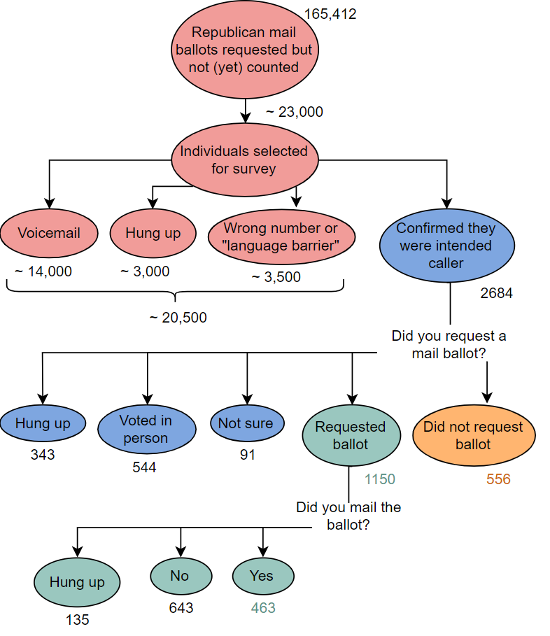


## Miller Case - Sampling design

### Problematic Sampling Design

- **Population**: republicans registered to vote in PA who had mail ballots officially requested that hadn't been returned or counted by November 9?

- **Sampling frame**: unknown; source of phone numbers unspecified.

- **Sample**: 2684 registered republicans or family members of registered repbulicans who had a mail ballot officially requested in PA and answered survey calls on Nov. 9 or 10.

- **Sampling mechanism**: nonrandom; depends on availability during calling hours on Monday and Tuesday, language spoken, and willingness to talk.

:::{.fragment}

:::{.emphasize}
This is not a representative sample of any meaningful population.*
:::

:::


## Miller Case - Missingness

### What is missing?

- Respondents hung up at every stage of the survey. 

    - This is probably not at random -- individuals who do not believe voter fraud occurred are more likely to hang up. 

    - However, we don't have any information about whether respondents think fraud occurred.

:::{.fragment}
:::{.emphasize}

So data are MNAR, and likely over-represent people more likely to claim they never requested a ballot.

:::
:::

## Miller Case - The Analysis

### Calculations

- The proportion of respondents who reported not requesting ballots among those who either voted in person, didn't request a ballot, or did request a ballot.
    - Ignored those who weren't sure and those who hung up.
    - Claimed that the estimated number of fraudulent requests was:
    $$\left(\frac{556}{1150 + 556 + 544}\right)\times 165,412 = 0.2471 \times 165,412 = 40,875$$

## Miller Case - Simulation

### How much bias might there be?

- It's not too tricky to envision sources of bias that would affect Miller's results. *How much bias might there be?*

- This is an oversimplification, but if we are willing to assume that

    1. Respondents all know whether they actually requested a ballot and tell the truth.
    2. Respondents who didn't request a ballot are more likely to be reached.
    3. Respondents who did request a ballot are more likely to hang up during the interview.

- Then we can show through a simple simulation that an actual fraud rate of under 1% will be estimated at over 20% almost all the time.


## Miller Case - Simulated population

First let's generate a population of 150K voters.

:::{.fragment}

```{python}
np.random.seed(41021)

# proportion of fraudlent requests
true_prop = 0.009

# generate population of 100K; 100 of 100K did not request a ballot
N = 150000
population = pd.DataFrame(data = {'requested': np.ones(N)})
num_nrequest = round(N*true_prop) - 1
population.iloc[0:num_nrequest, 0] = 0
```

:::

---

## Miller Case - Simulated Sample

### Introducing sampling weights

Then let's introduce sampling weights based on the conditional probability that an individual will talk with the interviewer given whether they requested a ballot or not.

:::{.fragment}

```{python}
# assume respondents tell the truth
p_request = 1 - true_prop
p_nrequest = true_prop

# assume respondents who claim no request are 15x more likely to talk
talk_factor = 15

# observed nonresponse rate
p_talk = 0.09

# conditional probability of talking given claimed request or not 
p_talk_request = p_talk/(p_request + talk_factor*p_nrequest) 
p_talk_nrequest = talk_factor*p_talk_request

# draw sample weighted by conditional probabilities
np.random.seed(41021)
population.loc[population.requested == 1, 'sample_weight'] = p_talk_request
population.loc[population.requested == 0, 'sample_weight'] = p_talk_nrequest
samp = population.sample(n = 2500, replace = False, weights = 'sample_weight')
```

:::

## Miller Case - Simulated Missing Mechanism

### Introducing missing values

Then let's introduce missing values at different rates for respondents who requested a ballot and respondents who didn't.

:::{.fragment}

```{python}
# assume respondents who affirm requesting are 4x more likely to hang up or deflect
missing_factor = 4

# observed missing/unsure rate
p_missing = 0.25

# conditional probabilities of missing given request status
p_missing_nrequest = p_missing/(0.8 + missing_factor*0.2) 
p_missing_request = missing_factor*p_missing_nrequest

# input missing values
np.random.seed(41021)
samp.loc[samp.requested == 1, 'missing_weight'] = p_missing_request
samp.loc[samp.requested == 0, 'missing_weight'] = p_missing_nrequest
samp['missing'] = np.random.binomial(n = 1, p = samp.missing_weight.values)
samp.loc[samp.missing == 1, 'requested'] = float('nan')
```

:::

## Miller Case - Simulated Result

If we then drop all the missing values and calculate the proportion of respondents who didn't request a ballot, we get:

:::{.fragment}

```{python}
# compute mean after dropping missing values
1 - samp.requested.mean()
```

:::

:::{.fragment}

<br>

:::{.emphasize}
So Miller's result is *expected* if the sampling and missing mechanisms introduce bias, even if the true rate of fraudulent requests is under 1% -- on the order of 1,000 ballots.
:::
:::

## Miller Case - Takeaways

### Main mistakes

- The main mistakes were ignoring the sampling design and missing data.
    - In other words, proceeding to analyze the data without first getting well-acquainted. 
    - We should assume these were [honest mistakes]{.accent}.

:::{.fragment}

:::{.emphasize}
After the affidavit was filed, a colleague spoke with Miller; he recanted and acknowledged his mistakes, but this received far less attention than the conclusions in the affidavit.
:::
:::

---

## Professional ethics and social responsibility

The American Statistical Association publishes [ethical guidelines for statistical practice](https://www.amstat.org/ASA/Your-Career/Ethical-Guidelines-for-Statistical-Practice.aspx). The Miller case violated a large number of these, most prominently, that an ethical practitioner:

- Reports the sources and assessed adequacy of the data, accounts for all data considered in a study, and explains the sample(s) actually used.

- In publications and reports, conveys the findings in ways that are both honest and meaningful to the user/reader. This includes tables, models, and graphics.

- In publications or testimony, identifies the ultimate financial sponsor of the study, the stated purpose, and the intended use of the study results.

- When reporting analyses of volunteer data or other data that may not be representative of a defined population, includes appropriate disclaimers and, if used, appropriate weighting.

## Conclusion

:::{.fragment}

::: {.spacer-sm}
:::

### ✅ What we covered

- Sampling design.
    - Terminology.
    - Sampling mechanisms.
    - Missing data mechanisms.
    - Statistical
- Case study in problematic design - Miller case.


:::

:::{.fragment}

::: {.spacer-sm}
:::

### 📅 What's next?

- Basic Data Preparation in `python`.
    - Missing data.
    - Duplicates.
    - Inconsistent data types.
    - Mixed data formats.
    - Invalid values.
    - Labelling issues.
    - Parsing dates.
    
:::

## References


