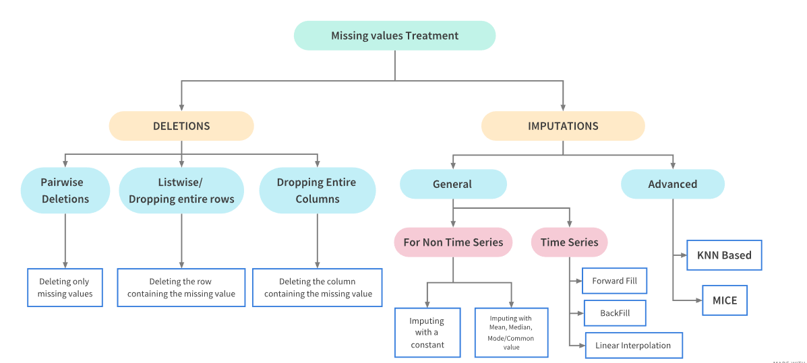

## 🚁 Overview

:::{.columns}
:::{.column width="50%" .fragment}
:::{.spacer-sm}
:::

### Aims of the lecture

- Study common data problems.
- Handling missing data.
- Searching for duplicate data.
- Fixing inconsistent data types.
- Labelling issues.

:::

:::{.column width="50%" .fragment}

:::{.spacer-sm}
:::

### 📚 Required Libraries

In this lecture we will be using the following libraries:

```{python}
import pandas as pd
import numpy as np
import random as rd
```

:::
:::

## 🧹 Tidy Data Review

### Tidy Data Standard

:::{.fragment}

:::{.callout-important title="Tidy Data Standard"}
For data to be tidy, it must satisfy the following three rules:

1. Each variable is a column.
2. Each observation is a row.
3. Each type of observational unit forms a table.
:::

:::

- If only it were so easy...

:::{.fragment}

### Other CommonData Problems

:::{.columns}
:::{.column width="50%"}

- Missing values.
- Duplicate records.
- Inconsistent or incorrect data types.
    - Dates, numbers as strings etc.

:::
:::{.column width="50%"}

- Invalid values / outliers.
- Labelling issues.

:::
:::
:::

# Data Preparation

## Data Preparation 

### What is data preparation?

:::{.fragment}

:::{.callout-important title="Data Preparation"}
Data preparation is the process of cleaning and transforming data to make it suitable for analysis. 
:::

- When we load data from a file we take steps to fascilitate analysis.
- Typically this process involes:
    - 🔍 [Identifying]{.accent} what is wrong with the data.
    - 🤔 [Determining]{.accent} how to "fix" the problem.
    - 🛠️ [Updating]{.accent} and [checking]{.accent} the result.

:::

## Missing Data

:::{.fragment}

### What causes missing data?

- Missing data can arise for a variety of reasons.
    - Field was [never collected]{.accent}.
    - Data was collected but [lost]{.accent} or [destroyed]{.accent}. 
    - Data was collected but [recorded incorrectly]{.accent}. 

- Understanding the [cause]{.accent} of missing data can be challenging. 🥲
    - But it can help us make good decisions! 👍

:::

:::{.fragment}

:::{.spacer-sm}
:::

### How do we handle missing data?

- Two approaches:
    - [Deletion:]{.accent} Removing the missing data from the dataset.
    - [Imputation:]{.accent} Filling in the missing data with replacement values.

:::

## Missing Data Treatments

### Treatment Dependencies



## Libraries and Practice Data

:::{.fragment}

### Library

To graphically analyze the missingness of data we can use the [Missingno Library](https://github.com/ResidentMario/missingno), which provides a suite of tools for visualizing missing data.

```{python}
import missingno as msno
```
:::

:::{.fragment}

<br>

### Practice Data

For our example we consider a simple example of a dataset with missing data.  We load the `nfl.csv` dataset which contains detailed NFL play-by-play data from 2009.

```{python}
nfl_data = pd.read_csv('data/nfl.csv')
```

:::

## Inspecting the Data

Let's take a first look at the first few rows and the shape.

```{python}
#| tbl-cap: "NFL Play-by-Play Data"
nfl_data.head()
```

- We can see that the dataset contains some missing data - i.e. `NaN` values.

:::{.fragment}

```{python}
#| output-location: column-fragment
nfl_data.shape
```

- We have 102 columns and ~360,000 rows!

:::

## Quantifying Missingness

:::{.fragment}

### Counting Missing Values

- We start by counting the number of missing values in each column.
    - `isnull` identifies missing values and `sum` counts them.

:::

:::{.fragment}

```{python}
#| output-location: column-fragment
missing_values_count = nfl_data.isnull().sum()
missing_values_count.sort_values(
    ascending=False
    ).head(10)
```
:::


:::{.fragment}

### Percentage Missingness

```{python}
#| output-location: column-fragment
# how many total missing values do we have?
total_cells = np.prod(nfl_data.shape)
total_missing = missing_values_count.sum()

# percent of data that is missing
percent_missing = (total_missing/total_cells) * 100
print(percent_missing)
```

- There are many nearly empty columns.

:::

## Missing Data Bar Chart

- We can use `msno.bar` to visualize the missing data counts (for the first few columns to make it easier to see).

:::{.fragment}

```{python}
#| fig-cap: "Missing Data Bar Chart"
msno.bar(nfl_data.iloc[:, 0:20], figsize=(15, 2.5))
```

:::

## Missing Data Matrix

- `msno.matrix` visualizes the missing data (white = missingness) for 500 random rows.

:::{.fragment}

```{python}
np.random.seed(42) # set seed for reproducible sample
nfl_data_sample = nfl_data.sample(500)
msno.matrix(nfl_data_sample.iloc[:,0:20], figsize=(15, 3))
```

- We see that the missing data patterns among columns are quite similar.
    - This indicates underlying relationships between the variables.
:::

## Missing Data Heatmap

- `msno.heatmap` visualizes these relationships.

:::{.fragment}

```{python}
msno.heatmap(nfl_data_sample.iloc[:,0:20], figsize=(10, 3))
```

- Positive correlation indicates variables are often missing together.
- Negative correlation indicates variables are often missing opposite each other.

:::

## Missing Data Dendogram

- We can use `msno.dendrogram` to visualize the hierarchical relationships between missing data.

:::{.fragment}

```{python}
msno.dendrogram(nfl_data_sample.iloc[:,0:20], figsize=(10, 3))
```

- Cluster leaves linked at a distance of 0 fully predict one anothers presence.
- It is clear then that this data set's missingness is not [completely random]{.accent}.

:::

## Understanding the Plots

:::{.fragment}

:::{.spacer-sm}
:::

### Lots of helpful information for analysis

- Variables with missing data can cause problems for analysis.
- How are the variables related to each other in terms of missingness.
    - Which variables are missing together.
    - Which variables are candidates for deletion / imputation.

:::

:::{.fragment}

### Missingness is itself information

- In real data missingness often carries signal.
    - **Example 1:** Income left blank because the person doesn't want to disclose it.
    - **Example 2:** Missing follow up appointments in drug trial because patients became too ill.
- By understanding missingness we help to avoid bias in our analysis.
    - **Example 1:** Sample will be mostly low and middle income earners. 
    - **Example 2:** Sample will be mostly patients who responded well to the treatment.

:::
## Why is the Data Missing?

:::{.fragment}

:::{.spacer-sm}
:::

### Ask the right questions!

- Is this data missing because it was never collected or because it doesn't exist?
    - If the data is missing because it doesn't exists (e.g. the age of pet for someone who doesn't have a pet) then we shouldn't impute the data.
    - If the data is missing because it was never collected then we should try imputation.

:::

:::{.fragment}

:::{.spacer-sm}
:::

### Missing Data Classifications

1. [Missing Completely at Random (MCAR)]{.accent} - missingness is completely random and independent of the observed data.
2. [Missing at Random (MAR)]{.accent} - missingness is not random, but can be fully accounted for by variables where there is complete information.
3. [Missing Not at Random (MNAR)]{.accent} - missingness depends on unobserved data or the value of the missing data itself.

:::

## Deleting Missing Data

:::{.fragment}

:::{.spacer-sm}
:::

### What is deletion?

- When data is MCAR we can consider [deletion]{.accent}, the removing missing data from the dataset.
    - **Pro:** This is a quick and effective way to handle missing data.
    - **Con:** It loses information.

:::

:::{.fragment}

:::{.spacer-sm}
:::

### Deleting Rows with Missing Data

```{python}
#| output-location: column-fragment
nfl_data_delete_rows = nfl_data.dropna()
# just how much data did we lose?
print("Rows in original dataset: %d \n" % nfl_data.shape[0])
print("Rows with na's dropped: %d" % nfl_data_delete_rows.shape[0])
```

- We have deleted every row! 

:::

:::{.fragment}

### Deleting Columns with Missing Data

```{python}
#| output-location: column-fragment
nfl_data_delete_columns = nfl_data.dropna(axis=1)
# just how much data did we lose?
print("Columns in original dataset: %d \n" % nfl_data.shape[1])
print("Columns with na's dropped: %d" % nfl_data_delete_columns.shape[1])
```

- We have deleted 37 out of 102 columns (approximately 36% of the data).

:::

## Imputation

:::{.fragment}

:::{.spacer-sm}
:::

### What is imputation?

- Imputation is the process of replacing missing data.
    - Methods depend on data characteristics.
    - What might be a good candidate value for missing data?

:::

:::{.fragment}

### When to use imputation?

- Looking at our example data we see that `TimeSecs` is a column that is missing a large number of values.
    - Looking at the [documentation](https://www.kaggle.com/maxhorowitz/nflplaybyplay2009to2016) we see that this column is the number of seconds left in the game when the play occurred.
    - It is likely that this data was not recorded therefore we can use imputation.

- However, `PenalizedTeam` is also missing values.
    - This column is the team that was penalized.
    - This data is missing because there was no penalty therefore we should not impute the data.

:::

## Simple Imputation Methods

:::{.fragment}

:::{.spacer-sm}
:::

### `fillna` method

- In pandas we can use the `fillna` method to impute missing data.
    - We can specify a value to replace missing data with.
        - Some [constant value]{.accent}.
        - [Statistics]{.accent} such as the mean, median, or mode.
    - Alternatively we can specify:
        - `method` to specify:
            - `ffill` - forward fill (use the previous value).
            - `bfill` - backward fill (use the next value).
        - `axis` to specify the axis to impute along (i.e. rows or columns).

:::

:::{.fragment}

:::{.emphasize}
Imputation is a powerful tool and a topic in it's own right.  We will not cover it in depth in this course but recommend you explore it further if your project data has missing values.
:::

:::

## Imputation Example

```{python}

nfl_data_imputed = nfl_data.bfill(axis=0).fillna(0)
nfl_data_imputed.head()
```

- We have specified `bfill` to replace the missing values with the next value.
- We specified `axis=0` to impute along the columns.
- We replaced all remaining missing values with 0.

## Duplicate Values

:::{.fragment}

:::{.spacer-sm}
:::

### Identifying Duplicate Values

- Well structured data should not have [duplicate values]{.accent}. 
    - Typically observations have a [unique identifier]{.accent}.
    - If there are duplicate values, we need to identify them and decide how to handle them.

:::

:::{.fragment}

### Example Data

For our example we consider synthetic customer data `customer.csv`.

:::

## Duplicate Data Example

```{python}
#| tbl-cap: "Customer Data"
customer_data = pd.read_csv('data/customer.csv')
customer_data.head()
```

- We can see that the dataset contains some duplicate values, lets count them using `duplicated()`:

:::{.fragment}

```{python}
#| output-location: column-fragment
dup_total = customer_data.duplicated().sum()
dup_index = customer_data.loc[customer_data.duplicated()].index
print(f"Total duplicate values: {dup_total}")
print(f"Duplicate index values: {dup_index}")
```

- Is this the whole story? Lets see..

:::

## Near Duplicates

:::{.fragment}

:::{.spacer-sm}
:::

### Near Duplicates

- We have identified 6 exact duplicates but have we missed any near duplicates?
- A common source of near duplicates is string formatting inconsistency - `Carol White` vs `carol white`.

:::

:::{.fragment}

### Make Formatting Consistent

- Let's make the formatting across all columns containing strings by:
    - Converting first letters of names to uppercase with `str.title()`.
    - Removing leading and trailing whitespace with `str.strip()`.

:::

:::{.fragment}

```{python}
customer_data['name']  = customer_data['name'].str.strip().str.title()
customer_data['email'] = customer_data['email'].str.strip().str.lower()
customer_data['city']  = customer_data['city'].str.strip().str.title()
```


- Now if we once again count the duplicates we find that:

:::

:::{.fragment}

```{python}
#| output-location: column-fragment
dup_total = customer_data.duplicated().sum()
dup_index = customer_data.loc[customer_data.duplicated()].index
print(f"Total duplicate values: {dup_total}")
print(f"Duplicate index values: {dup_index}")
```

:::

## Dealing with Duplicate Values

:::{.fragment}

:::{.spacer-sm}
:::

### Deleting Duplicate Values

- Most often we will simply [delete]{.accent} duplicate values.
    - We can use `drop_duplicates`.

:::

:::{.fragment}

```{python}
#| output-location: fragment
customer_data_no_dup = customer_data.drop_duplicates()
customer_data_no_dup.duplicated().sum()
```

:::

:::{.fragment}

:::{.spacer-sm}
:::

### Aggregating Duplicate Values

- Sometimes we may want to [aggregate]{.accent} duplicate values (to maximize information retention).
    - We can use `groupby` to aggregate duplicate values.

:::

:::{.fragment}

```{python}
#| output-location: column-fragment
customer_data_agg = customer_data.groupby(
    'customer_id'
    ).agg({
    'name': 'first',
    'email': 'first',
    'age': 'mean',
    'city': 'first',
    'spend': 'sum'
})
customer_data_agg.duplicated().sum()
```

:::

## Inconsistent Data Types

:::{.fragment}

:::{.spacer-sm}
:::

### Why types matter

- Pandas [infers]{.accent} types when you load a file
    - This inference is not always correct.
    - Wrong types break operations: 
        - [Averaging strings]{.accent}.
        - [Comparing dates stored as text]{.accent}.
- [Goal:]{.accent} each column should have a type that matches its [meaning]{.accent}.

:::

:::{.fragment}

:::{.spacer-sm}
:::

### Spotting and fixing

- Use available [data dictionaries]{.accent} or domain knowledge to help identify the correct type for each column.
- [Inspect]{.accent} with `dtypes`, `info()` and [spot-check]{.accent} values with `head()`, `unique()`.
- [Coerce]{.accent} into correct types (`pd.to_numeric`, `pd.to_datetime`)
- When reading CSVs, you can steer types with `dtype={...}` or parse dates with `parse_dates=[...] `.

:::

## Examples of Inconsistent Data Types

```{python}
example_df = pd.DataFrame({
    "Dates":["2024-01-01", "2024-01-02", "2024-01-03"],
    "Floats":["1.1", "2.2", "3.3"],
    "Booleans":["True", "False", "True"],
    })
```

:::{.fragment}

### Dates as strings

```{python}
#| output-location: fragment

print(f"Date column original type: {example_df['Dates'].dtype}")
example_df['Dates'] = pd.to_datetime(example_df['Dates'])
print(f"Date column new type: {example_df['Dates'].dtype}")
```

:::

:::{.fragment}

### Numbers are strings

```{python}
#| output-location: fragment
print(f"Floats column original type: {example_df['Floats'].dtype}")
example_df["Floats"] = pd.to_numeric(example_df["Floats"])
print(f"Floats column new type: {example_df['Floats'].dtype}")
```

:::

:::{.fragment}

### Booleans are strings

```{python}
#| output-location: fragment
print(f"Booleans column original type: {example_df['Booleans'].dtype}")
example_df["Booleans"] = (
    example_df["Booleans"].str.strip().str.lower().map({"true": True, "false": False}).astype("boolean")
)
print(f"Booleans column new type: {example_df['Booleans'].dtype}")
```

:::

## Mixed Data Formats

### Extra Problems

- Hand prepared data often contains mixed data formats.
    - Dates written as strings in different formats.
    - Names with titles, middle initials etc.
    - The options are endless...
- We will not cover this in depth in this course but recommend you explore it further if your project data has mixed data formats.

### Harder Example

```{python}
#| output-location: fragment
example_df = pd.DataFrame({
    "Dates":["2024-01-01", "21-12-2001", "December 21, 2001", "01/02/2024", "2018-03-04"],
    "Booleans":["True", "false", "true", "no", "yes"],
    })
```

## Examples of Mixed Data Formats

### Date Formats

```{python}
#| output-location: fragment
example_df['Dates'] = pd.to_datetime(example_df['Dates'], format="mixed")
print(example_df['Dates'])
```

### Boolean Formats

```{python}
#| output-location: fragment
example_df['Booleans'] = example_df['Booleans'].str.strip(
).str.lower(
).map({
    "true": True, "false": False, "yes": True, "no": False, 
    }).astype("boolean")
print(example_df['Booleans'])
```

- Pandas is very capable but often requires looking up syntax!

## Invalid Values

:::{.fragment}

:::{.spacer-sm}
:::

### Wrong but present

- [Invalid values]{.accent} are not missing: they appear as real entries but lie outside allowed rules:
    - Impossible ages.
    - Negative counts.
- They differ from [outliers]{.accent}: outliers can be legitimate extremes; invalid values break domain logic.
- Can be hard to spot since they will typically not produce errors.

:::

:::{.fragment}

### What to do

- Define [rules]{.accent} from the data dictionary or domain (ranges, allowed categories, regex for IDs).
- Use boolean masks: [`Series.between`]{.accent}, or `isin` to flag rows
- Drop, replace, or set to `NaN` and treat as missing.
- Document every rule: “why is this invalid?” matters as much as the code.

:::

:::{.fragment}

```{python}
#| output-location: column-fragment
ages = pd.Series([34, 200, 28, -1, 45])
ages[(ages < 0) | (ages > 120)]
```

:::

## Labelling Issues

:::{.fragment}

:::{.spacer-sm}
:::

### Same concept, different labels

- Categories may be spelled differently, use different casing, or mix codes (`"NYC"` vs `"nyc"` vs `"New York"`).
- Column names can be inconsistent across files (`customerID` vs `customer_id`), which blocks merges.

:::

:::{.fragment}

### Cleaning labels

- Normalize text: [`str.strip`]{.accent}, [`str.lower`]{.accent} / [`str.title`]{.accent}, remove extra spaces.
- Build a [mapping dictionary]{.accent} from raw labels to canonical ones and use [`map`]{.accent} or [`replace`]{.accent}.
- For analysis, prefer a single [canonical vocabulary]{.accent} per variable; keep a small “codebook” you can reuse.

```{python}
#| output-location: column-fragment
city_raw = pd.Series(["  nyc ", "NYC", "New York", "new york"])
city_raw.str.strip().str.title().replace({"Nyc": "New York"})
```

:::

## Parsing Dates

:::{.fragment}

### Dates are easy to get wrong

- Stored as strings with ambiguous order (`01/02/2024`), mixed formats, or Excel serial numbers.
- Wrong parsing silently shifts days or produces `NaT` only where you are not looking.

:::

:::{.fragment}

### Tools in pandas

- At load time: `pd.read_csv(..., parse_dates=["date_col"])` when the column is consistently formatted.
- After load: [`pd.to_datetime`]{.accent}; use `format='...'` when you know the pattern, and `errors='coerce'` to isolate bad strings.
- Use `dayfirst=True` or `yearfirst=True` when the data is not ISO-8601 and locale order matters.

```{python}
#| output-location: column-fragment
# Day-first strings (common outside the US); invalid entries become NaT.
pd.to_datetime(
    pd.Series(["15/03/2024", "02/04/2024", "not a date"]),
    errors="coerce",
    dayfirst=True,
)
```

:::

## Data Preparation Summary

### Things to remember

- Make sure you thoroughly understand the data you are working with.
    - Read the documentation / dictionaries.
    - Check for the common problems. 
    - Be prepared to go back and fix things you have missed.
- Document your data preparation process.
    - Highlight the issues you have found.
    - Justify your decisions.
- Being thorough initially will save you time in the long run! 

## Data Preparation Procedural Guide

### How to clean, a general guide!

:::{.columns .fragment}
:::{.column width="50%"}

1. Inspection.
2. Variable labeling.
3. Remove redundant / unused variables.
4. Fix data types and mixed formats.
5. Handle duplicates.
6. Handle missing values.
7. Clean strings / encode categorical variables.
8. Handle outliers / invalid values.
9. Final validation and documentation.

:::{.fragment}

:::{.emphasize}
This is a good guide to follow but it is not a strict recipe (as always)!
:::

:::

:::
:::{.column width="50%"}


:::
:::

## Conclusion

:::{.fragment}

::: {.spacer-sm}
:::

### ✅ What we covered

- Data preparation:
    - Missing data.
    - Duplicates.
    - Inconsistent data types.
    - Mixed data formats.
    - Invalid values.
    - Labelling issues.
    - Parsing dates.

:::

:::{.fragment}

::: {.spacer-sm}
:::

### 📅 What's next?

- Visualizations in python.
    - Matplotlib.
    - Seaborn.
    - Plotly.
    - Altair.
    
:::

## References
