## 🚁 Overview

:::{.columns}
:::{.column width="50%" .fragment}
:::{.spacer-sm}
:::

### Aims of the lecture

- Introduce the concept of **data visualization** and its importance in data analysis.
- Provide an overview of **basic visualizations** and when to use them.
- Introduce the `matplotlib` and `seaborn` libraries for creating visualizations in Python.
- Explore various **style** and **formatting** features including:
  - **Themes**.
  - **Variable Formatting**
  - **Facets**.

:::

:::{.column width="50%" .fragment}

:::{.spacer-sm}
:::

### 📚 Required Libraries

In this lecture we will be using the following **libraries**:

```{python}
import pandas as pd
import numpy as np
import matplotlib.pyplot as plt
import seaborn as sns
```

:::
:::

## Recap: Data Preparation

:::{.columns}

:::{.column width="40%" .fragment}

:::{.spacer-sm}
:::

### Data Preparation

- So far we have covered:
  - **Data acquisition** and understanding.
  - **Data preparation**.
    - **Tidy data**.
    - Quality assessment.
    - **Data cleaning**.
  
:::{.fragment}

:::{.spacer-sm}
:::

### Next Step: Exploration

- Perform **exploratory data analysis (EDA)**.
- Learn data **properties** and **relationships**.

:::

:::

:::{.column width="60%" .fragment}



:::

:::

# Exploratory Data Analysis (EDA)

## 🔍 Exploratory Data Analysis (EDA)

### What is EDA?

:::{.fragment}

:::{.callout-important title="Exploratory Data Analysis (EDA)"}
**Exploratory Data Analysis (EDA)** is the process of analyzing and **visualizing** data to understand its structure, identify patterns, and uncover insights.
:::

:::

:::{.fragment}

:::{.spacer-sm}
:::

### EDA Steps (Topic of next lecture)

1. Perform **univariate analysis** to understand the distribution of individual variables.
2. Perform **multivariate analysis** to explore relationships between variables.
3. Develop insights to inform modeling and deeper analysis.

:::

:::{.fragment}

:::{.spacer-sm}
:::

### Data Visualization

- A key component of EDA is **data visualization**.
- Python's standard library does not include a full visualization system, so we use dedicated libraries such as:
  - `matplotlib`, `seaborn`, `altair`, and `plotly`.

:::

# Data Visualization

## Data Visualization

### Why Visualize Data?

- Improve **interpretability** of data.
- Identify **patterns** and **relationships**.
- **Communicate** findings effectively.
- Explore data in an **interactive** way.

:::{.fragment}

:::{.spacer-sm}
:::

### Principles of Effective Data Visualization

- **Novel**
- **Informative**
- **Efficient**
- **Aesthetic**

:::

:::{.fragment}

> Always ask yourself, what is this visualization for? What is it contributing? 

:::


## Types of Visualization

### Exploratory vs Presentation

- **Exploratory visualizations**
  - Used during the data analysis process to explore and understand the data. 
  - Often created quickly and may not be polished or refined.
- **Presentation visualizations**
  - Used to communicate findings to an audience. 
  - Typically more polished and refined, with a focus on clarity and aesthetics.

:::{.fragment}

:::{.spacer-sm}
:::

### Static vs Interactive vs Animated

- **Static visualizations**: These are fixed images that do not allow for user interaction. 
- **Interactive visualizations**: These allow users to interact with the data, such as zooming, filtering, and hovering for more information.
- **Animated visualizations**: These show changes in data over time or through different conditions.

:::

## Visualizations in Python

:::{.columns}

:::{.column width="50%" .fragment}

:::{.spacer-sm}
:::

### `matplotlib` 

- The foundational visualization library in Python.
- Almost every other Python visualization library — including `seaborn` — is built on top of it.
- It is an **imperative** visualization library, meaning:
  - Total control over all plot details.
  - Often more verbose for common plots.
- Strong for fine-grained customization and publication-style figures.

:::{.fragment}

:::{.spacer-sm}
:::

### `seaborn`

- **Declarative** statistical visualization library for Python.
  - Similar to `ggplot2` in R.

:::

:::

:::{.column width="50%" .fragment}

- It is a **high-level statistical plotting API** on top of `matplotlib`, meaning:
  - You can create common statistical visualizations with much less code.
  - It provides useful defaults for **themes**, **color palettes**, and **grouped comparisons**.
- Well suited for EDA and rapid iteration.

:::{.fragment}

:::{.spacer-sm}
:::

### `altair`

- A **declarative** statistical visualization library for Python, based on Vega and Vega-Lite.
- It allows you to create **interactive visualizations** with a simple and intuitive syntax.
- Good for EDA, interactive documents, and reproducible chart specifications.

:::

:::

:::

## Plan for upcoming lectures

### Lecture 5 (Today)

- Summary of **standard visualizations** and when to use them.
  - Univariate, bivariate, multivariate.
  - Categorical vs continuous variables.
- Outline standard basic (static) visualization production.
  - Summarize foundations in `matplotlib`.
  - Focus on `seaborn` for EDA visualizations.

:::{.fragment}

:::{.spacer-sm}
:::

### Lecture 6 (Thursday)

- **Exploratory Data Analysis (EDA)**.
- Descriptive statistics.
- Complex `seaborn` visualizations.
- Interactive visualizations with `altair`.

:::

# Basic Visualizations

## Standard Visualizations

- We use different plots to visualize different types of data and relationships.
  - Univariate and continuous variables:
    - **Box plots**, **Violin plots**:
      - Visualize the descriptive statistics of a continuous variable.
    - **Histograms**, **Density plots** 
      - Visualize the distribution of a continuous variable.
  - Univariate and categorical variables:
    - **Bar plots**, **Count plots**
      - Visualize the count or proportion of categories in a categorical variable.
  - Bivariate and continuous:
    - **Scatter plots**
      - Visualize the relationship between two continuous variables.
    - **Line plots**
      - Visualize the relationship between two continuous variables over time or another continuous dimension.

## Example Data: `penguins`

- We will be using the `penguins` dataset loaded from the `seaborn` library.
- Contains measurements of penguins from three different species: Adelie, Chinstrap, and Gentoo.

:::{.fragment}

```{python}
penguins = sns.load_dataset("penguins")
print(penguins.shape)
penguins.head()
```

:::

## Object-Oriented Interface

### Pyplot vs Object-Oriented Interface

- **Pyplot interface**: A state-based interface that allows you to create plots using a simple, MATLAB-like syntax. It is suitable for quick and simple visualizations.
- **Object-oriented interface**: A more flexible and powerful interface that allows you to create complex and customized plots by working with figure and axes objects directly. It is recommended for more complex visualizations and when you need more control over the plot.
  - We will primarily be using the object-oriented interface in this course.

:::{.fragment}

:::{.spacer-sm}
:::

### Only covering the basics of `matplotlib`

- We will focus on plotting in `seaborn` and `altair` in this course.
- We only cover what we need to know in `matplotlib`.

:::

## `matplotlib` Scatter Plots

### Scatter Plots

- A **scatter plot** pairs two continuous variables to visualize their relationship.
- We produce scatter plots in `matplotlib` as follows:
  - Create a figure and axis object using `plt.subplots()`.
  - Call the appropriate plotting function on the axis object (e.g. `ax.scatter()`).
  - Customize the plot using axis methods `ax.set()`.
  - Display the plot using `plt.show()`.    

:::{.fragment}

```{python}
#| fig-align: center
#| output-location: slide
#| code-line-numbers: "|1|2-4|5-9|10-14|15"
#| fig-cap: "Scatter plot of bill length vs bill depth for the penguins dataset. (`matplotlib`)"
fig, ax = plt.subplots(figsize=(8, 6))          # Create figure and axis objects
ax.scatter (                                    # Create scatter plot
    "bill_length_mm", "bill_depth_mm",       
    data=penguins,                      
    color="steelblue",                          # Set point color
    alpha=0.95,                                 # Set point transparency
    s=7,                                        # Set point size
    marker="D"                                  # Set point type
    )
ax.set(                                         # Set labels and title
  xlabel="Bill Length (mm)",
  ylabel="Bill Depth (mm)",
  title="Penguin Bill Length vs Depth"
)
plt.show()                                     # Show the plot
```

:::

## `seaborn` Scatter Plots

### What makes `seaborn` so great?

- Uses the same underlying plotting functions as `matplotlib` but provides a **higher-level interface** for creating more **complex** and **informative** visualizations with less code.
- Provides built-in themes and color palettes to make it easy to create **attractive** visualizations.
- Provides functions for **visualizing statistical relationships**, such as regression lines and confidence intervals.

:::{.fragment}

:::{.spacer-sm}
:::

### Scatter Plots in `seaborn`

```{python}
#| fig-align: center
#| output-location: slide
#| code-line-numbers: "1|2-5|6-9|10"
#| fig-cap: "Scatter plot of bill length vs bill depth for the penguins dataset. (`seaborn`)"
sns.set_theme(style="whitegrid", palette="Set2")             # Set theme
ax = sns.scatterplot(                             # Create scatter plot
    x="bill_length_mm", y="bill_depth_mm",  
    data=penguins
)
ax.set(
  xlabel="Bill Length (mm)", 
  ylabel="Bill Depth (mm)", 
  title="Penguin Bill Length vs Depth")
plt.show()                                   # Show the plot
```

:::

## Variable Based Formatting

### Variable Based Formatting

- Often we would like to examine the influence of a **third categorical variable** on the relationship between two continuous variables.
- We can use **variable-based formatting** to color points by species in the penguins dataset.

:::{.fragment}

:::{.spacer-sm}
:::

### Scatter Plots with Variable Based Formatting in `seaborn`

```{python}
#| fig-align: center
#| output-location: slide
#| code-line-numbers: "4"
#| fig-cap: "Scatter plot of bill length vs bill depth grouped by species for the penguins dataset. (`seaborn`)"
ax = sns.scatterplot(                             
    x="bill_length_mm", y="bill_depth_mm",  
    data=penguins,
    hue="species"                           # Color points by species
)
ax.set(
  xlabel="Bill Length (mm)", 
  ylabel="Bill Depth (mm)", 
  title="Penguin Bill Length vs Depth")
plt.show()         
```

:::

## Adding Best Fit Lines

### What are best fit lines?

- A **best fit line** is a line that best fits the data points in a scatter plot, showing the overall trend of the relationship between the two variables.
- In `seaborn`, we can produce a scatter plot with a best fit line using the `lmplot()` function.

:::{.fragment}

> For now, treat best fit lines as descriptive trend summaries; we will cover regression assumptions, estimation, and interpretation in detail in future weeks.

:::

:::{.fragment}

:::{.spacer-sm}
:::

### `seaborn` Regression Lines

```{python}
#| fig-align: center
#| output-location: slide
#| code-line-numbers: "1-8|5|9|10|11"
#| fig-cap: "Scatter plot of bill length vs bill depth grouped by species with best fit lines and confidence intervals for the penguins dataset. (`seaborn`)"

g = sns.lmplot(                               # Scatter with regression line
    x="bill_length_mm", y="bill_depth_mm",  
    data=penguins,
    hue="species",                                      
    markers=["o", "s", "^"],                # Set point types
    line_kws={"linewidth": 2},               # Set line width
    height=5, aspect=1.8                    # Change figure size
)
g.set_axis_labels("Bill Length (mm)", "Bill Depth (mm)")
g.fig.subplots_adjust(top=0.9)
g.fig.suptitle("Penguin Bill Length vs Depth")
plt.show()
```

:::

## Bar Plots

### What are bar plots?

- A **bar plot** is a chart that presents categorical data with rectangular bars, where the length of each bar is proportional to the value it represents.
- They are often used to represent the count or proportion of categories in a categorical variable.
- Bar plots in `matplotlib` are driven by the summary data frame we provide. In this case, we compute species counts in advance.

:::{.fragment}

:::{.spacer-sm}
:::

### `matplotlib` Bar Plots

```{python}
#| output-location: column-fragment
bp1_data = penguins.groupby("species").size(
  ).reset_index(name="count")
print(bp1_data)
```

:::

:::{.fragment}

```{python}
#| fig-align: center
#| output-location: slide
#| code-line-numbers: "1|2-7"
#| fig-cap: "Bar plot of penguin species counts for the penguins dataset. (`matplotlib`)"
fig, ax = plt.subplots(figsize=(8, 6))
ax.bar(
  x="species", 
  height="count", 
  data=bp1_data, 
  color="steelblue"
  )
ax.set(
  xlabel="Species", 
  ylabel="Count", 
  title="Penguin Species Counts")
plt.show()
```

:::

## Count Plots

### `seaborn` Count Plots

- Although `seaborn` has an equivalent `barplot` function, a more useful plot type in this case is a `countplot`.
- This automatically computes the counts for each category and creates a bar plot without needing to pre-aggregate the data.

:::{.fragment}

```{python}
#| fig-align: center
#| output-location: slide
#| code-line-numbers: "1-4"
#| fig-cap: "Bar plot of penguin species counts for the penguins dataset. (`seaborn`)"
ax = sns.countplot(
    x="species",
    data=penguins
)
ax.set(
  xlabel="Species", 
  ylabel="Count", 
  title="Penguin Species Counts")
plt.show()
```

:::

## Subgrouping and Variable Formatting

### Subgrouping

- To examine relationships between multiple categorical variables, we can split each bar into subgroups based on a second categorical variable (e.g., species and island).

:::{.fragment}

:::{.spacer-sm}
:::

### Subgrouped Bar Plot with Variable Formatting

```{python}
#| fig-align: center
#| output-location: slide
#| code-line-numbers: "3|11"
#| fig-cap: "Bar plot of penguin species counts for the penguins dataset. (`seaborn`)"
ax = sns.countplot(
    x="island",
    hue="species",
    data=penguins
)
ax.set(
  xlabel="Island", 
  ylabel="Count", 
  title="Penguin Species Counts by Island"
  )
ax.legend(title="Species")
plt.show()
```

:::

## Box Plots

### What are box plots?

- A **box plot** (or box-and-whisker plot) is a standardized way of displaying the distribution of data based on a five-number summary: minimum, first quartile (Q1), median, third quartile (Q3), and maximum.
- It can also show **outliers** in the data.
- In `seaborn`, we can produce a box plot using the `boxplot()` function.

:::{.fragment}

:::{.spacer-sm}
:::

### `seaborn` Box Plots

```{python}
#| fig-align: center
#| output-location: slide
#| code-line-numbers: "1-4"
#| fig-cap: "Box plot of bill length by species for the penguins dataset. (`seaborn`)"
ax = sns.boxplot(
    x="species", y="bill_length_mm",
    data=penguins
)
ax.set(
  xlabel="Species", 
  ylabel="Bill Length (mm)", 
  title="Penguin Bill Length by Species"
  )
plt.show()
```

:::

## Histograms

### What are histograms?

- A **histogram** is a graphical representation of the distribution of a dataset, where the data is divided into bins and the frequency of data points in each bin is represented by the height of the bar.
- In `seaborn`, we can produce a histogram using the `histplot()` function.

:::{.fragment}

:::{.spacer-sm}
:::

### `seaborn` Histograms

```{python}
#| fig-align: center
#| output-location: slide
#| code-line-numbers: "1-6"
#| fig-cap: "Histogram of bill length for the penguins dataset. (`seaborn`)"
ax = sns.histplot(
    x="bill_length_mm",
    data=penguins,
    bins=20                 # Set number of bins
)
ax.set(xlabel="Bill Length (mm)", ylabel="Frequency", title="Histogram of Penguin Bill Length")
plt.show()
```

:::

## Histograms with Variable Formatting and Kernel Density Estimates

### Let's start exploring what we can do!

- We know that the three species of penguins have different bill length distributions.
  - Can we visualize this in a single plot?
- We can produce **kernel density estimates (KDEs)** to visualize the distribution of bill length for each species in a single plot.

:::{.fragment}

:::{.spacer-sm}
:::

### `seaborn` Histograms with KDEs

- Histogram shape depends on binning choices, and KDE smoothness depends on bandwidth, so use these as exploratory summaries rather than definitive evidence.

:::

:::{.fragment}

```{python}
#| fig-align: center
#| output-location: slide
#| code-line-numbers: "1-6"
#| fig-cap: "Histogram of bill length for the penguins dataset. (`seaborn`)"
ax = sns.histplot(
    x="bill_length_mm",
    data=penguins,
    bins=20,                # Set number of bins
    kde=True,               # Show kernel density estimate
    hue="species",          # Color by species
    multiple="layer"        # Overlay histograms
)
ax.set(xlabel="Bill Length (mm)", ylabel="Frequency", title="Histogram of Penguin Bill Length")
plt.show()
```

:::

## Violin Plots

### Fancy box plots?

- A **violin plot** is a method of plotting numeric data and can be understood as a combination of a box plot and a kernel density plot (a smoothed version of a histogram).
- It provides a visual summary of the distribution of the data, including its central tendency, variability, and shape.
- In `seaborn`, we can produce a violin plot using the `violinplot()` function.

:::{.fragment}

:::{.spacer-sm}
:::

### Violin Plots in `seaborn`

```{python}
#| fig-align: center
#| output-location: slide
#| code-line-numbers: "1-6"
#| fig-cap: "Violin plot of bill length by species for the penguins dataset. (`seaborn`)"
ax = sns.violinplot(
    x="species", y="bill_length_mm",
    data=penguins,
    inner="quartile",              # Show quartiles inside the violin
    color="steelblue"        # Set violin color
)
ax.set(
  xlabel="Species", 
  ylabel="Bill Length (mm)", 
  title="Penguin Bill Length by Species"
  )
plt.show()
```

:::

# Advanced Visualizations

## Advanced Visualizations

### Be creative!

- Remember, the goal of visualization is to communicate in a novel, aesthetic, and informative way.
- Don't be afraid to experiment with different visualizations.
- Tweak and change things until they are clear!

:::{.fragment}

:::{.spacer-sm}
:::

### Perhaps this boxplot is more informative?

```{python}
#| fig-align: center
#| output-location: slide
#| code-line-numbers: "1-4|6-13"
#| fig-cap: "Box plot of bill length by species for the penguins dataset. (`seaborn`)"
ax = sns.boxplot(
    x="bill_length_mm", y="species",
    data=penguins,
    color="lightsteelblue"
)
sns.stripplot(
    x="bill_length_mm", y="species",
    data=penguins,
    color="black",         # Use a single point color for readability
    alpha=0.5,           # Set point transparency
    size=4,              # Set point size
    ax=ax
)
ax.set(
  xlabel="Bill Length (mm)", 
  ylabel="Species", 
  title="Penguin Bill Length by Species"
  )
plt.show()
```

:::

## Continuous Variable Formatting

### We can also format using continuous variables!

- For our scatter plot suppose we wish to also incorporate the influence of body mass on bill length and depth.
- We can use the `size` and `sizes` parameters to control the size of points based on body mass.

### How about this scatter plot?

```{python}
#| fig-align: center
#| output-location: slide
#| code-line-numbers: "1-6"
#| fig-cap: "Scatter plot of bill length vs bill depth scaled by body mass for the penguins dataset. (`seaborn`)"
ax = sns.scatterplot(
    x="bill_length_mm", y="bill_depth_mm",
    data=penguins,
    hue="species",                           # Color by species 
    style="species",                         # Shape by species
    size="body_mass_g",                      # Scale by body mass
    sizes=(20, 200),                         # Set size range
    alpha=0.7                                # Set point transparency
)
ax.set(xlabel="Bill Length (mm)", ylabel="Bill Depth (mm)", title="Penguin Bill Length vs Depth Scaled by Body Mass")
ax.legend(title="Species")
plt.show()
```

# Multiplotting

## Multiplotting

### What is multiplotting?

- Particularly for reports we often are interested in showing multiple related visualizations together.
- In `matplotlib` we can use the `subplots()` function to create multiple plots in a single figure.
- In `seaborn` we can use the `FacetGrid()` function to create a grid of plots based on the values of one or more categorical variables.
  - This is where the improved efficiency of `seaborn` becomes apparent as we can create complex multiplots with very little code.

## Multiplots with `matplotlib`

### It's still important to learn the syntax

- We first create a figure with multiple axes using `plt.subplots()`.
- We then loop through the axes and create a scatter plot for each species in the penguins dataset.
- Finally, we adjust the layout and display the plot.

:::{.fragment}
:::{.spacer-sm}
:::

### Starting to get confusing! 😵‍💫

```{python}
#| fig-align: center
#| output-location: slide
#| code-line-numbers: "1-2|4|5|6-15|16-17"
#| fig-cap: "Multiplot of bill length vs bill depth for each species in the penguins dataset. (`matplotlib`)"

fig, axes = plt.subplots(nrows=1, ncols=3, figsize=(15, 5))     # Create figure and axes objects
species = penguins["species"].unique()              # Get unique species

for ax, sp in zip(axes, species):                            # Loop through axes and species
    subset = penguins[penguins["species"] == sp]             # Subset data for each species
    ax.scatter(                                              # Create scatter plot
        subset["bill_length_mm"], subset["bill_depth_mm"],
        color="steelblue",                          
        alpha=0.95,                                 
        s=7,                                        
        marker="D"                                  
    )
    ax.set_title(sp)                             
    ax.set_xlabel("Bill Length (mm)")            
    ax.set_ylabel("Bill Depth (mm)")             
plt.tight_layout()                          # Adjust layout
plt.show()                                     
```

:::

## Multiplots with `seaborn`

### So much easier! 😎

- We can create the same multiplot using `seaborn`'s `FacetGrid()` function with much less code.
- This function allows us to create a grid of plots based on the values of one or more categorical variables, making it easy to compare relationships across different groups.
- The `map()` method is used to apply a plotting function (e.g., `sns.scatterplot`) to each subset of the data defined by the grid.

:::{.fragment}

:::{.spacer-sm}
:::

### Facets with `seaborn`

```{python}
#| fig-align: center
#| output-location: slide
#| code-line-numbers: "1-5|6-12|13-16|18"
#| fig-cap: "Multiplot of bill length vs bill depth for each species in the penguins dataset. (`seaborn`)"
g = sns.FacetGrid(
  penguins, 
  col="species", 
  height=4, 
  aspect=1)  # Create facet grid
g.map(
  sns.scatterplot, 
  "bill_length_mm", "bill_depth_mm", 
  color="steelblue", 
  alpha=0.95, 
  s=7, 
  marker="D")  # Map scatter plot to each facet
g.set_axis_labels(
  "Bill Length (mm)", 
  "Bill Depth (mm)"
  )  # Set axis labels
g.fig.subplots_adjust(top=0.8)  # Adjust subplot spacing
g.fig.suptitle("Penguin Bill Length vs Depth by Species")  # Set overall title
plt.show()  # Show the plot
```

:::

## Conclusion

:::{.fragment}

::: {.spacer-sm}
:::

### ✅ What we covered

- Standard visualizations and when to use them.
- Basic visualization production in `matplotlib` and `seaborn`.
- Style and formatting features including themes, variable formatting, and facets.
- The importance of creativity and experimentation in data visualization.
- Facets.

:::

:::{.fragment}

::: {.spacer-sm}
:::

### 📅 What's next?

- **Exploratory Data Analysis (EDA)**.
- Descriptive statistics.
- Complex `seaborn` visualizations.
- Interactive visualizations with `altair`.
    
:::

## References
