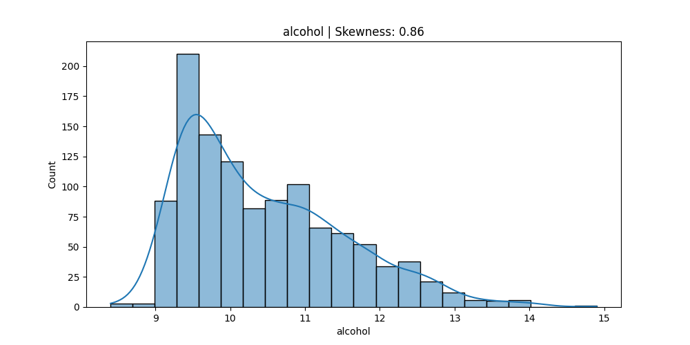

## 🚁 Overview

:::{.columns}
:::{.column width="50%" .fragment}
:::{.spacer-sm}
:::

### Aims of the lecture

- Perform **exploratory data analysis (EDA)** to understand data **properties** and **relationships**.
- Use and understand **descriptive statistics**:
  - **Location** measures (mean, median, mode).
  - **Spread** measures (variance, standard deviation, IQR).
  - **Shape** measures (skewness, kurtosis).
- Use **data visualizations**:
  - Histograms, box plots, scatter plots, heatmaps, etc.
  - Understand distributions.

:::

:::{.column width="50%" .fragment}

:::{.spacer-sm}
:::

### 📚 Required Libraries

In this lecture we will be using the following libraries:

```{python}
import pandas as pd
import numpy as np
import matplotlib.pyplot as plt
import seaborn as sns
import altair as alt
```

### 💅 Figure Styles

```{python}
sns.set_style('whitegrid')
sns.set_palette('Set2')
```

:::
:::

# Exploratory Data Analysis (EDA)

## 🔍 Exploratory Data Analysis (EDA)

### What is EDA?

:::{.fragment}

:::{.callout-important title="Exploratory Data Analysis (EDA)"}
**Exploratory Data Analysis (EDA)** is the process of analyzing and visualizing data to understand its structure, identify patterns, and uncover insights.
:::

:::

:::{.fragment}

:::{.spacer-sm}
:::

### EDA Steps

1. Perform **univariate analysis** to understand the distribution of individual variables.
2. Perform **multivariate analysis** to explore relationships between variables.
3. Develop insight to inform modelling and deeper analysis.

:::

:::{.fragment}

:::{.spacer-sm}
:::

### Tools for EDA

- Descriptive statistics (**location**, **spread**, **shape**, **dependence**).
- Data visualization.

:::

## EDA: Example Dataset 

### Example Data Set: `titanic`

```{python}
import seaborn as sns
titanic = sns.load_dataset('titanic')
titanic.head()
```

- The `titanic` dataset contains information about passengers on the Titanic.
- Collection of both categorical (e.g., `sex`, `class`) and numerical (e.g., `age`, `fare`) variables.

# Univariate Analysis

## EDA: Univariate Analysis

### What is Univariate Analysis?

- **Univariate analysis** focuses on analyzing and summarizing a single variable.
- Aim to understand:
  - **Location** (mean, median, mode).
  - **Variability** (standard deviation, interquartile range).
  - **Distribution shape** (skewness, kurtosis).
  - **Count** and **frequency** of categorical variables.

:::{.fragment}

:::{.spacer-sm}
:::

### Dependence on Variable Type

- Approach depends on the variable type:
  - **Quantitative** vs **Categorical** variables.
  - Changes the utility of different visualizations and statistics.

:::

## Categorical Variables: Frequency and Proportions

### Statistics

- For categorical variables, we produce a table summarizing:
  - **Frequency**: The count of each category.
  - **Proportion**: The relative frequency of each category (frequency divided by total count).

:::{.fragment}

:::{.spacer-sm} 
:::

### Example: Categorical Variable Summary Table

```{python}
pd.DataFrame({
  'Frequency': titanic['class'].value_counts(),
  'Proportion': titanic['class'].value_counts(normalize=True),
  'Percentage': titanic['class'].value_counts(normalize=True).mul(100).round(2).astype(str) + '%'
}).sort_index()
```

:::

## Categorical Variables: Visualizations

### Visualization Options

- Our visualization options essentially just display this same information:
  - **Count Plot**: Displays the frequency or proportion of each category.
  - **Pie Chart**: Shows the proportion of each category as a slice of a pie.
    - Not generally recommended for accurate comparison, but can be useful for showing relative proportions.

:::{.fragment}
:::{.spacer-sm}
:::

### Example: Count Plot and Pie Chart

```{python}
#| output-location: slide
#| fig-cap: "Count plot and pie chart for the `class` variable in the `titanic` dataset."
#| 
colors = sns.color_palette('pastel')[0:3]
fig, ax = plt.subplots(nrows=1, ncols=2, figsize=(15, 4))
sns.countplot(
  data=titanic, 
  x='class', 
  ax=ax[0]
  )
ax[0].set(title='Count Plot', xlabel='Class', ylabel='Count')
ax[1].pie(
  titanic['class'].value_counts(), 
  labels=titanic['class'].unique(), 
  colors=colors, 
  autopct='%.0f%%')
ax[1].set_title('Pie Chart of Passenger Class')
plt.tight_layout()
plt.show()
```

:::

## Numerical Variables: Location Measures

:::{.fragment}

:::{.spacer-sm}
:::

### Mean

- For some numerical variable we have sample $x_1, ..., x_n$ of $n$ observations.  The **sample mean** is computed as: $$\bar{x} := \frac{1}{n} \sum_{i=1}^n x_i.$$

:::

:::{.fragment}

:::{.spacer-sm}
:::

### Median

- The **sample median** is the **middle value** of the **sorted data**. 
  - If $n$ is **odd**, it is the value at position $\frac{n+1}{2}$. 
  - If $n$ is **even**, it is the average of the values at positions $\frac{n}{2}$ and $\frac{n}{2}+1$.

:::

:::{.fragment}

:::{.spacer-sm}
:::

### Mode

- The **sample mode** is the value that appears most frequently in the data.

:::

## Example: Location Measures

```{=html}
<style>
.dot { cursor: pointer; transition: r 0.15s; }
.dot:hover { r: 9; }
.chip {
  display: inline-flex; align-items: center; gap: 6px;
  background: #f1f1f0; border: 0.5px solid #ccc;
  border-radius: 20px; padding: 4px 10px 4px 8px;
  font-size: 13px; color: #222;
}
.chip button {
  background: none; border: none; cursor: pointer;
  color: #888; font-size: 14px; line-height: 1; padding: 0 0 0 2px;
}
.chip button:hover { color: #222; }
</style>

<div style="padding: 0.5rem 0 0; font-family: sans-serif;">
  <div style="display: flex; gap: 8px; flex-wrap: wrap; margin-bottom: 10px; align-items: center;" id="chips"></div>
  <div style="display: flex; gap: 8px; margin-bottom: 1rem;">
    <input type="number" id="new-val" placeholder="Add a value"
      style="width: 130px; padding: 5px 10px; border: 0.5px solid #ccc; border-radius: 6px; font-size: 14px;"
      step="1">
    <button onclick="addValue()"
      style="padding: 0 16px; border: 0.5px solid #ccc; border-radius: 6px; background: transparent; cursor: pointer; font-size: 14px;">
      Add
    </button>
  </div>

  <svg id="nl" width="100%" viewBox="0 0 640 130" style="overflow: visible; display: block;"></svg>

  <div style="display: grid; grid-template-columns: repeat(3, minmax(0,1fr)); gap: 10px; margin-top: 2.5rem;">
    <div style="background: #f5f5f5; border-radius: 8px; padding: 10px 14px;">
      <div style="font-size: 12px; color: #888; margin-bottom: 4px;">Mean</div>
      <div id="stat-mean" style="font-size: 20px; font-weight: 500; color: #185FA5;"></div>
      <div style="font-size: 11px; color: #aaa; margin-top: 3px;">average of all values</div>
    </div>
    <div style="background: #f5f5f5; border-radius: 8px; padding: 10px 14px;">
      <div style="font-size: 12px; color: #888; margin-bottom: 4px;">Median</div>
      <div id="stat-median" style="font-size: 20px; font-weight: 500; color: #0F6E56;"></div>
      <div style="font-size: 11px; color: #aaa; margin-top: 3px;">middle value when sorted</div>
    </div>
    <div style="background: #f5f5f5; border-radius: 8px; padding: 10px 14px;">
      <div style="font-size: 12px; color: #888; margin-bottom: 4px;">Mode</div>
      <div id="stat-mode" style="font-size: 20px; font-weight: 500; color: #854F0B;"></div>
      <div style="font-size: 11px; color: #aaa; margin-top: 3px;">most frequent value</div>
    </div>
  </div>
</div>

<script>
let data = [2, 4, 4, 5, 7, 9, 9, 9, 12, 15];

function calcStats(arr) {
  const sorted = [...arr].sort((a, b) => a - b);
  const mean = arr.reduce((s, v) => s + v, 0) / arr.length;
  const mid = Math.floor(sorted.length / 2);
  const median = sorted.length % 2 === 0
    ? (sorted[mid - 1] + sorted[mid]) / 2
    : sorted[mid];
  const freq = {};
  arr.forEach(v => freq[v] = (freq[v] || 0) + 1);
  const maxF = Math.max(...Object.values(freq));
  const modes = Object.keys(freq).filter(k => freq[k] === maxF).map(Number).sort((a, b) => a - b);
  return { mean, median, modes, multiMode: modes.length > 1 };
}

function toX(v, min, max, pad = 40) {
  return pad + (v - min) / (max - min) * (640 - pad * 2);
}

function render() {
  if (data.length === 0) return;
  const stats = calcStats(data);
  const sorted = [...data].sort((a, b) => a - b);
  const minV = sorted[0], maxV = sorted[sorted.length - 1];
  const range = maxV - minV || 1;
  const padMin = minV - range * 0.12;
  const padMax = maxV + range * 0.12;

  document.getElementById('stat-mean').textContent = +stats.mean.toFixed(2);
  document.getElementById('stat-median').textContent = +stats.median.toFixed(2);
  document.getElementById('stat-mode').textContent = stats.multiMode ? stats.modes.join(', ') : stats.modes[0];

  const svg = document.getElementById('nl');
  svg.innerHTML = '';
  const axisY = 68;
  const axisCol = 'rgba(0,0,0,0.2)';
  const textCol = 'rgba(0,0,0,0.45)';

  const line = document.createElementNS('http://www.w3.org/2000/svg', 'line');
  line.setAttribute('x1', '20'); line.setAttribute('x2', '620');
  line.setAttribute('y1', axisY); line.setAttribute('y2', axisY);
  line.setAttribute('stroke', axisCol); line.setAttribute('stroke-width', '1.5');
  svg.appendChild(line);

  for (let i = 0; i <= 6; i++) {
    const v = padMin + (padMax - padMin) * i / 6;
    const x = toX(v, padMin, padMax);
    const tick = document.createElementNS('http://www.w3.org/2000/svg', 'line');
    tick.setAttribute('x1', x); tick.setAttribute('x2', x);
    tick.setAttribute('y1', axisY - 4); tick.setAttribute('y2', axisY + 4);
    tick.setAttribute('stroke', axisCol); tick.setAttribute('stroke-width', '1');
    svg.appendChild(tick);
    const lbl = document.createElementNS('http://www.w3.org/2000/svg', 'text');
    lbl.setAttribute('x', x); lbl.setAttribute('y', axisY + 16);
    lbl.setAttribute('text-anchor', 'middle');
    lbl.setAttribute('font-size', '11'); lbl.setAttribute('fill', textCol);
    lbl.textContent = +v.toFixed(1);
    svg.appendChild(lbl);
  }

  const stackOffset = {};
  [...data].sort((a, b) => a - b).forEach(v => {
    const x = toX(v, padMin, padMax);
    const count = stackOffset[v] = (stackOffset[v] || 0) + 1;
    const y = axisY - 10 - (count - 1) * 16;
    const c = document.createElementNS('http://www.w3.org/2000/svg', 'circle');
    c.setAttribute('cx', x); c.setAttribute('cy', y); c.setAttribute('r', '6');
    c.setAttribute('fill', 'rgba(0,0,0,0.08)');
    c.setAttribute('stroke', axisCol); c.setAttribute('stroke-width', '1');
    c.classList.add('dot');
    svg.appendChild(c);
  });

  const markers = [
    { val: stats.mean,   col: '#185FA5', label: 'mean',   yOff: 28 },
    { val: stats.median, col: '#0F6E56', label: 'median', yOff: 44 },
    ...stats.modes.map(m => ({ val: m, col: '#854F0B', label: 'mode', yOff: 60 }))
  ];

  markers.forEach(({ val, col, label, yOff }) => {
    const x = toX(val, padMin, padMax);
    const tickLine = document.createElementNS('http://www.w3.org/2000/svg', 'line');
    tickLine.setAttribute('x1', x); tickLine.setAttribute('x2', x);
    tickLine.setAttribute('y1', axisY - 2); tickLine.setAttribute('y2', axisY + yOff);
    tickLine.setAttribute('stroke', col); tickLine.setAttribute('stroke-width', '1.5');
    tickLine.setAttribute('stroke-dasharray', '3 2');
    svg.appendChild(tickLine);

    const s = 5;
    const tri = document.createElementNS('http://www.w3.org/2000/svg', 'polygon');
    tri.setAttribute('points', `${x},${axisY + 2} ${x - s},${axisY + 2 + s * 1.4} ${x + s},${axisY + 2 + s * 1.4}`);
    tri.setAttribute('fill', col);
    svg.appendChild(tri);

    const lw = label.length * 6 + 20;
    const pill = document.createElementNS('http://www.w3.org/2000/svg', 'rect');
    pill.setAttribute('x', x - lw / 2); pill.setAttribute('y', axisY + yOff + 2);
    pill.setAttribute('width', lw); pill.setAttribute('height', 17);
    pill.setAttribute('rx', '8'); pill.setAttribute('fill', col); pill.setAttribute('opacity', '0.15');
    svg.appendChild(pill);

    const lt = document.createElementNS('http://www.w3.org/2000/svg', 'text');
    lt.setAttribute('x', x); lt.setAttribute('y', axisY + yOff + 14);
    lt.setAttribute('text-anchor', 'middle');
    lt.setAttribute('font-size', '11'); lt.setAttribute('fill', col); lt.setAttribute('font-weight', '500');
    lt.textContent = `${label} ${+val.toFixed(2)}`;
    svg.appendChild(lt);
  });

  renderChips();
}

function renderChips() {
  const container = document.getElementById('chips');
  container.innerHTML = '';
  [...data].sort((a, b) => a - b).forEach((v, i) => {
    const chip = document.createElement('span');
    chip.className = 'chip';
    chip.innerHTML = `${v}<button onclick="removeVal(${i})" title="Remove">×</button>`;
    container.appendChild(chip);
  });
}

function removeVal(idx) {
  const sorted = [...data].sort((a, b) => a - b);
  const v = sorted[idx];
  const pos = data.indexOf(v);
  data.splice(pos, 1);
  render();
}

function addValue() {
  const inp = document.getElementById('new-val');
  const v = parseFloat(inp.value);
  if (!isNaN(v)) { data.push(v); inp.value = ''; render(); }
}

document.getElementById('new-val').addEventListener('keydown', e => {
  if (e.key === 'Enter') addValue();
});

render();
</script>
```

- The mean is **sensitive to outliers**, while the median is more robust.
  - What if we add a value of 100?
- The mode can be useful for understanding the **most common value**, especially in categorical data.
  - Why might this stop being useful with `float` data?


## Numerical Variables: Spread Measures

### Variance and Standard Deviation

- The **sample variance** is computed as: $$s^2 := \frac{1}{n-1} \sum_{i=1}^n (x_i - \bar{x})^2.$$

  - This can be intuitively be thought of as the average squared distance of the data points from the mean.
  - We divide by $n-1$ instead of $n$ to get an unbiased estimate of the population variance (Bessel's correction - discussed further next week).

- The **sample standard deviation** is the square root of the variance: $$s := \sqrt{s^2}.$$

## Example: Sample Variance

```{=html}
<style>
.chip {
  display: inline-flex; align-items: center; gap: 6px;
  background: #f1f1f0; border: 0.5px solid #ccc;
  border-radius: 20px; padding: 4px 10px 4px 8px;
  font-size: 13px; color: #222;
}
.chip button {
  background: none; border: none; cursor: pointer;
  color: #888; font-size: 14px; line-height: 1; padding: 0 0 0 2px;
}
.chip button:hover { color: #222; }
</style>

<div style="padding: 0.5rem 0 0; font-family: sans-serif;">

  <div style="display: flex; gap: 8px; flex-wrap: wrap; margin-bottom: 10px; align-items: center;" id="var-chips"></div>
  <div style="display: flex; gap: 8px; margin-bottom: 1rem;">
    <input type="number" id="var-new-val" placeholder="Add a value"
      style="width: 130px; padding: 5px 10px; border: 0.5px solid #ccc; border-radius: 6px; font-size: 14px;" step="1">
    <button onclick="varAddValue()"
      style="padding: 0 16px; border: 0.5px solid #ccc; border-radius: 6px; background: transparent; cursor: pointer; font-size: 14px;">
      Add
    </button>
    <label style="display:flex; align-items:center; gap:6px; font-size:13px; color:#555; margin-left:8px;">
      <input type="checkbox" id="var-sample-toggle" onchange="varRender()"> Sample variance (n−1)
    </label>
  </div>

  <svg id="var-nl" width="100%" viewBox="0 0 640 115" style="overflow: visible; display: block; margin-bottom: 0.25rem;"></svg>

  <div style="font-size: 11px; color: #888; margin: 0.5rem 0 2px; text-transform: uppercase; letter-spacing: 0.05em;">Squared deviations (xᵢ − x̄)²</div>
  <svg id="var-sq" width="100%" viewBox="0 0 640 70" style="overflow: visible; display: block;"></svg>

  <div style="display: grid; grid-template-columns: repeat(4, minmax(0,1fr)); gap: 10px; margin-top: 2rem;">
    <div style="background: #f5f5f5; border-radius: 8px; padding: 10px 14px;">
      <div style="font-size: 11px; color: #888; margin-bottom: 4px;">Mean (x̄)</div>
      <div id="var-stat-mean" style="font-size: 20px; font-weight: 500; color: #185FA5;"></div>
    </div>
    <div style="background: #f5f5f5; border-radius: 8px; padding: 10px 14px;">
      <div style="font-size: 11px; color: #888; margin-bottom: 4px;">Sum of sq. dev.</div>
      <div id="var-stat-ss" style="font-size: 20px; font-weight: 500; color: #712B13;"></div>
    </div>
    <div style="background: #f5f5f5; border-radius: 8px; padding: 10px 14px;">
      <div style="font-size: 11px; color: #888; margin-bottom: 4px;" id="var-label">Variance (÷n)</div>
      <div id="var-stat-var" style="font-size: 20px; font-weight: 500; color: #3B6D11;"></div>
    </div>
    <div style="background: #f5f5f5; border-radius: 8px; padding: 10px 14px;">
      <div style="font-size: 11px; color: #888; margin-bottom: 4px;">Std deviation</div>
      <div id="var-stat-sd" style="font-size: 20px; font-weight: 500; color: #534AB7;"></div>
    </div>
  </div>

  <div id="var-formula" style="margin-top: 1.25rem; background: #f5f5f5; border-radius: 8px; padding: 10px 16px; font-size: 13px; color: #444; font-family: monospace; line-height: 1.8;"></div>
</div>

<script>
(function() {
  var varData = [2, 4, 5, 7, 9, 12];

  function varRender() {
    var isSample = document.getElementById('var-sample-toggle').checked;
    var n = varData.length;
    if (n === 0) return;

    var mean = varData.reduce(function(s, v) { return s + v; }, 0) / n;
    var devs = varData.map(function(v) { return v - mean; });
    var sqDevs = devs.map(function(d) { return d * d; });
    var ss = sqDevs.reduce(function(s, v) { return s + v; }, 0);
    var denom = isSample ? n - 1 : n;
    var variance = ss / denom;
    var sd = Math.sqrt(variance);

    document.getElementById('var-stat-mean').textContent = +mean.toFixed(2);
    document.getElementById('var-stat-ss').textContent = +ss.toFixed(2);
    document.getElementById('var-stat-var').textContent = +variance.toFixed(2);
    document.getElementById('var-stat-sd').textContent = +sd.toFixed(2);
    document.getElementById('var-label').textContent = isSample ? 'Variance (÷n−1)' : 'Variance (÷n)';

    var devsStr = varData.map(function(v, i) {
      return '(' + v + '−' + mean.toFixed(2) + ')²=' + sqDevs[i].toFixed(2);
    }).join('  +  ');
    document.getElementById('var-formula').innerHTML =
      'σ² = [' + devsStr + '] / ' + denom + '<br>' +
      '&nbsp;&nbsp;&nbsp;= ' + ss.toFixed(2) + ' / ' + denom + ' = <strong>' + variance.toFixed(2) + '</strong>';

    var sorted = varData.slice().sort(function(a, b) { return a - b; });
    var minV = sorted[0], maxV = sorted[sorted.length - 1];
    var range = maxV - minV || 1;
    var padMin = minV - range * 0.18;
    var padMax = maxV + range * 0.18;

    function toX(v) {
      return 40 + (v - padMin) / (padMax - padMin) * 560;
    }

    var nl = document.getElementById('var-nl');
    nl.innerHTML = '';
    var axisY = 52;
    var axisCol = 'rgba(0,0,0,0.18)';
    var textCol = 'rgba(0,0,0,0.4)';
    var meanX = toX(mean);

    varData.forEach(function(v) {
      var x = toX(v);
      var col = v >= mean ? '#993C1D' : '#185FA5';
      var ln = document.createElementNS('http://www.w3.org/2000/svg', 'line');
      ln.setAttribute('x1', Math.min(x, meanX));
      ln.setAttribute('x2', Math.max(x, meanX));
      ln.setAttribute('y1', axisY); ln.setAttribute('y2', axisY);
      ln.setAttribute('stroke', col); ln.setAttribute('stroke-width', '2');
      ln.setAttribute('opacity', '0.35');
      nl.appendChild(ln);
    });

    var axLine = document.createElementNS('http://www.w3.org/2000/svg', 'line');
    axLine.setAttribute('x1', '20'); axLine.setAttribute('x2', '620');
    axLine.setAttribute('y1', axisY); axLine.setAttribute('y2', axisY);
    axLine.setAttribute('stroke', axisCol); axLine.setAttribute('stroke-width', '1.5');
    nl.appendChild(axLine);

    for (var i = 0; i <= 6; i++) {
      var tv = padMin + (padMax - padMin) * i / 6;
      var tx = toX(tv);
      var tick = document.createElementNS('http://www.w3.org/2000/svg', 'line');
      tick.setAttribute('x1', tx); tick.setAttribute('x2', tx);
      tick.setAttribute('y1', axisY - 4); tick.setAttribute('y2', axisY + 4);
      tick.setAttribute('stroke', axisCol); tick.setAttribute('stroke-width', '1');
      nl.appendChild(tick);
      var lbl = document.createElementNS('http://www.w3.org/2000/svg', 'text');
      lbl.setAttribute('x', tx); lbl.setAttribute('y', axisY + 15);
      lbl.setAttribute('text-anchor', 'middle'); lbl.setAttribute('font-size', '10');
      lbl.setAttribute('fill', textCol); lbl.textContent = +tv.toFixed(1);
      nl.appendChild(lbl);
    }

    var stackOffset = {};
    varData.slice().sort(function(a, b) { return a - b; }).forEach(function(v) {
      var x = toX(v);
      stackOffset[v] = (stackOffset[v] || 0) + 1;
      var y = axisY - 10 - (stackOffset[v] - 1) * 15;
      var c = document.createElementNS('http://www.w3.org/2000/svg', 'circle');
      c.setAttribute('cx', x); c.setAttribute('cy', y); c.setAttribute('r', '5');
      c.setAttribute('fill', 'rgba(0,0,0,0.09)');
      c.setAttribute('stroke', 'rgba(0,0,0,0.2)'); c.setAttribute('stroke-width', '1');
      nl.appendChild(c);
    });

    varData.forEach(function(v) {
      var x = toX(v);
      var dev = +(v - mean).toFixed(2);
      if (Math.abs(dev) < 0.01) return;
      var midX = (x + meanX) / 2;
      var col = dev > 0 ? '#993C1D' : '#185FA5';
      var dl = document.createElementNS('http://www.w3.org/2000/svg', 'text');
      dl.setAttribute('x', midX); dl.setAttribute('y', axisY - 18);
      dl.setAttribute('text-anchor', 'middle'); dl.setAttribute('font-size', '10');
      dl.setAttribute('fill', col); dl.setAttribute('font-weight', '500');
      dl.textContent = (dev > 0 ? '+' : '') + dev;
      nl.appendChild(dl);
    });

    var s = 5;
    var meanTri = document.createElementNS('http://www.w3.org/2000/svg', 'polygon');
    meanTri.setAttribute('points',
      meanX + ',' + (axisY + 1) + ' ' +
      (meanX - s) + ',' + (axisY + s * 1.6) + ' ' +
      (meanX + s) + ',' + (axisY + s * 1.6));
    meanTri.setAttribute('fill', '#185FA5');
    nl.appendChild(meanTri);
    var meanLbl = document.createElementNS('http://www.w3.org/2000/svg', 'text');
    meanLbl.setAttribute('x', meanX); meanLbl.setAttribute('y', axisY + 22);
    meanLbl.setAttribute('text-anchor', 'middle'); meanLbl.setAttribute('font-size', '10');
    meanLbl.setAttribute('fill', '#185FA5'); meanLbl.setAttribute('font-weight', '500');
    meanLbl.textContent = 'x\u0305 = ' + mean.toFixed(2);
    nl.appendChild(meanLbl);

    var sq = document.getElementById('var-sq');
    sq.innerHTML = '';
    var maxSq = Math.max.apply(null, sqDevs.concat([1]));
    var barW = Math.min(40, 500 / varData.length - 8);
    var chartH = 50;

    varData.forEach(function(v, i) {
      var x = toX(v);
      var bh = (sqDevs[i] / maxSq) * chartH;
      var col = v >= mean ? '#F0997B' : '#85B7EB';
      var bar = document.createElementNS('http://www.w3.org/2000/svg', 'rect');
      bar.setAttribute('x', x - barW / 2); bar.setAttribute('y', chartH - bh);
      bar.setAttribute('width', barW); bar.setAttribute('height', Math.max(bh, 1));
      bar.setAttribute('rx', '3'); bar.setAttribute('fill', col);
      sq.appendChild(bar);
      var bl = document.createElementNS('http://www.w3.org/2000/svg', 'text');
      bl.setAttribute('x', x); bl.setAttribute('y', chartH - bh - 4);
      bl.setAttribute('text-anchor', 'middle'); bl.setAttribute('font-size', '10');
      bl.setAttribute('fill', 'rgba(0,0,0,0.45)');
      bl.textContent = +sqDevs[i].toFixed(1);
      sq.appendChild(bl);
      var vl = document.createElementNS('http://www.w3.org/2000/svg', 'text');
      vl.setAttribute('x', x); vl.setAttribute('y', chartH + 12);
      vl.setAttribute('text-anchor', 'middle'); vl.setAttribute('font-size', '10');
      vl.setAttribute('fill', 'rgba(0,0,0,0.35)');
      vl.textContent = v;
      sq.appendChild(vl);
    });

    varRenderChips();
  }

  function varRenderChips() {
    var container = document.getElementById('var-chips');
    container.innerHTML = '';
    varData.slice().sort(function(a, b) { return a - b; }).forEach(function(v, i) {
      var chip = document.createElement('span');
      chip.className = 'chip';
      chip.innerHTML = v + '<button onclick="varRemoveVal(' + i + ')" title="Remove">\u00d7</button>';
      container.appendChild(chip);
    });
  }

  window.varRemoveVal = function(idx) {
    var sorted = varData.slice().sort(function(a, b) { return a - b; });
    var v = sorted[idx];
    var pos = varData.indexOf(v);
    varData.splice(pos, 1);
    varRender();
  };

  window.varAddValue = function() {
    var inp = document.getElementById('var-new-val');
    var v = parseFloat(inp.value);
    if (!isNaN(v)) { varData.push(v); inp.value = ''; varRender(); }
  };

  window.varRender = varRender;

  document.getElementById('var-new-val').addEventListener('keydown', function(e) {
    if (e.key === 'Enter') varAddValue();
  });

  varRender();
})();
</script>
```

## Min, Max, Range, and Interquartile Range

- It is often useful to understand the range of values in the data, as well as the spread of the middle 50% of the data.

- The **minimum** and **maximum** values provide the range of the data: $$\text{Range} := \max(x_i) - \min(x_i).$$

- A **quantile** is a cut point that divides a sorted dataset into **equal-sized groups**.
  - **Percentiles** are quantiles that divide the data into 100 equal parts.
  - **Quartiles** are quantiles that divide the data into 4 equal parts.
    - The **first quartile** (Q1) is the 25th percentile.
    - The **second quartile** (Q2) is the 50th percentile (the median).
    - The **third quartile** (Q3) is the 75th percentile.

- The **interquartile range (IQR)** is the difference between the third and first quartiles: $$\text{IQR} := Q3 - Q1.$$

## Numerical Data Summary and Box Plots

### Data Summary

- We can use the `describe()` method in pandas to compute most of the common summary statistics for a numerical variable.
- A **box plot** (or box-and-whisker plot) is a graphical representation of the summary statistics, showing the median, quartiles, and potential outliers.

:::{.fragment}
:::{.spacer-sm}
:::

### Example: Data Summary Table

```{python}
#| output-location: column-fragment
titanic['age'].describe()
```

:::

:::{.fragment}
:::{.spacer-sm}
:::

### Example: Box Plot

```{python}
#| output-location: slide
#| fig-cap: "Box plot for the `age` variable grouped by `class` in the `titanic` dataset"
fig, ax = plt.subplots(figsize=(10, 5))
sns.boxplot(data=titanic, x='age', ax=ax)
ax.set_title('Box Plot of Passenger Age')
plt.tight_layout()
plt.show()
```

:::

## Histograms

### Histograms

- Box plots are useful for summarizing the distribution of a numerical variable.
- **Histograms** are useful for visualizing the **shape** of the distribution.
  - A histogram divides the range of the data into **intervals (bins)** and counts the number of observations in each bin.
  - The choice of bin width can affect the appearance of the histogram and our interpretation of the data.

:::{.fragment}
:::{.spacer-sm}
:::

### Example: Histogram

```{python}
#| output-location: slide
#| fig-cap: "Histogram of the `age` variable in the `titanic` dataset."
fig, ax = plt.subplots(figsize=(10, 5))
sns.histplot(data=titanic, x='age', bins=20, kde=True, ax=ax)
ax.set_title('Histogram of Passenger Age')
plt.tight_layout()
plt.show()
```

:::

## Histogram with Summary Statistic Overlays

```{python}
#| echo: false
#| fig-cap: "Histogram of the `age` variable in the `titanic` dataset with summary statistic overlays."
fig, ax = plt.subplots(figsize=(10, 5))
sns.histplot(data=titanic, x='age', bins=20, kde=True, ax=ax)
mean_age = titanic['age'].mean()
median_age = titanic['age'].median()
lower_quartile = titanic['age'].quantile(0.25)
upper_quartile = titanic['age'].quantile(0.75)
ax.axvline(mean_age, color='red', linestyle='--', label=f'Mean: {mean_age:.2f}')
ax.axvline(median_age, color='blue', linestyle='--', label=f'Median: {median_age:.2f}')
ax.axvline(lower_quartile, color='green', linestyle='--', label=f'Q1: {lower_quartile:.2f}')
ax.axvline(upper_quartile, color='orange', linestyle='--', label=f'Q3: {upper_quartile:.2f}')
ax.set_title('Histogram of Passenger Age with Mean and Median')
ax.legend()
plt.tight_layout()
plt.show()
```

## Skewness

### Skewness

- **Skewness** measures the asymmetry of the distribution of a numerical variable.
  - A distribution is **positively skewed** (right-skewed) if it has a long tail on the right side.
  - A distribution is **negatively skewed** (left-skewed) if it has a long tail on the left side.

- The **skewness** can be calculated using the formula: $$\text{Skewness} = \frac{1}{n} \sum_{i=1}^n \left( \frac{x_i - \bar{x}}{s} \right)^3.$$

## Kurtosis

- **Kurtosis** measures the "tailedness" of the distribution of a numerical variable.
  - A distribution is **leptokurtic** if it has heavy tails and a sharp peak.
  - A distribution is **platykurtic** if it has light tails and a flat peak.
  - A distribution is **mesokurtic** if it has tails and a peak similar to the normal distribution.

- The **kurtosis** can be calculated using the formula: $$\text{Kurtosis} = \frac{1}{n} \sum_{i=1}^n \left( \frac{x_i - \bar{x}}{s} \right)^4.$$

## Example: Skewness and Kurtosis

### Skewness and Kurtosis Calculation

- There are built-in functions in libraries like `scipy.stats` to calculate skewness and kurtosis, but we can also implement these calculations manually using the formulas provided.

:::{.fragment}
:::{.spacer-sm}
:::

```{python}
def calculate_skewness_kurtosis(data):
    n = len(data)
    mean = np.mean(data)
    std_dev = np.std(data, ddof=1)  # Sample standard deviation
    skewness = (1/n) * np.sum(((data - mean) / std_dev) ** 3)
    kurtosis = (1/n) * np.sum(((data - mean) / std_dev) ** 4)
    return skewness, kurtosis
```

:::

## Histogram with Kurtosis and Skewness

```{python}
#| echo: false
#| fig-cap: "Histogram of the `age` variable in the `titanic` dataset with summary statistic overlays."
fig, ax = plt.subplots(figsize=(10, 5))
sns.histplot(data=titanic, x='age', bins=20, kde=True, ax=ax)
mean_age = titanic['age'].mean()
median_age = titanic['age'].median()
lower_quartile = titanic['age'].quantile(0.25)
upper_quartile = titanic['age'].quantile(0.75)
ax.axvline(mean_age, color='red', linestyle='--', label=f'Mean: {mean_age:.2f}')
ax.axvline(median_age, color='blue', linestyle='--', label=f'Median: {median_age:.2f}')
ax.axvline(lower_quartile, color='green', linestyle='--', label=f'Q1: {lower_quartile:.2f}')
ax.axvline(upper_quartile, color='orange', linestyle='--', label=f'Q3: {upper_quartile:.2f}')
ax.set_title('Histogram of Passenger Age with Mean and Median')
ax.legend()
plt.tight_layout()
plt.show()
```

```{python}
#| output-location: fragment
skewness, kurtosis = calculate_skewness_kurtosis(titanic['age'].dropna())
print(f'Skewness: {skewness:.2f}, Kurtosis: {kurtosis:.2f}')
```

## Quick Note on the Normal Distribution

### What is the Normal Distribution?

- The **normal distribution** (or Gaussian distribution) is a continuous probability distribution that is symmetric around its mean, with a bell-shaped curve.
  - We will cover probability distributions in more detail next week but it is helpful to have an idea about the normal distribution when discussing skewness and kurtosis.
- It is defined by its mean ($\mu$) and standard deviation ($\sigma$).
- Many natural phenomena and measurement errors tend to follow a normal distribution, making it a fundamental concept in statistics.

:::{.fragment}
:::{.spacer-sm}
:::

### Properties of the Normal Distribution

- The mean, median, and mode of a normal distribution are all **equal**.
- The normal distribution is **symmetric** around the mean, meaning that it has no skewness.
- The normal distribution has a kurtosis of 3 (or excess kurtosis of 0).
  - Hence, leptokurtic distributions have kurtosis greater than 3, while platykurtic distributions have kurtosis less than 3.

:::

## Bell Curve

### Bell Curve Example

```{python}
#| echo: false
#| fig-cap: "Bell curve example with different means and variances."
#| fig-align: center
from scipy.stats import norm

params = [
    {"mean": 0,  "std": 1,   "color": "steelblue",  "label": "μ=0, σ=1"},
    {"mean": 0,  "std": 0.5, "color": "crimson",    "label": "μ=0, σ=0.5"},
    {"mean": 0,  "std": 2,   "color": "darkorange",  "label": "μ=0, σ=2"},
    {"mean": 2,  "std": 1,   "color": "seagreen",   "label": "μ=2, σ=1"},
    {"mean": -2, "std": 1,   "color": "mediumpurple","label": "μ=-2, σ=1"},
]

x = np.linspace(-7, 7, 1000)

fig, ax = plt.subplots(figsize=(10, 5))

for p in params:
    y = norm.pdf(x, loc=p["mean"], scale=p["std"])
    sns.lineplot(x=x, y=y, color=p["color"], label=p["label"], ax=ax)

ax.set(
    title="Normal Distributions with Different Means and Variances",
    xlabel="Value",
    ylabel="Density"
)
ax.legend(title="Parameters")
plt.tight_layout()
plt.show()
```

# Multivariate Analysis

## Cross Tabulation

### What are our aims?

- Find and measure relationships between variables.

:::{.fragment}
:::{.spacer-sm}
:::

### Categorical Cross Tabulation

- A **cross tabulation** displays the frequency distribution of two or more categorical variables.
- Examines the relationship between the variables by showing how the categories of one variable are distributed across the categories of another variable.

:::

:::{.fragment}
:::{.spacer-sm}
:::

```{python}
#| output-location: column-fragment
pd.crosstab(
  titanic['class'], titanic['survived'], 
  margins=True, normalize='index')
```

:::

## Tabulation of Categorical and Quantitative Variables

### What about when one variable is quantitative?

- We can use **grouped summary statistics** to examine the relationship between a categorical variable and a quantitative variable.
  - For example, we can compute the mean age of passengers in each class in the Titanic dataset.  

:::{.fragment}
:::{.spacer-sm}
:::

### Mixed Type Tabulation Example

```{python}
#| output-location: fragment
titanic.groupby('class')['age'].describe()
```

:::

## Covariance

### Multiple Quantitative Variables

- For two quantitative variables we are primarily interested in the sample covariance and correlation.

:::{.fragment}
:::{.spacer-sm}
:::

### Sample Covariance

- The **sample covariance** between two variables $X$ and $Y$ is calculated as: $$s_{XY} := \frac{1}{n-1} \sum_{i=1}^n (x_i - \bar{x})(y_i - \bar{y}).$$
  - This can be thought of as the average product of the deviations of the two variables from their respective means.
  - A **positive covariance** indicates that the variables tend to increase together
  - A **negative covariance** indicates that one variable tends to increase when the other decreases.

:::

## Correlation

### Sample Correlation

- The **sample correlation** between two variables $X$ and $Y$ is calculated as: $$r_{XY} := \frac{s_{XY}}{s_X s_Y},$$ where $s_X$ and $s_Y$ are the sample standard deviations of $X$ and $Y$, respectively.
  - The **correlation coefficient** ranges from -1 to 1.
  - Values close to 1 indicate a **strong positive linear relationship**.
  - Values close to -1 indicate a **strong negative linear relationship**.
  - Values close to 0 indicate **no linear relationship**.  

## Correlation Visualization Example

```{=html}
<div id="corr-widget" style="max-width: 850px; margin: 0 auto;">
  <label for="gradient-slider" style="display: block; margin-bottom: 0.5rem; font-weight: 600;">
    Gradient: <span id="gradient-value">2.0</span>
  </label>
  <input
    id="gradient-slider"
    type="range"
    min="-2"
    max="2"
    step="0.1"
    value="2"
    style="width: 100%; margin-bottom: 1rem;"
  />
  <div id="corr-plot" style="width: 100%; height: 380px;"></div>
  <div id="corr-stats" style="margin-top: 0.75rem; font-size: 1rem;"></div>
</div>

<script>
(function loadAndRun() {
  if (typeof Plotly === 'undefined') {
    var s = document.createElement('script');
    s.src = 'https://cdn.plot.ly/plotly-2.35.2.min.js';
    s.onload = initWidget;
    document.head.appendChild(s);
  } else {
    initWidget();
  }

  function initWidget() {
    var n = 100;

    function mulberry32(seed) {
      var t = seed;
      return function () {
        t += 0x6D2B79F5;
        var r = Math.imul(t ^ (t >>> 15), 1 | t);
        r ^= r + Math.imul(r ^ (r >>> 7), 61 | r);
        return ((r ^ (r >>> 14)) >>> 0) / 4294967296;
      };
    }

    function normalSample(rand) {
      var u1 = Math.max(rand(), Number.EPSILON);
      var u2 = rand();
      return Math.sqrt(-2 * Math.log(u1)) * Math.cos(2 * Math.PI * u2);
    }

    function mean(arr) {
      return arr.reduce(function(acc, v) { return acc + v; }, 0) / arr.length;
    }

    function covarianceSample(a, b) {
      var ma = mean(a), mb = mean(b), sum = 0;
      for (var i = 0; i < a.length; i++) sum += (a[i] - ma) * (b[i] - mb);
      return sum / (a.length - 1);
    }

    function stdevSample(arr) {
      var m = mean(arr), sumSq = 0;
      for (var i = 0; i < arr.length; i++) { var d = arr[i] - m; sumSq += d * d; }
      return Math.sqrt(sumSq / (arr.length - 1));
    }

    var rand = mulberry32(42);
    var x = Array.from({ length: n }, function() { return normalSample(rand); });
    var noise = Array.from({ length: n }, function() { return normalSample(rand); });
    var xMin = Math.min.apply(null, x);
    var xMax = Math.max.apply(null, x);

    var slider = document.getElementById('gradient-slider');
    var gradientValue = document.getElementById('gradient-value');
    var stats = document.getElementById('corr-stats');
    var plotDiv = document.getElementById('corr-plot');

    function updatePlot() {
      var gradient = Number(slider.value);
      gradientValue.textContent = gradient.toFixed(1);

      var y = x.map(function(xi, i) { return gradient * xi + noise[i]; });
      var covariance = covarianceSample(x, y);
      var correlation = covariance / (stdevSample(x) * stdevSample(y));

      Plotly.react(
        plotDiv,
        [
          { x: x, y: y, mode: 'markers', type: 'scatter',
            marker: { color: '#1f77b4', opacity: 0.7, size: 8 }, name: 'Data' },
          { x: [xMin, xMax], y: [gradient * xMin, gradient * xMax],
            mode: 'lines', type: 'scatter',
            line: { color: 'crimson', width: 3 }, name: 'y = gradient * x' }
        ],
        {
          title: 'Normal Data with Gradient ' + gradient.toFixed(1),
          xaxis: { title: 'x' },
          yaxis: { title: 'y' },
          margin: { t: 50, r: 20, b: 50, l: 60 },
          legend: { orientation: 'h', y: 1.1 }
        },
        { responsive: true, displayModeBar: false }
      );

      stats.innerHTML =
        'Correlation: <strong>' + correlation.toFixed(3) + '</strong><br>' +
        'Covariance: <strong>' + covariance.toFixed(3) + '</strong>';
    }

    slider.addEventListener('input', updatePlot);

    // RevealJS may not have sized the slide container yet — wait one tick
    setTimeout(updatePlot, 0);
  }
})();
</script>
```

## Warnings about Correlation

:::{.fragment}
:::{.spacer-sm}
:::

### Correlation is not causation!

- Correlation does not imply causation!
  - Just because two variables move together does not mean that one variable causes the other to move.
  - For example, there is a strong correlation between ice cream sales and crime rates, but it does not mean that ice cream sales causes crime or vice versa.

:::

:::{.fragment}
:::{.spacer-sm}
:::

### Correlation measures linear relationships!

- Correlation measures only linear relationships!
  - Just because two variables have a correlation of 0 does not mean that they are independent.

:::

## Non-Linear Relationships

### Look at the following scatter plot:

```{python}
#| echo: false
#| fig-cap: "Quadratic relationship with a correlation of nearly 0."
#| fig-align: center
rng = np.random.default_rng(42)

x = rng.uniform(-3, 3, 300)
y = x**2 + rng.normal(0, 0.5, 300)

r = np.corrcoef(x, y)[0, 1]

plt.scatter(x, y, alpha=0.5, s=20)
plt.title(f"Quadratic relationship — Correlation = {r:.3f}")
plt.xlabel("x")
plt.ylabel("y")
plt.tight_layout()
plt.show()
```

- The correlation is nearly 0, but there is clearly a strong relationship.

## Covariance and Correlation Matrices

:::{.fragment}
:::{.spacer-sm}
:::

### Covariance and Correlation Matrices

- The **covariance matrix** of a set of variables is a square matrix that contains the variances and covariances of the variables.
- The **correlation matrix** of a set of variables is a square matrix that contains the correlations of the variables.
  - Both are symmetric and positive semi-definite (which means all eigenvalues are non-negative).

:::

:::{.fragment}
:::{.spacer-sm}
:::

### Covariance and Correlation Matrices Example

```{python}
#| output-location: column-fragment
titanic[['age', 'fare']].cov()
```

:::

:::{.fragment}
:::{.spacer-sm}
:::

```{python}
#| output-location: column-fragment
titanic[['age', 'fare']].corr()
```

:::

## Checking our Matrices

### Let's look at the scatter plot

```{python}
#| output-location: slide
#| fig-cap: "Scatter Plot of Age and Fare"
#| fig-align: center
fig, ax = plt.subplots(figsize=(10, 5))
sns.scatterplot(data=titanic, x='age', y='fare', ax=ax)
ax.set(
  title='Scatter Plot of Age and Fare',
  xlabel='Age',
  ylabel='Fare'
)
plt.tight_layout()
plt.show()
```

# Exploratory Analysis Example

## Example Data: Wine Dataset

- We consider the wine data set provided by Geeks for Geeks in the following note on [Exploratory Data Analysis in Python](https://www.geeksforgeeks.org/exploratory-data-analysis-in-python/).

:::{.fragment}
:::{.spacer-sm}
:::

```{python}
wine = pd.read_csv('data/WineQT.csv')
wine.head()
```

- The shape of the wine dataset is:

:::

:::{.fragment}
:::{.spacer-sm}
:::

```{python}
#| output-location: column-fragment
wine.shape
```

:::

## Summary Statistics

- We can compute the summary statistics for the wine dataset using the `describe` method.

:::{.fragment}
:::{.spacer-sm}
:::

```{python}
wine.describe()
```

:::

## Univariate Analysis

### Histograms to inspect the distribution of the variables
```{python}
#| eval: false
for feature in wine.columns:
    fig, ax = plt.subplots(figsize=(10, 5))
    sns.histplot(wine[feature], kde=True, ax=ax)
    plt.title(f"{feature} | Skewness: {round(wine[feature].skew(), 2)}")
    plt.savefig(f"assets/wine_{feature}.png")

plt.tight_layout()
plt.show()
```

## Histogram Plots

```{=html}
<div id="wine-carousel" style="max-width: 850px; margin: 0 auto; text-align: center;">

  <div style="margin-bottom: 1rem; display: flex; align-items: center; justify-content: center; gap: 1rem;">
    <button id="prev-btn" onclick="wineNav(-1)"
      style="padding: 0.4rem 0.9rem; font-size: 1.1rem; cursor: pointer; border-radius: 6px; border: 1px solid #ccc;">&#8592;</button>

    <select id="wine-select" onchange="wineSelect(this.value)"
      style="padding: 0.4rem 0.6rem; font-size: 0.95rem; border-radius: 6px; border: 1px solid #ccc; min-width: 220px;">
      <option value="0">Alcohol</option>
      <option value="1">Chlorides</option>
      <option value="2">Citric Acid</option>
      <option value="3">Density</option>
      <option value="4">Fixed Acidity</option>
      <option value="5">Free Sulfur Dioxide</option>
      <option value="6">Id</option>
      <option value="7">pH</option>
      <option value="8">Quality</option>
      <option value="9">Residual Sugar</option>
      <option value="10">Sulphates</option>
      <option value="11">Total Sulfur Dioxide</option>
      <option value="12">Volatile Acidity</option>
    </select>

    <button id="next-btn" onclick="wineNav(1)"
      style="padding: 0.4rem 0.9rem; font-size: 1.1rem; cursor: pointer; border-radius: 6px; border: 1px solid #ccc;">&#8594;</button>
  </div>

  <div style="position: relative; width: 100%; min-height: 420px;">
    
  </div>

  <div id="wine-counter" style="margin-top: 0.6rem; font-size: 0.9rem; color: #888;">
    1 / 13
  </div>

</div>

<script>
(function () {
  var plots = [
    { label: 'Alcohol',              file: 'assets/wine_alcohol.png' },
    { label: 'Chlorides',            file: 'assets/wine_chlorides.png' },
    { label: 'Citric Acid',          file: 'assets/wine_citric acid.png' },
    { label: 'Density',              file: 'assets/wine_density.png' },
    { label: 'Fixed Acidity',        file: 'assets/wine_fixed acidity.png' },
    { label: 'Free Sulfur Dioxide',  file: 'assets/wine_free sulfur dioxide.png' },
    { label: 'Id',                   file: 'assets/wine_Id.png' },
    { label: 'pH',                   file: 'assets/wine_pH.png' },
    { label: 'Quality',              file: 'assets/wine_quality.png' },
    { label: 'Residual Sugar',       file: 'assets/wine_residual sugar.png' },
    { label: 'Sulphates',            file: 'assets/wine_sulphates.png' },
    { label: 'Total Sulfur Dioxide', file: 'assets/wine_total sulfur dioxide.png' },
    { label: 'Volatile Acidity',     file: 'assets/wine_volatile acidity.png' }
  ];

  var current = 0;

  function show(idx) {
    current = (idx + plots.length) % plots.length;
    document.getElementById('wine-img').src = plots[current].file;
    document.getElementById('wine-select').value = current;
    document.getElementById('wine-counter').textContent =
      (current + 1) + ' / ' + plots.length;
  }

  window.wineNav = function (dir) { show(current + dir); };
  window.wineSelect = function (val) { show(parseInt(val)); };

  // Keyboard left/right arrow support
  document.addEventListener('keydown', function (e) {
    if (e.key === 'ArrowLeft')  wineNav(-1);
    if (e.key === 'ArrowRight') wineNav(1);
  });
})();
</script>
```
- Which variables are skewed? 

## Skewness and Kurtosis

### Skewness

```{python}
#| output-location: fragment
wine.skew()
```

:::{.fragment}
:::{.spacer-sm}
:::

### Kurtosis

```{python}
#| output-location: fragment
wine.kurtosis()
```

:::

## Bivariate Analysis

### Pairplots

```{python}
#| fig-align: center
sns.pairplot(wine.iloc[:, :2])
```

## Quality vs Alcohol

### Box Plots

```{python}
#| output-location: slide
#| fig-align: center
#| fig-cap: "Box Plot of Quality and Alcohol"
fig, ax = plt.subplots(figsize=(10, 5))
sns.boxplot(x='quality', y='alcohol', data=wine, ax=ax)
ax.set(
  title='Box Plot of Quality and Alcohol',
  xlabel='Quality',
  ylabel='Alcohol'
)
plt.tight_layout()
plt.show()
```

## Multivariate Analysis

### Heatmap

```{python}
#| output-location: slide
#| fig-align: center
#| fig-cap: "Heatmap of the wine dataset"
plt.figure(figsize=(7, 7))

sns.heatmap(wine.corr(), annot=True, fmt='.2f', cmap='Pastel2', linewidths=2)
plt.title('Correlation Heatmap')
plt.show()
```

## Conclusion

:::{.fragment}

::: {.spacer-sm}
:::

### ✅ What we covered

- Exploratory Data Analysis (EDA):
  - Univariate analysis.
  - Bivariate analysis.
  - Multivariate analysis.
  - Correlation and covariance.
  - Skewness and kurtosis.
  - Cross tabulation.
  - Grouped summary statistics.
  - Mixed type tabulation.

:::

:::{.fragment}

::: {.spacer-sm}
:::

### 📅 What's next?

- Statistical Foundations.
- Probability and Distributions.
    
:::

## References
