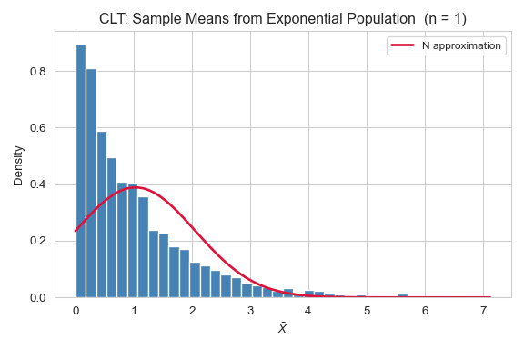

## 🚁 Overview

:::{.columns}
:::{.column width="50%" .fragment}
:::{.spacer-sm}
:::

### Aims of the lecture

- Understand the framework of **statistical inference**.
- Distinguish between **populations**, **samples**, **parameters**, and **statistics**.
- Understand **sampling distributions** and the **Central Limit Theorem**.
- Evaluate **estimators** using bias, variance, and MSE.
- Apply **maximum likelihood estimation (MLE)**.
- Construct and interpret **confidence intervals**.
- Conduct and interpret **hypothesis tests**.

:::

:::{.column width="50%" .fragment}

:::{.spacer-sm}
:::

### 📚 Required Libraries

In this lecture we will be using the following libraries:

```{python}
import numpy as np
import matplotlib.pyplot as plt
import seaborn as sns
from scipy import stats
from scipy.stats import norm, t, binom
```

### 💅 Figure Styles

```{python}
sns.set_style('whitegrid')
sns.set_palette('Set2')
```

:::
:::


# Introduction to Statistical Inference

## 🔭 What is Statistical Inference?

### From data to conclusions

:::{.fragment}

:::{.callout-important title="Statistical Inference"}
**Statistical inference** is the process of drawing conclusions about an unknown
**population** from a **sample** of observed data, while rigorously accounting
for **uncertainty**.
:::

:::

:::{.fragment}

:::{.spacer-sm}
:::

### The core problem

- We want to know something about a **large population** (e.g. all voters, all patients).
- We cannot observe the whole population — we only have a **sample**.
- We must reason from the sample to the population, quantifying how uncertain our conclusions are.

:::

:::{.fragment}

:::{.spacer-sm}
:::

### Two main branches

- **Frequentist inference**: Unknown fixed parameters; probability describes long-run frequency of events.
- **Bayesian inference**: Parameters are random variables with prior distributions, updated by data.

:::

## Populations and Samples

### Key terminology

:::{.fragment}

:::{.callout-important title="Population and Sample"}
A **population** is the complete set of units we are interested in.
A **sample** is a subset of the population that we actually observe.
:::

:::

:::{.fragment}

:::{.spacer-sm}
:::

### Parameters and statistics

- A **parameter** is a numerical characteristic of the *population* — it is fixed but **unknown**.
  - Examples: population mean $\mu$, population variance $\sigma^2$, proportion $p$.
- A **statistic** is a numerical function of the *sample* — it is **observed** and used to estimate parameters.
  - Examples: sample mean $\bar{x}$, sample variance $s^2$, sample proportion $\hat{p}$.

:::

:::{.fragment}

:::{.spacer-sm}
:::

### The goal

- Use the statistic (computed from data) to **estimate** or **test claims** about the unknown parameter.

:::

## Example - FIV in Cats 

### Problem Statement

- We wish to determine the proportion of cats that have FIV.

:::{.fragment}

:::{.spacer-sm}
:::

### Probabilistic Model 

- We assume that this system can be modelled as a collection of independent 
  Bernoulli random variables with unknown parameter $p$. 
    - We cannot census all cats (the population) to find the true proportion $p$.
:::

:::{.fragment}

:::{.spacer-sm}
:::

### Statistical Model

- Instead, we take a sample of $n=100$ cats and compute the sample proportion $\hat{p}$. 
    - We use **hat notation** to specify parameter estimates.
    - This is a statistic since it was computed from data.
- Specifically, this is known as a point estimate of a parameter.
:::

## Example - FIV in Cats Parameter Estimation 

### Simulation

- Suppose we know the true underlying proportion of cats with FIV is $p=0.15$.
  - We write a function which generates a sample of $n=100$ realizations of a 
    Bernoulli random variable with parameter $p=0.15$.

:::{.fragment}

```{python}
# Set seed for reproducibility
rng = np.random.default_rng(123)
# Write function generating cat samples
def generate_cat_sample():
    return rng.binomial(n=1, p=0.15, size=100)
# Example 
sample1 = generate_cat_sample()
print(sample1)
```

:::

:::{.fragment}

:::{.spacer-sm}
:::

### Estimation

- We can compute the sample proportion $\hat{p}$ from this sample. 

:::

:::{.fragment}

```{python}
sample1.mean()
```

:::

## Why Randomness Matters

### Statistics are random variables

- Because the sample is drawn **randomly** from the population, any statistic computed from it is a **random variable**.
- If we took a different sample, we would get a different value of the statistic.
- This **sampling variability** is what we need to quantify.

:::{.fragment}

:::{.spacer-sm}
:::

### Let's simulate the variability 

- We can use this same function to create multiple samples and comute 
  multiple sample proportions.
- From this we produce a histogram to inspect the distribution.

:::

:::{.fragment}

```{python}
#| output-location: slide 
#| fig-cap: "Sampling variability: distribution of sample proportions from 1000 samples of size n=100."
sample_proportions = [generate_cat_sample().mean() for _ in range(1000)]
sns.histplot(sample_proportions, bins=20, kde=True, color='steelblue')
```

:::

## Another Example - Heights of Pool Players

### Heights of Students

- We wish to estimate the average height of members of the SB pool league.
- **Probabilistic:** Assume that the heights are normally distributed with 
  unknown mean $\mu$ and $\sigma$.
- **Statistics:** In reality, how would you estimate these parameters?
  - Collect a sample of playerss and determine their height.
  - Compute the sample mean $\bar{X}\approx \mu$ and sample standard deviation
    $S\approx\sigma$. 

:::{.fragment}

:::{.spacer-sm}
:::

### More Simulation 

- We assume that the true mean height is $\mu=170$ (cm) and $\sigma=3$. 
- We write a function generating $n=100$ realizations of 
  $X\sim\text{Normal}(170, 3^2)$.

:::

:::{.fragment}

```{python}
#| output-location: slide 
#| fig-cap: "Sampling variability: distribution of sample means from 1000 samples of size n=100."

rng = np.random.default_rng(456)
def generate_height_sample(n=100):
    return rng.normal(loc=170, scale=3, size=n)
samples = [generate_height_sample() for _ in range(1000)]
sample_means = [samp.mean() for samp in samples]
sample_sdvs = [samp.std(ddof=1) for samp in samples]

```

:::

## Sample Distribution 

```{python}
#| fig-align: center 
#| fig-cap: "Distribution of all 1000 samples (each of size n=100)."
sns.histplot(np.array(samples).flatten(), kde=True, color='steelblue')
```

- This is just a $n=100000$ sample from our Normal distribution.

## Sample Mean Distribution 

```{python}
#| fig-align: center
#| fig-cap: "Distribution of sample means from 1000 samples of size n=100."
sns.histplot(sample_means, bins=20, kde=True, color='steelblue')
```

- What distribution is this?

## Sample Standard Deviation Distribution 

```{python}
#| fig-align: center
#| fig-cap: "Distribution of sample standard deviations from 1000 samples of size n=100."
sns.histplot(sample_sdvs, bins=20, kde=True, color='steelblue')
```
- What about this? 

# Sampling Distributions and the CLT

## 📐 Sampling Distributions

### The distribution of a statistic

:::{.fragment}

:::{.callout-important title="Sampling Distribution"}
The **sampling distribution** of a statistic is the probability distribution
of that statistic over all possible samples of a given size $n$ from the population.
:::

:::

:::{.fragment}

:::{.spacer-sm}
:::

### Properties of the sample mean

For a population with mean $\mu$ and variance $\sigma^2$, the sample mean
$\bar{X} = \frac{1}{n}\sum_{i=1}^n X_i$ satisfies:

$$\mathbb{E}[\bar{X}] = \mu, \qquad \text{Var}(\bar{X}) = \frac{\sigma^2}{n}.$$

:::

:::{.fragment}

:::{.spacer-sm}
:::

### Standard error

- The **standard error (SE)** of $\bar{X}$ is $\text{SE}(\bar{X}) = \sigma / \sqrt{n}$.
  - This is the standard deviation of the sampling distribution of $\bar{X}$.
- As $n \to \infty$, the SE shrinks — larger samples give **more precise** estimates.

:::

## The Central Limit Theorem

### The most important theorem in statistics

:::{.fragment}

:::{.callout-important title="Central Limit Theorem (CLT)"}
Let $X_1, X_2, \ldots, X_n$ be i.i.d. random variables with mean $\mu$ and
finite variance $\sigma^2$. Then as $n \to \infty$:
$$\frac{\bar{X} - \mu}{\sigma / \sqrt{n}} \xrightarrow{d} \mathcal{N}(0, 1).$$
:::

:::

:::{.fragment}

:::{.spacer-sm}
:::

### What it means in practice

- Regardless of the **shape of the population**, the sample mean is **approximately normally distributed** for large $n$.
- A rule of thumb: the approximation is reliable for $n \geq 30$ (though this depends on skewness).
- The CLT justifies applying normal-based inference to a huge variety of real-world data.

:::

## CLT in Action




# Point Estimation

## 🎯 Estimators and Estimates

### Terminology

:::{.fragment}

:::{.callout-important title="Estimator and Estimate"}
An **estimator** $\hat{\theta}$ is a function of the sample used to estimate a
population parameter $\theta$. An **estimate** is the specific value of the
estimator computed from an observed sample.
:::

:::

:::{.fragment}

:::{.spacer-sm}
:::

### Common estimators

| Parameter | Estimator | Formula |
|---|---|---|
| Mean $\mu$ | Sample mean | $\bar{X} = \frac{1}{n}\sum X_i$ |
| Variance $\sigma^2$ | Sample variance | $S^2 = \frac{1}{n-1}\sum(X_i - \bar{X})^2$ |
| Proportion $p$ | Sample proportion | $\hat{p} = \frac{\text{successes}}{n}$ |

:::

## Properties of Estimators

### How do we judge a good estimator?

:::{.fragment}

:::{.callout-important title="Bias"}
The **bias** of an estimator $\hat{\theta}$ is:
$$\text{Bias}(\hat{\theta}) = \mathbb{E}[\hat{\theta}] - \theta.$$
An estimator is **unbiased** if $\text{Bias}(\hat{\theta}) = 0$.
:::

:::

:::{.fragment}

:::{.spacer-sm}
:::

### Mean Squared Error

$$\text{MSE}(\hat{\theta}) = \mathbb{E}\!\left[(\hat{\theta} - \theta)^2\right] = \text{Var}(\hat{\theta}) + \left[\text{Bias}(\hat{\theta})\right]^2.$$

:::

:::{.fragment}

:::{.spacer-sm}
:::

### The bias-variance trade-off

- A **low-bias, high-variance** estimator is accurate on average but erratic.
- A **high-bias, low-variance** estimator is consistently wrong but predictably so.
- Good estimators minimise **MSE**, balancing both.

:::

## Bias of the Sample Variance

### Why divide by $n-1$?

:::{.fragment}

- The **naive** estimator $\tilde{S}^2 = \frac{1}{n}\sum(X_i - \bar{X})^2$ is
  **biased**: $\mathbb{E}[\tilde{S}^2] = \frac{n-1}{n}\sigma^2$.
- Dividing by $n-1$ instead of $n$ corrects for this:
  $$\mathbb{E}[S^2] = \sigma^2. \qquad \text{(unbiased)}$$
- The factor $n-1$ is called the **degrees of freedom** — we "lose" one degree
  of freedom because $\bar{X}$ is estimated from the same data.

:::

:::{.fragment}

:::{.spacer-sm}
:::


```{python}
#| output-location: slide
#| fig-cap: "Biased (n) vs. unbiased (n-1) sample variance estimators."
rng = np.random.default_rng(7)
true_var = 4.0
biased, unbiased = [], []
for _ in range(10_000):
    x = rng.normal(0, np.sqrt(true_var), size=10)
    biased.append(np.var(x, ddof=0))
    unbiased.append(np.var(x, ddof=1))

fig, ax = plt.subplots(figsize=(9, 4))
ax.hist(biased,   bins=60, alpha=0.6, density=True, label=f'n   (mean={np.mean(biased):.2f})',   color='steelblue')
ax.hist(unbiased, bins=60, alpha=0.6, density=True, label=f'n-1 (mean={np.mean(unbiased):.2f})', color='crimson')
ax.axvline(true_var, color='black', lw=2, linestyle='--', label=f'True σ² = {true_var}')
ax.set_xlabel('Estimated variance'); ax.set_ylabel('Density')
ax.set_title('Biased vs. Unbiased Variance Estimator (n = 10, 10 000 samples)')
ax.legend()
plt.tight_layout()
plt.show()
```

:::

# Maximum Likelihood Estimation

## 📈 The Likelihood Function

### Choosing parameters that make the data most probable

:::{.fragment}

:::{.callout-important title="Likelihood Function"}
Given data $x_1, \ldots, x_n$ assumed i.i.d. from a distribution with parameter $\theta$,
the **likelihood** is:
$$L(\theta) = \prod_{i=1}^n f(x_i;\, \theta).$$
The **log-likelihood** $\ell(\theta) = \sum_{i=1}^n \log f(x_i;\, \theta)$ is
typically easier to maximise.
:::

:::

:::{.fragment}

:::{.spacer-sm}
:::

### Maximum Likelihood Estimator (MLE)

$$\hat{\theta}_{\text{MLE}} = \arg\max_\theta\, \ell(\theta).$$

- The MLE is the parameter value that makes the observed data **most probable**.
- MLEs are generally **consistent** (converge to the true value) and
  **asymptotically normal**.

:::

## MLE for the Gaussian

### Deriving the MLE analytically

:::{.fragment}

For data $x_1, \ldots, x_n \sim \mathcal{N}(\mu, \sigma^2)$:

$$\ell(\mu, \sigma^2) = -\frac{n}{2}\log(2\pi\sigma^2) - \frac{1}{2\sigma^2}\sum_{i=1}^n (x_i - \mu)^2.$$

:::

:::{.fragment}

:::{.spacer-sm}
:::

### Setting derivatives to zero gives

$$\hat{\mu}_{\text{MLE}} = \bar{x} = \frac{1}{n}\sum_{i=1}^n x_i, \qquad \hat{\sigma}^2_{\text{MLE}} = \frac{1}{n}\sum_{i=1}^n (x_i - \bar{x})^2.$$

:::

:::{.fragment}

:::{.spacer-sm}
:::

### Note

- $\hat{\mu}_{\text{MLE}}$ is **unbiased**, but $\hat{\sigma}^2_{\text{MLE}}$ uses $n$ (not $n-1$) and is **biased**.
- This is why the sample variance corrects to $n-1$ in practice.

:::

## MLE in Python

```{python}
#| output-location: slide
#| fig-cap: "Profile log-likelihood for μ (left) and σ² (right) from a simulated Gaussian sample."
rng = np.random.default_rng(3)
data = rng.normal(loc=5.0, scale=2.0, size=50)

mu_grid    = np.linspace(3, 7, 300)
sigma2_grid = np.linspace(1, 9, 300)

# Profile log-likelihoods
ll_mu    = [-0.5 * np.sum((data - m)**2) / np.var(data, ddof=0)
             - 0.5 * len(data) * np.log(2 * np.pi * np.var(data, ddof=0))
             for m in mu_grid]
ll_s2    = [-len(data) / 2 * np.log(2 * np.pi * s2) - np.sum((data - data.mean())**2) / (2 * s2)
             for s2 in sigma2_grid]

fig, axes = plt.subplots(1, 2, figsize=(13, 4))
axes[0].plot(mu_grid, ll_mu, 'steelblue', lw=2)
axes[0].axvline(data.mean(), color='crimson', linestyle='--', label=f'MLE μ̂ = {data.mean():.2f}')
axes[0].set_xlabel('μ'); axes[0].set_ylabel('Log-likelihood')
axes[0].set_title('Profile log-likelihood for μ'); axes[0].legend()

axes[1].plot(sigma2_grid, ll_s2, 'steelblue', lw=2)
axes[1].axvline(np.var(data, ddof=0), color='crimson', linestyle='--',
                label=f'MLE σ̂² = {np.var(data, ddof=0):.2f}')
axes[1].set_xlabel('σ²'); axes[1].set_ylabel('Log-likelihood')
axes[1].set_title('Profile log-likelihood for σ²'); axes[1].legend()

plt.tight_layout()
plt.show()
```

# Confidence Intervals

## 📏 Quantifying Estimation Uncertainty

### Beyond point estimates

:::{.fragment}

- A point estimate $\hat{\theta}$ is a single number — it tells us nothing about **uncertainty**.
- A **confidence interval (CI)** gives a *range* of plausible values for $\theta$.

:::

:::{.fragment}

:::{.spacer-sm}
:::

:::{.callout-important title="Confidence Interval"}
A **$(1-\alpha)\times 100\%$ confidence interval** for $\theta$ is a random interval
$[L, U]$ (depending on the data) such that:
$$P(L \leq \theta \leq U) = 1 - \alpha.$$
:::

:::

:::{.fragment}

:::{.spacer-sm}
:::

### Correct interpretation

- A 95% CI does **not** mean "there is a 95% probability that $\theta$ is in this particular interval."
- It means: if we repeated the procedure many times, **95% of the resulting intervals** would contain the true $\theta$.

:::

## CI for the Population Mean (Known σ)

### The $z$-interval

:::{.fragment}

When $\sigma$ is known and either $n$ is large (CLT) or the population is normal:

$$\bar{X} \pm z_{\alpha/2} \frac{\sigma}{\sqrt{n}},$$

where $z_{\alpha/2}$ is the upper $\alpha/2$ quantile of $\mathcal{N}(0, 1)$.

:::

:::{.fragment}

:::{.spacer-sm}
:::

### Common critical values

| Confidence level | $\alpha$ | $z_{\alpha/2}$ |
|---|---|---|
| 90% | 0.10 | 1.645 |
| 95% | 0.05 | 1.960 |
| 99% | 0.01 | 2.576 |

:::

## CI for the Population Mean (Unknown σ)

### The $t$-interval

:::{.fragment}

When $\sigma$ is **unknown** (the typical case), we replace it with $S$ and use the
**$t$-distribution**:

$$\bar{X} \pm t_{\alpha/2,\, n-1} \frac{S}{\sqrt{n}},$$

where $t_{\alpha/2, n-1}$ is the upper $\alpha/2$ quantile of the $t$-distribution
with $n-1$ degrees of freedom.

:::

:::{.fragment}

:::{.spacer-sm}
:::

### The $t$-distribution

- Heavier tails than the normal — accounts for extra uncertainty from estimating $\sigma$.
- As $n \to \infty$, $t_{n-1} \to \mathcal{N}(0,1)$.

:::

## Confidence Intervals in Python

```{python}
#| output-location: slide
#| fig-cap: "Simulation: 50 confidence intervals at the 95% level. Green = contain μ; red = miss."
#| code-line-numbers: "1-2|3-4|5-13|9|10|11|"
# Set the seed 
rng = np.random.default_rng(12)
# Specify parameters 
true_mu, true_sigma, n_obs, n_intervals = 0.0, 1.0, 30, 50

# Loop generating confidence intervals
covered, not_covered = [], []
for _ in range(n_intervals):
    sample = rng.normal(true_mu, true_sigma, size=n_obs) # sampling from normal
    xbar, s = sample.mean(), sample.std(ddof=1)          # sample mean and std
    margin = t.ppf(0.975, df=n_obs - 1) * s / np.sqrt(n_obs) # compute bounds 
    (covered if abs(xbar - true_mu) <= margin else not_covered).append(
      (xbar - margin, xbar + margin)
      )

# Produce plot
fig, ax = plt.subplots(figsize=(10, 6))
for i, (lo, hi) in enumerate(covered):
    ax.plot([lo, hi], [i, i], color='steelblue', lw=1.5)
for i, (lo, hi) in enumerate(not_covered, start=len(covered)):
    ax.plot([lo, hi], [i, i], color='crimson', lw=1.5)
ax.axvline(true_mu, color='black', lw=2, linestyle='--', label='True μ = 0')
ax.set_xlabel('Parameter value'); ax.set_yticks([])
ax.set_title(f'95% Confidence Intervals (n={n_obs}): '
             f'{len(covered)}/{n_intervals} contain μ')
ax.legend()
plt.tight_layout()
plt.show()
```

# Hypothesis Testing

## ❓ The Framework

### Making decisions under uncertainty

:::{.fragment}

:::{.callout-important title="Hypothesis Test"}
A **hypothesis test** is a formal procedure for deciding between two competing
hypotheses about a parameter, based on observed data.
:::

:::

:::{.fragment}

:::{.spacer-sm}
:::

### Null and alternative hypotheses

- The **null hypothesis** $H_0$: a default claim we assume to be true (often "no effect", "no difference").
- The **alternative hypothesis** $H_1$ (or $H_a$): what we are trying to find evidence for.
- Examples:
  - $H_0: \mu = 0$ vs. $H_1: \mu \neq 0$ (two-sided)
  - $H_0: \mu \leq 0$ vs. $H_1: \mu > 0$ (one-sided)

:::

- Compute a **test statistic** $T$ from the data that measures evidence against $H_0$.
- Ask: "If $H_0$ were true, how likely is a test statistic at least this extreme?"
- If the answer is "very unlikely", we **reject** $H_0$.


## Test Statistics and $p$-Values

### Formalising "how unlikely"

:::{.fragment}

:::{.callout-important title="$p$-Value"}
The **$p$-value** is the probability, under $H_0$, of observing a test statistic
at least as extreme as the one actually observed.
$$p\text{-value} = P_{H_0}(T \geq t_{\text{obs}}) \quad \text{(one-sided example)}.$$
:::

:::

:::{.fragment}

:::{.spacer-sm}
:::

### Decision rule at significance level $\alpha$

- If $p\text{-value} \leq \alpha$: **reject** $H_0$ (result is "statistically significant").
- If $p\text{-value} > \alpha$: **fail to reject** $H_0$ (insufficient evidence).
- Common choices: $\alpha = 0.05$ (5%) or $\alpha = 0.01$ (1%).
- Important! What the $p$-value is not.
  - It is **not** the probability that $H_0$ is true.
  - It does **not** measure the size or practical importance of an effect.

:::

## Type I and Type II Errors

### Two ways a test can be wrong

:::{.fragment}

| | $H_0$ true | $H_0$ false |
|---|---|---|
| **Reject $H_0$** | Type I Error (false positive) | Correct (Power) |
| **Fail to reject $H_0$** | Correct | Type II Error (false negative) |

:::

:::{.fragment}

:::{.spacer-sm}
:::

### Definitions

- **Type I error rate** = $\alpha$ = $P(\text{reject } H_0 \mid H_0 \text{ true})$ — controlled by our choice of $\alpha$.
- **Type II error rate** = $\beta$ = $P(\text{fail to reject } H_0 \mid H_1 \text{ true})$.
- **Power** = $1 - \beta$ = $P(\text{reject } H_0 \mid H_1 \text{ true})$ — the probability of correctly detecting a true effect.

:::

:::{.fragment}

:::{.spacer-sm}
:::

### The trade-off

- Decreasing $\alpha$ (stricter test) reduces Type I errors but **increases** Type II errors.
- Larger sample sizes increase **power** without inflating the Type I error rate.

:::

## The One-Sample $t$-Test

### Testing a claim about the population mean

:::{.fragment}

For testing $H_0: \mu = \mu_0$ based on a sample $x_1, \ldots, x_n$, the **test statistic** is:

$$T = \frac{\bar{X} - \mu_0}{S / \sqrt{n}} \sim t_{n-1} \quad \text{under } H_0.$$

:::

:::{.fragment}

:::{.spacer-sm}
:::

### $p$-value computation

- **Two-sided** ($H_1: \mu \neq \mu_0$): $p = 2\,P(t_{n-1} \geq |t_{\text{obs}}|)$.
- **One-sided upper** ($H_1: \mu > \mu_0$): $p = P(t_{n-1} \geq t_{\text{obs}})$.
- **One-sided lower** ($H_1: \mu < \mu_0$): $p = P(t_{n-1} \leq t_{\text{obs}})$.

:::

## $t$-Test in Python

```{python}
#| output-location: slide
#| fig-cap: "One-sample t-test: observed test statistic against the null t-distribution."
rng = np.random.default_rng(99)
sample = rng.normal(loc=2.5, scale=3.0, size=40)
mu_0 = 0.0

t_stat, p_val = stats.ttest_1samp(sample, popmean=mu_0)
df = len(sample) - 1

x_grid = np.linspace(-5, 5, 400)
fig, ax = plt.subplots(figsize=(10, 5))
ax.plot(x_grid, t.pdf(x_grid, df=df), 'k', lw=2, label=f't distribution (df={df})')

# Shade rejection region (two-sided, α = 0.05)
crit = t.ppf(0.975, df=df)
x_left  = np.linspace(-5, -crit, 200)
x_right = np.linspace(crit,  5, 200)
ax.fill_between(x_left,  t.pdf(x_left,  df=df), alpha=0.3, color='crimson', label='Rejection region (α=0.05)')
ax.fill_between(x_right, t.pdf(x_right, df=df), alpha=0.3, color='crimson')

ax.axvline(t_stat, color='steelblue', lw=2.5, linestyle='--',
           label=f'Observed T = {t_stat:.2f},  p = {p_val:.4f}')
ax.set_xlabel('t'); ax.set_ylabel('Density')
ax.set_title(f'One-sample t-test: H₀: μ = {mu_0}  vs.  H₁: μ ≠ {mu_0}')
ax.legend()
plt.tight_layout()
plt.show()
```

## Connecting CIs and Hypothesis Tests

### Two sides of the same coin

:::{.fragment}

- A **$(1-\alpha)$ confidence interval** for $\mu$ contains exactly those values $\mu_0$ for which the two-sided test at level $\alpha$ **fails to reject** $H_0: \mu = \mu_0$.
- Equivalently: reject $H_0: \mu = \mu_0$ at level $\alpha$ if and only if $\mu_0$ lies **outside** the $(1-\alpha)$ CI.

:::

:::{.fragment}

:::{.spacer-sm}
:::

### Practical takeaway

- CIs and hypothesis tests answer **complementary** questions:
  - CI: "What values of $\mu$ are consistent with the data?"
  - Test: "Is a specific value $\mu_0$ consistent with the data?"
- Reporting a CI is often more informative than a binary reject/fail-to-reject decision.

:::

## Statistical vs. Practical Significance

### Large samples can make small effects "significant"

:::{.fragment}

- With a very large $n$, even a **trivially small** difference from $\mu_0$ will yield a tiny $p$-value.
- A statistically significant result is **not** necessarily practically important.

:::

:::{.fragment}

:::{.spacer-sm}
:::

### Effect sizes

- Always **report the estimated effect and a CI**, not just the $p$-value.
- Consider **effect size** measures such as Cohen's $d$:
  $$d = \frac{\bar{X} - \mu_0}{S}.$$
- A large effect size with a non-significant $p$-value may indicate **insufficient power** (small $n$), not the absence of an effect.

:::

## Summary: The Inference Pipeline

:::{.fragment}

| Step | Question | Tool |
|---|---|---|
| 1. Formulate | What do I want to learn? | Research question |
| 2. Model | What is the data-generating process? | Probability model |
| 3. Estimate | What are the parameter values? | MLE / method of moments |
| 4. Quantify uncertainty | How precise is my estimate? | Confidence interval |
| 5. Test | Is a specific claim consistent with the data? | Hypothesis test / $p$-value |
| 6. Communicate | What do the results mean in context? | Effect size, CI, visualisation |

:::

## Conclusion

:::{.fragment}

::: {.spacer-sm}
:::

### ✅ What we covered

- **Statistical inference**: drawing conclusions about populations from samples.
- **Populations, parameters, samples, and statistics**.
- **Sampling distributions** and the **Central Limit Theorem**.
- **Point estimation**: bias, variance, MSE, and the MLE.
- **Confidence intervals**: construction and correct interpretation.
- **Hypothesis testing**: null/alternative hypotheses, test statistics, $p$-values, Type I/II errors.
- **The $t$-test** and the duality between CIs and tests.

:::

:::{.fragment}

::: {.spacer-sm}
:::

### 📅 What's next?

- Simple linear regression.
- Fitting, interpreting, and evaluating regression models.

:::

## References
