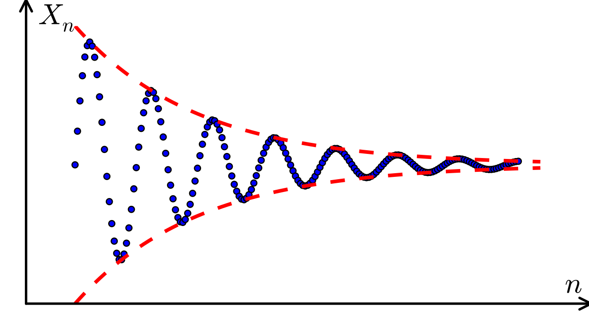

## Introduction

Cauchy (mutual) convergence is a useful result when you have to prove 
convergence but do not have a good candidate for a limit.  Cauchy convergence 
requires only information on pairs $(x_{n},x_{m})$.

Informally, a real sequence $\{ x_{n} \}$ is **Cauchy** when the terms of the 
sequence become arbitrarily close together as $n$ gets very large.  We write a
more concrete metric based definition of Cauchy sequences using the 
standard Euclidean metric.

:::{.definition data-title="Cauchy Sequence"}

A real sequence $\{  x_{n} \}$ is **Cauchy** if 

$$
\forall \epsilon >0, \exists N=N_{\epsilon}~s.t.~|x_{n}-x_{m}|<\epsilon ,\forall n,m>N,
$$

or in other words $x_{n}-x_{m}\to 0$ as $n,m \to \infty$ independently.

:::

This leads to the following important result in [[metric-spaces]] and 
[[functional-analysis]] in general known as the 
**Cauchy characterization of convergence for sequences**.

:::{.theorem data-title="Cauchy Characterization of Convergence"}

A real sequence $\{ x_{n} \}$ is convergent in the reals if and only if it is
Cauchy.

:::

:::{.proof}

**($\Rightarrow$) Convergent implies Cauchy.**
Suppose $x_{n}\to x$. Given $\epsilon>0$, choose $N$ such that
$|x_{n}-x|<\epsilon/2$ for all $n>N$. Then for any $n,m>N$ the triangle
inequality gives

$$
|x_{n}-x_{m}| \le |x_{n}-x| + |x-x_{m}| < \frac{\epsilon}{2} + \frac{\epsilon}{2} = \epsilon,
$$

so $\{ x_{n} \}$ is Cauchy.

**($\Leftarrow$) Cauchy implies convergent.**
This direction relies on the completeness of $\mathbb{R}$ and proceeds in three
steps.

1. *A Cauchy sequence is bounded.* Taking $\epsilon=1$, there is an $N$ with
   $|x_{n}-x_{N+1}|<1$ for all $n>N$. Hence every term lies in the interval
   $(x_{N+1}-1,\,x_{N+1}+1)$ except for the finitely many terms
   $x_{1},\dots,x_{N}$, so the sequence is bounded.

2. *Extract a convergent subsequence.* By the Bolzano–Weierstrass theorem, the
   bounded sequence has a convergent subsequence $x_{n_{k}}\to x$ for some
   $x\in\mathbb{R}$. This is the step that uses completeness of the reals.

3. *The whole sequence converges to the same limit.* Given $\epsilon>0$, use
   the
   Cauchy property to pick $N$ with $|x_{n}-x_{m}|<\epsilon/2$ for all $n,m>N$,
   and pick $k$ large enough that $n_{k}>N$ and $|x_{n_{k}}-x|<\epsilon/2$.
   Then
   for all $n>N$,

   $$
   |x_{n}-x| \le |x_{n}-x_{n_{k}}| + |x_{n_{k}}-x| < \frac{\epsilon}{2} + \frac{\epsilon}{2} = \epsilon.
   $$

   Therefore $x_{n}\to x$. 

:::
