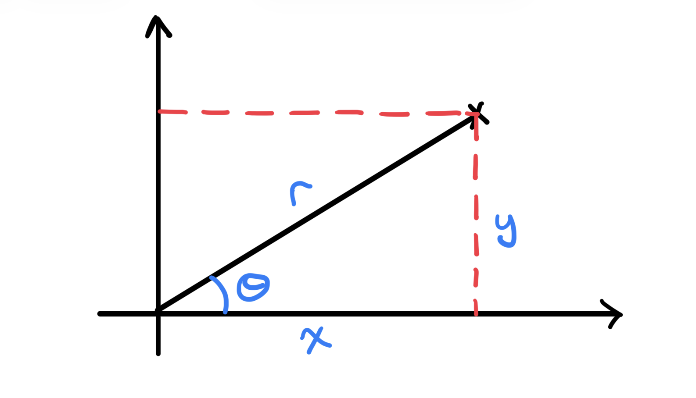

## Gaussian Integral

In [[probability-theory]] the [[normal-distribution]] is a continuous 
probability distribution with parameters mean $\mu$ and variance $\sigma^2$
that takes the form of a bell-shaped curve that is symmetric about the mean. 
For a Normal random variable $X\sim\mathcal{N}(\mu,\sigma^2)$ can take values 
in $\mathbb{R}$ and has probability 
density function (PDF) of the normal distribution is given by

$$
f(x;\mu,\sigma^2)=\frac{1}{\sqrt{2\pi\sigma^2}}
  \exp\left(-\frac{(x-\mu)^2}{2\sigma^2}\right).
$$

Now, since this is a probability distribution, we know that the total 
probability must be equal to 1, that is 

$$
\int_{-\infty}^{\infty} \frac{1}{\sqrt{2\pi\sigma^2}}
  \exp\left(-\frac{(x-\mu)^2}{2\sigma^2}\right) dx = 1.
$$

The purpose of this note is to demonstrate how to compute this integral 
analytically.  

## Standard Normal

First lets evaluate the following Gaussian integral

$$
I = \int_{-\infty}^{\infty}
  \exp\left(-\frac{x^2}{2}\right) dx.
$$

Since the integrand is non-negative, Tonelli's theorem allows us to square 
the integral as

$$
I^2 = \int_{-\infty}^{\infty} \exp\left(-\frac{x^2}{2}\right) dx
  \int_{-\infty}^{\infty} \exp\left(-\frac{y^2}{2}\right) dy
  = \int_{-\infty}^{\infty} \int_{-\infty}^{\infty}
    \exp\left(-\frac{x^2+y^2}{2}\right) dx dy.
$$

We can then change to polar coordinates 

$$
y = r\sin(\theta), \quad x = r\cos(\theta), \quad r\in [0,\infty), \theta\in[0,2\pi).
$$

{width="50%"}

The [[jacobian-matrix]] of the transformation is given by

$$
\begin{align}
J & = \lvert \frac{\partial (x,y) }{\partial (r,\theta)}\rvert| =
  \left\lvert \begin{matrix} 
\frac{\partial x}{\partial r} & \frac{\partial x}{\partial \theta} \\
\frac{\partial y}{\partial r} & \frac{\partial y}{\partial \theta} 
\end{matrix} \right\rvert = 
\left\lvert \begin{matrix}
\cos(\theta) & -r\sin(\theta) \\
\sin(\theta) & r\cos(\theta)
\end{matrix} \right\rvert \\ 
& = r \cos^2(\theta) + r\sin^2(\theta)= r.
\end{align}
$$

