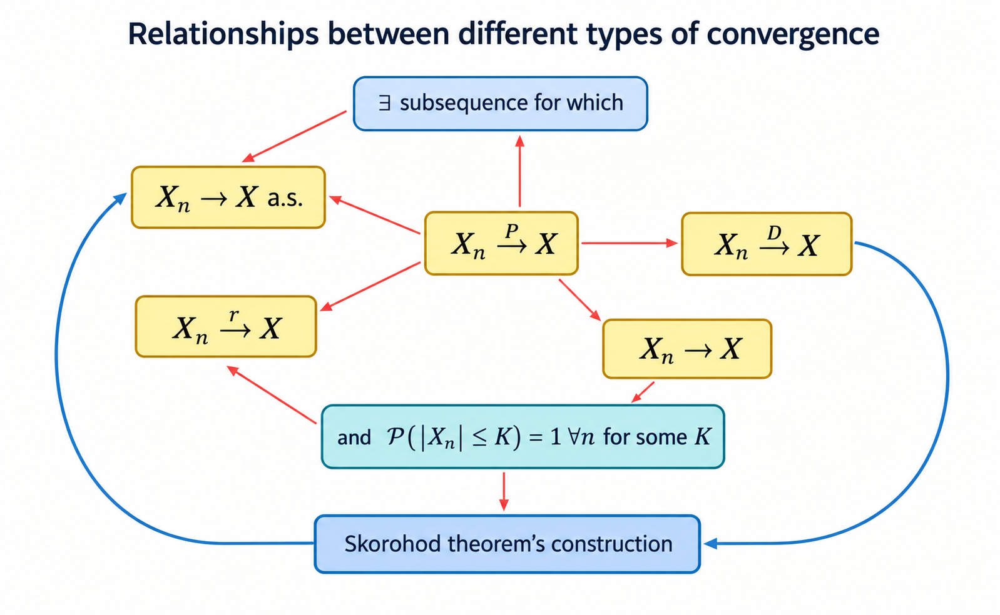

## Convergence of Stochastic Processes

Recall from our study of [[real-analysis]] that a **sequence of functions**
$\{f_{n}\}$ is said to converge to $f$ on $[0,1]$ in the following different
ways

1. **Pointwise.** $\forall x \in[0,1]$, $f_{n}(x)\to f(x)$.
2. **Almost everywhere.** $\exists K\in \mathcal{B}_{[0,1]}$ such that 
   $\mu(K)=1$ and $\forall x \in K$, $f_{n}(x)\to f(x)$.
3. **Uniform.** $\forall \epsilon>0$, $\exists N\in \mathbb{N}$ such that 
   $\forall n>N$, $\sup_{x\in[0,1]}|f_{n}(x)-f(x)|<\epsilon$.

Consider a **discrete time stochastic process** $\{X_{n}, n\geq 1\}$ and $X$ on
some probability space $(\Omega,\mathcal{F}, \mathbb{P})$. The following are
ways in which $\{X_n\}$ can converge to $X$ as $n \to \infty$:

:::{.definition data-title="Convergence Almost Surely"}

The stochastic process $\{X_n\}$ is said to **converge almost surely** to $X$, 
denoted $X_n\stackrel{a.s.}{\rightarrow}X$ $(n\rightarrow\infty)$ if

$$
\mathbb{P}\left(\lim_{n\rightarrow\infty}X_n=X\right)=\mathbb{P}\left(\left\{\omega\in\Omega:\lim_{n\rightarrow\infty}X_n(\omega)=X(\omega)\right\}\right)=1.
$$

:::

Recall that a **norm** is any function $\Vert \cdot\Vert$ from a vector
(function) space $V$ to $\mathbb{R}$ satisfying:

1. $\Vert f\Vert \geq 0$ for every $f\in V$
2. $\Vert f\Vert=0$ if $f$ is a zero function
3. $\Vert af\Vert = |a|\Vert f\Vert$ for every $a \in \mathbb{R}$, $f \in V$
4. $\Vert f+g \Vert \leq\Vert f\Vert +\Vert g\Vert$ (triangle inequality)

The $L^p$ norm is a specific norm intimately linked with probability spaces and
expectations defined as

$$
\Vert X\Vert_{p}=[\mathbb{E}|X|^p]^{1/p}=\left(\int _{\Omega}|X|^p \, d\mathbb{P}\right)^{1/p} .
$$

:::{.definition data-title="Convergence in Lp Norm"}

A stochastic process $\{X_n\}$ is said to **converge in $L^p$-norm** to $X$, 
denoted $X_n\stackrel{L^p}{\rightarrow}X$ $(n\rightarrow\infty)$ if

$$
\lim_{ n \to \infty }\Vert X_{n}-X\Vert_{p}=\lim_{ n \to \infty }(\mathbb{E}|X_{n}-X|^p)^{1/p} = 0.
$$

:::

:::{.definition data-title="Convergence in Probability"}
A stochastic process $\{X_n\}$ is said to **converge in probability** to $X$,
denoted $X_n\stackrel{\mathbb{P}}{\rightarrow}X$ $(n\rightarrow\infty)$ if

$$
\lim_{ n \to \infty } \mathbb{P}(\{\omega \in\Omega:|X_{n}(\omega)
-X(\omega)|>\epsilon\})=0,
$$

for every $\epsilon>0$.

:::

:::{.definition data-title="Convergence in Law"}

A stochastic process $\{X_n\}$ is said to **converge in law** (or **converge in distribution**) to $X$ as $n\to \infty$, denoted $X_{n}\stackrel{\mathcal{D}}{\to}X$ if

$$
\lim_{ n \to \infty } F_{X_{n}}(x)=F_{X}(x).
$$

:::

We note the following key points and observations about convergence in law:

1. Unlike other types of convergence 
   convergence in law **tells us nothing about the behavior of the random
   variables** themselves, only their distribution.

2. Convergence in law means that $F_{n}(x) \to F(x)$ for all $x$ up to the
   **points of discontinuity** of $F$.

3. Limits in distribution are unique, that is $F_{n}(x) \to F(x)$ and
   $F_{n}(x) \to G(x)$ then $F=G$.

:::{.example data-title="Convergence Almost Surely Example"}

Consider the sample space $\Omega=[0,1]$ with uniform probability measure
defined by

$$
\mathbb{P}([a,b])=b-a;\quad (0 \leq  a \leq  b \leq  1).
$$

Define the sequence of random variables $\{ X_{n} \}_{n \in \mathbb{N}}$ and
random variable $X$ by

$$
X_{n}(\omega) = \begin{cases}
  1 & \text{if } 0 \leq  \omega < \frac{{n+1}}{2n} \\
  0 & \text{otherwise},
  \end{cases}\quad\&\quad X(\omega)= 
  \begin{cases}
  1 & \text{if }0 < \omega< \frac{1}{2} \\
  0&\text{otherwise}.
  \end{cases}
$$

We can show that $X_{n} \stackrel{a.s.}{\to}X$ by first defining the set $A$ as

$$
A:= \{  \omega \in \Omega :\lim_{n \to \infty}X_{n}(\omega)=X(\omega) \},
$$

and showing that $\mathbb{P}(A)=1$. We can specifically find $A$ by noting:

- For $0\leq \omega < \frac{1}{2}< \frac{{n+1}}{2n}$ we have that
  $X_{n}(\omega)= X(\omega)=1$ and so
  $\left[ 0, \frac{1}{2} \right) \subset A$;
- For $\omega> \frac{1}{2} \implies 2\omega-1>0$ we have $X(\omega)=0$ and
  $X_{n}(\omega)=0$ for all $n > \frac{1}{2\omega-1}$ so
  $\left( \frac{1}{2},1 \right] \subset A$.

Since $\mathbb{P}\left( X_{n}=\frac{1}{2} \right)=0$ we have that
$\mathbb{P}\left( X_{n} \in\left[ 0, \frac{1}{2} \right) \cup 
\left( \frac{1}{2}\cup 1 \right] \right)=1$ and since
$\left[ 0, \frac{1}{2} \right) \cup \left( \frac{1}{2}\cup 1 \right] \subset A$
we have $\mathbb{P}(A)=1$.

:::

## Convergence Relationships

These types of convergence are of difference strengths (in that some imply
others but not vice versa) as outlined in the diagram below.

### Convergence in Mean to Convergence in Probability

:::{.theorem data-title="Convergence in mean to convergence in probability"}

If $X_{n}\stackrel{L^1}{\to}X$ then $X_{n}\stackrel{\mathbb{P}}{\to}X$ as
$n \to \infty$.

:::

:::{.proof}

This result follows directly from applying [[markov-inequality]] since, for
every $\epsilon>0$ we have that

$$
\mathbb{P}(|X_{n}-X|>\epsilon)\leq \frac{1}{\epsilon}\cdot \mathbb{E}|X_{n}-X|,
$$

as required.

:::

*Note: The converse does not hold in general.*

### Convergence in Mean Hierarchy

:::{.theorem data-title="Convegrence in mean hierarchy"}

Consider $1<r<s<\infty$ and assume that $X_{n}\stackrel{L^s}{\to}X$ as
$n \to \infty$. Then we have that $X_{n}\stackrel{L^r}{\to}X$. *In other words,
higher orders of r-th mean convergence imply lower orders.*

:::

:::{.proof}

This result follows directly from applying [[lyapunov-inequality]]

$$
(\mathbb{E}|X|^r)^{1/r}\leq(\mathbb{E}|X|^s)^{1/s};\quad 0<r<s<\infty,
$$

as required.

:::

*Note: The converse does not hold in general.*

### Convergence in Probability to Convergence in Law

:::{.theorem data-title="Convergence in probability to convergence in law"}

If $X_{n}\stackrel{{\mathbb{P}}}{\to}X$ as $n \to \infty$, then
$X_{n}\stackrel{\mathcal{D}}{\to}X$ as $n\to \infty$.

:::

:::{.proof}

For every $x \in\mathbb{R}$, $\epsilon>0$ we have that

$$
\mathbb{P}(X\leq x-\epsilon)\leq \liminf_{n \to \infty } 
\mathbb{P}(X_{n}\leq x)\leq \limsup_{ n \to \infty }
\mathbb{P}(X_{n}\leq x)\leq \mathbb{P}(X\leq x+\epsilon).
$$

If $x$ is a continuity point of $X$, then as $\epsilon\downarrow 0$, the left
and right sides converge and hence

$$
\lim_{ n \to \infty } \mathbb{P}(X_{n}\leq x)=P(X\leq x),
$$

giving the result.

:::

*Note: The converse does not hold in general.*

### Convergence in Probability to Convergence in Mean under Boundedness

:::{.theorem data-title="Convergence in probability to convergence in mean 
under boundedness"}

Suppose there exists $K>0$ such that $\mathbb{P}(|X_{n}|\leq K)=1$ for every
$n$ and $X_{n}\stackrel{\mathbb{P}}{\to}X$ as $n \to \infty$. Then
$X_{n}\stackrel{L^1}{\to}X$ as $n \to \infty$.

:::

:::{.proof}

:::

### Convergence Almost Surely to Convergence in Probability
 
:::{.theorem data-title="Convergence Almost Surely to Convergence in 
Probability"}

If $X_{n}\stackrel{a.s}{\to}X$ as $n \to \infty$ then
$X_{n}\stackrel{\mathbb{P}}{\to}X$ as $n \to \infty$.

:::

:::{.proof}

We fix $\varepsilon>0$ and define the event
$A_{n}=\{ |X_{n}-X| \geq \epsilon \}$. We can then define the decreasing set
$B_{m}=\bigcup_{k=m}^\infty A_{k}$ i.e. $B_{m}\supseteq B_{m+1}\supseteq\dots$
and since decreasing sequences have limits we have that
$$
B_{m}=\bigcup_{k=m}^\infty A_{k}\downarrow B_{\infty}=\bigcap_{m=0}^\infty \bigcup_{k=m}^\infty A_{k}=\limsup_{n\to \infty}A_{n}.
$$
We consider the limit
$$
\lim_{n \to \infty}\mathbb{P}(|X_{n}-X|>\varepsilon)=\lim_{n \to \infty}\mathbb{P}(A_{n})\leq \lim_{{n \to \infty}}\mathbb{P}(B_{n})\stackrel{m.c.t}{=}\mathbb{P}\left(\lim_{n\to \infty}B_{n}\right)\leq  \mathbb{P}(X_{n}\not\to X)=0.
$$

Note this result follows from an application of the 
[[monotone-convergence-theorem]].

:::

*Note: The converse is not true in general, however we can show that for every
sequence of random variables that converges in probability, there exists a
subsequence that converges almost surely.*

### Convergence in Probability to Convergence Almost Surely of a Subsequence

:::{.theorem data-title="Convergence in Probability to Convergence Almost 
Surely of a Subsequence"}

If $X_{n}\stackrel{\mathbb{P}}{\to}X$, then there exists a non-random
subsequence $\{ n_{1}, n_{2}, \dots, n_{k}, \dots \}\nearrow \infty$ such that
$X_{n_{k}}\stackrel{a.s.}{\to}X$ as $k \to \infty$.

:::

:::{.proof}
Assuming $X_{n}\stackrel{\mathbb{P}}{\to}X$ we fix integer $k>0$ and choose
$\varepsilon = \frac{1}{k}$ such that by definition
$$
\lim_{n \to \infty}\mathbb{P}\left( \left\{  \omega \in \Omega:|X_{n}(\omega)-X(\omega)|> \frac{1}{k}  \right\} \right) =0.
$$
Thus, there exists $n_{k}$ such that
$\mathbb{P}\left( \left\{  \omega \in \Omega:|X_{n_{k}}(\omega)-X(\omega)|> \frac{1}{k}  \right\} \right)=\mathbb{P}(A_{k})\leq \frac{1}{k}^2$.
From results for [[geometric-series]] we have that
$$
\sum_{i=1}^\infty\mathbb{P}(A_{k})=\sum_{i=1}^\infty \frac{1}{k^2}<\infty,
$$
and so from the [[borel-cantelli-lemma]] we have that $\mathbb{P}(A_{k}~i.o)=0$
and so there exists $n_{0}$ such that
$A_{k}^c=\left\{  \omega \in \Omega:\lvert X_{n_{k}}(\omega)-X(\omega) \rvert \leq \frac{1}{k}  \right\}$
happens for all $k \geq n_{0}$ with probability 1.

:::

### Convergence in Probability to Convergence in Mean under Uniform Integrability

:::{.theorem data-title="Equivalence of convergence in $\mathbb{P}$ and in $L_1$ under uniform integrability"}

For $p>0$ assume that $X_n \in L^p$, $n \geq 1$ and
$X_{n}\stackrel{\mathbb{P}}{\to} X$. The following three statements are
equivalent:

1. $\{ |X_{n}|^p,~n\geq 1 \}$ is
   [[uniform-integrability|uniformly integrable]];
2. $X_{n}\stackrel{L^p}{\to}X$ and $X\in L^p$; and
3. $\lim_{n \to \infty}\mathbb{E}[|X_{n}|^p]=\mathbb{E}[|X|^p]<\infty$.

:::

:::{.proof}

:::

## Skorohod's Representation Theorem

:::{.theorem data-title="Skorohod Representation Theorem"}

Suppose that $X_{n}\stackrel{\mathcal{D}}{\to}X$ as $n \to \infty$ with
$F_{n}(x):=\mathbb{P}(X_{n} \leq x)$ and $F(x):=\mathbb{P}(X\leq x)$ for
$x \in \mathbb{R}$. Then, there exists a probability space
$(\Omega', \mathcal{F}',\mathbb{P}')$ and random variables $\{Y_{n}, n\geq 1\}$
and $Y$ such that
$$
Y_{n}\stackrel{\mathcal{D}}{=}X_{n},\quad Y\stackrel{\mathcal{D}}{=X},
$$
for every $n$ and $Y_{n}\stackrel{a.s.}{\to}Y$ as $n \to \infty$.

:::

:::{.proof}

:::

## Convergence Almost Surely Results

In most problems, proving convergence almost surely directly is challenging,
thus it is desirable to know some sufficient conditions.

:::{.theorem data-title="Sufficient Condition for Convergence Almost Surely"}

For sequence of random variables $\{  X_{n} \}n \in \mathbb{N}$, if for all 
$\epsilon >0$ we have 

$$
\sum_{n=1}^\infty \mathbb{P}(|X_{n}-X|>\varepsilon)<\infty,
$$

then $X_{n}\stackrel{a.s.}{\to}X$.

:::

This result is a direct application of the [[borel-cantelli-lemma]] since the
condition implies that $\{ |X_{n} - X|>\varepsilon \}$ finitely often almost
surely and so eventually $|X_{n}-X|<\varepsilon$ for all $n$ large enough
almost surely.

## Convergence of Distribution Results

With convergence of distribution we consider the following questions:

1. Does a sequence of d.f.s $\{  F_{n} \}$ necessarily converge?
	- *In general no, [[hellys-selection-theorem]] provides a partial answer.*
2. If a sequence of d.f.s $\{  F_{n} \}$ converges to a function $F$:
   $F_{n}(x) \to F(x)$ is the limit $F$ necessarily a distribution function?
	- *In general, no, the space of distribution functions is not compact.*  
3. When is the limit $F$ (of a sequence of d.f.s $\{  F_{n} \}$) is a proper
   d.f.?
	- *When $\{ F_{n} \}$ is [[tightness|tight]]*. 

Some key results relating to convergence of distribution functions are detailed
below.

- [[continuous-mapping-theorem]]
- [[portmanteau-theorem]]
- [[hellys-selection-theorem]]
- [[prohorovs-theorem]]

